# Setup Oracle Database 19c Compute

## Introduction
This lab will show you how to setup a compute instance running a pre-configured Compute and the corresponding Virtual Cloud Network (VCN).

Estimated Lab Time:  25 minutes

### About Terraform and Oracle Cloud Resource Manager
Terraform is a tool for building, changing, and versioning infrastructure safely and efficiently.  Configuration files describe to Terraform the components needed to run a single application or your entire datacenter.  In this lab a configuration file has been created for you to build the compute component.  The compute component you will build creates an image out of Oracle's Cloud Marketplace.  This image is running Oracle Database 19c.

Resource Manager is an Oracle Cloud Infrastructure service that allows you to automate the process of provisioning your Oracle Cloud Infrastructure resources. Using Terraform, Resource Manager helps you install, configure, and manage resources through the "infrastructure-as-code" model. To learn more about OCI Resource Manager, preview the video below.

[](youtube:udJdVCz5HYs)

### About Oracle Cloud Marketplace

The Oracle Cloud Marketplace is a catalog of solutions that extends Oracle Cloud services.  It offers multiple consumption modes and deployment modes.  In this lab we will be deploying the free Oracle Database 19c marketplace image.

[Link to Marketplace](https://www.oracle.com/cloud/marketplace/)

### Objectives
In this lab, you'll:
* Use Resource Manager to quickly setup a compute instance and VCN
* Login to your compute instance
* Confirm your Oracle Database 19c is up and running

### Prerequisites

This lab assumes you have:
- An Oracle Free Tier or Paid Cloud account
- SSH Keys

## **STEP 1**: Setup Stack
If you already have a VCN created, skip this step and proceed to *STEP 3*.

1.  Click on the link below to download the Resource Manager zip file you need to build your enviornment.  
    - [workshop_v2.zip](https://objectstorage.us-ashburn-1.oraclecloud.com/p/aUFtqKFdyNXDRXcNFSln8DxqfmJLCRwn_ClZhjvFdb8/n/c4u03/b/labfiles/o/workshop_v2.zip) - Packaged terraform instance creation script for creating instance running the 19c Oracle Database

2.  Save in your downloads folder.
3.  Login to your Oracle Cloud account
4.  Click the **Create a Stack** tile on the homepage.  You may also get to Resource Manager by clicking on the Hamburger **Menu** -> **Solutions and Platform** -> **Resource Manager**.
   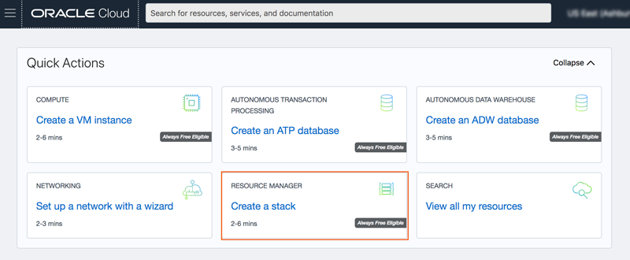

5.  Click the **Browse** link and select the zip file (workshop_v2.zip) that you downloaded. Click **Open**.
   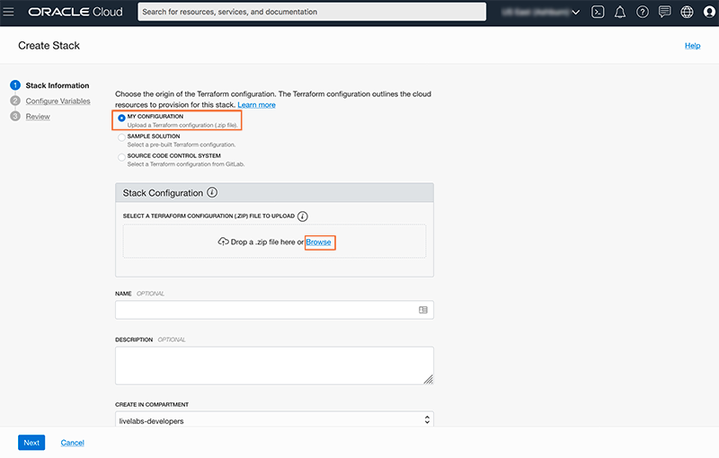

6. Enter the name of your choice.  We suggest livelabs19c.  Click **Next**
   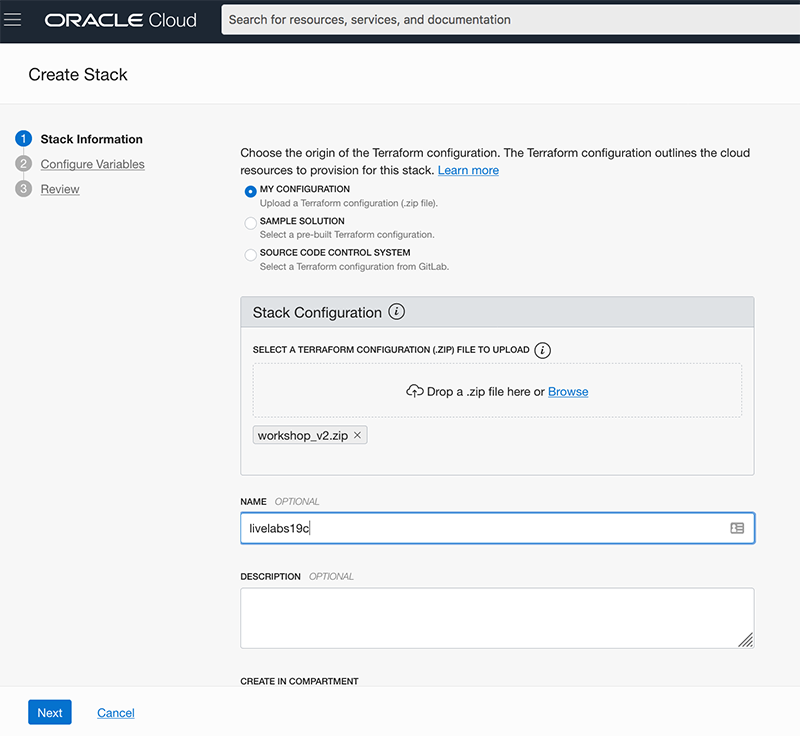
7. Accept the region and select your compartment.  Select an **availabilty domain** from the drop down.
   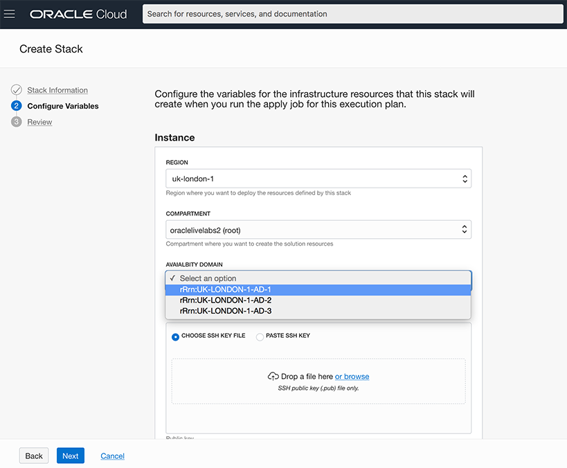
8. Paste the SSH key you created in the previous lab.
   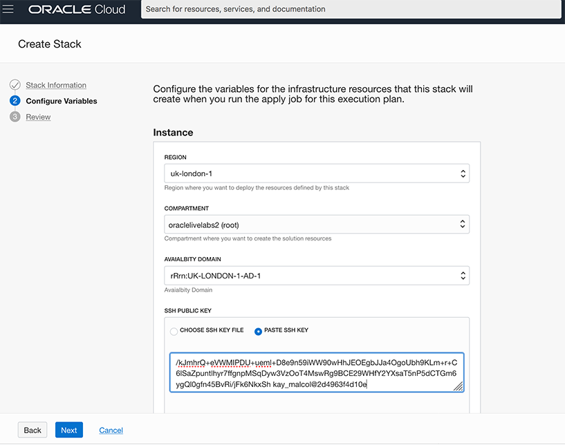
9. Scroll down and select the **VMStandard.E2.4**.  *Note: Make sure you select the 2.4 version.  It has enough memory to run the database 19c binaries*
    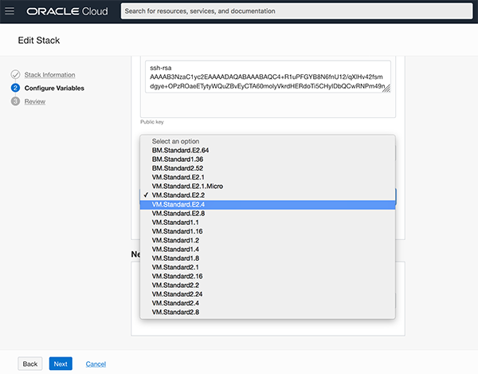
10. Accept the network and click **Next**.
    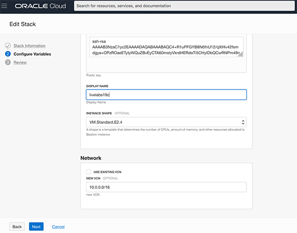
11. Review the details and click **Next**.
    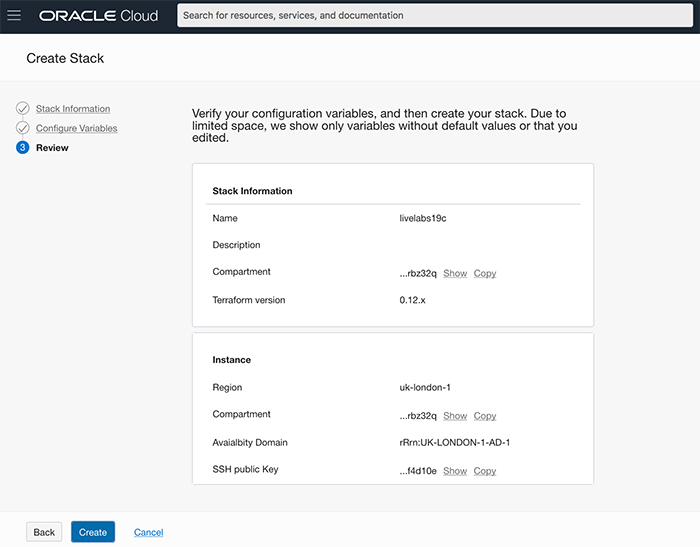

## **STEP 2**: Run Stack Apply Job

1. Click the **Terraform Actions** drop down.
    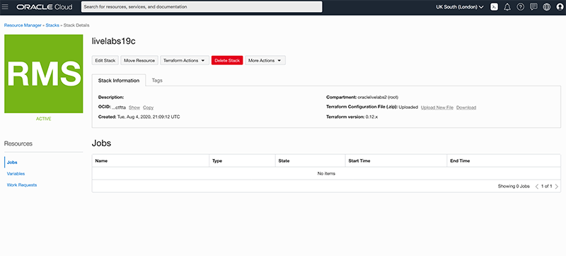
2. Choose **Apply**
    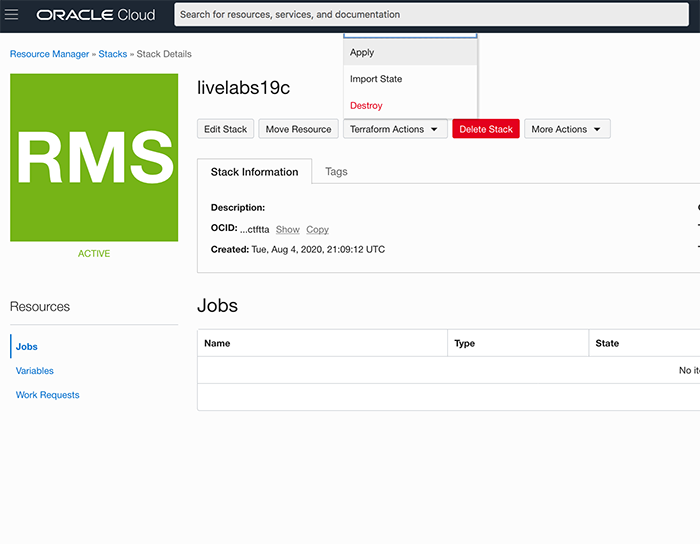
3. Resource Manager will begin creating the components needed for this workshop.
    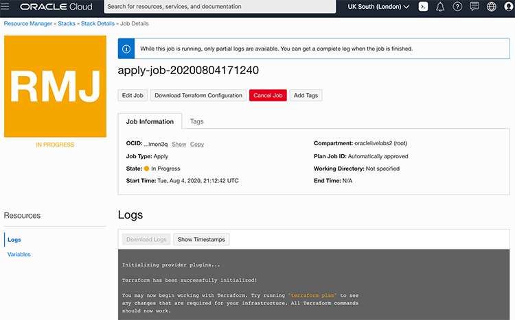
4. Inspect the log, you will notice that 8 resources were created including the compute instance.
   

## **STEP 3**: Gather compute instance details
1. Go to the hamburger menu (in the top left corner) and click **Compute** -> **Instances**
   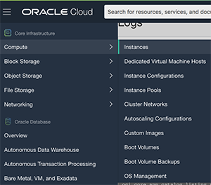
2. Look for the instance you just created and jot down the public IP address.
   

## **STEP 4**: Connect to your instance

There are multiple ways to connect to your cloud instance.  Choose the way to connect to your cloud instance that matches the SSH Key you generated.  *(i.e If you created your SSH Keys in cloud shell, choose cloud shell)*

- Oracle Cloud Shell
- MAC or Windows CYCGWIN Emulator
- Windows Using Putty
  
### Oracle Cloud Shell

1. To re-start the Oracle Cloud shell, go to your Cloud console and click the cloud shell icon to the right of the region.  *Note: Make sure you are in the region you were assigned*

    

2.  Go to **Compute** -> **Instances** and select the instance you created (make sure you choose the correct compartment)
3.  On the instance homepage, find the Public IP addresss for your instance.

    
4.  Enter the command below to login to your instance.    
    ````
    ssh -i ~/.ssh/<sshkeyname> opc@<Your Compute Instance Public IP Address>
    ````

    *Note: The angle brackets <> should not appear in your code.*
          
5.  When prompted, answer **yes** to continue connecting.
6.  Continue to the *next Step* on the left hand menu.

### MAC or Windows CYGWIN Emulator
1.  Go to **Compute** -> **Instances** and select the instance you created (make sure you choose the correct compartment)
2.  On the instance homepage, find the Public IP addresss for your instance.

3.  Open up a terminal (MAC) or cygwin emulator as the opc user.  Enter yes when prompted.

    ````
    ssh -i ~/.ssh/<sshkeyname> opc@<Your Compute Instance Public IP Address>
    ````
    

    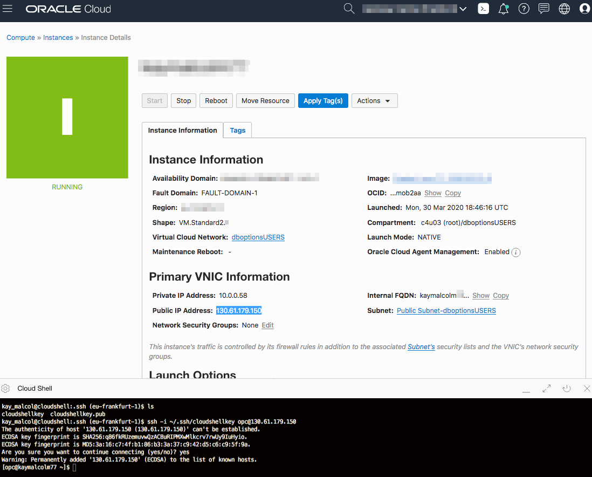

    *Note: The angle brackets <> should not appear in your code.*

4.  After successfully logging in, proceed to the *next Step* on the left hand menu.

### Windows using Putty

1.  Open up putty and create a new connection.

    ````
    ssh -i ~/.ssh/<sshkeyname> opc@<Your Compute Instance Public IP Address>
    ````
    

    *Note: The angle brackets <> should not appear in your code.*

2.  Enter a name for the session and click **Save**.

    

3. Click **Connection** > **Data** in the left navigation pane and set the Auto-login username to root.

4. Click **Connection** > **SSH** > **Auth** in the left navigation pane and configure the SSH private key to use by clicking Browse under Private key file for authentication.

5. Navigate to the location where you saved your SSH private key file, select the file, and click Open.  NOTE:  You cannot connect while on VPN or in the Oracle office on clear-corporate (choose clear-internet).

    

6. The file path for the SSH private key file now displays in the Private key file for authentication field.

7. Click Session in the left navigation pane, then click Save in the Load, save or delete a stored session STEP.

8. Click Open to begin your session with the instance.

## **STEP 5**: Verify the ORCL database is up

Once you deploy your compute instance, t
1.  From your connected session of choice **tail** the last 10 lines of the **dbsingle.log** file.  This file configures the database.  
    ````
    <copy>
    tail -10 /u01/ocidb/buildsingle1.log
    </copy>
    ````
    

2.  After *approximately 20 minutes*, you will see a notice that says the database setup is complete.

3. Run the following command to verify the database with the SID **ORCL** is up and running

    ````
    <copy>
    ps -ef | grep ORCL
    </copy>
    ````
    

4. Verify the listener is running
    ````
    <copy>
    ps -ef | grep tns
    </copy>
    ````

    

5.  Connect to the Database using SQL*Plus as the **oracle** user.

    ````
    <copy>
    sudo su - oracle
    sqlplus system/Ora_DB4U@localhost:1521/orclpdb
    exit
    </copy>
    ````

    

Congratulations!  You now have a fully functional Oracle Database 19c instance (ORCL) running on Oracle Cloud Compute.  

You may now *proceed to the next lab*.  

## Acknowledgements
- **Author** - Kay Malcolm, Director, DB Product Management
- **Contributors** - Sanjay Narvekar, Troy Anthony, Anoosha Pilli, Arabella Yao
- **Last Updated By/Date** - Kay Malcolm, August 2020

## See an issue?
Please submit feedback using this [form](https://apexapps.oracle.com/pls/apex/f?p=133:1:::::P1_FEEDBACK:1). Please include the *workshop name*, *lab* and *STEP* in your request.  If you don't see the workshop name listed, please enter it manually. If you would like for us to follow up with you, enter your email in the *Feedback Comments* section.    Please include the workshop name and lab in your request.
