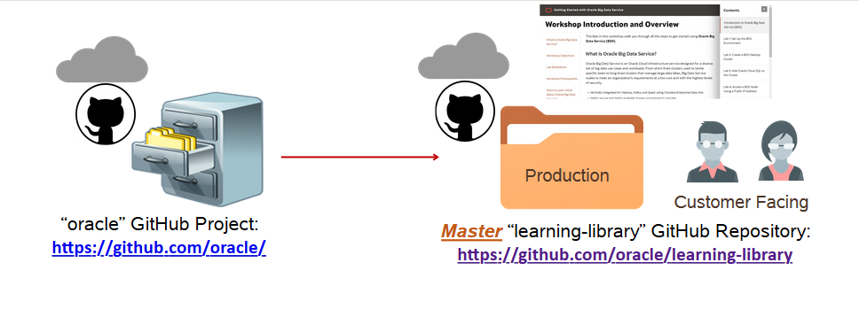
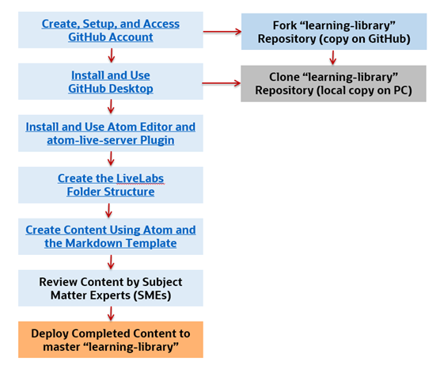

# Workshop Introduction and Overview                                    

The labs in this workshop walk you through all the steps to **develop labs and workshops**

## What are Live Labs and Workshops
A lab is a new model adopted by the DB organization to enhance the tutorial experience. Labs are what we all commonly know as Oracle by example (OBE). Labs can be combined to form a workshop, formerly known as learning path.

An individual Markdown (.md) file is called a lab (previously known as an Oracle By Example or OBE, or a tutorial).
A collection of labs is called workshop (previously known as Hands-on Lab or HOL, or a Learning Path).

## GitHub Projects and repositories
* GitHub is organized by projects.
* Each project has its own repository (commonly referred to as repo) that is accessed
through a unique URL.

## 'Oracle' GitHub Project and “learning-library” Repository

## GitHub Workflow
The following flow chart shows the process that we need to follow to set up the required environment for developing labs and workshops.

The following diagram explains the process of setting up the GitHub environment, forking to create a duplicate copy of the production oracle/learning-library repository to your GitHub account, and cloning your forked repository to your local machine.

## Workshop Objectives
- Setting Up the GitHub Environment and Installing GitHub Desktop Client
- Forking Learned-Library Content
- Cloning your Forked Library
- Understand the Live Labs Folder Structure
- Use Atom Editor to Develop Content
- Perform GitHub Operations to Commit your Developed Contents
- Host the labs on OHC

## Lab Breakdown
- Introduction to Live Labs and Workshops
- **Lab 1:** Get Started with Git and Set up the Environment
- **Lab 2:** Understand the Folder Structure
- **Lab 3:** Use Atom Editor and Live Server to Develop Content
- **Lab 4:** Use GitHub to Commit to Git Repository (Git Web UI)
- **Lab 5:** Add GitHub Hosted Labs to OHC

**After reading the following workshop prerequisites, get started by clicking Lab 1 in the Contents menu on the right.**

## Workshop Prerequisites
This workshop requires an Oracle Cloud account. You may use your own cloud account or a training account whose details were given to you by an Oracle instructor.

**You are all set to begin the labs! Click Lab 2: Get Started with Git and Set up the GitHub Environment in the Contents menu on the right.**

## Want to Learn More About Live Labs and Workshops?
Use these links to get more information about Labs and Workshops:
* [Glossary of Terms](https://confluence.oraclecorp.com/confluence/display/DBIDDP/Glossary+of+terms)

## Acknowledgements

* **Authors:**
    * Anuradha Chepuri, Principal UA Developer, Oracle GoldenGate
* **Reviewers:**
  * Aslam Khan, Sr.Manager User Assistance Development, ODI, GoldenGate
* **Contributors:**
* Lauran Serhal, Principal UA Developer, Oracle Database
* **Last Updated By/Date:** Anuradha Chepuri, September 2020

## See an issue?  
Please open up a request [here](https://github.com/oracle/learning-library/issues).  Please include the workshop name and lab in your request.
