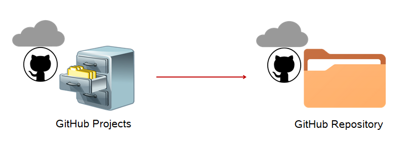

# Lab1: Introduction to Labs and Workshops                                   

The labs in this workshop walk you through all the steps to **develop labs and workshops**.

## What are Labs and Workshops
A lab is a new model adopted by the DB organization to enhance the tutorial experience. Labs are what we all commonly know as Oracle by example (OBE). Labs can be combined to form a workshop, formerly known as Hands-on Lab or HOL, or a Learning Path.

An individual Markdown (.md) file is called a lab.
A collection of labs is called workshop.

## What is GitHub?
GitHub is a cloud-based version control system designed for software developers.
  * At the core of GitHub is Git, an open source version control system that manages file versions and tracks the changes made by the members of a repository.
  * The Hub is a cloud-based repository that manages storage of the files and provides a folder structure.
  

## GitHub Projects and Repositories
* GitHub is organized by projects.
* Each project has its own repository (commonly referred to as repo) that is accessed
through a unique URL.

## 'Oracle' GitHub Project and “learning-library” Repository

  
  **Note**: The term "learning-library" is NOT the same as Oracle Learning Library (OLL) used formerly in the OBE world. The Oracle Learning Library (OLL) is an online resource for content about Oracle products [https://apexapps.oracle.com/pls/apex/f?p=44785:1](https://apexapps.oracle.com/pls/apex/f?p=44785:1), whereas "learning-library" is the GitHub repository that is accessed through a unique URL: [https://github.com/oracle/learning-library](https://github.com/oracle/learning-library).

## GitHub Workflow
The following flow chart shows the process that your need to follow to set up the environment for developing labs and workshops:

## Workshop Objectives
  * Set up the GitHub environment.
  * Install and use GitHub Desktop Client.
  * Fork the learning-library repository (copy repository content to GitHub).
  * Clone your forked learning-library repository (copy repository content to local machine).
  * Understand the lab folders' structure.
  * Install and use Atom Editor to and the Markdown templates to develop content.
  * Perform GitHub operations to commit your developed content to the master (production) learning-library on GitHub.
  * Host workshops and labs on the Oracle Help Center (OHC).

## Lab Breakdown
- **Lab 1:** Introduction to Labs and Workshops
- **Lab 2:** Get Started with Git and Set up the Environment
- **Lab 3:** Understand the Folder Structure
- **Lab 4:** Use Atom Editor and Live Server to Develop Content
- **Lab 5:** Use GitHub to Commit to Git Repository (Git Web UI)
- **Lab 6:** Add GitHub Hosted Labs to OHC

## What's Next

  **You are all set to begin the labs! Click Lab 2: Get Started with Git and Set up the Environment in the Contents menu.**

## Want to learn more about labs and workshops?
  Use these links to get more information about Labs and Workshops:
  * [Oracle LiveLabs](https://apexapps.oracle.com/pls/apex/f?p=133:1)
  * [Getting started with GitHub](https://docs.github.com/en/free-pro-team@latest/github/getting-started-with-github)
  * [Glossary of Terms](https://confluence.oraclecorp.com/confluence/display/DBIDDP/Glossary+of+terms)
  * [Develop LiveLabs Workshops and Labs Using Markdown](https://confluence.oraclecorp.com/confluence/pages/viewpage.action?spaceKey=DBIDDP&title=Develop+LiveLabs+Workshops+and+Labs+Using+Markdown)

## Acknowledgements

* **Author:**
    * Anuradha Chepuri, Principal User Assistance Developer, Oracle GoldenGate
* **Contributors:**
    * Lauran Serhal, Principal User Assistance Developer, Oracle Database and Big Data User Assistance

* **Reviewed by:**  
    * Aslam Khan, Senior User Assistance Manager, ODI, OGG, EDQ
    * Tom McGinn, Database and Database Cloud Service Senior Principal Product Manager, DB Development - Documentation
* **Last Updated By/Date:** Anuradha Chepuri, October 2020

## Need Help?  
Please submit feedback or ask for help using our [LiveLabs Support Forum](https://community.oracle.com/tech/developers/categories/livelabsdiscussions). Please click the **Log In** button and login using your Oracle Account. Click the **Ask A Question** button to the left to start a *New Discussion* or *Ask a Question*.  Please include your workshop name and lab name.  You can also include screenshots and attach files.  Engage directly with the author of the workshop.

If you do not have an Oracle Account, click [here](https://profile.oracle.com/myprofile/account/create-account.jspx) to create one.
