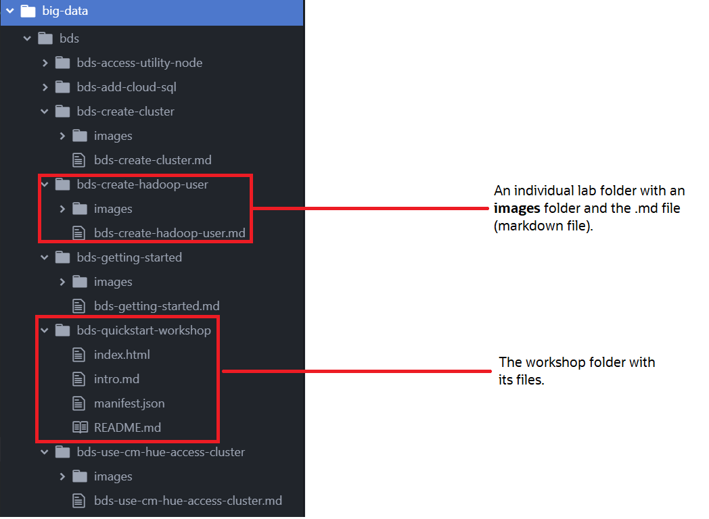

# Understand the Learning-Library Folder Structure

## INTRODUCTION
This lab describes the prescribed folder structure that we need follow to develop labs and workshops
### Objectives

* Understand the Learning Library Foldser Structure
* Get to know the Components
* Set up the GitHub Environment
## **STEP 1:** Learning Library Folder Structure

The following image shows a folder structure for a big-data workshop. You can see this structure in the following URL https://github.com/oracle/learning-library/tree/master/database-management-library/big-data/bds, or in the data-management-library/big-data/bds folder of the clone on your machine.
    

## **STEP 2:** Individual Components of the Workshop and Lab Folders
1. The following describes the components of the above example:
    * The root folder of this example is the name of the workshop, bds
    * Each lab folder will have an **images** folder that contains the screenshots that are used in the lab.
    * The **Workshop** folder contains an `index.html`, `intro.md`,`manifest.json`, and `README.md` file.
    * The index.html file is executed when it is accessed by a browser. For example, https://oracle.github.io/learning-library/data-management-library/database/multitenant/workshops/freetier/index.html
    * The `manifest.json` file defines the structure of the workshop that the `index.html` file renders.
    * The `README.md` file contains the gist of the entire Workshop. You can view it from your git repository.

      

**This concludes this lab. Please proceed to the next lab in the Contents menu on the right.**

## WANT TO LEARN MORE?

* [How to Use the GitHub Template](https://otube.oracle.com/media/Use+GitHub+Template/0_780dlc2i)

## ## ACKNOWLEDGEMENTS

* **Authors:**
    * Anuradha Chepuri, Principal UA Developer, Oracle GoldenGate

* **Last Updated By/Date:** Anuradha Chepuri, October 2020

## See an issue?  
Please open a request [here](https://github.com/oracle/learning-library/issues). Include the workshop name and lab in your request.
