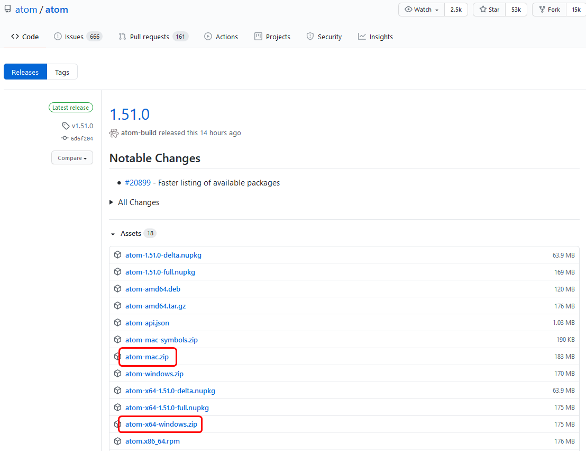
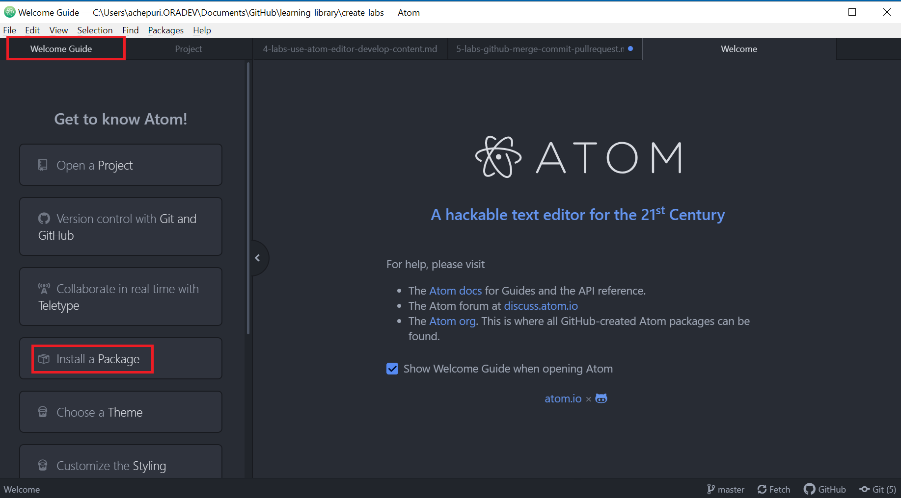
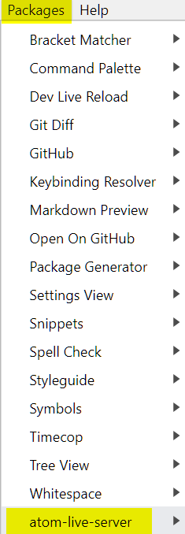
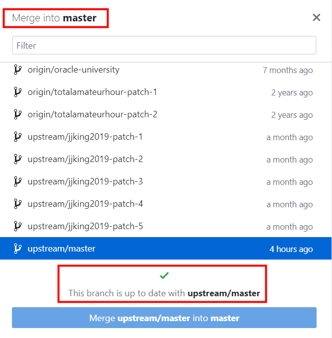
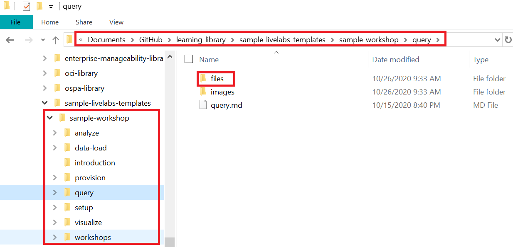
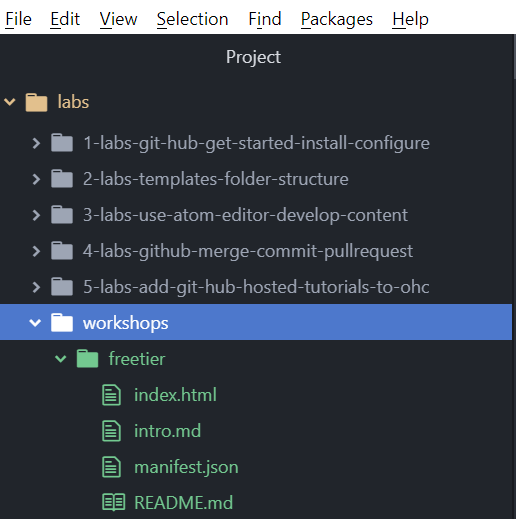
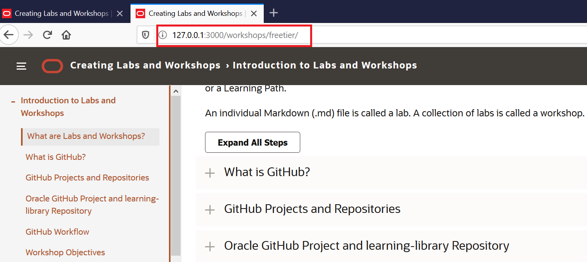

# Use Atom Editor to Develop Markdown Content

## Introduction

You can use your preferred editor to author and edit your Markdown (.md) content for rendering the Workshop output.

**Note:** Oracle recommends the UA Developers to use Atom.

### Objectives

* Learn about the tools that are available to develop and host your content.
* Learn how to merge content.
* Create workshop and lab content.
* Preview the content in a browser.

### What Do You Need?
* An IDE, such as Atom.
* A local web server such as **atom-live-server**, a plugin for `Atom.io`.

## **STEP 1:** Install Atom
`Atom.io` is a 3rd party IDE freely available under MIT License.

To install Atom:
1. Go to the [Atom](https://github.com/atom/atom/releases/tag/v1.51.0) URL.
2. Click the zip file  for your operating system, save and extract the zip file.
  
3. From the extracted files, click `atom.exe` to launch Atom.

## **STEP 2:** Install the atom-live-server Plugin
You must NOT be connected to Oracle's network or VPN while installing the **atom-live-server** package.

To install **atom-live-server**:
1. In the **Atom** editor, click **Help**, and then select **Welcome Guide**.
2. In the **Welcome Guide** screen, click **Install a Package**, and then click **Open Installer** to display the **Install Packages** window.

  

3. Enter **atom-live-server**, and then click **Install**.

  

4. When the installation is successfully completed, the **Install** button is replaced with the **Uninstall** and **Disable** buttons.
  
The **atom-live-server** plugin is added to the **Packages** menu.
  

## **STEP 3:** Merge Content from Git Before you Start Editing your Content
  Everyday before you start editing your content, ensure to do a Merge in **GitHub Desktop**.
  Merging synchronizes the content in your cloned repository with the latest content on the **upstream/master** repository and ensures that you have the most recent versions of the templates and other workshops/labs.

  To merge content:
  1. Start your **GitHub Desktop** client.
  2. Select **Branch > Merge into current branch** to display the **Merge in Master** window.

    

  3. Under the **Default branch**, the master branch is selected by default. This indicates the local clone on your PC.
    

  4. Scroll down the **Merge into master** window, select **upstream/master** (this is your master repository which is the learning-library), and then click **Merge upstream/master into master**. In this example, this will merge 120 commits by other people from the **upstream/master** into the clone on the local PC.

    

  5. When the merge is successfully completed, a **"Successfully merged upstream/master into master"** message is displayed. To push the new commits from the local clone to your forked location, click **Push origin**.

    **Note**: To determine if your clone is up-to-date with **upstream/master** (production), repeat steps 2 to 4. If both repositories are synchronized, then the following message is displayed: "This branch is up to date with **upstream/master**".

    

  In the **GitHub Desktop** UI, notice that the **Push Origin** is replaced by **Fetch Origin** after the push origin operation is successfully completed.  The local clone and fork repositories are now synchronized with the master repository.

  

## **STEP 4:** Create your Labs and Workshop Content
Leverage the content from the **learning-library\sample-livelabs-templates\sample-workshop** folder to start creating lab and workshop content for your project.

**Note**: Ensure to update your clone from the **upstream/master** repository (detailed in **Step 2**) on a regular basis whenever we are working on the markdown files.

To create your lab and workshop content:
1. Open your cloned repository using Windows Explorer.
2. Go to **learning-library\sample-livelabs-templates\sample-workshop**.
3. Copy any lab folder, such as the **query** folder to your project folder and rename **query**, for example: **1-labs-git-hub-get-started-install-configure**. Every lab folder contains the following: a **files** folder, an **images** folder, and the respective `.md` file. Rename the `.md` file, for example, `1-labs-git-hub-get-started-install-configure.md`. Based on the sample **query** folder, you can create and rename as many labs as per your requirement.

  **Note**: The **files** folder within every sample lab folder is currently not required and is reserved for future use.
  
  After you copy the sample folder, you can delete your copy of the **files** folder from your project folder.
  Your lab will look similar to this example:
  
4. To edit the `.md` file of your lab, open **Atom** Editor, click **File > Open Folder** to display the **Open Folder** dialog box.
  
5. Navigate to **GitHub\learning-library\create-labs\labs** and click **Select Folder** to open your project folder.
  
    **Important Note**: The **create-labs\labs** folders are internal to this "**Creating Labs and Workshops**" workshop. These folders are not available at the production. This means that when you fork the **oracle\learning-library** repository to your fork, such as **<your account>/learning-library** you will not find the **create-labs\labs** folders, and thereby will not be available in your cloned repository as well.   
6. Select the `.md` file you want to edit, for example, select the `1-labs-git-hub-get-started-install-configure.md` file and add your lab content. Similarly, edit the `.md` files of the rest of your labs.
7. If you want to use any images in your lab, then include them within the **images** folder.
6. Similarly, to start creating your workshop content, navigate to **learning-library\sample-livelabs-templates\sample-workshop** and copy the **workshops** folder along with its contents to your project folder. For example, **GitHub\learning-library\create-labs\labs**.
7. In **Atom**, expand the **workshops\freetier** folder, edit the `manifest.json` to list the labs you have added to your workshop (or plan to add) and update the title of the workshop. The `manifest.json` is like your book map file in SDL.
  
8. If you want to add an introduction to your workshop, then navigate to **learning-library\sample-livelabs-templates\sample-workshop\introduction** and copy the `introduction.md` file to your **workshops\freetier** folder, for example: **GitHub\learning-library\create-labs\labs\workshops\freetier**. You can rename it if you would want to. In this example, we have renamed it to `intro.md`. Update the `intro.md` as per your requirements. Similarly, you can create a `README.md` file with the same `introduction.md` file and update the `README.md` with a summary of your workshop. Note that the `intro.md` and `README.md` files are optional files for your workshop's introduction. The workshop introduction can be treated as another lab.
    

In this example, your project folder **labs** contains 5 labs and a workshop.
    

## **STEP 5:** Preview Your Workshop and Labs Using atom-live-server

  To preview your output in a browser:
1. Start the **atom-live-server**. In the Atom editor, select **Packages > atom-live-server > Start server**.
  

  By default, the **atom-live-server** opens a browser window that displays the folders inside your project (**labs**) folder.
2. Click the **workshops** folder and then click **freetier** folder that contains the workshop you want to view.
  

  The Workshop is displayed along with the labs. You can make content changes in the **Atom** editor to the workshop and lab files, save the changes, and the updated content gets automatically refreshed in the browser window.

  

3. To stop the **atom-live-server**, go back to **Atom**, select  **Packages > atom-live-server > Stop folder-path-at-port-#**.

**This concludes this lab. Please proceed to the next lab in the Contents menu.**

## Want to Learn More?
[Basic Writing and Formatting Syntax](https://docs.github.com/en/github/writing-on-github/basic-writing-and-formatting-syntax)

## Acknowledgements
* **Author:**
    * Anuradha Chepuri, Principal User Assistance Developer, Oracle GoldenGate
* **Contributors:**
    * Lauran Serhal, Principal User Assistance Developer, Oracle Database and Big Data User Assistance

* **Reviewed by:**  
    * Aslam Khan, Senior User Assistance Manager, ODI, OGG, EDQ
    * Tom McGinn, Database and Database Cloud Service Senior Principal Product Manager, DB Development - Documentation

* **Last Updated By/Date:** Anuradha Chepuri, October 2020

## Need Help?  
Please submit feedback or ask for help using our [LiveLabs Support Forum](https://community.oracle.com/tech/developers/categories/livelabsdiscussions). Please click the **Log In** button and login using your Oracle Account. Click the **Ask A Question** button to the left to start a *New Discussion* or *Ask a Question*.  Please include your workshop name and lab name.  You can also include screenshots and attach files.  Engage directly with the author of the workshop.

If you do not have an Oracle Account, click [here](https://profile.oracle.com/myprofile/account/create-account.jspx) to create one.
