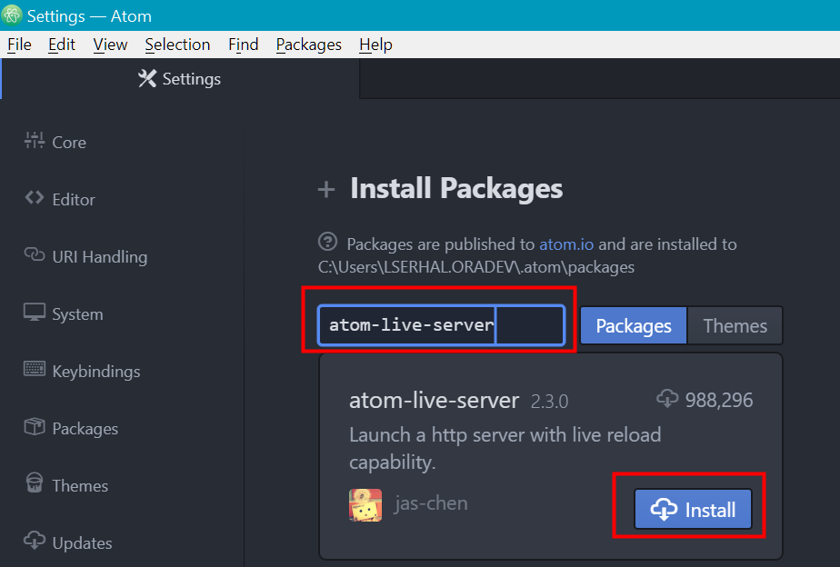
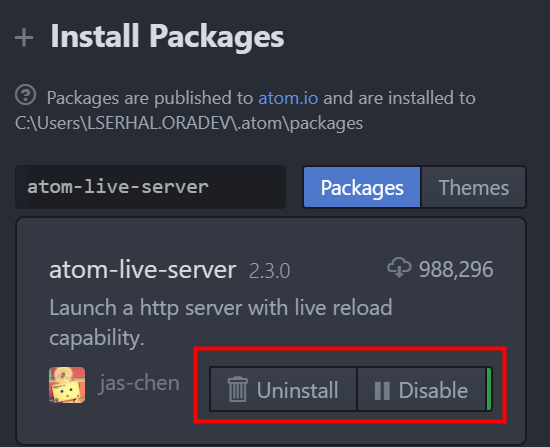
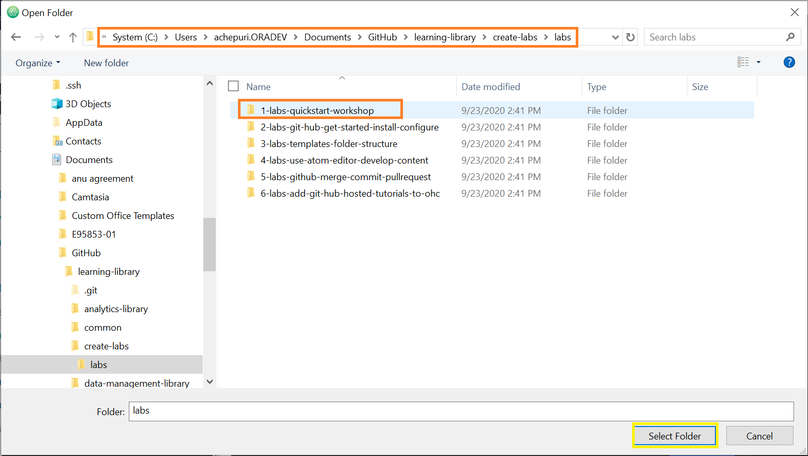
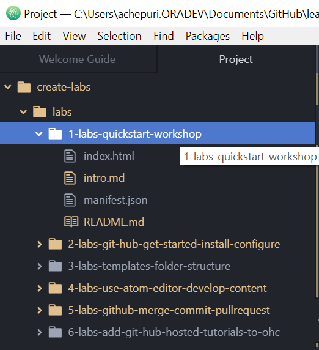

# Use Atom Editor to Develop Content and Host on Atom Live Server

## INTRODUCTION

You need to use your preferred Editor to author and edit your Markdown (.md) content for rendering the Workshop output. Oracle recommended Editor is Atom and the Atom Live Server

### Objectives

This lab suggests alternatives to develop and host your content, and if you are already using something that works for you, no need to change it. You can use any combination of tools that make sense for you.

### What Do You Need?
* An IDE such as Atom.
* A local web server such as atom-live-server, a plugin for Atom.io

**Note:** Using Atom is recommended for UA Developers. Visual Studio Code is a Microsoft "open source" product. The license agreement is not a standard MIT or General Public License (GPL) agreement and therefore not approved for use at Oracle.

## **STEP 1:** Install Atom
Atom.io is a 3rd party IDE freely available under MIT License.
To install Atom:
1. Go to the [Atom](https://github.com/atom/atom/releases/tag/v1.51.0) URL.
2. Select your zip file, save, and extract the zip files.
  
3. From the extracted files, click `atom.exe` to launch Atom.

## **STEP 2:** Install the Atom-Live-Server Plugin
Ensure that you are not on Oracle's network (or VPN) to install packages, including atom-live-server.
To install the Atom Live Server:
1. In the Atom Editor, click **Help**, and then select **Welcome Guide**.
2. In the **Welcome Guide** screen, click **Install a Package**, and then click **Open Installer** to display the **Install Packages** window.

3. Enter `atom-live-server`, and then click **Install**.

4. When the installation is successfully completed, the **Install** button is replaced with the **Uninstall** and **Disable** buttons.

The atom-live-server plugin is added to the **Packages** menu.

## **STEP 3:** Browse Your Workshop and Labs Using Atom-Live-Server

To view your Workshop and Labs in HTML format:
1. To view your workshop and the labs inside the workshop in HTML format, open the folder that contains the markdown (.md), `index.html`, and `manifest.json` files for the workshop. Click **File > Open Folder** to display the **Open Folder** dialog box.

2. The following example shows the local cloned copy of the learning-library repository for user achepuri. The clone was saved in the following local filesystem path: **C:\Users\achepuri.ORADEV\Documents\GitHub\learning-library\create-labs\labs** folder. The user chose **GitHub** folder for the clone's name. The workshop was created in the **\learning-library\create-labs\labs** folder. The workshop's name (and the folder's name) is 1-labs-quickstart-workshop. This workshop, contains 5 labs as shown in the following screen. To open the workshop in Atom, select the root folder for the workshop, create-labs, and then select **labs** Folder.

The workshop folder and the lab folders are displayed in Atom.

3. To preview your output: Start atom-live-server. Select **Packages > atom-live-server > Start Server**.

4. By default, atom-live-server opens a browser window that displays the folders inside the **labs** folder. If several folders are displayed, then select the folder that contains the workshop or lab that you want to view. In this example, to display the workshop, double-click the workshop's name, **1-labs-quickstart-workshop**.

The Workshop is displayed along with the labs. The labs contained in this workshop are displayed in the Contents menu on the right. You can make content changes in the Atom Editor to the workshop and lab files, save the changes, and the updated workshop and labs will be displayed in the browser window. The pages reload automatically. To view a lab, click the lab's name in the **Contents** menu.

5. To stop the atom-live-server, select  **Packages > atom-live-server > Stop folder-path-at-port-#**.

**This concludes this lab. Please proceed to the next lab in the Contents menu on the right.**

## WANT TO LEARN MORE?
[Basic Writing and Formatting Syntax](https://docs.github.com/en/github/writing-on-github/basic-writing-and-formatting-syntax)

## ACKNOWLEDGEMENTS
* **Authors:**
    * Anuradha Chepuri

* **Last Updated By/Date:** Anuradha Chepuri, October 2020

## SEE AN ISSUE?
Please open up a request [here](https://github.com/oracle/learning-library/issues).
