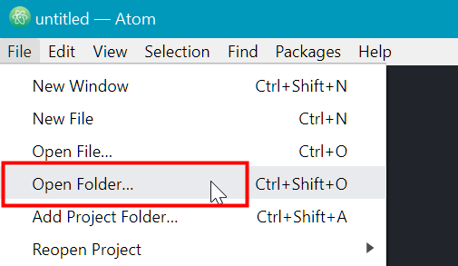
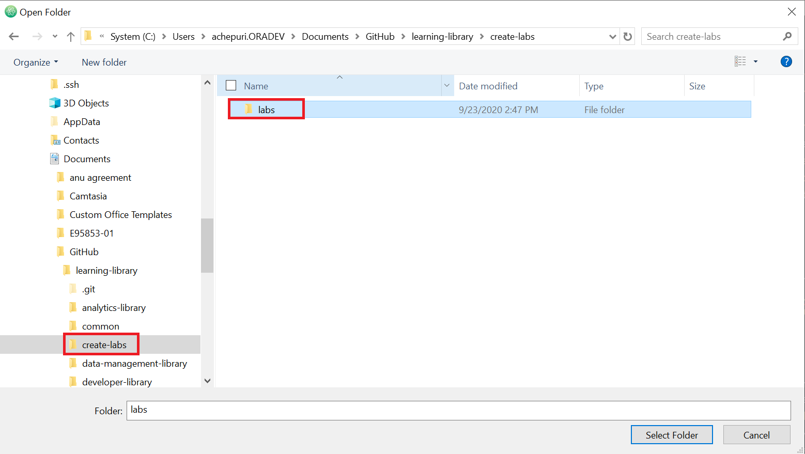
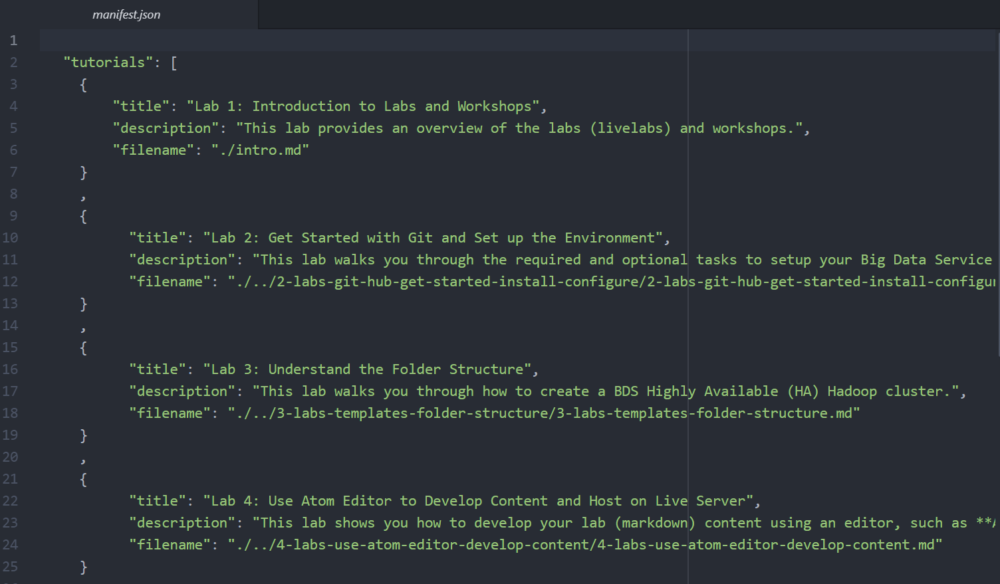
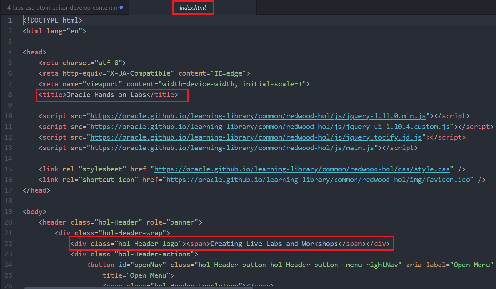
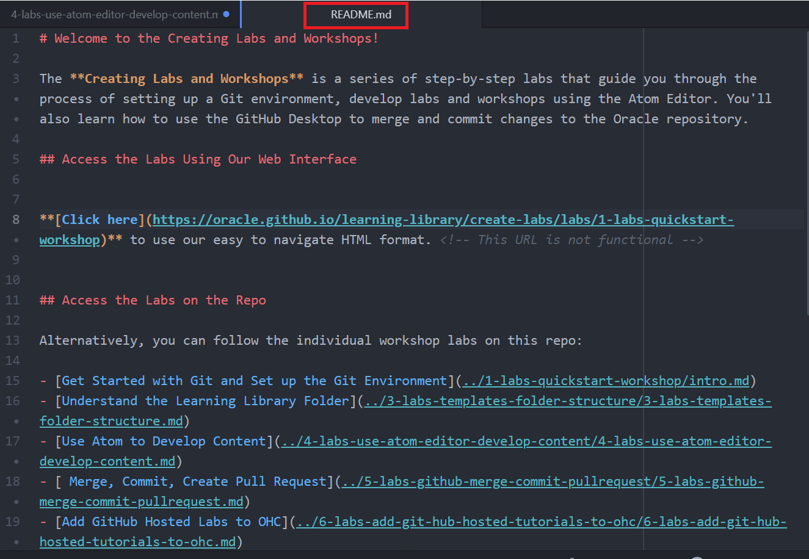
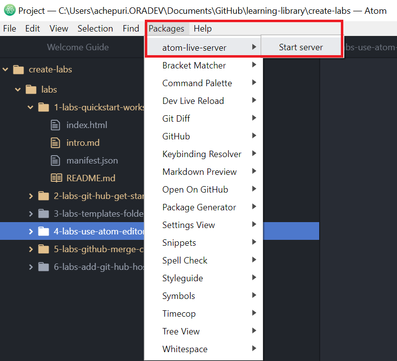
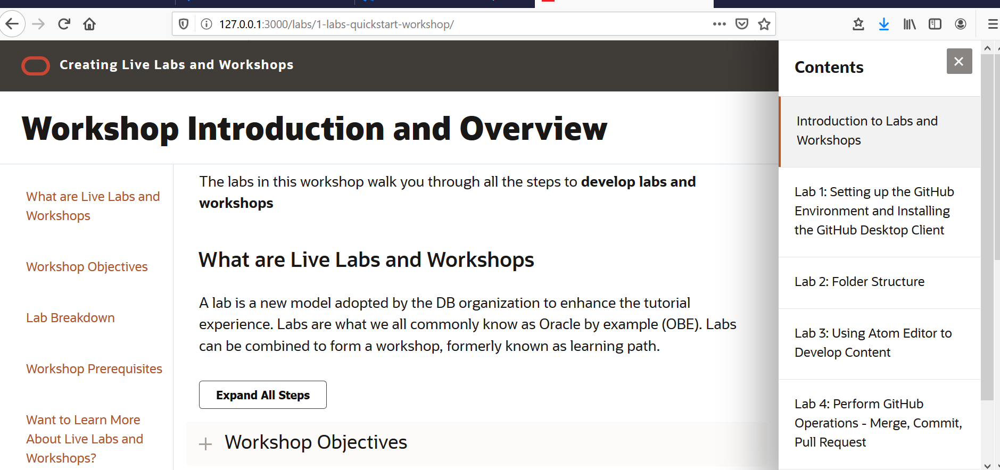

# Use Atom Editor to Develop Content and Host on Atom Live Server

## Introduction

You can use your preferred Editor to author and edit your Markdown (.md) content for rendering the Workshop output. Oracle recommends the Atom Editor and the Atom Live Server.

### Objectives

This lab suggests alternatives to develop and host your content, and if you are already using something that works for you, no need to change it. You can use any combination of tools that make sense for you.

### What Do You Need?
* An IDE such as Atom.
* A local web server such as atom-live-server, a plugin for Atom.io

**Note:** Using Atom is recommended for UA Developers. Visual Studio Code is a Microsoft "open source" product. The license agreement is not a standard MIT or General Public License (GPL) agreement and therefore not approved for use at Oracle.

## **STEP 1:** Install Atom
`Atom.io` is a 3rd party IDE freely available under MIT License.

To install Atom:
1. Go to the [Atom](https://github.com/atom/atom/releases/tag/v1.51.0) URL.
2. Click the zip file file for your operating system, save and extract the zip file.
  
3. From the extracted files, click `atom.exe` to launch Atom.

## **STEP 2:** Install the Atom-Live-Server Plugin
You must NOT be connected to Oracle's network or VPN while installing the Atom-Live-Server package.

To install the Atom Live Server:
1. In the Atom Editor, click **Help**, and then select **Welcome Guide**.
2. In the **Welcome Guide** screen, click **Install a Package**, and then click **Open Installer** to display the **Install Packages** window.

  

3. Enter `atom-live-server`, and then click **Install**.

  

4. When the installation is successfully completed, the **Install** button is replaced with the **Uninstall** and **Disable** buttons.
  
The atom-live-server plugin is added to the **Packages** menu.
  

## **STEP 3:** Create your Lab and Workshop Content
You can use any of the existing project folder in the **\learning-library** folder as a template to create a workshop for your project. In this example, let's use the **learning-library\data-management-library\big-data\bds** project folder as a template to create a new workshop.
To create your Lab and Workshop Content:
1. Open your cloned repository using Windows Explorer.
2. Copy the **learning-library\data-management-library\big-data\bds** folder and paste it in your project folder (create a new folder, such as **create-labs**).
3. Rename the **bds** project folder to a name of your choice, for example, **labs**.
4. Rename the workshop and lab folders in the labs folder as per your requirement.  For example, rename **bds-quickstart-workshop** folder to **1-labs-quickstart-workshop** and so on.
5. Open **Atom** Editor, browse, and select your project folder. Click **File > Open Folder** to display the **Open Folder** dialog box.
  
6. Navigate to **create-labs\labs** and click **Select Folder**.
  
  The workshop folder and the lab folders are displayed in Atom.
  
7. Expand the Workshop folder, **1-labs-quickstart-workshop** in this example, open the `manifest.json` to list the labs you plan to add to your workshop. The `manifest.json` is like your book map file in SDL.
  
8. Open the `intro.md` file from **1-labs-quickstart-workshop** and update it as per your requirements.
9. Open the `index.html` file and update the title of the workshop.
    
10. Open the `README.md` file and update it with a gist of your workshop.
    
11. Similarly, expand the lab folder, for example, **2-labs-git-hug-get-started-install-configure** and edit the `*.md` file as per your requirement. If you want to use any images in your lab, then include them in the images folder.

## **STEP 4:** Preview Your Workshop and Labs Using Atom-Live-Server

To preview your output in a browser:
1. Start the atom-live-server. In the Atom Editor, select **Packages > atom-live-server > Start Server**.
  

  By default, the atom-live-server opens a browser window that displays the folders inside the **labs** folder.
2. Double-click the folder that contains the workshop you want to view. In this example, to display the workshop, double-click the workshop's name, **1-labs-quickstart-workshop**.
  

  The Workshop is displayed along with the labs. The labs contained in this workshop are displayed in the **Contents** menu on the right. You can make content changes in the Atom Editor to the workshop and lab files, save the changes, and the updated workshop and labs are automatically refreshed in the browser window.

  

3. To stop the atom-live-server, select  **Packages > atom-live-server > Stop folder-path-at-port-#**.

**This concludes this lab. Please proceed to the next lab in the Contents menu on the right.**

## Want to Learn More?
[Basic Writing and Formatting Syntax](https://docs.github.com/en/github/writing-on-github/basic-writing-and-formatting-syntax)

## Acknowledgements
* **Authors:**
    * Anuradha Chepuri, Principal UA Developer, Oracle GoldenGate
* **Reviewed by:**  
        * Aslam Khan, Sr. User Assistance Manager, ODI, OGG
* **Last Updated By/Date:** Anuradha Chepuri, October 2020

## See an Issue?
Please open a request [here](https://github.com/oracle/learning-library/issues).
Include the workshop name and lab in your request.
