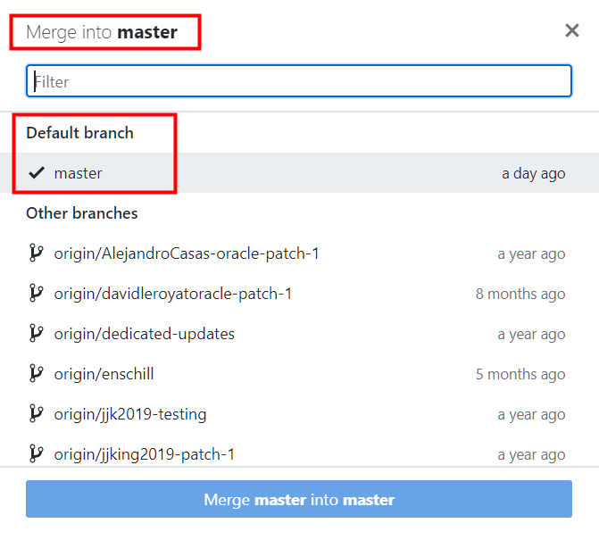
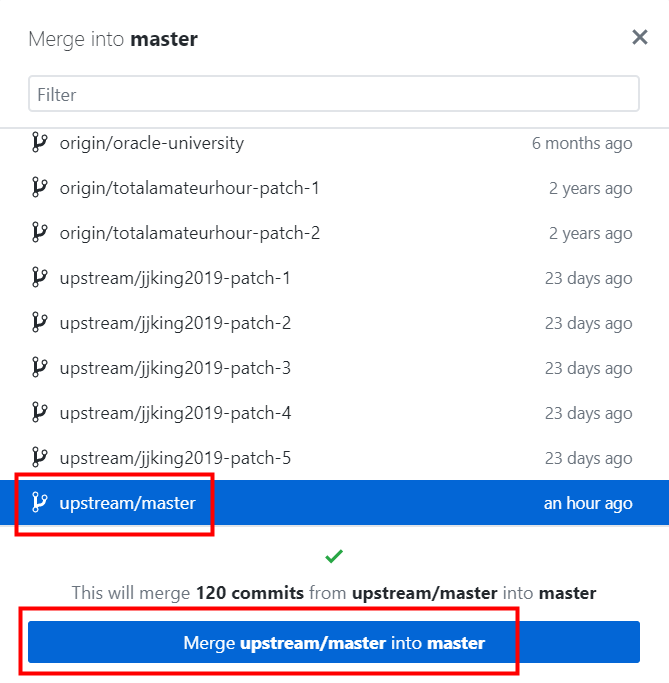
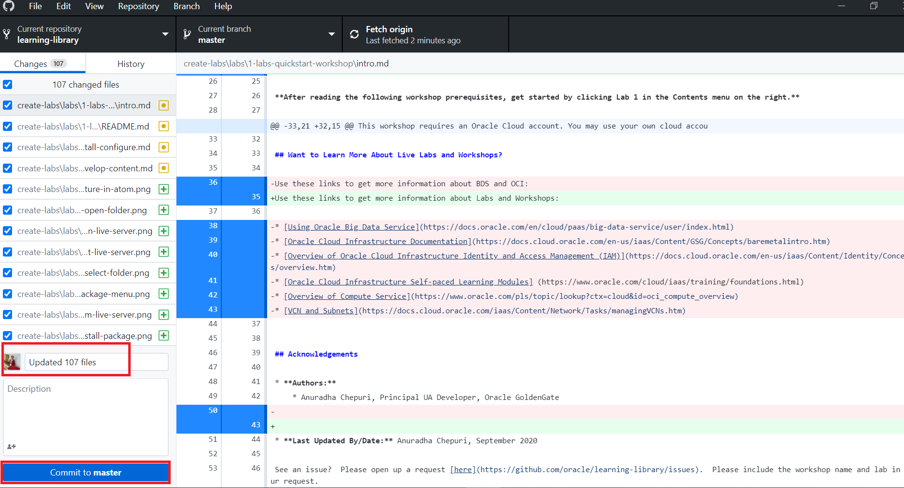
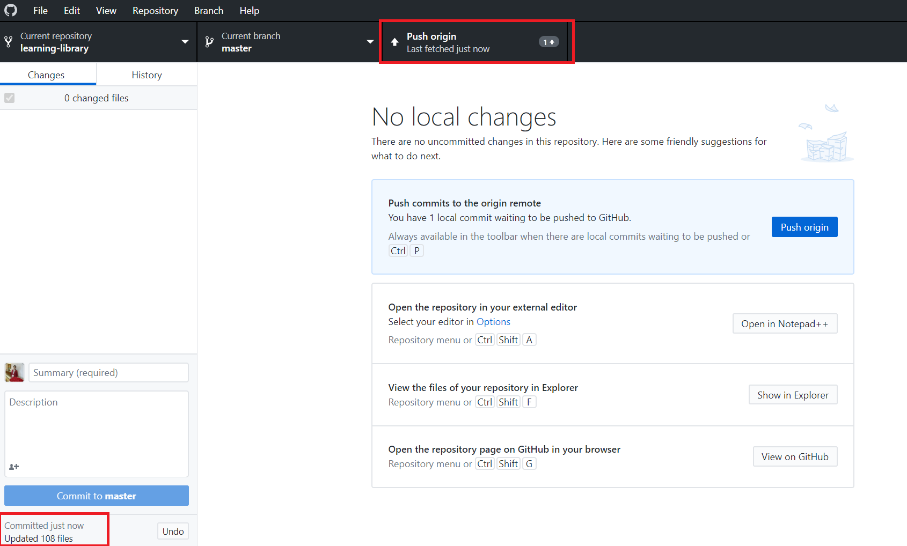
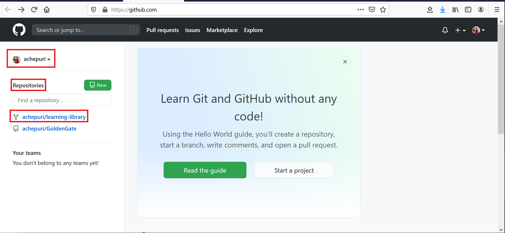
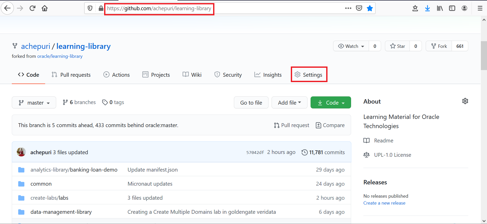
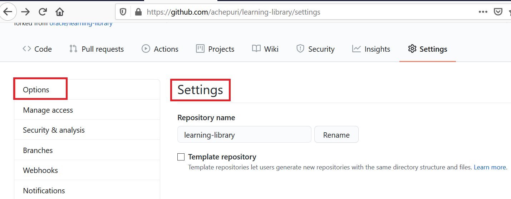
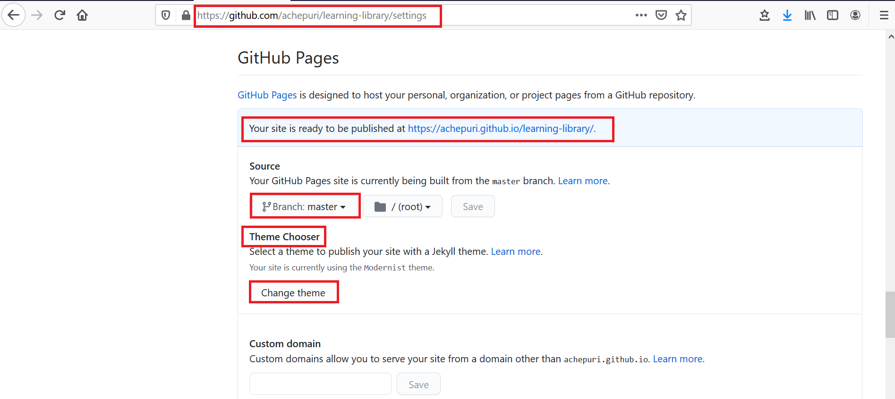
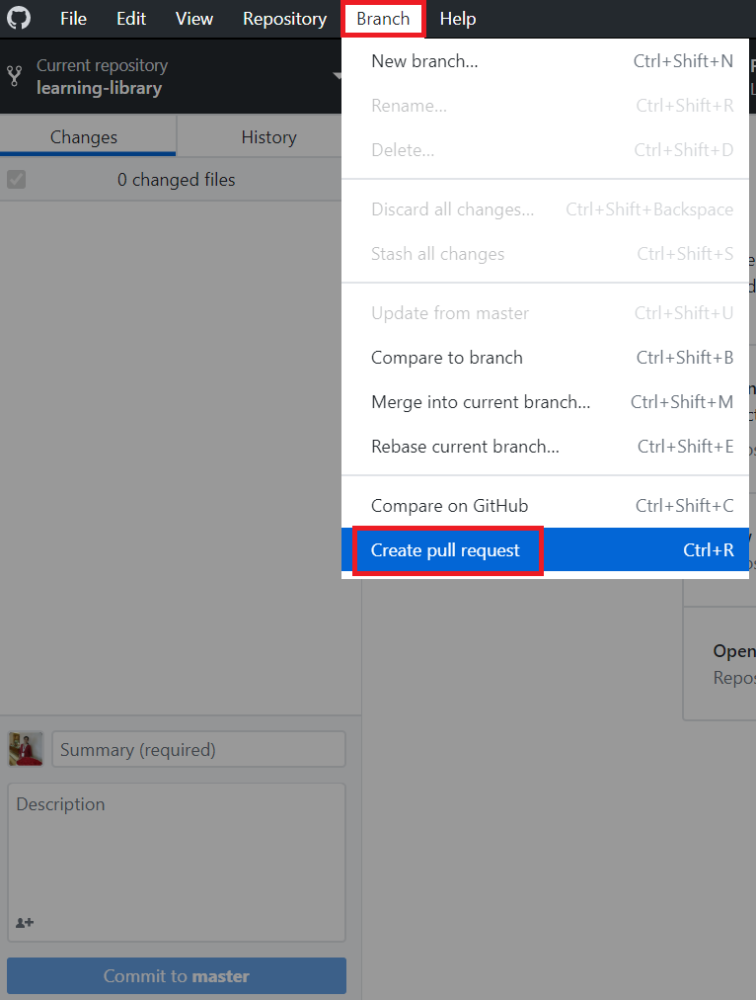
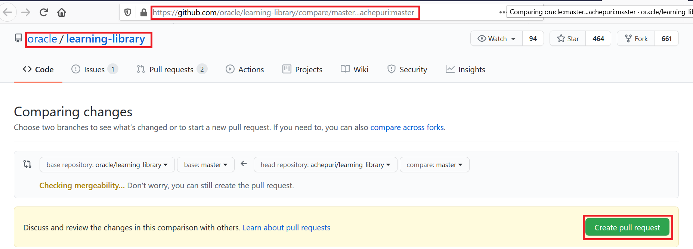

# Use GitHub to Commit to Git Repository (Git Web UI)

## Introduction

As a best practice, merge your library everyday or whenever you start your GitHub Desktop application. Merge pulls all the commits (changes) from the [upstream/master repository (production)](https://github.com/oracle/learning-library), into your local filesystem clone (local machine). This keeps your local clone up-to-date with other people's work (commits) from the upstream/master. Next, you push the updated content from your clone into the origin of your clone, that is, your fork, to synchronize your clone with your fork. Merging also avoids the long time it could take to complete if you don't do that often.

### Objectives

* Learn how to merge content
* Commit your Changes
* Request for a Review
* Test your Content
* Create a Pull Request to Upload your Content to Master

### What Do You Need?
* Git Environment Setup
* GitHub Desktop client

This lab assumes that you have successfully completed **Lab 4: Using Atom Editor to Develop Content** in the **Contents** menu on the right.

## **STEP 1:** Merge Content from Git Before you Start Editing your Content
Everyday before you start editing your content, ensure to do a Merge.

To merge content:
1. Start your **GitHub Desktop** client.
2. Select **Branch > Merge into current branch** to display the **Merge in Master** window.

  

3. Under the **Default branch**, the master branch is selected by default. This indicates the local clone on your PC.
  

4. Scroll down the **Merge into master** window, select **upstream/master** (this is your master repository which is the learning-library), and then click **Merge upstream/master into master**. In this example, this will merge 120 commits by other people from the upstream/master into the clone on the local PC.

  

5. When the merge is successfully completed, a "Successfully merged upstream/master into master" message is displayed. To push the new commits from the local clone to your forked location, click **Push origin**.

  **Note**: To determine if your clone is up-to-date with upstream/master (production), repeat steps 2 to 4. If both repositories are synchronized, then the following message is displayed: "This branch is up to date with upstream/master".

  

In the GitHub Desktop UI, notice that the **Push Origin** is replaced by **Fetch Origin** after the push origin operation is successfully completed.  The local clone and fork repositories are now synchronized with the master repository.

## **STEP 2:** Commit your Changes in your Clone
When you create, delete, or modify assets in your clone (local copy), you should commit (save) those changes to your clone, and then push those changes from your clone to your fork. Then these changes get saved to your forked learning-library repository.

To commit your changes:
1. Start your **GitHub Desktop** client.
2. In the **Summary (required)** text box on the left (next to your picture), enter a summary of your changes. You can optionally add a more detailed description of your changes in the **Description** text box.

  

3. Click **Commit to master**. This saves your changes in your local clone. **Fetch Origin** changes to **Push Origin**.

4. Click **Push origin** (it should have an upward arrow with a number). This pushes the updated content from your clone into the origin of this clone, that is, your fork.

  

## **STEP 3:** Set Up GitHub Pages for your Fork to Test your Content

After you upload the content from your clone to your fork, request your review team members to review this content by providing them with access to your GitHub Pages site URL (or the URL of your forked repository).

The GitHub Web UI has a feature called as **Set Up GitHub Pages for Your Fork** to Test Your Content. This feature performs a dynamic conversion of the Markdown files (.md files you have developed using your Atom Editor) to HTML. You can preview your workshop and labs on your forked repository and provide this URL to your reviewers.

To identify your GitHub Pages URL:
1. Login to [GitHub Web UI](http://github.com) using your GitHub account credentials, and then click your fork's link in the **Repositories** section to display your fork.

  

2. Click **Settings**.

   

3. Click **Options** and scroll down to the **GitHub Pages** section.

  

4. If your GitHub Page site is not yet set up, then the **Theme Chooser** label is displayed as a button. To enable GitHub Pages on your fork, click **Theme Chooser**. This may take a few hours to complete before your site is enabled.

  In the following example, the web site for the fork associated with user achepuri is: [https://achepuri.github.io/learning-library](https://achepuri.github.io/learning-library) where
    * achepuri is the user's GitHub account username
    * github.io is the domain name
    * learning-library is the repository name.
    Notice the GitHub Pages site that is associated with your fork.

    

**Note**: [https://achepuri.github.io/learning-library](https://achepuri.github.io/learning-library) refers to the forked repository and not the master repository (production).  

You can also review and test your workshop and labs on your forked repository from:

http://github.com/*your-github-account*/learning-library/tree/master/*path to your lab*

## **STEP 4**: Create a Pull Request to Upload Your Content to the Master Repository
The **Pull Request** is a request that you send to the repository owners and code owners of the **oracle/learning-library** repository to approve and host your content on production (**upstream/master** repository).

**Note**: The owners can approve your request, ask for more information if required, or reject your request if your content does not meet the standards for Oracle GitHub.

To create a Pull Request:
1. In the **GitHub Desktop** client, select **Branch > Create pull request** to display a browser interface.

  

2. Click **Create pull request** to display an **Open a pull request** page.

  

3. Enter a subject for the pull request, an optional comment, and then click **Create pull request**.

  A status page is displayed indicating that you have created a pull request along with the request number (#1770 for example), that it is pending review, and that merging is blocked. A merge that is blocked will be performed automatically as soon as it receives one approving review.

  When your pull request is approved, the page gets updated with information about your commits being approved and merged into the **upstream/master** repository (production).

  When the pull request is approved and merged into the **upstream/master** repository, two emails are sent to the e-mail account associated with your GitHub account.
  * The first email notifies you that your pull request was approved (or rejected).
  * If your pull request was approved, then the second email notifies you that your pull request was merged into the **upstream/master** repository.  

  Your committed content is now visible to the public on the learning-library (upstream/master or production) repository.

**This concludes this lab. Please proceed to the next lab in the Contents menu on the right.**

## Want to Learn More?

* [Using GItHub Desktop to merge, commit and make pull requests](https://otube.oracle.com/media/t/1_bxj0cfqf)
## Acknowledgements

* **Author:**  
    * Anuradha Chepuri, Principal User Assistance Developer, Oracle GoldenGate

* **Reviewed by:**  
    * Aslam Khan, Sr. User Assistance Manager, ODI, OGG
* **Last Updated By/Date:** Anuradha Chepuri, October 2020

## See an issue?  

Please open a request [here](https://github.com/oracle/learning-library/issues). Include the workshop name and lab in your request.
