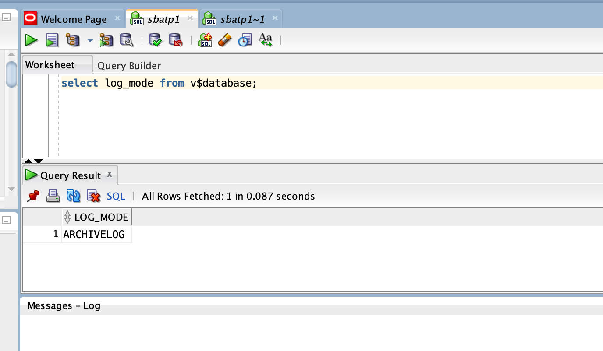
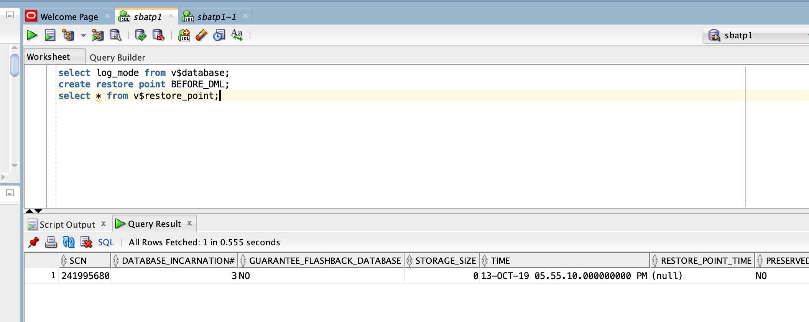
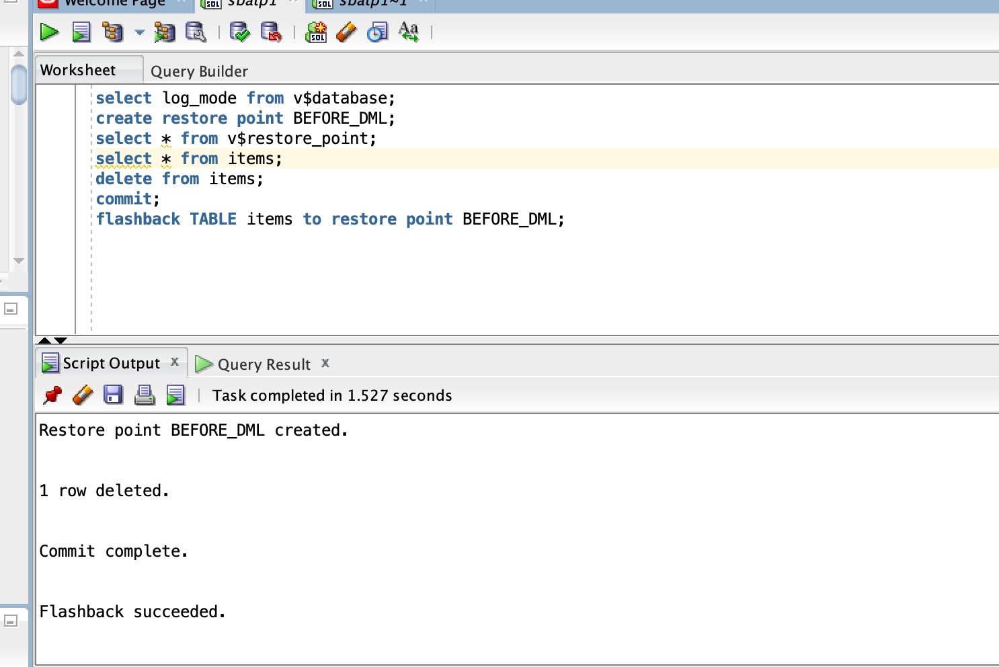

# Recover from user errors using flashback recovery

## Introduction
The Oracle Autonomous Database service comes pre-configured with a set of features collectively known as Flashback Technology that supports viewing past states of data, and winding and rewinding data back and forth in time, without requiring the restore of the database from backup. Depending on the changes to your database, Flashback Technology can often reverse the unwanted changes more quickly and with less impact on database availability.

### Objectives
As an adminstrator,
1. Learn how to set up recovery points in database change scripts.
2. Learn to recover from user errors such as unwanted commits and table drops.

### Required Artifacts
- An Oracle Cloud Infrastructure account.
- A pre-provisioned instance of Oracle Developer Client image in an application subnet. Refer to [Lab 5](?lab=lab-5-configuring-development-system).
- A pre-provisioned Autonomous Transaction Processing instance. Refer to [Lab 4](?lab=lab-4-provisioning-databases).

## **Step 1:** Log in to the Oracle Cloud Developer image and invoke SQL Developer
- To connect to your Oracle Cloud Developer image please refer to [Lab 5](?lab=lab-5-configuring-development-system). If  you are already connected from the previous lab skip to *STEP 2*.  

    *The remainder of this lab assumes you are connected to the image through VNC Viewer and are operating from the image itself and not your local machine (except if noted).*

- Connect to your developer client machine over VNC and invoke SQL Developer. Refer to [Lab 5](?lab=lab-5-configuring-development-system) for detailed instructions. 

- Next, open a connection to your dedicated autonomous DB instance. Once again, refer to [Lab 5](?lab=lab-5-configuring-development-system) if you do not know how to do that. Alternatively, you may also use sqlcl or sql*plus clients for this lab but screenshots here are based on SQL Developer.


## **Step 2:** Recover from erroneous transactions
*Lets first see how to recover from an accidental data loss.*

- In SQL Developer worksheet, lets first make sure the database is in archivelog mode. An autonomous database is always created in archivelog mode.

    ````
    <copy>
    select log_mode from v$database;
    </copy>
    ````
    


    The Query result should indicate the database is in ARCHIVELOG mode.

- Next, lets create a sample table, insert and commit a row using the following script,

    ````
    <copy>
    create table items(itemid NUMBER(5), qty Number(2), price Number(6,2));
    insert into items values(1, 2, 10);
    commit;
    </copy>
    ````

- Before you can use Flashback Table, you must ensure that row movement is enabled on the table to be flashed back, or returned to a previous state. Row movement indicates that rowids will change after the flashback occurs.

    ````
    <copy>
    Alter table items enable row movement;
    </copy>
    ````

- Now lets insert and commit a row in the items table.

    ````
    <copy>
    insert into items values(1, 2, 10);
    commit;
    </copy>
    ````

- Let's assume a database change requires certain DML operations. As a best practice, you create a restore point at the start of the change.

    ````
    <copy>
    create restore point BEFORE_DML;
    </copy>
    ````

- Confirm your restore point was created.

    ````
    <copy>
    select * from v$restore_point;
    </copy>
    ````
    

- Next, execute and commit this delete statement.
    
    ````
    <copy>
    delete from items;
    commit;
    </copy>
    ````

- The data in table items is all gone. Now lets flashback the table to the restore point to recover the data.

    ````
    <copy>
    flashback table items to restore point BEFORE_DML;
    </copy>
    ````
    


- And we are back in the game! 

- Of Course, you can always run a check on the items table with a, 

    ````
    <copy>
    select count(*) from items;
    </copy>
    ````

## Acknowledgements
*Congratulations! You successfully learnt to recover from user errors using Oracle flashback.*

- **Author** - Tejus S. & Kris Bhanushali
- **Adapted by** -  Yaisah Granillo, Cloud Solution Engineer
- **Last Updated By/Date** - Yaisah Granillo, April 2020

## See an issue?
Please submit feedback using this [form](https://apexapps.oracle.com/pls/apex/f?p=133:1:::::P1_FEEDBACK:1). Please include the *workshop name*, *lab* and *step* in your request.  If you don't see the workshop name listed, please enter it manually. If you would like us to follow up with you, enter your email in the *Feedback Comments* section. 
