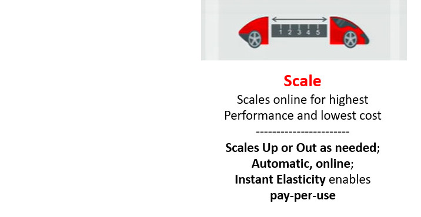
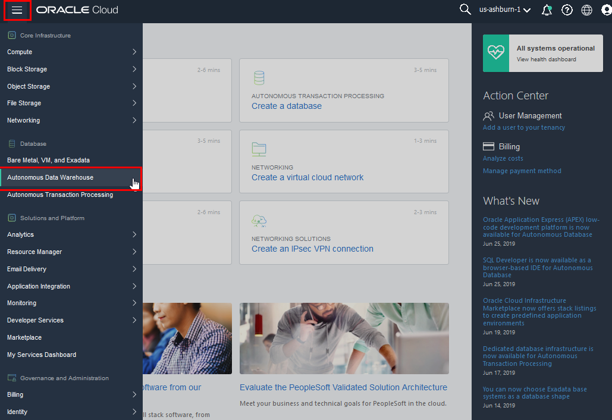
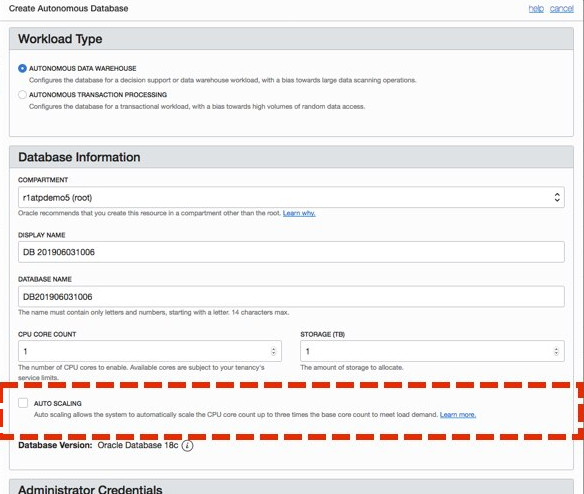

# Auto Scaling an Autonomous Database

## **Introduction**

In this lab, you will learn the benefits of auto-scaling an Oracle autonomous database. This lab uses the existing SSB schema in ADW. The lab executes a PL/SQL procedure which loops through executing one query for a specified number of minutes. You run this procedure from multiple sessions concurrently to see how CPU is utilized with and without auto scaling.

### What is Auto Scaling?

With auto scaling enabled, the database can use up to **three times** more CPU and IO resources than specified by the number of OCPUs currently shown in the **Scale Up/Down** dialog. When you enable auto scaling, if your workload requires additional CPU and IO resources the database automatically uses the resources without any manual intervention required.

*There's no "trigger point" after which you start to scale; the CPUs are ALWAYS available to you.*



Auto scaling is enabled by default when you create an Autonomous Database instance or you can use **Scale Up/Down** on the Oracle Cloud Infrastructure console to enable or disable auto scaling.

To see the average number of OCPUs used during an hour you can use the "Number of OCPUs allocated" graph on the Overview page on the Autonomous Data Warehouse service console.

Enabling auto scaling does not change the concurrency and parallelism settings for the predefined services.

Auto scaling makes it even easier to simply deploy a data warehouse, then forget about it - everything to do with the management and tuning of the data warehouse is taken care of for you. Your data warehouse is simply there, online and ready to work whenever you need it.

### How Auto Scaling Works

- When an ADW instance is created, the **CPU\_COUNT** parameter is set to 2X the number of allocated **OCPUs**. For example, if 4 OCPUs are allocated, CPU_COUNT is set to 8.
- When auto scaling is enabled, CPU\_COUNT is set to 3X higher than the base allocation. So in our example with 4 OCPUs, CPU_COUNT is set to 24.
- Customers are charged for the actual OCPU usage, between 4 and 12 in this example.
- Auto Scaling takes effect with the higher CPU\_COUNT setting – there are no additional things or criteria which happen behind the scenes to enable more CPU.
- Actual CPU usage is tracked with the metric **CPU Usage Per Sec** in `gv$con_sysmetric_history`. This view shows metric averages per minute. The per-minute metrics are then averaged over an hour for billing.

### Objectives

-   Learn the benefits of auto scaling
-   Learn how to enable and disable auto scaling
-   Examine the before/after performance improvements of auto scaling

### Prerequisites

- This lab requires an <a href="https://www.oracle.com/cloud/free/" target="\_blank">Oracle Cloud account</a>. You may use your own cloud account, a cloud account that you obtained through a trial, a LiveLabs account or a training account whose details were given to you by an Oracle instructor.
- This lab assumes you have completed the **Prerequisites** and **Lab 1** seen in the Contents menu on the right.
- Make sure you have completed the previous lab in the Contents menu on the right, *Provision Autonomous Database*, before you proceed with this lab, if you want to apply auto scaling to an existing ADW database. Otherwise, proceed with this lab to try auto scaling with a new autonomous database.
- **Note** Auto scaling is not available with Oracle's **Always Free** databases.

### How You Will Test Auto Scaling in this Lab

- **Test 1**: have only 1 session executing queries, so it is able to use all of the CPU.
- **Test 2**: have 2 sessions executing queries, so the CPU time is divided between those 2 sessions, resulting in query times that are 2X longer.
- **Test 3**: same as test 2, but with 3 sessions executing queries and sharing the CPU resources, resulting in query times that are 3X longer.
- **Test 4**: enable auto scaling and again have 3 sessions executing queries. The auto scaling will allow all 3 sessions to use CPU with a larger CPU\_COUNT, bringing your execution times back to what they were with only 1 session executing queries.

## **STEP 1**: Use ADW Database from Previous Lab or Create a New ADW Database

1. If you have created the Autonomous Data Warehouse database in the previous lab, *Provision Autonomous Database*, go to the details page for the database, click the  **Scale Up/Down** button, and deselect the **Auto Scaling** checkbox to disable auto scaling.

    

2. If you have not already created the ADW database in the previous lab, perform the following steps to create one. Log in to the OCI Console, and select **Autonomous Data Warehouse** from the navigation menu on the left of the console.

    

3. Click **Create Autonomous Database**.

    

4. Fill the fields as you normally do, up through specifying OCPUs and storage. Notice a check box just underneath the boxes where you decide how many OCPUs and how much storage you need. The check box is labeled **Auto Scaling** and the associated text explains what the feature does. For this lab, do **not** enable Auto Scaling. You will enable auto scaling later, after the autonomous database has been created.

    


## **STEP 2**: Create Four Connections to ADW in SQL Developer Web

1. Go to the details page for your ADW database. Click the **Tools** tab. In the next screen, click **Open SQL Developer Web**. (Note that you can alternatively use SQL Developer desktop client instead of SQL Developer Web.)

    

    

2. Open and save 4 worksheets: one using the LOW consumer group and three using the HIGH consumer group. In SQL Developer Web worksheets, you choose the consumer group from a drop-down menu in the upper right corner.
    - You will use the worksheet with the LOW consumer group in STEP 3 to run the setup and query the test results.
    - You will use the three worksheets with the HIGH consumer group to run the test queries in STEPS 4 through 9.

    

## **Step 3**: Run a Query to Show Current CPU Usage

1. Run the following query in your first worksheet that uses the LOW consumer group, to show the CPU usage for the past 5 minutes. You can also use this query to refer to the CPU usage later, but we'll include the CPU usage info in another query which also shows the test results.

```
<copy>SELECT
    *
FROM
    (
        SELECT
            to_char(end_time, 'DD-MM-YYYY HH24:MI')      end_time,
            round(SUM(value) / 100, 1)                   value
        FROM
            gv$con_sysmetric_history
        WHERE
                metric_name = 'CPU Usage Per Sec'
            AND begin_time > sysdate - 6 / 1440
        GROUP BY
            to_char(end_time, 'DD-MM-YYYY HH24:MI')
    )
WHERE
    end_time IS NOT NULL
ORDER BY
    1,
    2;
    </copy>
```

2. The Output will look something like the following. CPU usage should be relatively low since you haven't run any load yet.

```
END_TIME         VALUE
---------------- -----
02-09-2020 17:25 0.001
02-09-2020 17:26  0.01
02-09-2020 17:27 0.001
02-09-2020 17:28 0.009
02-09-2020 17:29 0.036
```

## **Step 4**: Create the Procedure for the Workload Used in the Test
Run a script to:
- Create the procedure **test\_proc** for the workload used in the test.
- Create a sequence used for each test number.
- Create the table used to save the results.

1. Copy and paste the following script into your second worksheet. This worksheet uses the HIGH consumer group.

```
<copy>drop sequence test_run_seq;
create sequence test_run_seq order nocache;

drop table test_run_data;
create table test_run_data
(test_no    number,
 cpu_count  number,
 sid        number,
 query_no   number,
 start_time timestamp,
 end_time   timestamp
);

create or replace procedure test_proc(i_executions number := 3) as
  v_sid        number;
  v_loop       number := 0;
  v_test_sql   varchar2(32767);
  v_test_sql_1 varchar2(32767);
  v_test_sql_2 varchar2(32767);
  v_end_date   date;
  v_begin_date date;
  v_begin_sql_time timestamp;
  v_end_sql_time timestamp;
  v_minute     number;
  v_result     number;
  v_last_test_no  number;
  v_test_no   number;
  v_test_start_time date;
  v_last_test_start_time date;
  v_cpu_count number;
--
function get_test_no return number is
  v_last_test_no         number;
  v_last_test_start_time date;
  v_test_no              number;
  v_test_start_time      date;
begin
  select test_no, start_time into v_last_test_no, v_last_test_start_time
  from   test_run_data
  where  start_time = (select max(start_time)
                       from   test_run_data);
  if v_last_test_start_time > (sysdate - 1/1440)
    then v_test_no := v_last_test_no;
    else v_test_no:= test_run_seq.nextval;
    end if;
  return v_test_no;
exception
  when others then
    v_test_no:= test_run_seq.nextval;
    return v_test_no;
end get_test_no;
--
begin
--  v_end_date := sysdate + (i_minutes/1440);
  v_test_no := get_test_no;
  select userenv('SID') into v_sid from dual;
  select sum(value) into v_cpu_count from gv$parameter where name = 'cpu_count';
  insert into test_run_data values(v_test_no, v_cpu_count, v_sid, null, systimestamp, null);
  commit;
  v_begin_date := sysdate;
  v_test_sql_1 := q'#select /* #';
  v_test_sql_2 := q'# */ /*+ NO_RESULT_CACHE */ count(*) from (
SELECT
    d.d_month,
    d.d_year,
    c.c_city,
    SUM(lo.lo_quantity),
    SUM(lo.lo_ordtotalprice),
    SUM(lo.lo_revenue),
    SUM(lo.lo_supplycost)
FROM
    ssb.lineorder   lo,
    ssb.dwdate      d,
    ssb.customer    c
WHERE
    lo.lo_orderdate = d.d_datekey
    AND lo.lo_custkey = c.c_custkey
    AND d.d_year = 1992
    AND d.d_sellingseason='Fall'
    AND c.c_nation = 'UNITED STATES'
GROUP BY
    d.d_month,
    d.d_year,
    c.c_city
)
#';
  loop
    v_loop   := v_loop + 1;
    v_minute := round((sysdate - v_begin_date) * 1440, 1);
    v_test_sql := v_test_sql_1 || 'test no:' || v_test_no || ', sid:' || v_sid || ', loop:' || v_loop || v_test_sql_2;
    v_begin_sql_time := systimestamp;
    execute immediate v_test_sql into v_result;
    v_end_sql_time := systimestamp;
    insert into test_run_data values(v_test_no, v_cpu_count, v_sid, v_loop, v_begin_sql_time, v_end_sql_time);
    commit;
    exit when v_loop = i_executions;
  end loop;
end;
/
</copy>
```

## **Step 5**: Run the `test_proc` Procedure

1. Run the procedure from the 2nd worksheet; one of your worksheets that uses the HIGH consumer group.
It will run for about 4.5 minutes on a 1 OCPU system.

````
exec test_proc;
````

2. While the procedure is executing, you can look at the Monitored SQL to see what is running. The procedure runs a query 3 times and is currently on the second one (loop in the SQL comment).

    

3. When the procedure finishes, check the Monitored SQL again.

    

4. Run this script to see the test results.

```
<copy>alter session set nls_date_format='DD-MM-YYYY HH24:MI:SS';

select test_no,
       cpu_count,
       sessions,
       queries_finished,
       test_duration_in_seconds,
       test_start_time,
--       test_end_time,
--       next_min_after_start,
--       min_before_end,
       avg_query_time,
       (select max(value)
        from   (SELECT trunc(end_time, 'MI') metric_end_time,
                       round(SUM(value) / 100, 3) value
                FROM   gv$con_sysmetric_history
                WHERE  metric_name = 'CPU Usage Per Sec'
                GROUP BY trunc(end_time, 'MI'))
        WHERE metric_end_time between next_min_after_start and min_before_end) max_cpu_usage
from   (select test_no,
               cpu_count,
               count(distinct sid) sessions,
               sum(nvl2(end_time,1,0)) queries_finished,
               round(extract(minute from (max(end_time) - min(start_time))) * 60 + extract(second from (max(end_time) - min(start_time))),1) test_duration_in_seconds,
               cast(min(start_time) as date) test_start_time,
               cast(max(end_time) as date) test_end_time,
               trunc(min(start_time), 'MI') + 1/1440 next_min_after_start,
               trunc(max(end_time), 'MI') - 1/1440 min_before_end,
               round(avg(to_number(extract(minute from (end_time - start_time)) * 60 + extract(second from (end_time - start_time)))),1) avg_query_time
        from   test_run_data
--        where  end_time is not null
        group by test_no,
                 cpu_count)
order by 1;
</copy>
```

5. The output should be something like this:

```
TEST_NO CPU_COUNT SESSIONS QUERIES_FINISHED TEST_DURATION_IN_SECONDS TEST_START_TIME     AVG_QUERY_TIME MAX_CPU_USAGE
------- --------- -------- ---------------- ------------------------ -------------------- -------------- -------------
      1         2        1                3                    271.4 2020-09-02T17:30:43Z           90.5         0.968
```

    Here Your can see:
    - CPU_COUNT=2. The cpu_count is set to 2X the OCPU setting, so here your OCPU setting is 1.
    - The test finished in 271 seconds, with an average query time of 90 seconds.
    - The MAX_CPU_USAGE is ~1, equal to the OCPU setting. This information comes from the gv$con_sysmetric_history view you queried earlier.

6. In the Active Sessions section for the Performance Hub, you can see that there is 1 active session running on the high service.

    

7. Switching to view by wait class, you can see that most of time is spent on CPU.

    

## **Step 6**: Run the Procedure from Two Worksheets Using the High Consumer Group

1. Now run the procedure from 2 worksheet connections using the HIGH consumer group. While the procedures are running, look at monitored SQL, which shows 2 queries executing.

    

2. Then look at monitored SQL after the procedures have completed.

    

3. Run the query to see the test results.

```
TEST_NO CPU_COUNT SESSIONS QUERIES_FINISHED TEST_DURATION_IN_SECONDS TEST_START_TIME     AVG_QUERY_TIME MAX_CPU_USAGE
------- --------- -------- ---------------- ------------------------ -------------------- -------------- -------------
      1         2        1                3                    271.4 2020-09-02T17:30:43Z           90.5         0.968
      2         2        2                6                    535.8 2020-09-02T17:38:31Z          177.7         0.997
```

Even though there are 2 queries executing at the same time, the system has limited the CPU usage to ~1 CPU. As a result, the average query time is about 2X as long.

4. Average Active Sessions shows 2 sessions using the HIGH consumer group.

    

5. Switching to view by wait class, you can see that now there are waits on CPU and IO.

    

## **Step 7**: Run the Procedure from Three Worksheets Using the High Consumer Group

1. Now run the procedure from 3 connections using the HIGH consumer group. While the procedures are running, monitored SQL shows 3 queries executing.

    

2. Now look at monitored SQL after the procedures have completed.

    

3. Run the query to see the rest results.

```
<copy>TEST_NO CPU_COUNT SESSIONS QUERIES_FINISHED TEST_DURATION_IN_SECONDS TEST_START_TIME     AVG_QUERY_TIME MAX_CPU_USAGE
------- --------- -------- ---------------- ------------------------ -------------------- -------------- -------------
      1         2        1                3                    271.4 2020-09-02T17:30:43Z           90.5         0.968
      2         2        2                6                    535.8 2020-09-02T17:38:31Z          177.7         0.997
      3         2        3                9                    806.5 2020-09-02T17:51:50Z          261.2         1.031
</copy>
```
Even though there are 3 queries executing at the same time, the system has limited the CPU usage to ~1 CPU. As a result, the average query time is about 3X as long.

4. Average Active Sessions shows 3 sessions using the high service.

    

5. Switching to view by wait class, you can see that you have the same number of waits on CPU, and more on IO.

    

Clearly, your test of 3 queries executing concurrently has not improved query performance. Next, enable auto scaling to improve query performance.

## **Step 8**: Enable Auto Scaling

1. Enable auto scaling, to allow you to use 3X the amount of CPU. Go to the details page for the database, click the  **Scale Up/Down** button, and select the **Auto Scaling** checkbox to re-enable auto scaling.

    

## **Step 9**: Run the Procedure Again from Three Worksheets Using the High Consumer Group

1. Run the procedure from 3 connections using the HIGH consumer group again. While the procedures are running, 3onitored SQL shows 3 queries executing.

    

2. Check the monitored SQL after the procedures have completed.

    

3. Run the query to see the rest results.

```
TEST_NO CPU_COUNT SESSIONS QUERIES_FINISHED TEST_DURATION_IN_SECONDS TEST_START_TIME     AVG_QUERY_TIME MAX_CPU_USAGE
------- --------- -------- ---------------- ------------------------ -------------------- -------------- -------------
      1         2        1                3                    271.4 2020-09-02T17:30:43Z           90.5         0.968
      2         2        2                6                    535.8 2020-09-02T17:38:31Z          177.7         0.997
      3         2        3                9                    806.5 2020-09-02T17:51:50Z          261.2         1.031
      4         6        3                9                    274.4 2020-09-02T18:12:26Z           89.8         2.897
```
Here you can see:
- CPU_COUNT=6. The cpu\_count is set to 6X the OCPU setting when auto scaling is enabled, so here our OCPU setting is still 1.
- The test finished in 274 seconds, with an average query time of 89 seconds, about the same as test 1 when there was only 1 session running queries.
- The MAX\_CPU\_USAGE is almost 3 as the system has automatically scaled to allow 3X the OCPU setting. This information comes from the ``gv$con_sysmetric_history`` view you queried earlier.

4. In the Active Sessions section for the Performance Hub, you can see that there are 3 active sessions running on the HIGH consumer group.

    

5. Switching to view by wait class, you can see that most of the time is spent on CPU.

    

## **Step 10**: Review What Happened Over the Tests

1. Here is the active sessions by consumer group graph for all of the tests.

    

2. And here is the graph by wait class.

    

In Summary:
- **Test 1** had only 1 session executing queries, so it was able to use all of the CPU.
- **Test 2** had 2 sessions executing queries, so the CPU time was divided between those 2 sessions, resulting in query times that were 2X longer.
- **Test 3** showed the same as test 2 but with 3 sessions executing queries and sharing the CPU resources, resulting in query times that were 3X longer.
- **Test 4** enabled auto scaling and had 3 sessions executing queries. **The auto scaling allowed all 3 sessions to use 3x the amount of CPU, bringing your execution times back to what they were with only 1 session executing queries!**

## Things to Note

- CPU\_COUNT is the only parameter that changes when auto scaling is enabled.
- Other parameters, including PARALLEL\_MAX\_SERVERS and PARALLEL\_SERVERS\_TARGET, stay the same.
- Consequently, parallel statement queuing acts the same with and without auto scaling enabled.
- When auto scaling is enabled, IO is also scaled to 3X the OCPU allocation. So even if only one session is executing a SQL Statement, it benefits from the additional IO.

## Want to Learn More?

For more information about auto scaling, see the documentation [Use Auto Scaling](https://docs.oracle.com/en/cloud/paas/autonomous-data-warehouse-cloud/user/autonomous-auto-scale.html#GUID-27FAB1C1-B09F-4A7A-9FB9-5CB8110F7141).

## **Acknowledgements**

- **Author** - John Zimmerman, Real World Performance Team
- **Contributors** - Nilay Panchal and Keith Laker, ADB Product Management
- **Adapted for Cloud by** - Rick Green, Principal Developer, Database User Assistance
- **Last Updated By/Date** - Rick Green, September 2020

## See an issue?
Please submit feedback using this [form](https://apexapps.oracle.com/pls/apex/f?p=133:1:::::P1_FEEDBACK:1). Please include the *workshop name*, *lab* and *step* in your request.  If you don't see the workshop name listed, please enter it manually. If you would like for us to follow up with you, enter your email in the *Feedback Comments* section.
