# Auto Scaling an Autonomous Database

## **Introduction**

In this lab, you will learn the benefits of auto-scaling an Oracle autonomous database and how to easily enable and disable this feature.

### What is Auto Scaling?

With auto scaling enabled, the database can use up to **three times** more CPU and IO resources than specified by the number of OCPUs currently shown in the **Scale Up/Down** dialog. When auto scaling is enabled, if your workload requires additional CPU and IO resources the database automatically uses the resources without any manual intervention required.

*There's no "trigger point" after which you start to scale; the CPUs are ALWAYS available to you.*

Auto scaling is enabled by default when you create an Autonomous Database instance or you can use **Scale Up/Down** on the Oracle Cloud Infrastructure console to enable or disable auto scaling.

To see the average number of OCPUs used during an hour you can use the "Number of OCPUs allocated" graph on the Overview page on the Autonomous Data Warehouse service console.

Enabling auto scaling does not change the concurrency and parallelism settings for the predefined services.

Auto scaling makes it even easier to simply deploy a data warehouse, then forget about it - everything to do with the management and tuning of the data warehouse is taken care of for you. Your data warehouse is simply there, online and ready to work whenever you need it.

### Objectives

-   Learn the benefits of auto scaling
-   Learn how to enable and disable auto scaling
-   Examine the before/after performance improvements of auto scaling

### Prerequisites

- The following lab requires an <a href="https://www.oracle.com/cloud/free/" target="\_blank">Oracle Cloud account</a>. You may use your own cloud account, a cloud account that you obtained through a trial, a LiveLabs account or a training account whose details were given to you by an Oracle instructor.
- This lab assumes you have completed the **Prerequisites** and **Lab 1** seen in the Contents menu on the right.
- Make sure you have completed the previous lab in the Contents menu on the right, *Provision Autonomous Database*, before you proceed with this lab, if you want to apply auto scaling to an existing ADW database. Otherwise, proceed with this lab to try auto scaling with a new autonomous database.
- **Note** Auto scaling is not available with Oracle's **Always Free** databases.

## **STEP 1**: Create a New Auto Scaling Autonomous Database

If you have already created a few data warehouses in the Oracle Cloud then you will be familiar with the very simple pop-up form we provide to create a new autonomous data warehouse.

1.  Log in to the OCI Console, and select **Autonomous Data Warehouse** from the navigation menu on the left of the console.

    

2.  Click **Create Autonomous Database**.

    

3.  Fill the fields as you normally do, up through specifying OCPUs and storage. Notice a check box just underneath the boxes where you decide how many OCPUs and how much storage you need.

    

4. The check box is labeled **Auto Scaling** and the associated text explains what the feature does. Simply click the check box and that’s it. In one single click, you have created an autonomous data warehouse that is going to scale itself based on your workload.

    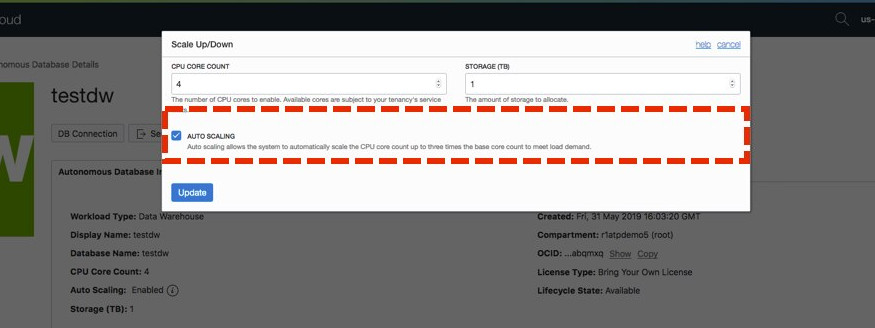

## **STEP 2**: Adding Auto Scaling to an Existing Autonomous Database

So what do you do if you already have an autonomous data warehouse and it's being used non-stop, every day. The good news is that you can switch on auto scaling for an existing data warehouses with a single click.

1.  All you need to do is click on the “Scale Up/Down” button on the OCI console and this pop-up form which manages scaling also now contains a new check box to enable (and disable) auto scaling. Enabling auto scaling on an existing instance requires zero downtime.

    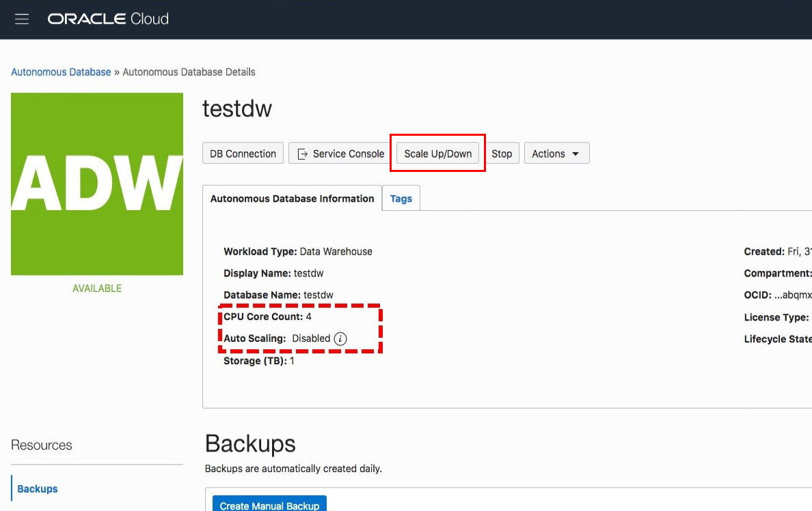

## **STEP 3**: How Does Auto Scaling Work?

Let's work through a simple example.

1. Suppose you have an existing Autonomous Data Warehouse with 4 OCPUs and 1 TB of storage and auto scaling is not enabled (in other words, it's disabled).

    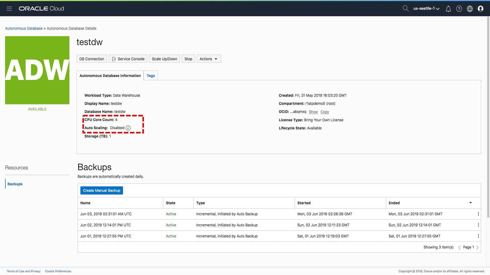

2. First, enable the auto scaling feature by clicking **Scale Up/Down**.

    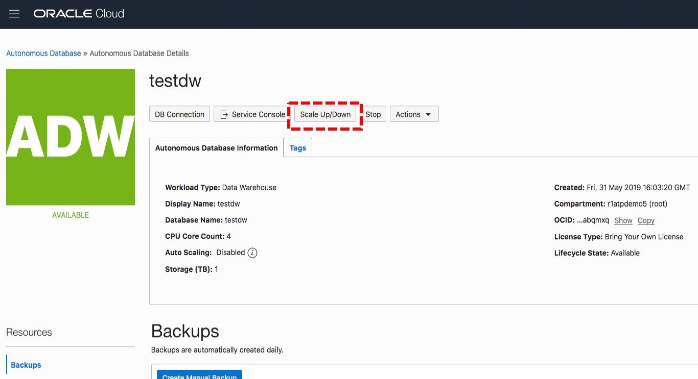

3. Click the **Auto Scaling** check box.

    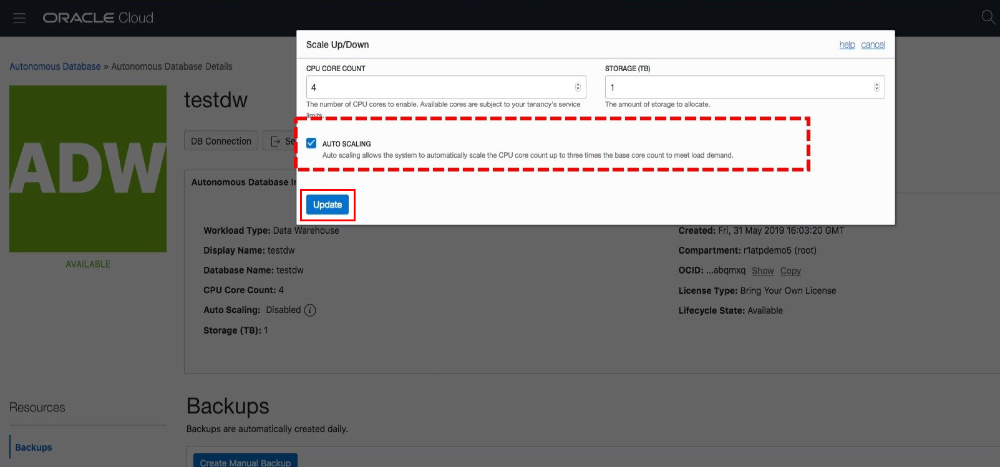

4. As soon as you click the blue **Update** button, your instance will switch to “SCALING IN PROGRESS” mode.

    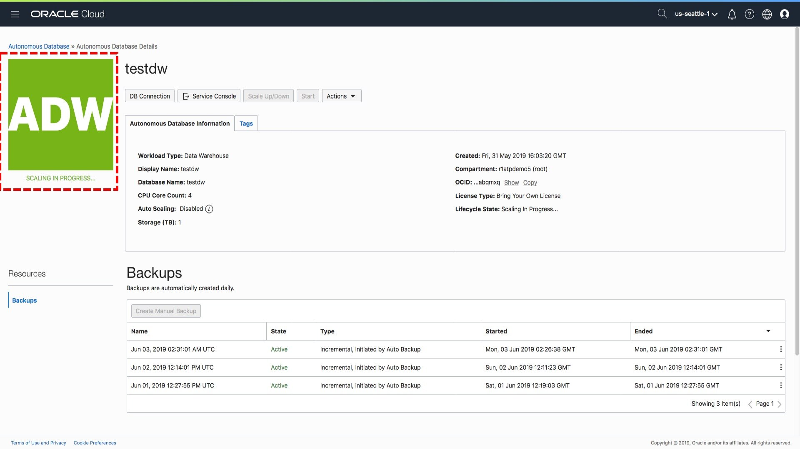

5. At this point, your data warehouse is still online and fully available. In the background, the system is setting up the infrastructure so the data warehouse can just expand itself as the workload grows. Notice at this point, the system is still showing that auto scaling is disabled. After about a minute the status area will change to “AVAILABLE” and auto scaling will be enabled.

    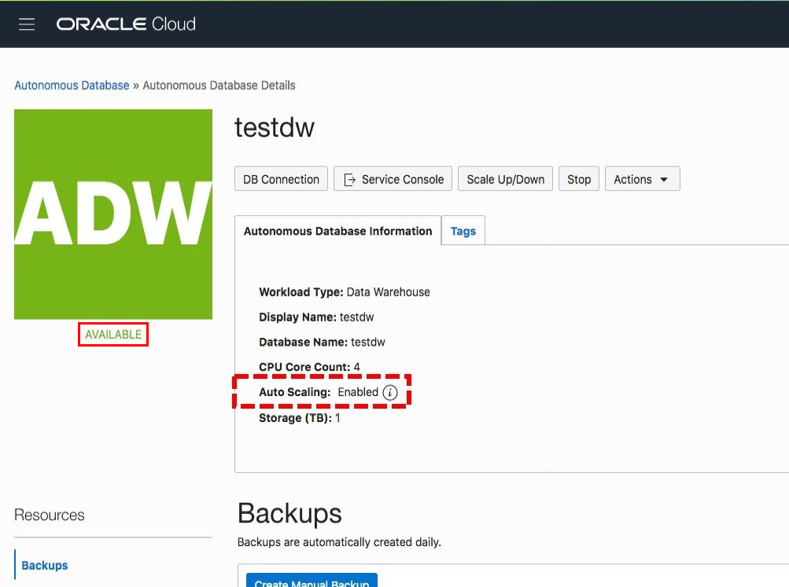

6. Now let’s assume that you throw some queries at this data warehouse. In fact, let’s assume that you use up all the OCPU capacity on the system and let’s run this workload a number of times at different points in the day and see what happens. If you switch to the Service Console, you can monitor the resources and workload on your data warehouse. In the service console graphs below, you can see that a workload peaks at around 24 queries and that same workload kicks off at different points in time throughout the day, hence the spikey looking graph.

    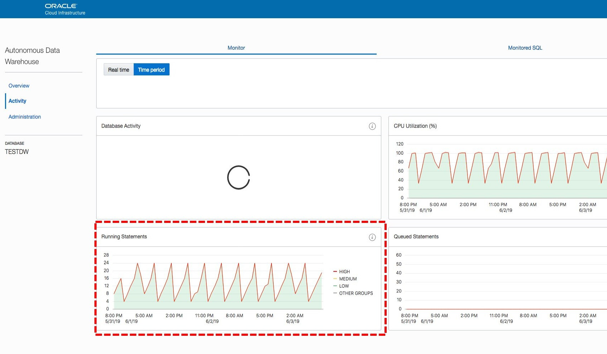

7. Notice that when the queries are running in this example, the CPU utilization hits 100%.

    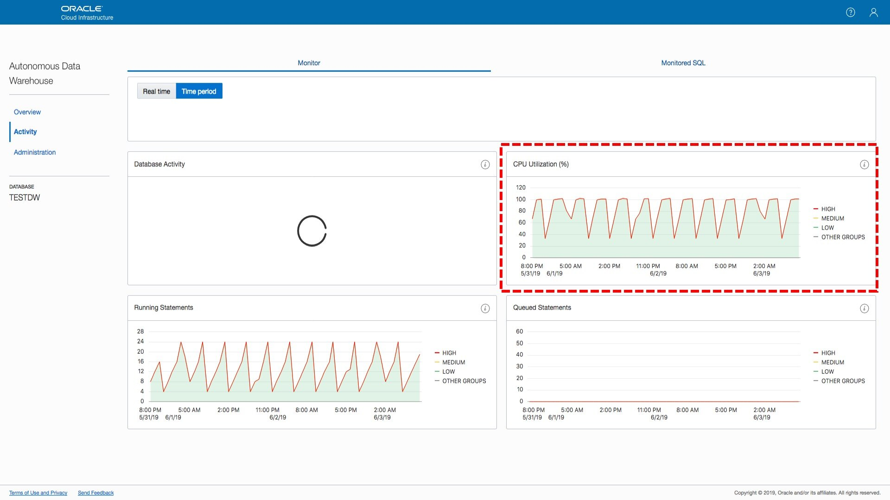

8. But there is something odd going on here, because this example is maxing out on the OCPU resources, but we are not seeing any sign of queries getting queued.

    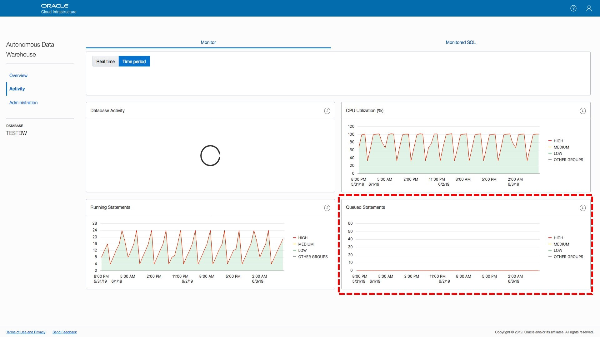

 9. What is going on here? Well, it's got nothing to do with auto scaling and here's why... Firstly, you will notice that this example's queries are running in the low resource group, so queries here won't get queued. Secondly, enabling auto scaling does not change the concurrency and parallelism settings for the predefined services. See [Managing Concurrency and Priorities on Autonomous Data Warehouse](https://docs.oracle.com/en/cloud/paas/autonomous-data-warehouse-cloud/user/manage-service.html#GUID-759EFFFA-9FAC-4439-B47F-281E470E01DE) section in the documentation for more information.

 Anyway, if you switch over to the “Overview” graphs, you can track what’s happening to the number of OCPUs being used by your data warehouse.

  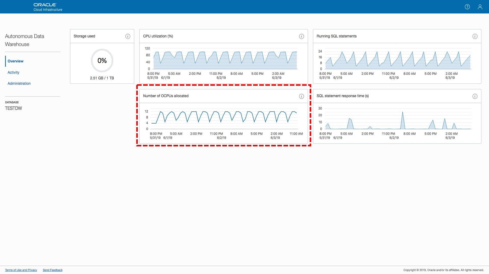

10. In the graph showing **Number of OCPUs allocated**, you can see that with auto scaling the graph is no longer a straight line over time. The number of OCPUs is fluctuating and the reason it’s fluctuating is because the autonomous data warehouse is reacting to the size of the workload by automatically adding, totally transparently behind the scenes, more OCPUs. Each time you get close to fully using all the OCPU capacity, the system adds more OCPUs up to the maximum of **3x** the original starting number (which in this case was 4 OCPUs). This means that in this case, you have a window of between 4 and 12 OCPUs that you can use to run your workload.  

    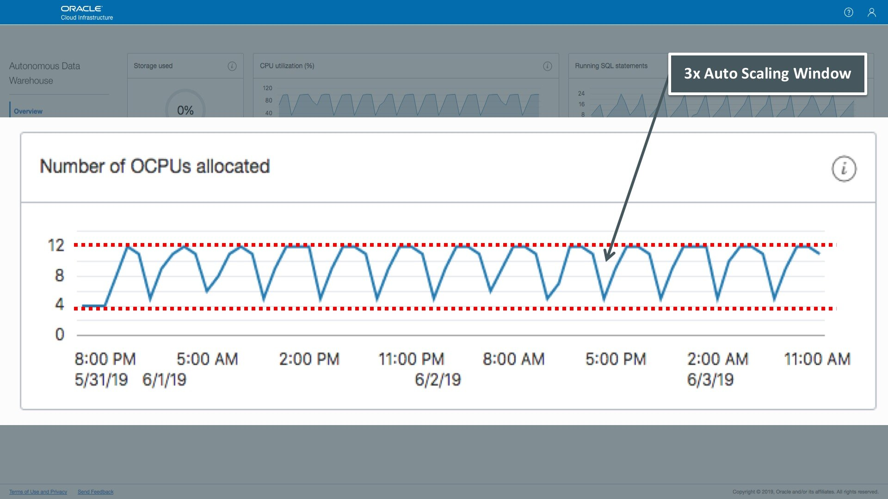

## Want to Learn More?

For more information about auto scaling, see the documentation [Use Auto Scaling](https://docs.oracle.com/en/cloud/paas/autonomous-data-warehouse-cloud/user/autonomous-auto-scale.html#GUID-27FAB1C1-B09F-4A7A-9FB9-5CB8110F7141).

## **Acknowledgements**

- **Authors** - Keith Laker and Nilay Panchal, ADB Product Management
- **Adapted for Cloud by** - Rick Green, Principal Developer, Database User Assistance
- **Last Updated By/Date** - Rick Green, July 2020

## See an issue?
Please submit feedback using this [form](https://apexapps.oracle.com/pls/apex/f?p=133:1:::::P1_FEEDBACK:1). Please include the *workshop name*, *lab* and *step* in your request.  If you don't see the workshop name listed, please enter it manually. If you would like for us to follow up with you, enter your email in the *Feedback Comments* section.
