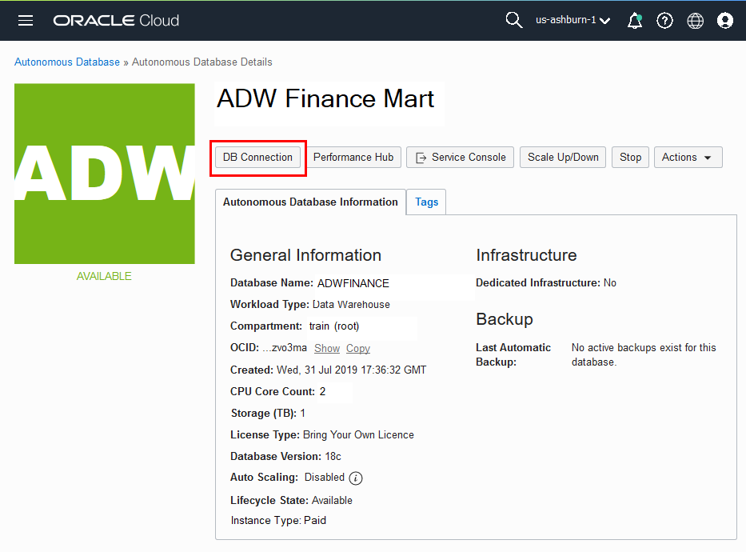
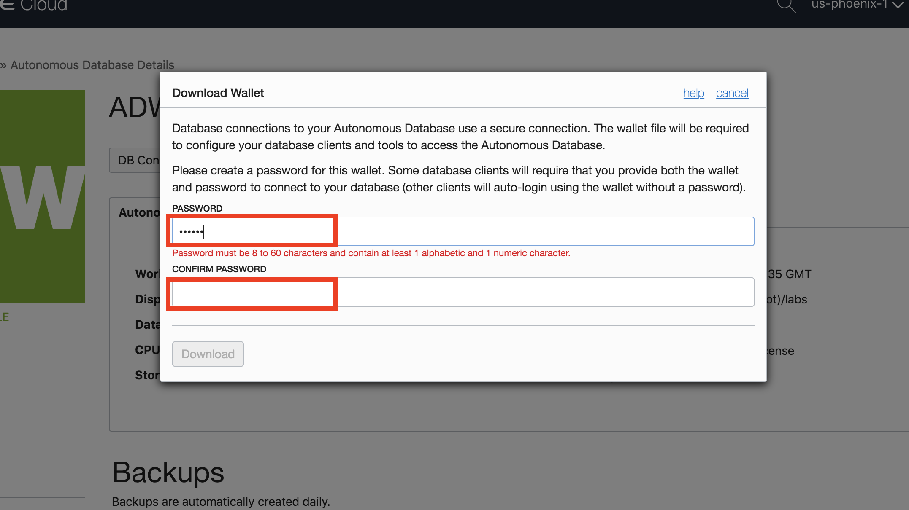
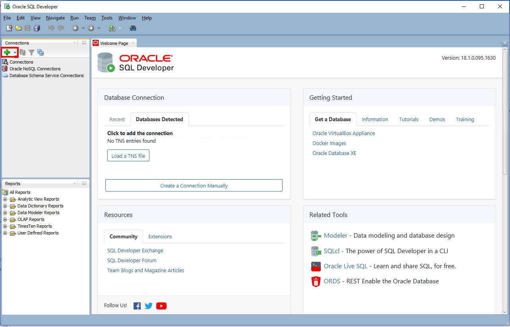
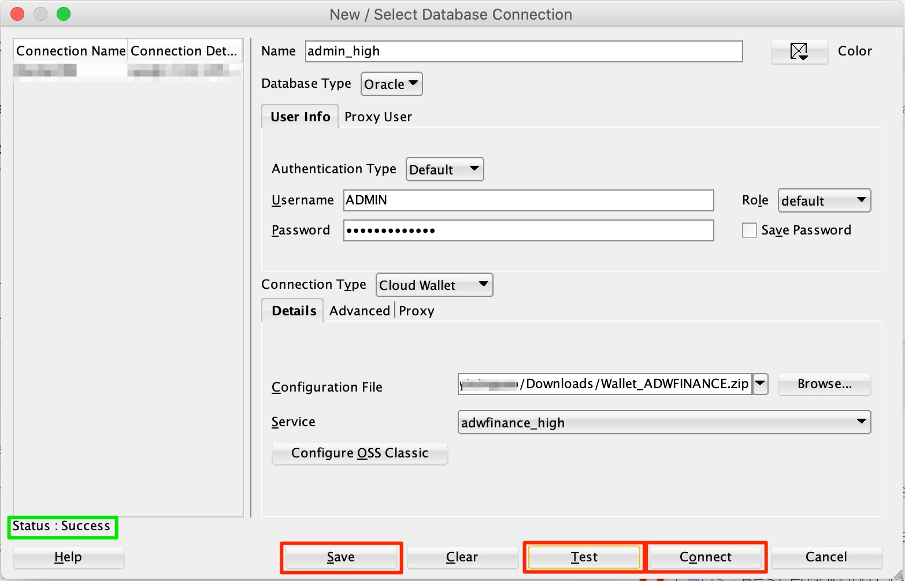
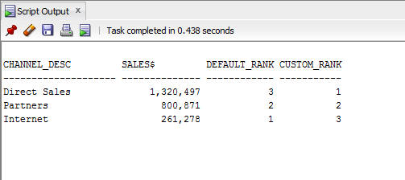

# Connect Securely Using SQL Developer with a Connection Wallet

## **Introduction**

This lab walks you through the steps to download and configure a *connection wallet* to connect securely to an Autonomous Database (Autonomous Data Warehouse [ADW] or Autonomous Transaction Processing [ATP]). You will use this connection wallet to connect to the database using **Oracle SQL Developer**. (Previous labs in this workshop used **SQL Developer Web** from a web browser, to access an autonomous database directly from the cloud console without a connection wallet. SQL Developer Web is a convenient browser-based tool, offering a subset of the features and functions in Oracle SQL Developer.)

*Note: While this lab uses ADW, the steps are identical for connecting to an autonomous database in ATP.*

Watch a video demonstration of connecting to an autonomous database instance using SQL Developer.

[](youtube:PHQqbUX4T50)

### Objectives

-   Learn how to download and configure a connection wallet
-   Learn how to connect to your Autonomous Data Warehouse with Oracle SQL Developer

### Lab Prerequisites

-   The following lab requires an <a href="https://www.oracle.com/cloud/free/" target="\_blank">Oracle Cloud account</a>. You may use your own cloud account, a cloud account that you obtained through a trial, a LiveLabs account or a training account whose details were given to you by an Oracle instructor.

-   Oracle SQL Developer 19.2 or later is recommended (see <a href="http://www.oracle.com/technetwork/developer-tools/sql-developer/downloads/index.html" target="\_blank">Oracle SQL Developer Downloads site</a>).
    Please use SQL Developer version 18.3 or later, as this version contains enhancements for key Autonomous Data Warehouse features, including using ADW behind a VPN or Firewall.

    *Note:* If you are a Windows user on a 64-bit platform, download the "Windows 64-bit with JDK 8 included" distribution, as it includes both Java 8 and the Java Cryptography Extension (JCE) files necessary to run SQL Developer and to connect to your Autonomous Data Warehouse.
    If you are a non-Windows user, download and install the appropriate [Java 8 JDK](http://www.oracle.com/technetwork/java/javase/downloads/jdk8-downloads-2133151.html) for your Operating System. Download and extract the [Java Cryptography Extension](http://www.oracle.com/technetwork/java/javase/downloads/jce8-download-2133166.html) to the directory as indicated in the README.txt.

-   This lab assumes you have completed the **Prerequisites** and **Provision Autonomous Database** labs seen in the Contents menu on the right.

## **Step 1**: Download the Connection Wallet

As ADW and ATP accept only secure connections to the database, you need to download a wallet file containing your credentials first. The wallet can be downloaded either from the instance's details page or from the ADW or ATP service console.

1.  If you are not logged in to Oracle Cloud Console, login and select Autonomous Data Warehouse from the hamburger menu and navigate into your ADW Finance Mart instance.

    

    

2.  In your database's instance Details page, click on **DB Connection**.

    

3.  Use the Database Connection dialog to download client credentials.
    - Wallet Type - For this lab, select **Instance Wallet**. This wallet type is for a single database only. This provides a database-specific wallet. 
    - Click **Download Wallet**.

    

    *Note: Oracle recommends that you provide a database-specific wallet, using Instance Wallet, to end users and for application use whenever possible. Regional wallets should only be used for administrative purposes that require potential access to all Autonomous Databases within a region.*

4.  Specify a password of your choice for the wallet. You will need this password when connecting to the database via SQL Developer later. The password is also used as the JKS Keystore password for JDBC applications that use JKS for security. Click **Download** to download the wallet file to your client machine.

    *Note: If you are prevented from downloading your Connection Wallet, it may be due to your browser's pop-up blocker. Please disable it or create an exception for Oracle Cloud domains.*

    

5.  Once the wallet is downloaded, click **Close** to close the Database Connection dialog.

## **Step 2**: Connect to the database using SQL Developer

Start SQL Developer and create a connection for your database using the default administrator account "ADMIN" by following these steps.

1.  Click the **New Connection** icon in the Connections toolbox on the top left of the SQL Developer homepage.

    

2.  In **New / Select Database Connection** dialog, Fill in the connection details as below:

    -   **Name:** admin_high
    -   **Username:** ADMIN
    -   **Password:** The password you specified during provisioning your instance
    -   **Connection Type:** Cloud Wallet
    -   **Configuration File:** Enter the full path for the wallet file you downloaded before, or click **Browse...** to point to the location of the file.
    -   **Service:** There are 3 pre-configured database services for each database. Pick **<*databasename*>\_high** for this lab. For example, if the database you created was named adwfinance, select **adwfinance_high** as the service.

    

3.  Test your connection by clicking the **Test** button. If it succeeds, you will see *Status: Success*, you can save your connection information by clicking **Save**, then connect to your database by clicking the **Connect** button. An entry for the new connection will appear under Connections.

4.  If you are behind a VPN or Firewall and this Test fails, make sure you have <a href="https://www.oracle.com/technetwork/developer-tools/sql-developer/downloads/index.html" target="\_blank">SQL Developer 18.3</a> or higher. This version and above will allow you to select the "Use HTTP Proxy Host" option for a Cloud Wallet type connection. While creating your new ADW connection here, provide your proxy's Host and Port. If you are unsure where to find this, you may look at your computer's connection settings or contact your Network Administrator.

## **Step 3**: Querying Your Autonomous Database with SQL Developer

The SH schema provides a small data set that you can use to run the sample queries in the <a href="https://docs.oracle.com/en/database/oracle/oracle-database/19/dwhsg/sql-analysis-reporting-data-warehouses.html#GUID-1D8E3429-735B-409C-BD16-54004964D89B" target="\_blank">Database Data Warehousing Guide</a>. For example, the following query shows you how the SQL function RANK() works:

1.  In a SQL Developer worksheet, perform the following `SH` query.

    ````
    <copy>
    SELECT channel_desc, TO_CHAR(SUM(amount_sold),'9,999,999,999') SALES$,
    RANK() OVER (ORDER BY SUM(amount_sold)) AS default_rank,
    RANK() OVER (ORDER BY SUM(amount_sold) DESC NULLS LAST) AS custom_rank
    FROM sh.sales, sh.products, sh.customers, sh.times, sh.channels, sh.countries
    WHERE sales.prod_id=products.prod_id AND sales.cust_id=customers.cust_id
    AND customers.country_id = countries.country_id AND sales.time_id=times.time_id
    AND sales.channel_id=channels.channel_id
    AND times.calendar_month_desc IN ('2000-09', '2000-10')
    AND country_iso_code='US'
    GROUP BY channel_desc;
    </copy>
    ````

    

## Want to Learn More?

Click [here](https://docs.oracle.com/en/cloud/paas/autonomous-data-warehouse-cloud/user/connect-data-warehouse.html#GUID-94719269-9218-4FAF-870E-6F0783E209FD) for documentation on other methods to securely connect to an autonomous database in Autonomous Data Warehouse.

## **Acknowledgements**

- **Author** - Richard Green, DB Docs Team
- **Adapted for Cloud by** - Richard Green, Principal Developer, Database User Assistance
- **Last Updated By/Date** - Arabella Yao, Product Manager Intern, DB Product Management, July 2020

See an issue?  Please open up a request [here](https://github.com/oracle/learning-library/issues).   Please include the workshop name and lab in your request.
