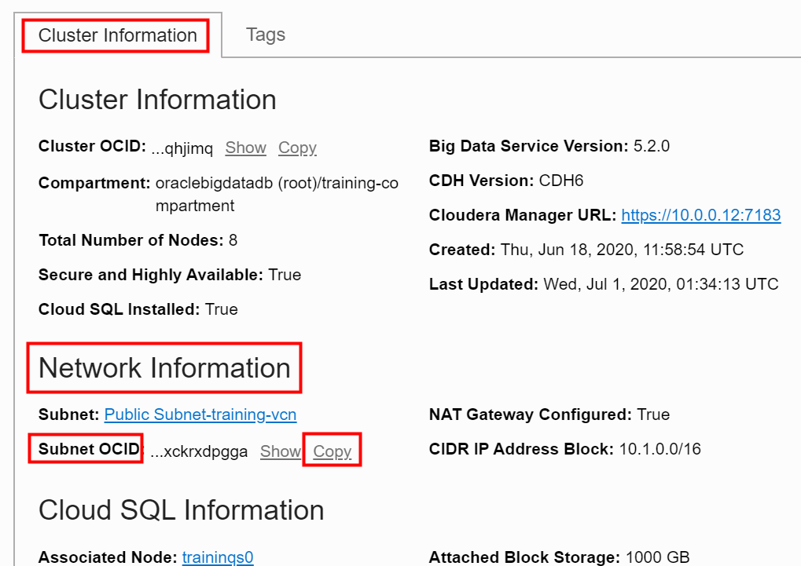
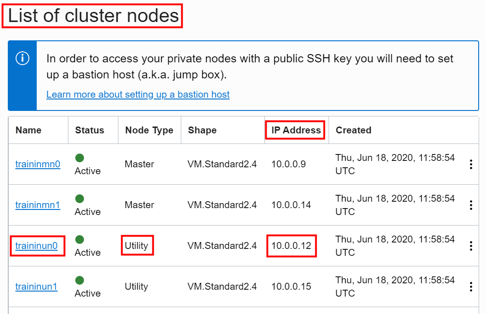
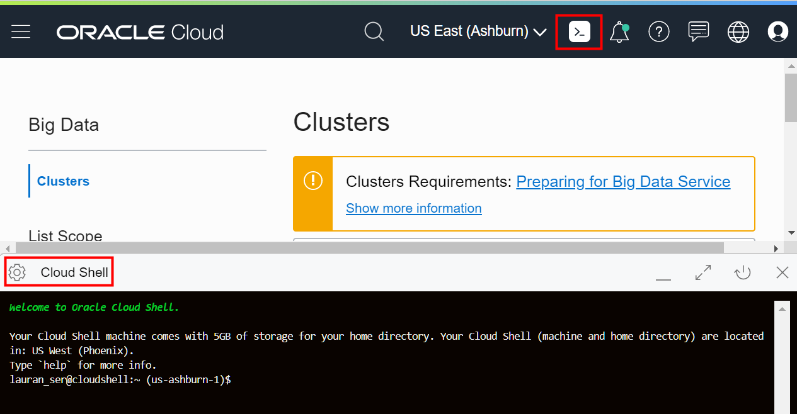
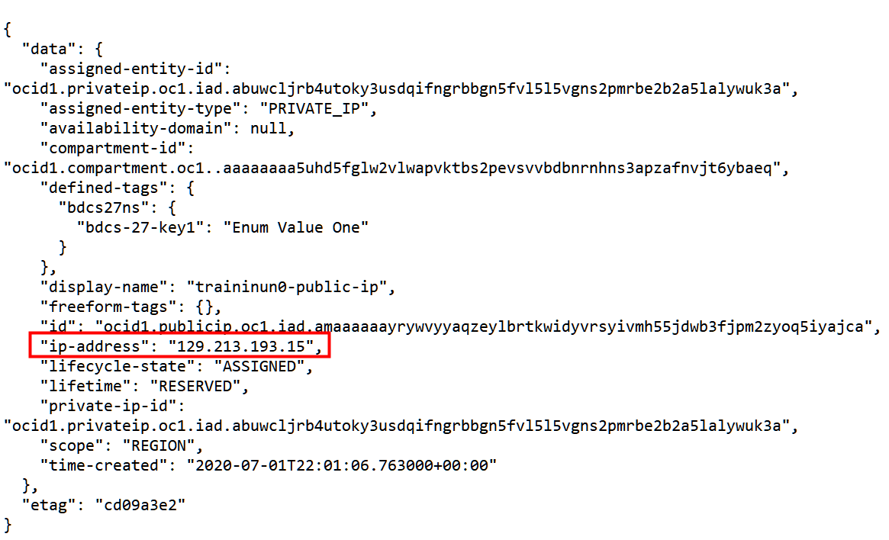
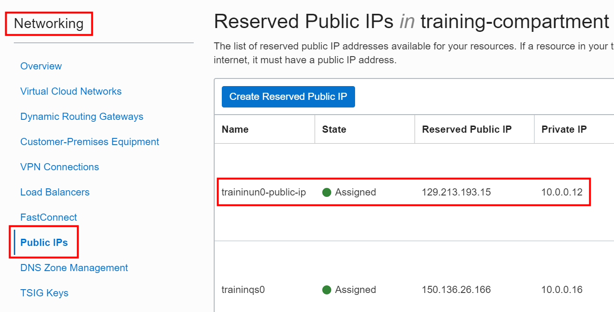
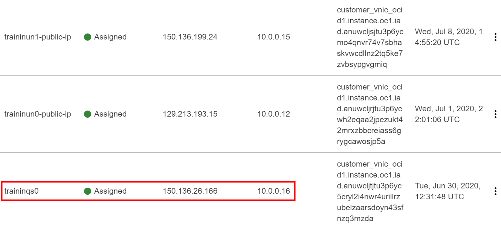
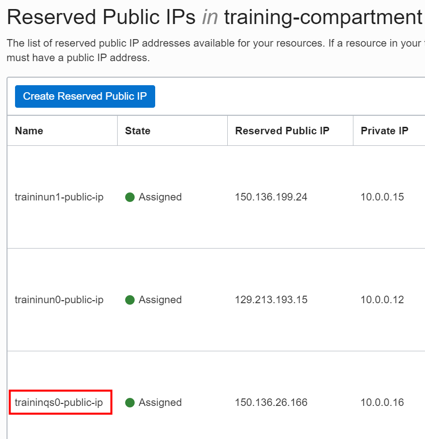
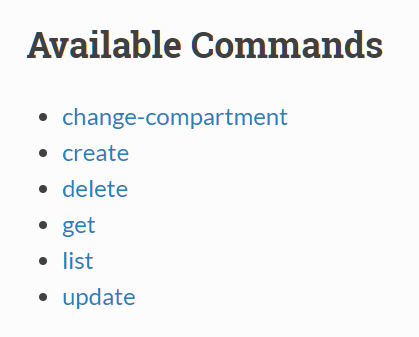
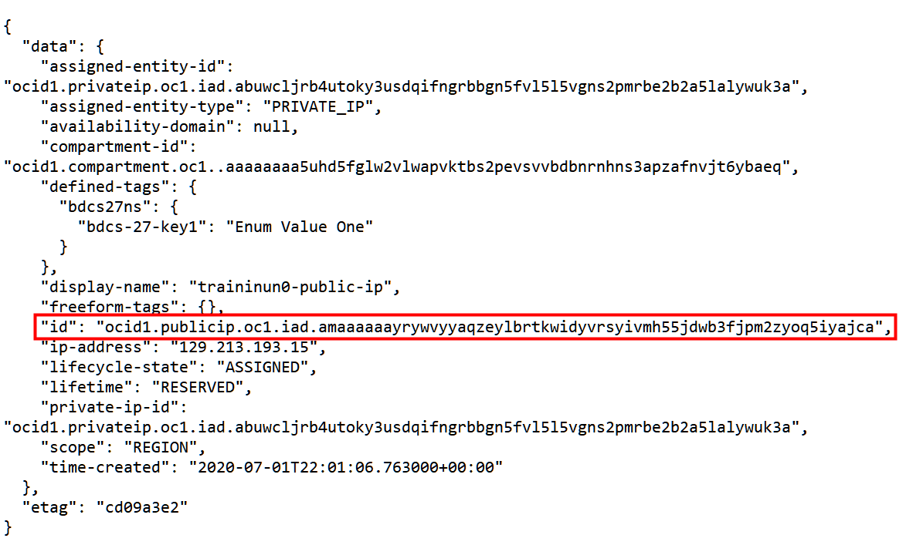

# Access a BDS Node Using a Public IP

## Introduction

Big Data Service nodes are by default assigned private IP addresses, which aren't accessible from the public internet. You can make the nodes in the cluster available using one of the following methods:

* You can map the private IP addresses of selected nodes in the cluster to public IP addresses to make them publicly available on the internet. We will use this method in this lab which assumes that making the IP address public is an acceptable security risk.
* You can setup an SSH tunnel using a Bastion host. Only the Bastion host is exposed to the public internet. A Bastion host provides access to the cluster's private network from the public internet.
* You can also use VPN Connect which provides a site-to-site Internet Protocol Security (IPSec) VPN between your on-premises network and your virtual cloud network (VCN). IPSec VPN is a popular set of protocols used to ensure secure and private communications over IP networks. This is achieved by the authentication and encryption of IP packets between two end-points.
* Finally, you can use OCI FastConnect to access services in OCI without going over the public internet. With FastConnect, the traffic goes over your private physical connection.
Using a Bastion Host, VPN Connect, and OCI FastConnect provide more private and secure options than making the IP address public.

In this lab, you will use the **Oracle Cloud Infrastructure Cloud Shell**, which is a web browser-based terminal accessible from the **Oracle Cloud Console**. You'll gather some information about your network and your cluster nodes, and then you'll pass that information to commands in the shell. Finally, you learn how to edit an existing public IP address. To perform this task, you must have a cluster running in a VCN in your tenancy, and that cluster must have a regional, public subnet.

**Important:**

Making the first utility node publicly available isn't enough to make services that run on this node such as Cloudera Manager (CM) and Hue available from the internet. Before you can access those services on this node using a Web browser, you must also open the ports associated with both services. You do this by adding an ingress rule to a security list for each service. You will do this in the next lab. See [Define Security Rules](https://docs.oracle.com/en/cloud/paas/big-data-service/user/configure-security-rules-network.html#GUID-42EDCC75-D170-489E-B42F-334267CE6C92)

### Objectives

* Learn how to gather information about the cluster.
* Learn how to map private IP address of a node to a public IP address.
* Learn how to edit a public IP address using both the **Oracle Cloud Console** and the OCI Command Line Interface (CLI).

### What Do You Need?

This lab assumes that you have successfully completed the following labs in the **Contents** menu on the right:
+ **Lab 1: Setup the BDS Environment**
+ **Lab 2: Create a BDS Hadoop Cluster**
+ **Lab 3: Add Oracle Cloud SQL to the Cluster**

## STEP 1: Gather Information About the Cluster

1. Log in to the **Oracle Cloud Console** as the Cloud Administrator, if you are not already logged in. On the **Sign In** page, select your `tenancy`, enter your `username` and `password`, and then click **Sign In**. The **Oracle Cloud Console** Home page is displayed.

2. Click the **Navigation** menu in the upper left-hand corner of the **Oracle Cloud Console** Home page. Under **Data & AI**, select **Big Data**.

3. On the **Clusters** page, click the **`training-cluster`** link in the **Name** column to display the **Cluster Details** page.

4. In the **Cluster Information** tab, in the **Network Information** section, click the **Copy** link next to **Subnet OCID**. Next, paste that OCID to an editor or a file, so you can retrieve it later in **STEP 2** in this lab.

  

5. On the same page, in the **List of Cluster Nodes** section, in the **IP Address** column, find the private IP address for the first utility node, **`traininun0`**. Save the IP address so that you can retrieve it later. In our example, the private IP address of our first utility node in the cluster is **`10.0.0.12`**.

  

## STEP 2: Map the Private IP Address to a Public IP Address

In this step, you will set three variables using the **`export`** command. The variables will be used in the **`oci network`** command that you will use to map the private IP address of the first utility node to a public IP address.

1. On the **Oracle Cloud Console** banner at the top of the page, click the **Cloud Shell** icon. It may take a few moments to connect and authenticate you.

  

2. At the **$** command line prompt, enter the following command, or use the **Copy** button to copy the command, and then paste it on the command line. The **_`display-name`_** is an optional descriptive name that will be attached to the reserved public IP address that will be created for you.

      ```
    <b>$</b> <copy>export DISPLAY_NAME=<i>"display-name"</i></copy>
      ```

    **Note:** In the preceding command, substitute **_`display-name`_** with a descriptive name of your choice.

    In our example, we will use **`traininun0-public-ip`** for the descriptive name.

      ```
    $ export DISPLAY_NAME="traininun0-public-ip"
      ```
3. At the **$** command line prompt, enter the following command, or use the **Copy** button to copy the command, and then paste it in the command line.   

      ```
    <b>$</b> <copy>export SUBNET_OCID=<i>"subnet-ocid</i>"</copy>
      ```
    **Note:** In the preceding command, substitute **_``subnet-ocid``_** with your own **`subnet-ocid`** that you identified in **STEP 1** of this lab.

    In our example, we replaced the **_``subnet-ocid``_** with our own **`subnet-ocid`**:
      ```
    $ export SUBNET_OCID="ocid1.subnet.oc1.iad.aaaaaaaagmjtgzrviqqpfmypt4aeuwrhtcwku53bs6bi7qjfyvxckrxdpgga"
      ```

4. At the **$** command line prompt, enter the following command, or use the **Copy** button to copy the command, and then paste it on the command line. The **`ip-address`** is the private IP address that is assigned to the node that you want to map.

      ```
    <b>$</b> <copy>export PRIVATE_IP=<i>"ip-address"</i></copy>
      ```
  **Note:** In the preceding command, substitute **_`ip-address`_** with your first utility node's private IP address.

  In our example, we replaced the **_``ip-address``_** with the private IP address of our first utility node that we identified in **STEP 1** of this lab.

      ```
    $ export PRIVATE_IP="10.0.0.12"
      ```

5.  At the **$** command line prompt, enter the following command exactly as it's shown below **_without any breaks_**, or use the **Copy** button to copy the command, and then paste it on the command line.

      ```
    <copy>oci network public-ip create --display-name $DISPLAY_NAME --compartment-id `oci network private-ip list --subnet-id $SUBNET_OCID --ip-address $PRIVATE_IP | jq -r '.data[] | ."compartment-id"'` --lifetime "RESERVED" --private-ip-id `oci network private-ip list --subnet-id $SUBNET_OCID --ip-address $PRIVATE_IP | jq -r '.data[] | ."id"'`</copy>
      ```
6.  In the output returned, find the value for **ip-address** field. In our example, it's **`129.213.193.15`**. This is the new reserved public IP address that is mapped to the private IP address of the first utility node.

  

7.  To see the reserved public IP address in the console, click the Navigation menu and navigate to  **Core Infrastructure > Networking > Virtual Cloud Networks**. In the **Networking** section on the left, click **Public IPs**. The new reserved public IP address appears in the **Reserved Public IPs** list. If you did specify a descriptive name as explained earlier, that name will appear in the **Name** column; Otherwise, a name such as  **publicip_nnnnnnnnn_** is generated.

  

## STEP 3: Edit a Public IP Address

In this step, you will learn how to edit a public IP address using both the **Cloud Console** and the **Cloud Shell**.

1. On the **Oracle Cloud Console** banner at the top of the page, click the Navigation menu and navigate to **Core Infrastructure > Networking > Virtual Cloud Networks**. In the **Networking** section on the left, click **Public IPs**. The **Reserved Public IPs** page lists the available public IP addresses.

  

2. On the row for the reserved public IP address that you want to edit, click the **Actions** button. You can use the context menu to do the following for the selected pubic IP address: Edit its name, move it to another compartment, copy its OCID, view its tags and add new tags, and terminate it.

  

3. Change the name of the public IP address associated with the Cloud SQL node from `traininqs0` to **`traininqs0-public-ip`**. On the row for `traininqs0`, click the **Actions** button, and then select **Edit** from the context menu.

    

4. In the **Edit** dialog box, in the **RESERVED PUBLIC IP NAME** field, enter **`traininqs0-public-ip`**, and then click **Save Changes**.

      

    The renamed public IP address is displayed.

      

5. You can also edit public IP addresses using the OCI CLI. See [OCI CLI Command Reference - public-ip](https://docs.cloud.oracle.com/en-us/iaas/tools/oci-cli/2.9.0/oci_cli_docs/cmdref/network/public-ip.html#) in the _Oracle Cloud Infrastructure_ documentation.

  

6. For example, you can delete a public IP address using the OCI CLI command as follows:

    ```
    $ oci network public-ip delete --public-ip-id value
    ```
    **Note:** The `value` for **``--public-ip-id``** in the preceding command is displayed in the output returned when you ran the **`oci network`** command in this lab; however, the actual name of the field is **`"id"`**. Substitute `value` with the actual value of the `"id"` field.

    

    ```
    $ oci network public-ip delete --public-ip-id "ocid1.publicip.oc1.iad.amaaaaaayrywvyyaqzeylbrtkwidyvrsyivmh55jdwb3fjpm2zyoq5iyajca"
    ```
    **Note:** Don't delete any of your public IP addresses as you will need them in this workshop.

**This concludes this lab. Please proceed to the next lab in the Contents menu on the right.**

## Want to Learn More?

* [Using Oracle Big Data Service](https://docs.oracle.com/en/cloud/paas/big-data-service/user/index.html)
* [Oracle Cloud Infrastructure Documentation](https://docs.cloud.oracle.com/en-us/iaas/Content/GSG/Concepts/baremetalintro.htm)
* [Getting Started with the Command Line Interface (CLI)](https://docs.cloud.oracle.com/en-us/iaas/Content/GSG/Tasks/gettingstartedwiththeCLI.htm)
* [OCI CLI Command Reference - Public-IP](https://docs.cloud.oracle.com/en-us/iaas/tools/oci-cli/2.9.0/oci_cli_docs/cmdref/network/public-ip.html#)
* [OCI CLI Command Reference - Big Data Service (bds)](https://docs.cloud.oracle.com/en-us/iaas/tools/oci-cli/2.10.0/oci_cli_docs/cmdref/bds.html)

## Acknowledgements

* **Author:**
    + Lauran Serhal, Principal UA Developer, Oracle Database and Big Data User Assistance
* **Technical Contributors:**
    + Martin Gubar, Director, Oracle Big Data Product Management
    + Ben Gelernter, Principal User Assistance Developer, DB Development - Documentation  
* **Last Updated By/Date:** Lauran Serhal, July 2020

See an issue?  Please open up a request [here](https://github.com/oracle/learning-library/issues).
