# Create a BDS Hadoop Cluster

## Introduction

In this lab, you will learn how to create a Highly-Available (HA) Cloudera Distribution Including Apache Hadoop (CDH) cluster using the Oracle Cloud Infrastructure Console (OCI) and Big Data Service (BDS). This will be a small development cluster that is not intended to process huge amounts of data. It will be based on small Virtual Machine (VM) shapes that are perfect for developing applications and testing functionality at a minimal cost.

### Objectives

* Learn how to create an HA Hadoop cluster using BDS and OCI.
* Learn how to monitor the cluster creation.

### What Do You Need?

This lab assumes that you have successfully completed **Lab 1: Setup the BDS Environment** in the **Contents** menu on the right.

### Video Preview

Watch a video demonstration of creating a simple non-HA Hadoop cluster:

## STEP 1: Create a Cluster
There are many options when creating a cluster. You will need to understand the sizing requirements based on your use case and performance needs. In this lab, you will create a small testing and development cluster that is not intended to process huge amounts of data. It will be based on small Virtual Machine (VM) shapes that are perfect for developing applications and testing functionality at a minimal cost.

Your simple HA cluster will have the following profile:
  + **Nodes:** **2** Master nodes, **2** Utility nodes, and **3** Worker nodes.  
  + **Shape:** **VM.Standard2.4** shape for all nodes in the cluster. This shape provides **4 CPUs** and **60 GB** of memory.  
  + **Storage Size:** **250 GB** block storage for the Master and Utility nodes and **750 GB**  block storage for the Worker nodes.

  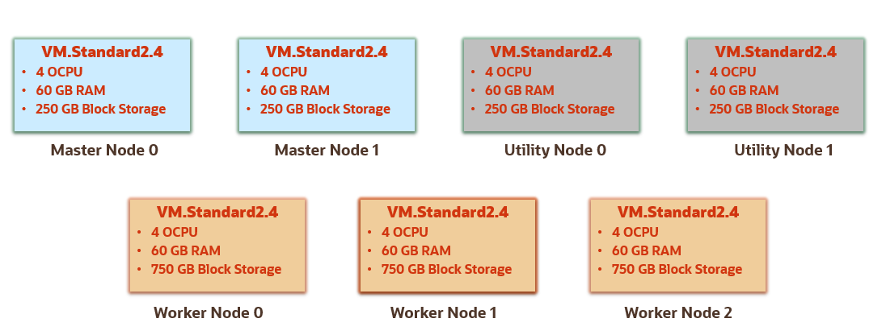

  **Note:**    
  For better performance and scalability, change the preceding specifications appropriately. Consider **DensIO** shapes (with direct attached storage) and **Bare Metal** shapes.

Create the cluster as follows:

1. Log in to the **Oracle Cloud Console** as the Cloud Administrator, if you are not already logged in. On the **Sign In** page, select your `tenancy`, enter your `username` and `password`, and then click **Sign In**. The **Oracle Cloud Console** Home page is displayed.

2. Click the **Navigation** menu in the upper left-hand corner of the **Oracle Cloud Console** Home page.

3. Under **Data & AI**, select **Big Data**.

   

4. On the **Clusters** page, click **Create Cluster**.

  

5. At the top of the **Create Cluster** wizard, provide the cluster details as follows:
    * **CLUSTER NAME:** **`training-cluster`**.
    * **CLUSTER ADMIN PASSWORD:** Enter a `cluster admin password` of your choice such as **`Training123`**. You'll need this password to sign into Cloudera Manager and to perform certain actions on the cluster through the Cloud Console.
    * **CONFIRM CLUSTER ADMIN PASSWORD:** Confirm your password.
    * **SECURE & HIGHLY AVAILABLE(HA):** Select this checkbox, if not already selected, to make the cluster secure and highly available. A secure cluster has the full Hadoop security stack, including HDFS Transparent Encryption, Kerberos, and Apache Sentry. This setting can't be changed for the life of the cluster.
    * **CLUSTER VERSION:** This read-only field displays the latest version of Cloudera 6 that is available to Oracle which is deployed by BDS.

    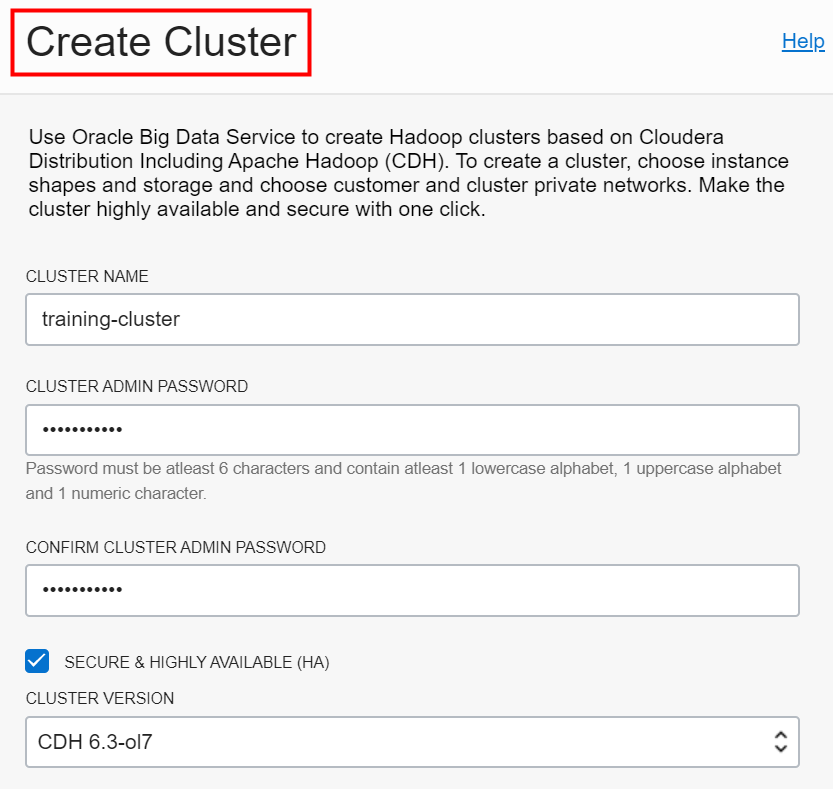

6. In the **Hadoop Nodes > Master/Utility Nodes** section, provide the following details:

    * **CHOOSE INSTANCE TYPE:** **`Virtual Machine`**.
    * **CHOOSE MASTER/UTILITY NODE SHAPE:** **`VM.Standard2.4`**.
    * **BLOCK STORAGE SIZE PER MASTER/UTILITY NODE (IN GB):** **`250 GB`**.
    * **NUMBER OF MASTER & UTILITY NODES** _READ-ONLY_ **:** Since you are creating an HA cluster, this field shows **4** nodes: **2** Master nodes and **2** Utility nodes. For a non-HA cluster, this field would show only **2** nodes: **1** Master node and  **1** Utility node.

    

    **Note:** For information on the supported cluster layout, shape, and storage, see [Plan Your Cluster](https://docs.oracle.com/en/cloud/paas/big-data-service/user/plan-your-cluster.html#GUID-0A40FB4C-663E-435A-A1D7-0292DBAC9F1D).

7. In the **Hadoop Nodes > Worker Nodes** section, provide the following details:

    * **CHOOSE INSTANCE TYPE:** **`Virtual Machine`**.
    * **CHOOSE MASTER/UTILITY NODE SHAPE:** **`VM.Standard2.4`**.
    * **BLOCK STORAGE SIZE PER MASTER/UTILITY NODE (IN GB):** **`750 GB`**.
    * **NUMBER OF WORKER NODE:** **`3`**. This is the minimum allowed for a cluster.

    

8. In the **Network Setting > Cluster Private Network** section, provide the following details:

     * **CIDR BLOCK:** **`10.1.0.0/16`**. This CIDR block assigns the range of contiguous IP addresses available for the cluster's private network that BDS creates for the cluster. This private network is created in the Oracle tenancy and not in your customer tenancy. It is used exclusively for private communication among the nodes of the cluster. No other traffic travels over this network, it isn't accessible by outside hosts, and you can't modify it once it's created. All ports are open on this private network.

     **Note:** Use CIDR block **`10.1.0.0/16`** instead of the already displayed **`10.0.0.0/16`** CIDR block range. This avoids overlaping IP addresses since you already used the **`10.0.0.0/16`** CIDR block range for for the **`training-vcn`** VCN that you created in **Lab 1**.

9. In the **Network Setting > Customer Network** section, provide the following details:

    * **CHOOSE VCN IN `training-compartment`:** **`training-vcn`**. The VCN must contain a regional subnet.   **Note:** Make sure that **`training-compartment`** is selected; if it's not, click the _CHANGE COMPARTMENT_ link, and then search for and select your **`training-compartment`**.
    * **CHOOSE REGIONAL SUBNET IN `training-compartment`:** **`Public Subnet-training-vcn`**. This is the public subnet that was created for you when you created your **`training-vcn`** VCN in **Lab 1**.
    * **Networking Options:** **`DEPLOY ORACLE-MANAGED SERVICE GATEWAY AND NAT GATEWAY (QUICK START)`**. This simplifies your network configuration by allowing Oracle to provide and manage these communication gateways for private use by the cluster. These gateways are created in the Oracle tenancy and can't be modified after the cluster is created.

    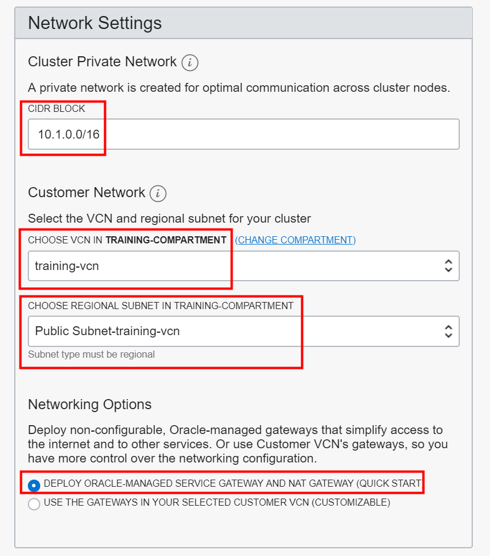

10. In the **Additional Options > SSH PUBLIC KEY** section, associate a public SSH key with the cluster. You can use the associated private SSH key to make SSH connections to the cluster.

    **Note:** If you already have an existing public key, you can use it in this step; you don't have to create a new public key. If you need to create a new SSH key pair, see the [Creating a Key Pair] (https://docs.cloud.oracle.com/en-us/iaas/Content/GSG/Tasks/creatingkeys.htm?Highlight=ssh%20key#CreatingaKeyPair) OCI documentation topic or the
    [Generate SSH key](https://oracle.github.io/learning-library/common/labs/generate-ssh-key/) lab.

    Enter an SSH public key in any of the following ways:
     * Select **CHOOSE SSH KEY FILE**, and then either Drag and drop a public SSH key file into the box,
      or click **Select one...** and navigate to and choose a public SSH key file from your local file system.
     * Select **PASTE SSH PUBLIC KEY**, and then paste the contents from a public SSH key file into the box.

     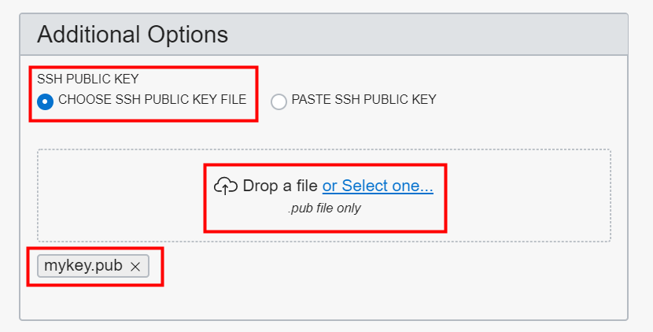

11.  Click **Create Cluster**. The **Clusters** page is re-displayed. The state of the cluster is initially **Creating**.

    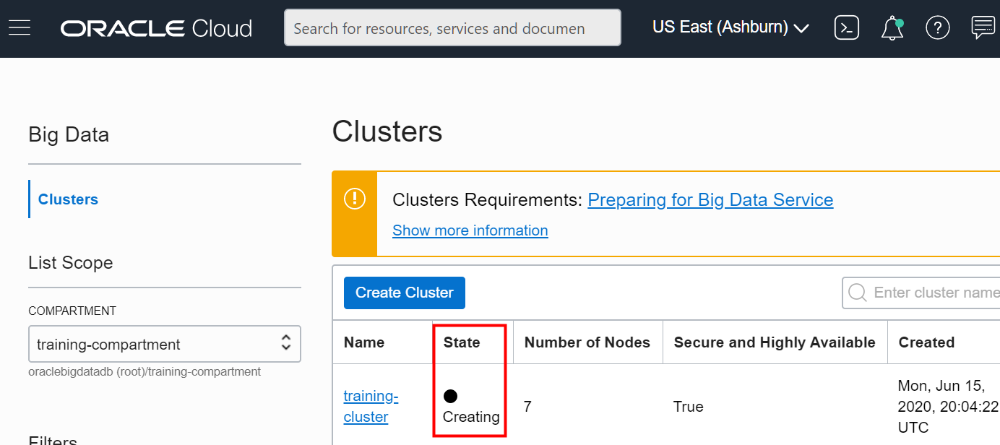

## STEP 2: Monitor the Cluster Creation

The process of creating the cluster can take some time; however, you can monitor the cluster creation progress as follows:

1. To view the cluster's details, click **`training-cluster`** in the **Name** column to display the **Cluster Details** page.

   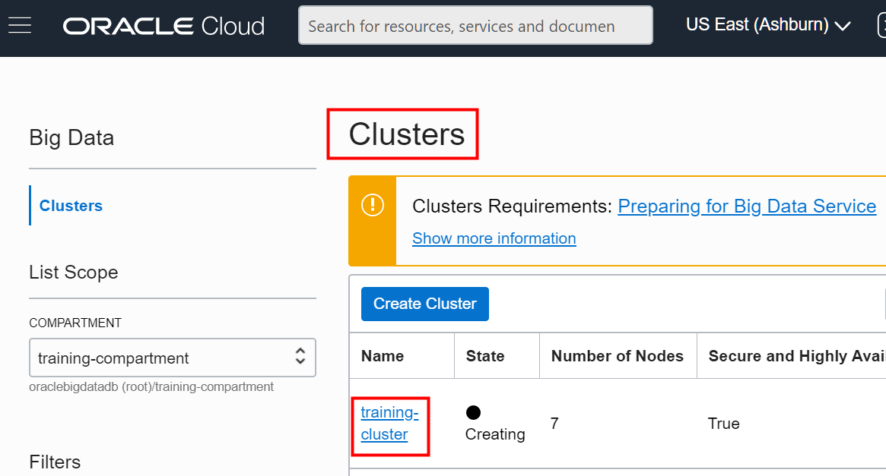

   The **Cluster Information** tab displays the cluster's general and network information.

   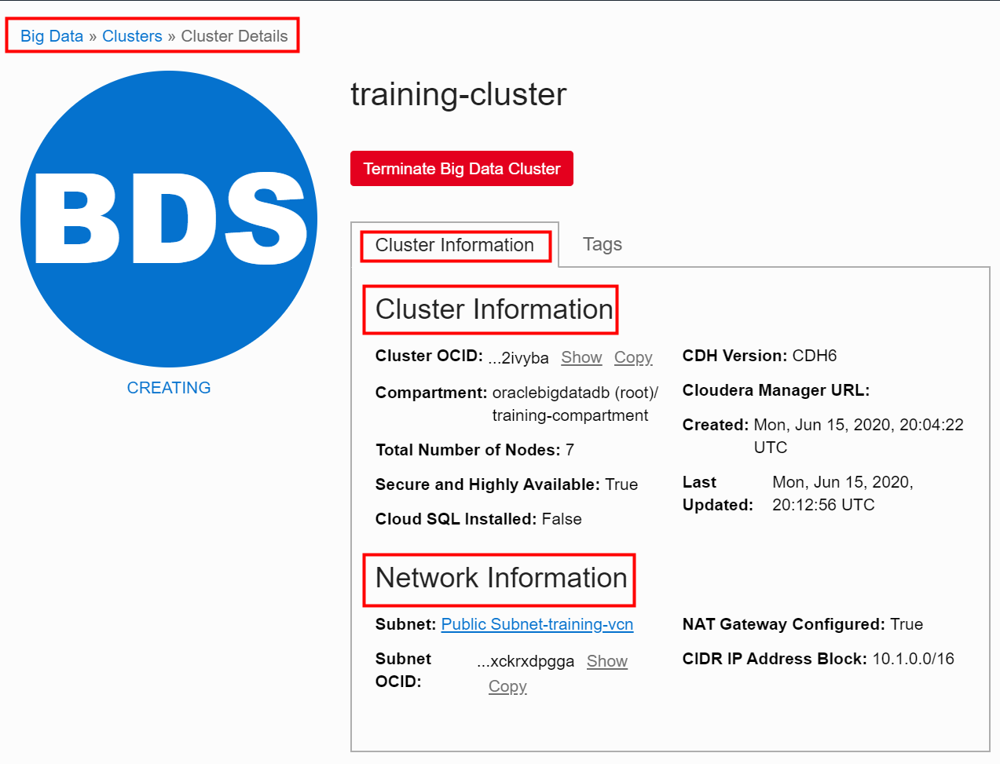  

   The **List of cluster nodes** section displays the following information for each node in the cluster: Name, status, type, shape, private IP address, and date and time of creation.

     

   **Note:**
   The name of a node is the concatenation of the **first seven** letters of the cluster's name, **`trainin`**, followed by two letters representing the node type such as **`mn`** for a **Master** node, **`un`** for a **Utility** node, and **`wn`** for a **Worker** node. The numeric value represents the node type order in the list such as Worker nodes **`0`**, **`1`**, and **`2`**.

   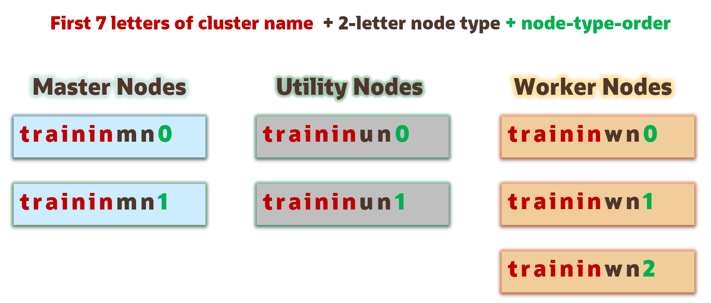

2. To view the details of a node, click the node's name link in the **Name** column. For example, click the **`traininmn0`** first Master node in the **Name** column to display the **Node Details** page.

     

   The **Node Information** tab displays the node's general information and the network information.

   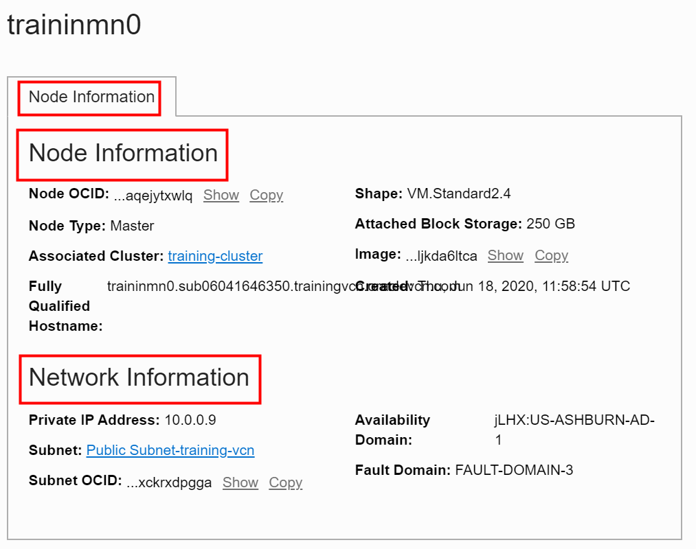  

   The **Node Metrics** section displays the following charts: CPU UTILIZATION, MEMORY UTILIZATION, NETWORK BYTES IN, and NETWORK BYTES OUT. You can hover over any chart to get additional details.

     

3. To display the block storage attached to this node, in the **Resources** section on the left, click the **Attached Block Volume Storage** link.

     

4. Click the **Cluster Details** link in the breadcrumbs at the top of the page to re-display the **Cluster Details** page.

     

5. In the **Resources** section on the left, click **Work Requests**.

   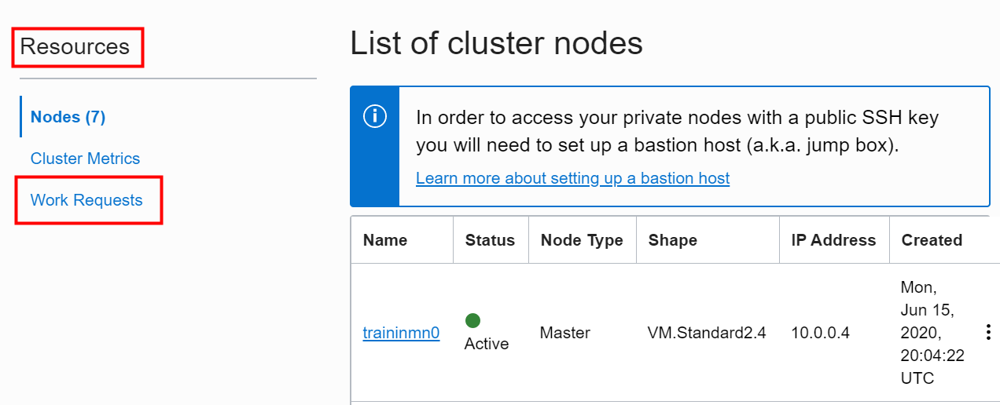  

6. The **Work Requests** section on the page displays the status of the cluster creation and other details such as the **Operation**, **Status**, **% Complete**, **Accepted**, **Started**, and **Finished**. Click the **CREATE_BDS** name link in the **Operation** column.

   

   The **CREATE_BDS** page displays the work request information, logs, and errors, if any.

   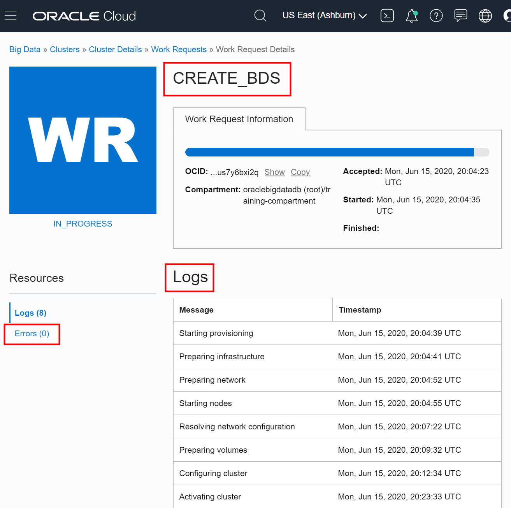

7. Click the **Clusters** link in the breadcrumbs at the top of the page to re-display the **Clusters** page.

      

8. Once the **`training-cluster`** cluster is created successfully, the status changes to **Active**.   

    

## STEP 3: Review Locations of Services in the Cluster

  The `training-cluster` cluster is a highly available (HA) cluster; therefore, the services are distributed as follows:

  | Master Node 1 **`traininmn0`**| Master Node 2 **`traininmn1`** | Utility  Node 1 **`traininmn0`** | Utility Node 2 **`traininmn1`** | Worker Nodes **`traininmn0`** **`traininmn1`** **`traininmn2`** |
  |:----:|:----:|:----:|:----:|:----:|
  HDFS Failover Controller HDFS JournalNode HDFS NameNode Key Trustee KMS  Proxy Key Trustee Server Active KTS Active Database Spark History Server YARN JobHistory Server YARN ResourceManager ZooKeeper Server MIT KDC Primary| HDFS Balancer HDFS Failover Controller HDFS HttpFS HDFS JournalNode HDFS NameNode Hue Load Balancer Hue Server Hue Kerberos Ticket Renewer Key Trustee KMS Proxy KTS Passive Database KTS Passive ResourceManager ZooKeeper Server MIT KDC Secondary| HDFS JournalNode Cloudera Manager  CM Alert Publisher CM Service Event Server CM Service Host Monitor CM Service Navigator Audit Server CM Service Navigator Metadata Server CM Service Reports Manager CM Service Monitor Sentry Server Zookeeper Server| Hive Metastore Server HiveServer2 Hive WebHCat Server Hue Load Balancer Hue Server Hue Kerberos Ticket Renewer Oozie Server Sentry Server|HDFS DataNode YARN NodeManager

**This concludes this lab. Please proceed to the next lab in the Contents menu on the right.**

## Want to Learn More?

* [Using Oracle Big Data Service](https://docs.oracle.com/en/cloud/paas/big-data-service/user/index.html)
* [Oracle Cloud Infrastructure Documentation](https://docs.cloud.oracle.com/en-us/iaas/Content/GSG/Concepts/baremetalintro.htm)
* [Overview of Oracle Cloud Infrastructure Identity and Access Management](https://docs.cloud.oracle.com/en-us/iaas/Content/Identity/Concepts/overview.htm)

## Acknowledgements

* **Authors:**
    + Martin Gubar, Director, Oracle Big Data Product Management
    + Lauran Serhal, Principal Developer, Oracle Database and Big Data User Assistance
* **Last Updated By/Date:** Lauran Serhal, June 2020

See an issue?  Please open up a request [here](https://github.com/oracle/learning-library/issues).
