#  Use Cloudera Manager (CM) and Hue to Access a BDS Cluster

## Introduction

To ensure security, when BDS deploys a cluster, the nodes in the cluster are not accessible on the public internet. By default, the IP addresses for the cluster nodes are private.

In the previous lab, you made the two utility nodes in your HA-cluster accessible from the internet by mapping the nodes' private IP addresses to public IP addresses; however, making the utility nodes publicly available isn't enough to make services that run on those nodes available from the internet.

All services are only available on certain ports. For example, in an HA-cluster such as **`training-cluster`**, Cloudera Manager (CM) runs on the first utility node, **`traininun0`**, and Hue runs on the second utility node, **`traininun1`**. Before you can access CM and Hue on the utility nodes using a Web browser, you must also open the ports that are associated with both services. You do this by defining an ingress rule on the public subnet to a security list for each service. Security lists act as virtual firewalls for your Compute instances and other kinds of resources with ingress and egress rules that specify the types of traffic allowed in and out of the cluster. Ingress security rules expose HTTP and HTTPS routes from outside the cluster to services within the cluster.

In this lab, you'll learn how to access CM and Hue directly in a web browser.


### Objectives

* Learn how to use Cloudera Manager (CM) and Hue to access a Big Data Service (BDS) cluster.
* Learn how to add ingress rules to the default security rule that enables you to access both CM and Hue.

### What Do You Need?

This lab assumes that you have successfully completed the following labs in the **Contents** menu on the right:
+ **Lab 1: Setup the BDS Environment**
+ **Lab 2: Create a BDS Hadoop Cluster**
+ **Lab 3: Add Oracle Cloud SQL to the Cluster**
+ **Lab 4: Access a BDS Node Using a Public IP Address**

## STEP 1: Create Ingress Security Rules (and Open Ports) for Cloudera Manager and Hue

In this step, you will add ingress security rules to the default security list in your cluster's VCN. This will allow access from anywhere on the internet to Cloudera Manager on port **`7183`** and Hue on port **`8888`**.

1. Log in to the **Oracle Cloud Console** as the Cloud Administrator, if you are not already logged in. On the **Sign In** page, select your `tenancy`, enter your `username` and `password`, and then click **Sign In**. The **Oracle Cloud Console** Home page is displayed.

2. Click the **Navigation** menu in the upper left-hand corner of the **Oracle Cloud Console** Home page. Under **Networking**, select **Virtual Cloud Networks**.

3. On the **Virtual Cloud Networks** page, click your cluster's Virtual Cloud Network, **`training-vcn`**.

  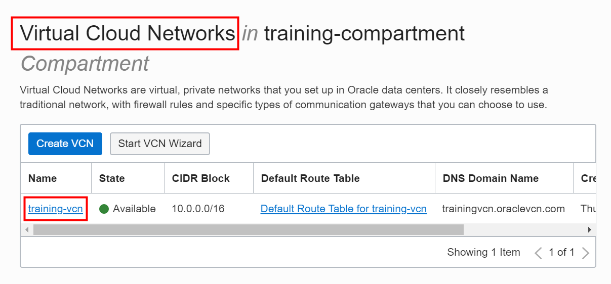

4. Next, you will update the default security list for the public subnet in your VCN. Remember, when you created the cluster, you needed to specify that your cluster belongs to a public subnet. In the **Subnets** section on the **Virtual Cloud Network Details** page, click the public subnet for the selected network.

  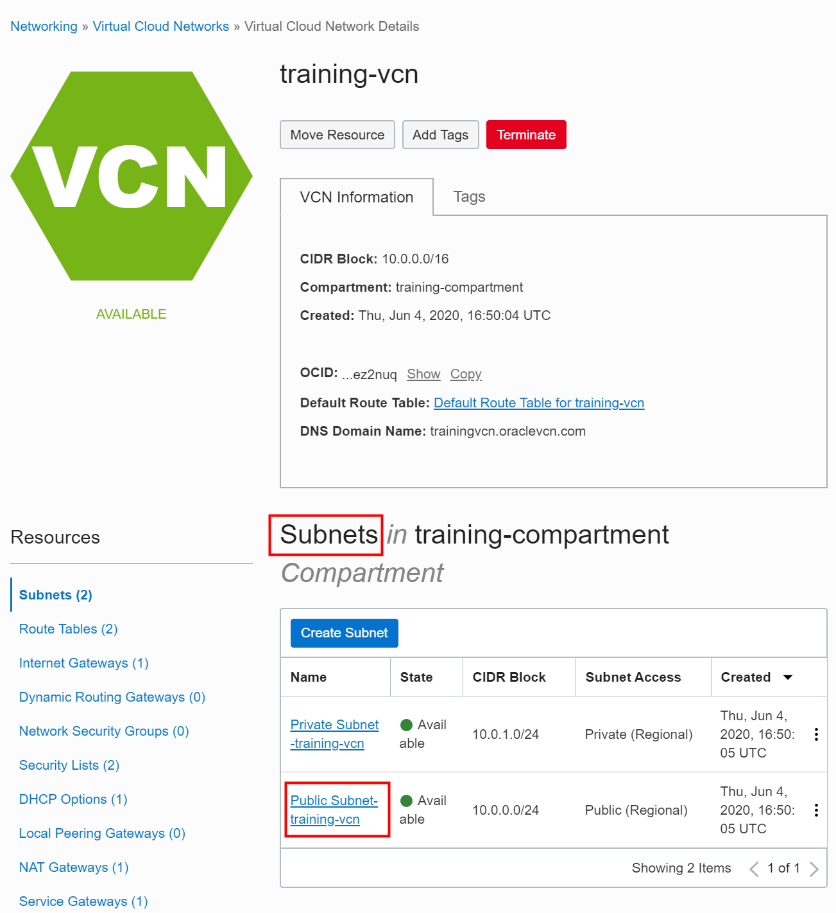

5. In the **Security Lists** section on the **Subnet Details** page, click your **Default Security List** link for your selected network in the **Name** column.

  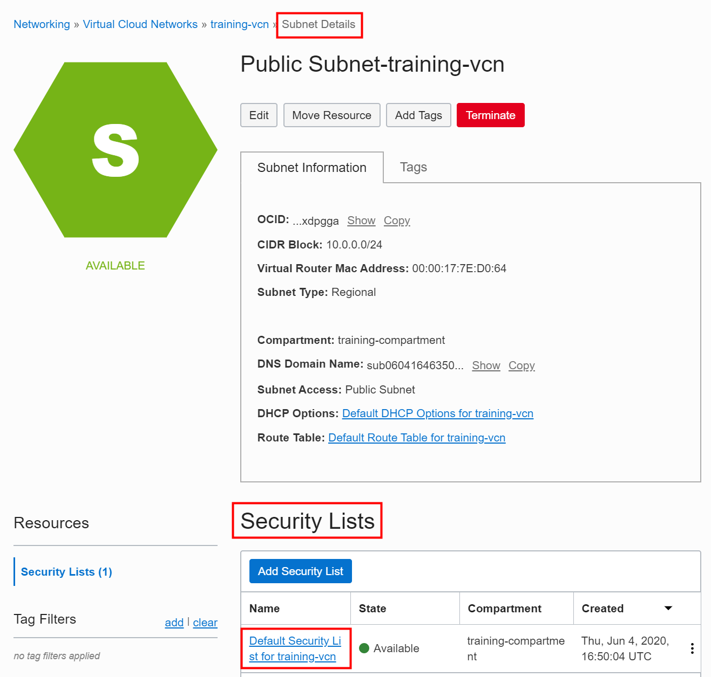

6. On the **Default Security List** page, scroll-down to the **Ingress Rules** section. This section shows the currently available security rules in the selected **Default Security List**. Next, click **Add Ingress Rules**.

  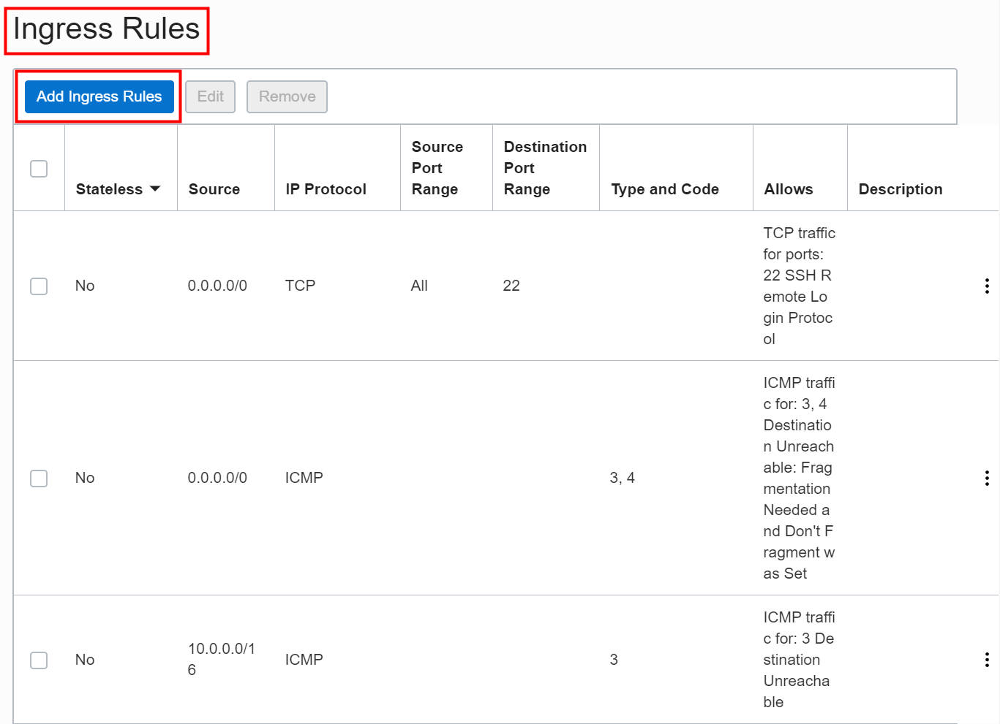

7. In the **Add Ingress Rules** dialog box, add the rule for the TCP protocol which enables you to use Cloudera Manager to access your cluster. You can add values to this dialog box to meet your security needs. In our example, we are opening up the port for Cloudera Manager to all sources by entering **`0.0.0.0/0`** for the **Source CIDR**. Anyone on the internet can access port **`7183`** for CM. No egress rule is required to allow the response traffic. Update the source to a more restrictive CDIR if required. Provide the following information:

    + For the **SOURCE TYPE**, select **`CIDR`**.
    + For the **SOURCE CIDR**, enter **`0.0.0.0/0`**.
    + For the **IP PROTOCOL**, select **`TCP`**.
    + For the **SOURCE PORT RANGE**, enter **`All`**.
    + For the **DESTINATION PORT RANGE**, enter **`7180`**.
    + For the **DESCRIPTION**, enter **`For CM Access on Port 7183`**.

  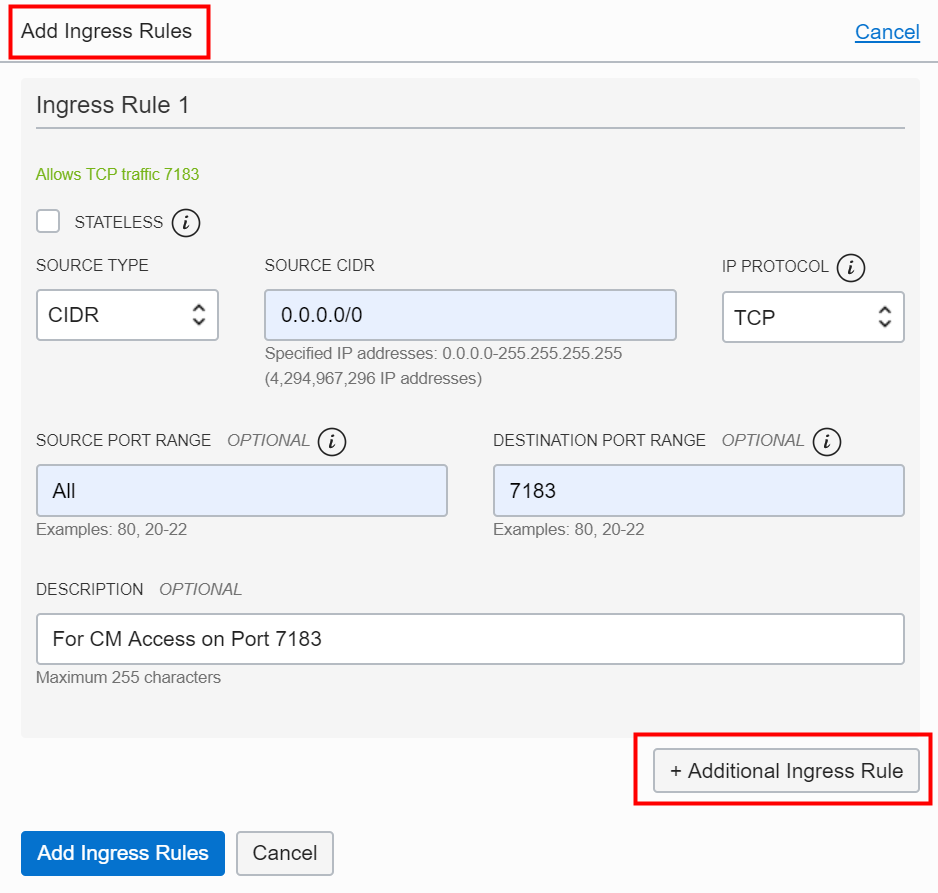

8. Click **+Additional Ingress Rule** to add an ingress security rule for Hue.

9. At the bottom of the **Add Ingress Rules** dialog box, the **Ingress Rule 2** section is displayed. Provide the following information:

    + For the **SOURCE TYPE**, select **`CIDR`**.
    + For the **SOURCE CIDR**, enter **`0.0.0.0/0`**.
    + For the **IP PROTOCOL**, select **`TCP`**.
    + For the **SOURCE PORT RANGE**, enter **`All`**.
    + For the **DESTINATION PORT RANGE**, enter **`8888`**.
    + For the **DESCRIPTION**, enter **`For Hue Access on Port 8888`**.

10. Click **Add Ingress Rules**.

  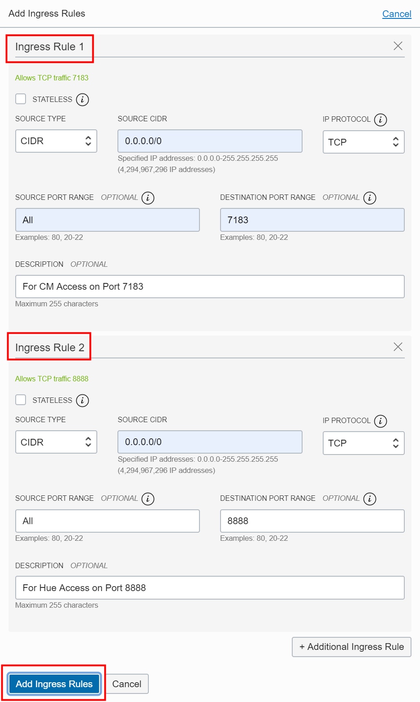

  The two ingress rules are added to the **Default Security List**.

  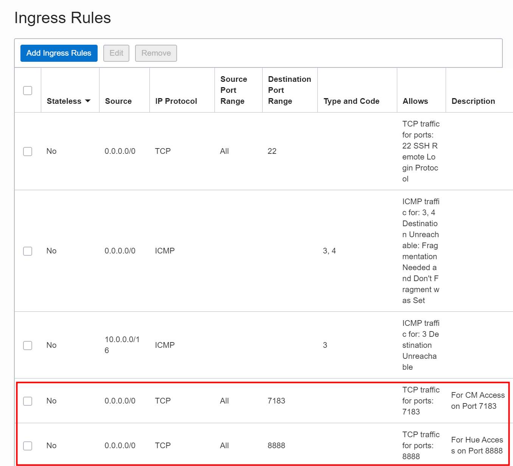

## STEP 2: Use Cloudera Manager to Access the Cluster

In this step, you will use CM to access the cluster. In an HA-cluster, CM runs on the first utility node, **`traininun0`**. You will use the reserved public IP address that is associated with **`traininun0`** that you created in step 2 of **Lab 4, Access a BDS Node Using a Public IP Address**.

1. Open a Web browser window.

2. Enter the following URL:

    ```
    https://<ip-address>:7183
    ```
    **Note:**    
    In the preceding command, substitute **_``ip-address``_** with your own **_``ip-address``_** that is associated with the first utility node in your cluster, **`traininun0`**, which you created in the previous lab.

    In our example, we used the reserved public IP address that is associated with our first utility node as follows:

    ```
    https://129.213.193.15:7183
    ```

3. On the CM Login screen, enter your **`username`** which is **`admin`** by default in CM. For the password, enter the **`password`** that you specified when you created the cluster such as **`Training123`**.

  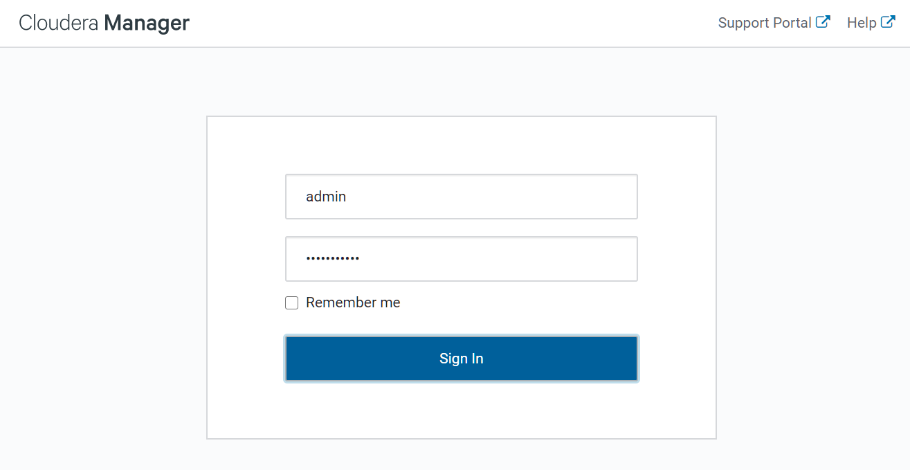

4. In the CM Home page, note the name of the cluster, the CDH version, and the services running on the cluster.

  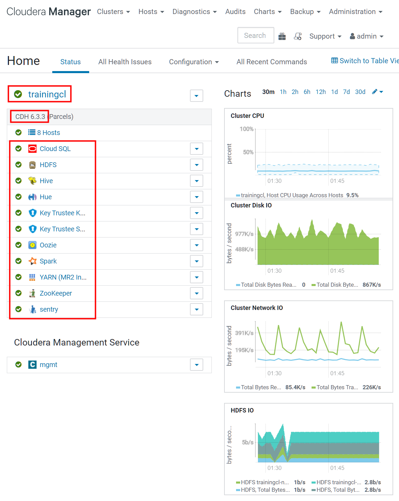

5. From the **Hosts** drop-down menu, select **All Hosts**.

  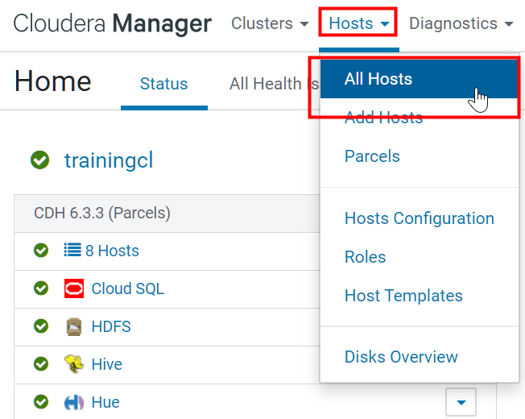

  The hosts of the cluster are displayed. Hosts are configured with one or more role instances, each of which corresponds to a service. The role indicates which daemon, also known as service, runs on the host. Typically, a host will run multiple roles in support of the various services running in the cluster.

   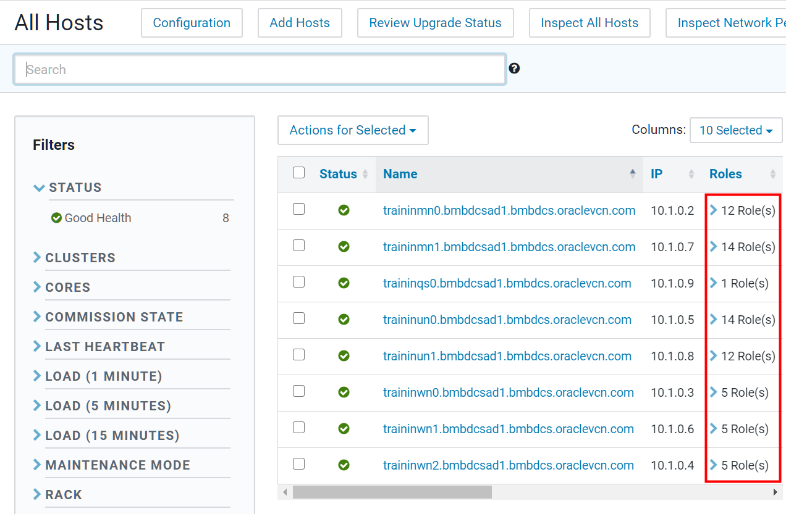

6. Drill-down on the roles associated with the first Master node in the cluster, **`traininmn0`**.

   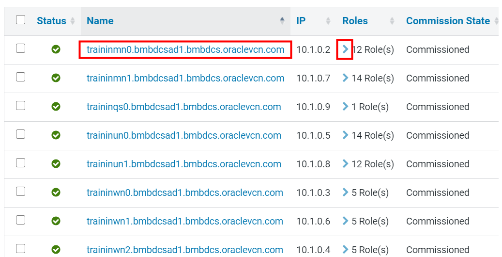

    The services and roles that are running on the Master node are displayed such as the `HDFS NameNode`, `Spark History Server`, `YARN's Job History Server`, and `Yarn's ResourceManager` among other services and gateways. A gateway is a type of role that typically provides client access to specific cluster services. For example, Hive and Spark each have gateway roles to provide access for their clients to their respective services.

    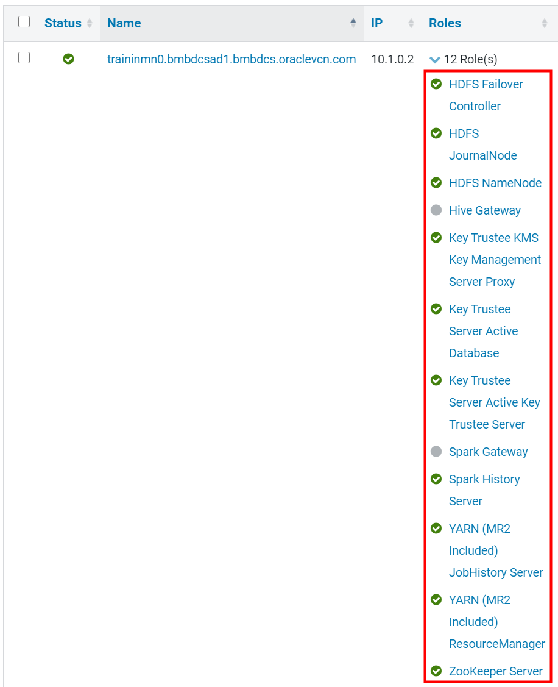

7. From the **Hosts** drop-down menu, select **Roles**.

    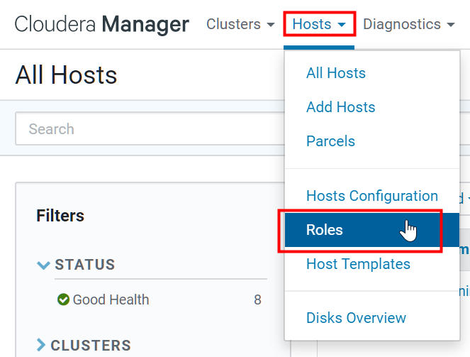

8. The **Roles** page displays the hosts in the cluster and all the roles (services and gateways) that are running on each host. The table is also grouped by hosts having the same roles assigned to them. For example, all three worker nodes run the same roles such as Big Data SQL server, DataNode, Hive and Spark Gateways, and YARN NodeManager.

    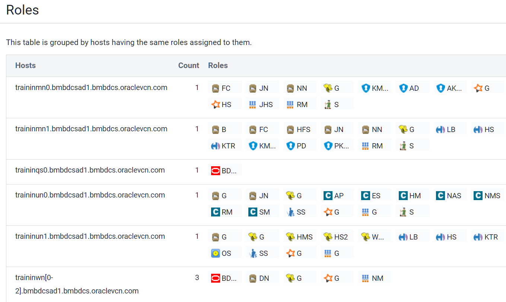

    **Note:**    
    You can hover over any icon in the table to display the name of the service or gateway.

    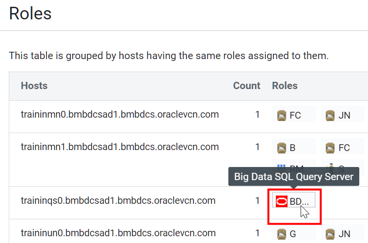

9. Exit CM. From the **User** drop-down menu, select **Sign out**.

    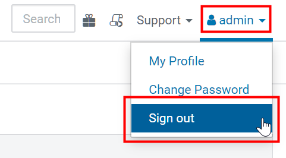

## STEP 3: Use Hue to Access the Cluster

In this step, you will use Hue to access the cluster. In an HA-cluster, Hue runs on the second utility node. You will use the reserved public IP address that is associated with **`traininun1`** that you created in **Lab 5, Access a BDS Node Using a Public IP Address**.

1. Open a Web browser window.

2. Enter the following URL:

    ```
    https://<ip-address>:8888
    ```
    **Note:**    
    In the preceding command, substitute **_``ip-address``_** with your own **_``ip-address``_** that is associated with the **second utility node** in your cluster, **`traininun1`**, which you created in the previous lab.

    In our example, we used the reserved public IP address that is associated with our second utility node as follows:

    ```
    https://150.136.199.24:8888
    ```

3. If this is the first time you are accessing Hue, the Hue Login screen is displayed. Enter your **`username`** which is **`admin`** by default in Hue. For the password, enter the **`password`** that you specified when you created the cluster such as **`Training123`**.

  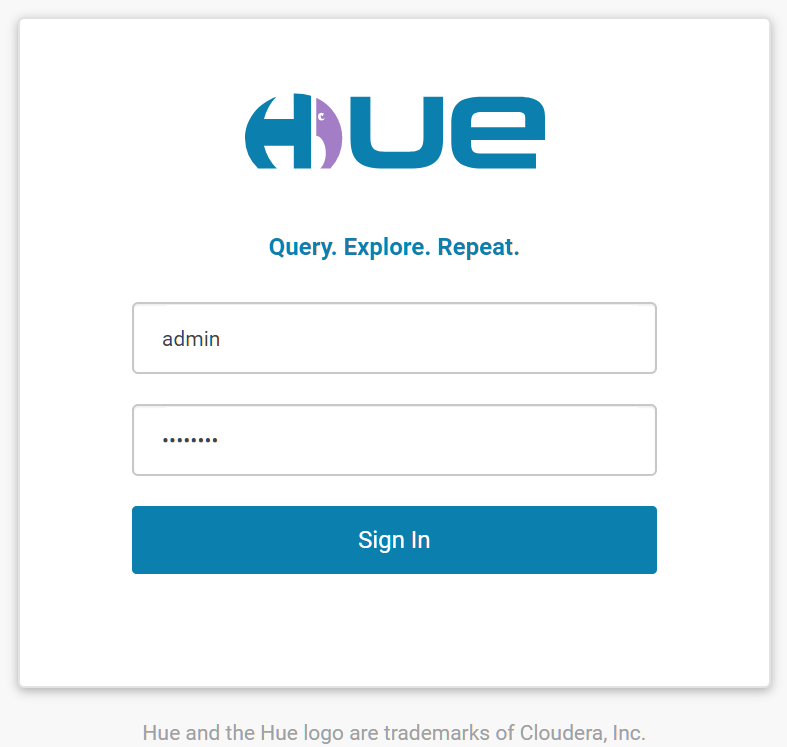

  The **Hue Editor** page is displayed.

  

4. For documentation on using Hue, see [Introduction to Hue](https://docs.cloudera.com/documentation/enterprise/6/6.3/topics/hue.html). You can also select **Help** from the **User** drop-down menu for general help topics.

  

5. Exit Hue. From the **admin** drop-down menu, select **Sign out**.

  


**This concludes this lab. Please proceed to the next lab in the Contents menu on the right.**

## Want to Learn More?

* [Oracle Big Data Service](https://docs.oracle.com/en/cloud/paas/big-data-service/)
* [Oracle Cloud Infrastructure Documentation](https://docs.cloud.oracle.com/en-us/iaas/Content/GSG/Concepts/baremetalintro.htm)
* [Security Lists](https://docs.cloud.oracle.com/en-us/iaas/Content/Network/Concepts/securitylists.htm)
* [Security Rules](https://docs.cloud.oracle.com/en-us/iaas/Content/Network/Concepts/securityrules.htm)
* [Configure Security Rules for the Network](https://docs.oracle.com/en/cloud/paas/big-data-service/user/configure-security-rules-network.html)
* [VCN and Subnets](https://docs.cloud.oracle.com/iaas/Content/Network/Tasks/managingVCNs.htm)
* [Cloudera Manager](https://docs.cloudera.com/documentation/enterprise/6/6.3/topics/cloudera_manager.html)
* [Using Hue](https://docs.cloudera.com/documentation/enterprise/6/6.3/topics/hue_using.html)

## Acknowledgements

* **Author:**
    + Lauran Serhal, Principal UA Developer, Oracle Database and Big Data User Assistance
* **Technical Contributor:**
    + Martin Gubar, Director, Oracle Big Data Product Management
* **Last Updated By/Date:** Lauran Serhal, July 2020

See an issue?  Please open up a request [here](https://github.com/oracle/learning-library/issues).
