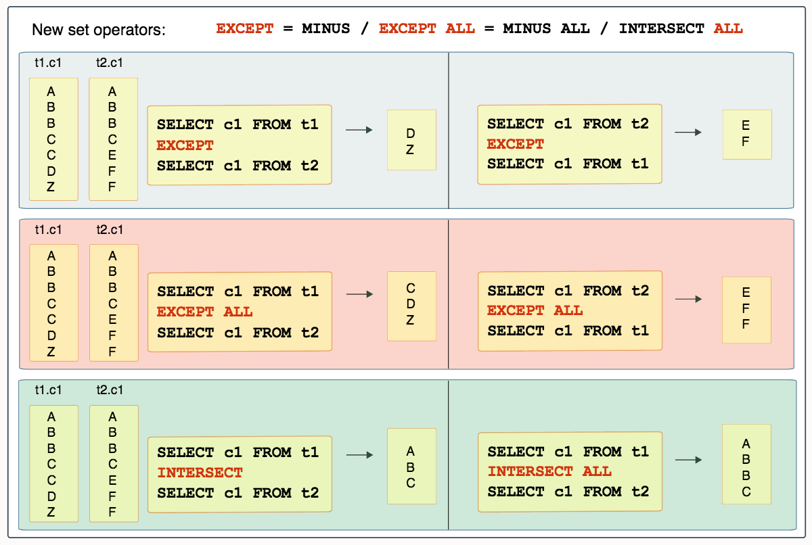

# New Set Operators

## Introduction
This lab shows how to use the new set operators, EXCEPT, EXCEPT ALL and INTERSECT ALL.

### About Product/Technology
Until Oracle Database 21c, only the set operator UNION could be combined with ALL. Oracle Database 21c introduces two set operators, MINUS ALL (same as EXCEPT ALL) and INTERSECT ALL.

 

- The 1st and 2nd statements use the EXCEPT operator to return only unique rows returned by the 1st query but not the 2nd.  
- The 3rd and 4th statements combine results from two queries using EXCEPT ALL reteruning only rows returned by the 1st query but not the 2nd even if not unique.
- The 5th and 6th statement combines results from 2 queries using INTERSECT ALL returning only unique rows returned by both queries.


Estimated Lab Time: XX minutes

### Objectives
In this lab, you will:
* Setup the environment
* Test the set operator with the EXCEPT clause
* Test the set operator with the EXCEPT ALL clause
* Test the set operator with the INTERSECT clause
* Test the set operator with the INTERSECT ALL clause

### Prerequisites

* An Oracle Free Tier, Always Free, Paid or LiveLabs Cloud Account
* Lab: SSH Keys
* Lab: Create a VCN
* Lab: Create an OCI VM Database
* Lab: 21c Setup


## **STEP  1**: Set up the environment

In this step you will execute the `/home/oracle/labs/M104783GC10/setup_oe_tables.sh` shell script. The shell script creates and loads the `OE.INVENTORIES`, `OE.ORDERS` and `OE.ORDER_ITEMS` tables.

1.  Change to the lab directory and run the shell script to setup the tables
   
      ```
      
      $ <copy>cd /home/oracle/labs/M104783GC10</copy>

      ```

2. Run the script to setup the Order Entry (OE) tables.

      ```
      $ <copy>/home/oracle/labs/M104783GC10/setup_oe_tables.sh</copy>
      
      ...
      
      Commit complete.
      
      Disconnected from Oracle Database 21c Enterprise Edition Release 21.0.0.0.0 - Production
      
      Version 21.2.0.0.0
      
      $ 
      
      ```

## **STEP  2**: Test the set operator with the `EXCEPT` clause

1. Connect to `PDB21` as `OE`.

  
      ```
      
      $ <copy>sqlplus oe@PDB21</copy>
      
      Copyright (c) 1982, 2020, Oracle.  All rights reserved.
      
      Enter password: <b><i>password</i></b>
      
      Last Successful login time: Mon Mar 16 2020 11:32:00 +00:00
      
      Connected to:
      
      SQL>
      
      ```

2. Count in both tables, `INVENTORIES` and `ORDER_ITEMS`, respectively the number of products available in the inventory and the number of products that customers ordered.  Start with the `INVENTORIES` table.

  
      ```
      
      SQL> <copy>SELECT count(distinct product_id) FROM inventories;</copy>
      
      COUNT(PRODUCT_ID)
      
      -----------------
      
                  208

3. Run a count in the `ORDER_ITEMS` table.  Note the difference.

      ```

      SQL> <copy>SELECT count(distinct product_id) FROM order_items;</copy>
      
      COUNT(PRODUCT_ID)
      
      -----------------
      
                  185
      
      SQL>
      
      ```

4. How many products are in the inventory that were never ordered? Use the `EXCEPT` operator to retrieve only unique rows returned by the first query but not by the second.

  
      ```
      
      SQL> <copy>SELECT count(*) FROM 
      
            (SELECT product_id FROM inventories
      
            EXCEPT
      
            SELECT product_id FROM order_items);</copy>
      
      COUNT(*)
      
      ----------
      
            84
      
      SQL>
      
      ```

5. How many products were ordered that are now missing in the inventory? The order of the queries is relevant for the result.

  
      ```
      
      SQL> <copy>SELECT count(*) FROM 
      
            (SELECT product_id FROM order_items
      
                  EXCEPT
      
            SELECT product_id FROM inventories);
            </copy>
      
      COUNT(*)
      
      ----------
      
            61
      
      SQL>
      
      ```

## **STEP  3**: Test the set operator with the `EXCEPT ALL` clause

1. Would the usage of ALL in the set operator defined in a query in a previous step mean anything? Run the SQL statement using the *EXCEPT ALL* operator.

      ```

      SQL> <copy>SELECT product_id FROM inventories
            EXCEPT ALL
            SELECT product_id FROM order_items;</copy>

      PRODUCT_ID
      ----------
            1729
            1729
            1729
            1729
            1729
            1729
            1733
            1733
            1733
            1733
            1733
            1733
            1733
            1733
            1733
      ...
            3502
            3502
            3502
            3502
            3502
            3503
            3503
            3503
            3503
            3503

      826 rows selected.
      ```
2. Run the same query but reverse the tables.  

      ```
      SQL> <copy>SELECT count(*) FROM 
            (SELECT product_id FROM inventories
            EXCEPT ALL
            SELECT product_id FROM order_items);</copy>

      COUNT(*)
      ----------
            826

      SQL>

      ```
The result shows all rows in the `INVENTORIES` table that contain products that were never ordered all inventories. This does not mean anything relevant. The use of `ALL` in operators must be appropriate.

## **STEP  4**: Test the set operator with the `INTERSECT` clause

1. How many products that were ordered are still orderable? The statement combining the results from two queries with the `INTERSECT` operator returns only those unique rows returned by both queries.

      ````
      SQL> <copy>SELECT count(*) FROM 
            (SELECT product_id FROM inventories
            INTERSECT
            SELECT product_id FROM order_items);</copy>

      COUNT(*)
      ----------
            124

      ````

2. Run the sql statement below reversing the intersect clause.

      ````
      SQL> 
      <copy>
      SELECT count(*) FROM 
            (SELECT product_id FROM order_items
            INTERSECT
            SELECT product_id FROM inventories);
            </copy>

      COUNT(*)
      ----------
            124

      SQL>

      ````

## **STEP  5**: Test the set operator with the `INTERSECT ALL` clause

1. Would the usage of `ALL` in the operator defined in the query in step 8 mean anything?

      ```

      SQL> <copy>SELECT count(*) FROM 
            (SELECT product_id FROM order_items
            INTERSECT ALL
            SELECT product_id FROM inventories);</copy>

      COUNT(*)
      ----------
            286
      ````

2. Exit SQL*Plus
   
      ````
      SQL> <copy>exit</copy>
      ```
The result shows all rows in the `INVENTORIES` table that contain products that were ordered. This does not mean that these products were ordered from these warehouses. The query does not mean anything relevant. The use of `ALL` in operators must be appropriate.

You may now [proceed to the next lab](#next).

## Learn More

*(optional - include links to docs, white papers, blogs, etc)*

* [URL text 1](http://docs.oracle.com)
* [URL text 2](http://docs.oracle.com)

## Acknowledgements
* **Author** - Dominique Jeunot, Database UA Team
* **Contributors** -  Kay Malcolm, Database Product Management
* **Last Updated By/Date** -  Kay Malcolm, Database Product Management

## Need Help?
Please submit feedback or ask for help using our [LiveLabs Support Forum](https://community.oracle.com/tech/developers/categories/livelabsdiscussions). Please click the **Log In** button and login using your Oracle Account. Click the **Ask A Question** button to the left to start a *New Discussion* or *Ask a Question*.  Please include your workshop name and lab name.  You can also include screenshots and attach files.  Engage directly with the author of the workshop.

If you do not have an Oracle Account, click [here](https://profile.oracle.com/myprofile/account/create-account.jspx) to create one.
