# Disaster Recovery Network and Connectivity Setup

## Introduction

This lab walks you through setting up your environment for our active and passive disaster recovery scenarios. It will leverage Oracle Cloud's resource manager as well as pre-prepared terraform scripts.

Estimated Lab Time: 60 minutes

### About OCI Resource Manager

OCI resource manager enables us to quickly run completed terraform scripts in order to deploy infrastructure in Oracle Cloud. It provides a friendly and customizable user interface that facilitates the deployment process.

### Objectives

In this lab, you will:
* Deploy DR network and infrastructure on OCI using Terraform.
* Configure network and infrastructure settings through the Oracle Cloud console.

### Prerequisites

* Full admin access to an Oracle Cloud account.
* Create your own private/public key pair on your local system.
* Move the key pair to the resource-manager-bin/keys/ folder.
* Zip up all of the files from resource-manager-bin folder. The zip file name is not important. Just make sure it has the following file structure:
    
        resource-manager-bin/
        ├── assets 
        │   ├── images
        │   │   └── oracle.png
        │   ├── scripts
        │   │   ├── block-volume-migration.py
        │   │   ├── boot-volume-migration.py
        │   │   ├── cloud_init_checker.sh
        │   │   └── README.md
        │   └── templates
        │       ├── bootstrap_dst.tpl
        │       └── bootstrap_src.tpl
        ├── data_sources.tf
        ├── dr_schema.yaml
        ├── keys
        │   ├── id_rsa
        │   ├── id_rsa.pub
        ├── main.tf
        ├── modules
        │   ├── bastion_instance
        │   │   ├── main.tf
        │   │   ├── outputs.tf
        │   │   └── variables.tf
        │   ├── iam
        │   │   ├── main.tf
        │   │   ├── outputs.tf
        │   │   └── variables.tf
        │   ├── lb
        │   │   ├── main.tf
        │   │   ├── outputs.tf
        │   │   └── variables.tf
        │   ├── network
        │   │   ├── main.tf
        │   │   ├── outputs.tf
        │   │   └── variables.tf
        │   ├── server
        │   │   ├── main.tf
        │   │   ├── outputs.tf
        │   │   └── variables.tf
        ├── outputs.tf
        ├── providers.tf
        ├── README.md
        ├── terraform.tfvars
        └── variables.tf

* **Inputs**
    *The following inputs are required for terraform modules:*

    ```
    Argument
    Description

    region
    Primary region in which to operate, example: us-ashburn-1, us-phoenix-1, ap-seoul-1, ap-tokyo-1, ca-toronto-1 

    dr_region
    DR region in which to operate, example: us-ashburn-1, us-phoenix-1, ap-seoul-1, ap-tokyo-1, ca-toronto-1

    dr_vcn_cidr_block
    CIDR block of the VCN (Virtual Cloud Network) to be created in DR region. make sure the VCN CIDR blocks of primary and DR regions do not overlap

    vcn_cidr_block
    CIDR block of the VCN (Virtual Cloud Network) to be created in primary region. make sure the VCN CIDR blocks of primary and DR regions do not overlap

    vcn_dns_label
    DNS Label of the VCN (Virtual Cloud Network) to be created.

    bastion_server_shape
    This is the compute shape for bastion server. For more information on available shapes, see VM Shapes

    app_server_shape
    This is the compute shape for application servers deployed in primary region for hosting application. For more information on available shapes, see VM Shapes

    lb_shape
    A template that determines the total pre-provisioned bandwidth (ingress plus egress). To get a list of available shapes, use the ListShapes operation. Example: 100Mbps
    ```
**Note:** This is **not** configured for a production environment. **This is just for demo purposes.**

## **STEP 1:** Deploying with OCI Resource Manager.

The following section will show you how to configure resource manager to make the deployment easier. You will not be able to configure anything that is shaded out on the page.

1. Configuration 

    -  Navigate to the resource manager tab in oci. Next upload the zip file to the stack.

        
        
    -  Input the configuration for the instances.

        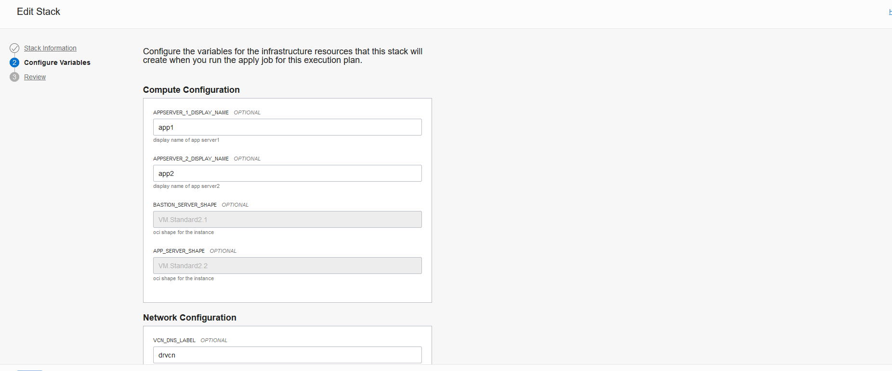

    -  Input the configuration for the vcn

        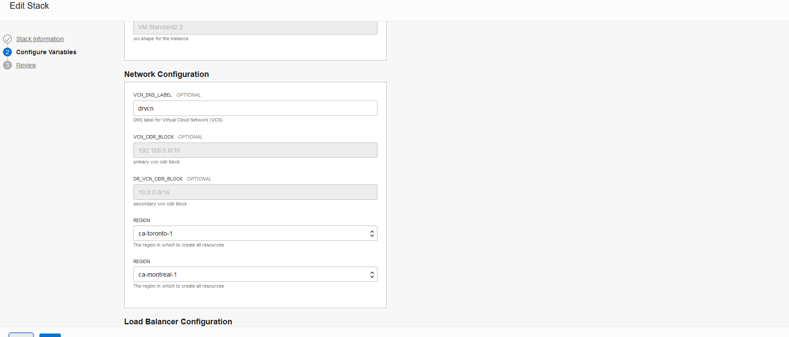
        
    -  Input the configuration for the load balancer

        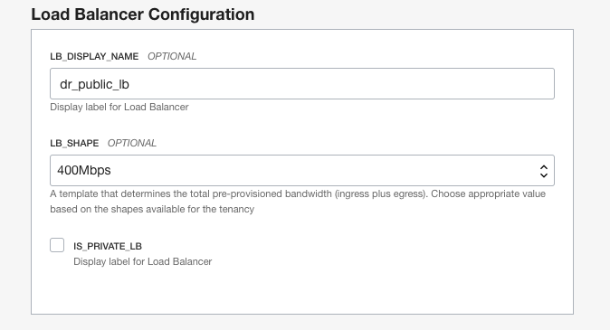
        
    -  Input the configuration for the keys. Since the keys are in the zip file and in the keys folder, make sure to put "./keys/" in front of the key names.

        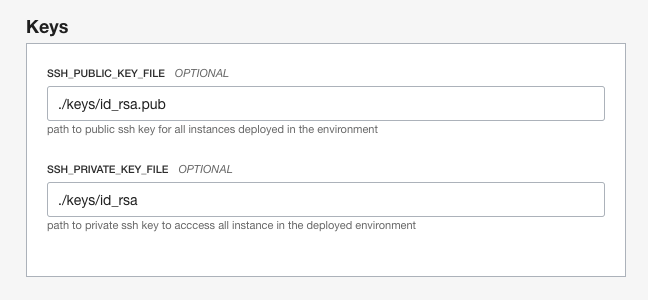
        
        **Review process**

        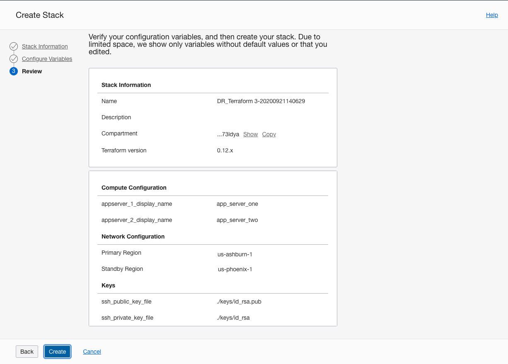
    
2. Plan

    -  Select plan from the dropdown menu.

        
        
    -  Make sure everything looks okay and then proceed

        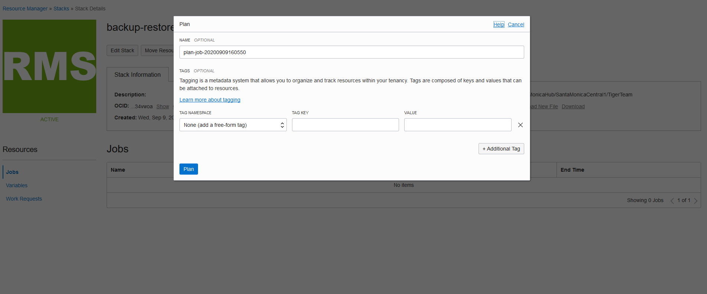

    -  Wait until the icon turns green.

        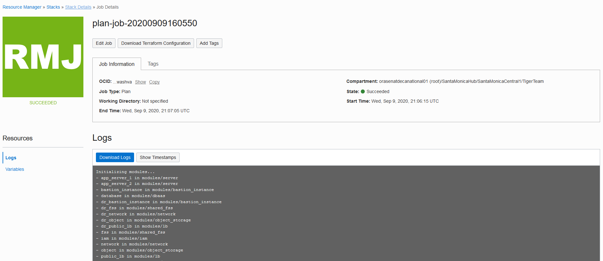
    
3. Apply
    
    -  Select apply from the dropdown menu. 

        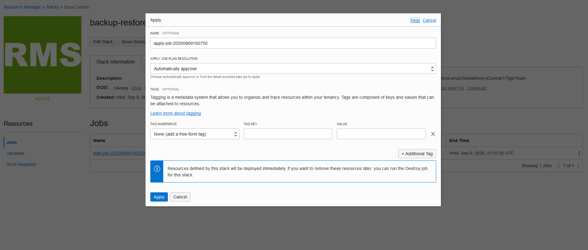
        
    -  Wait until the icon turns green.

        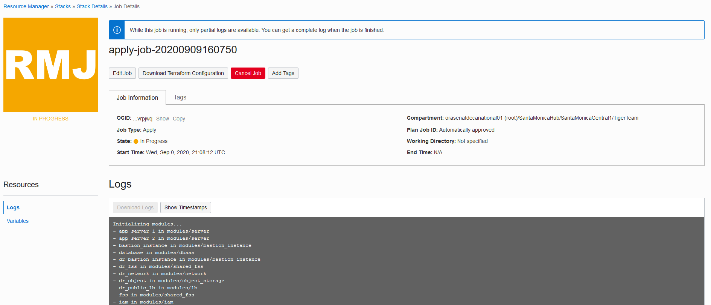

4. Destroy
    If you want to delete the infrastructure. First navigate to OCI Console and terminate the DR database and once the termination is successful then resource manager can be used to destroy the environment.

    -  Select destroy from the dropdown menu. 

        

    -  Wait until the icon turns green.

        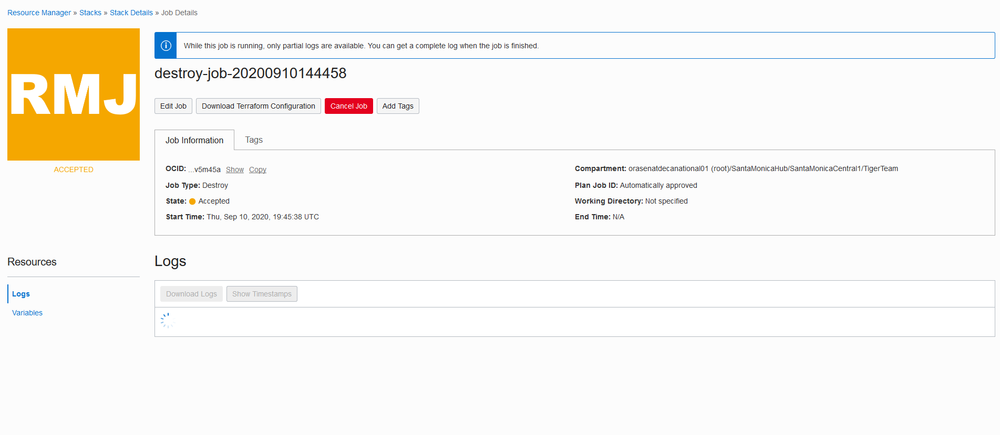

**Example of the results terraform will produce.**
  *Example: Instances in the Primary Region*

  

  *Example: Instances in the DR Region*

  
 
## **STEP 2:** Configuring the DNS for failover.

1. Create a Health Check

    -  Navigate to the upper left hamburger menu, expand **Networking** and click on **Health Checks**.

        

    -  Click on **Create Health Check** and provide the appropriate information. _Make sure to attach the **Primary** load balancer as a target_. You may choose whichever [vantage points](https://docs.cloud.oracle.com/en-us/iaas/Content/HealthChecks/Concepts/healthchecks.htm) you would like. The **Request Type** and **Protocol** should both be **HTTP**. The **Method** should be **HEAD**. Leave everything else as their default values.

        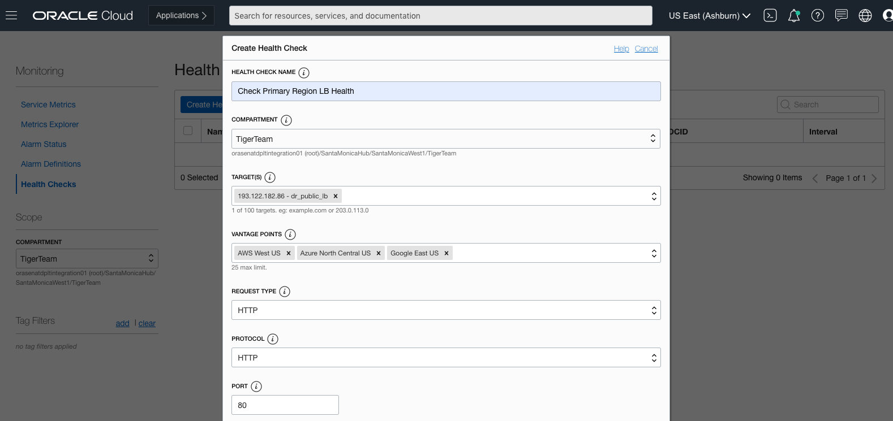

        

        

2. Create a new DNS zone

    - Navigate to the upper left hamburger menu, expand **Networking** and click on **DNS Zone Management**.

        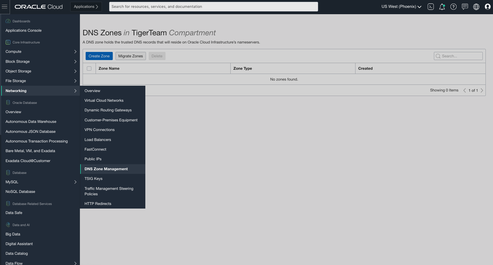

    - Click on **Create Zone**.

        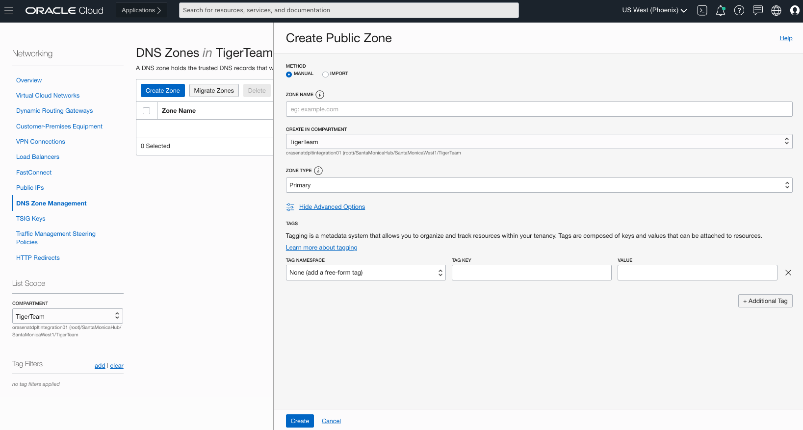

    - Provide a **Zone Name**. This value has to be the same as an internet accessible domain hosted on either godaddy or freenom. The **Zone Type** should be **Primary**. Once created, please connect your DNS with the nameservers provided through the service console.

        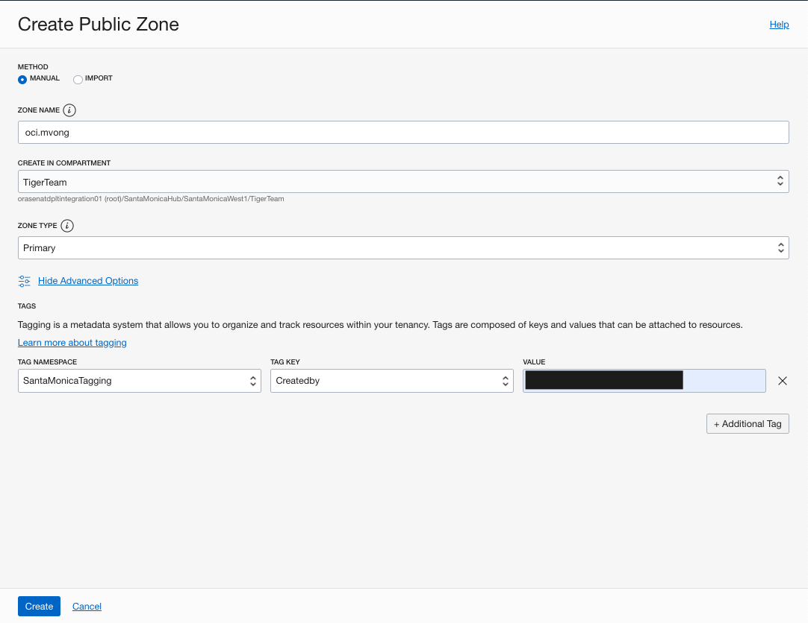

3. Create a Traffic Management Steering Policy

    -  From the OCI console, under networking go to the traffic steering policies.

        

    -  Create a failover traffic steering policy.

        

    -  This policy will point your DNS to your DR region's load balancer if your primary region's load balancer fails the health check. 

        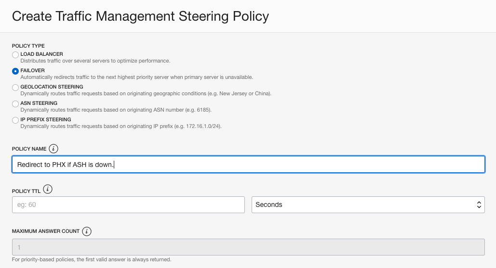

    -  You can get your load balancer IPs from Networking -> Load balancers. Make sure you are in the correct regions. 

        

    -  You can see, we switch regions on the upper right to get the IP of the LB in the DR region, Phoenix.

        

    -  Provide your answer pools for both of your regions.

        

        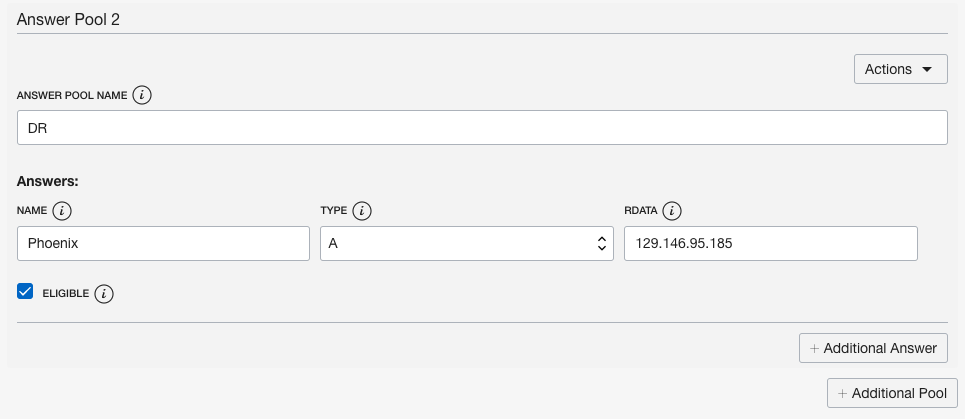

    -  Make sure to attach the previously created health check of your primary load balancer, this is what determines if traffic should be re-directed to your DR region.  

        

        

    -  Provide a subdomain name and attach the previously created DNS zone as an attached domain. 

        

    -  This is a summary of your traffic steering policy.

        

        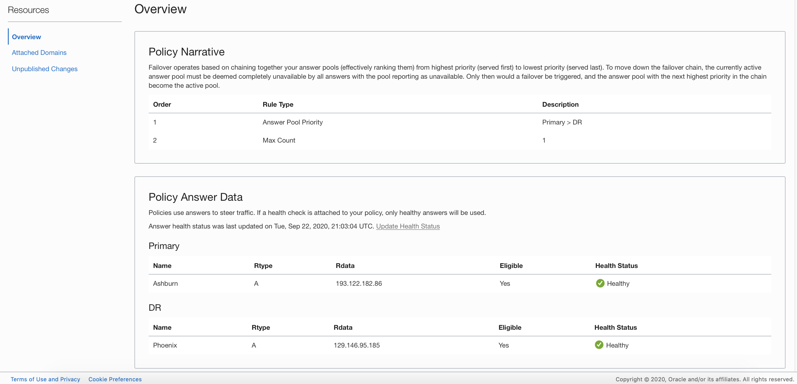

        

You may proceed to the next lab.

## Learn More
- [Introduction to OCI](https://docs.cloud.oracle.com/en-us/iaas/Content/GSG/Concepts/baremetalintro.htm)

## Acknowledgements
* **Authors** - Saul Chavez, Cloud Engineer; Mark Vong, Cloud Engineer
* **Contributors** -  Goutham M L, Cloud Engineer
* **Last Updated By** - Mark Vong, Cloud Engineering, October 2020

## Need Help?
Please submit feedback or ask for help using our [LiveLabs Support Forum](https://community.oracle.com/tech/developers/categories/livelabsdiscussions). Please click the **Log In** button and login using your Oracle Account. Click the **Ask A Question** button to the left to start a *New Discussion* or *Ask a Question*.  Please include your workshop name and lab name.  You can also include screenshots and attach files.  Engage directly with the author of the workshop.

If you do not have an Oracle Account, click [here](https://profile.oracle.com/myprofile/account/create-account.jspx) to create one.