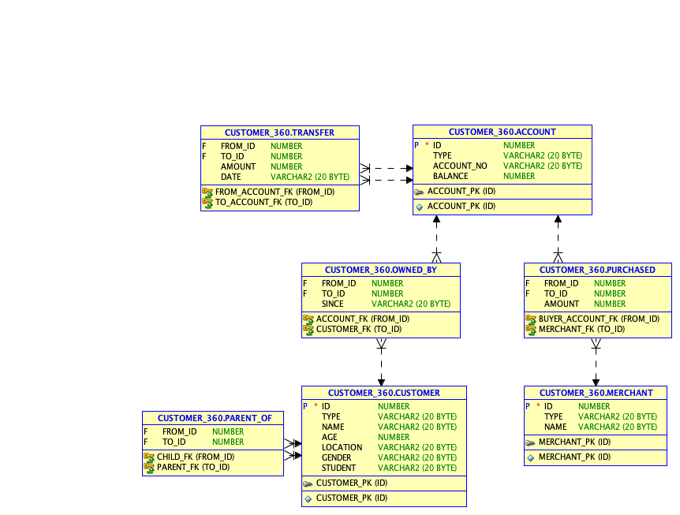
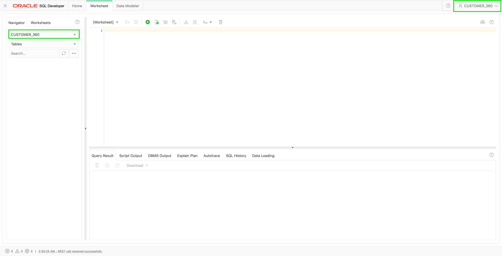
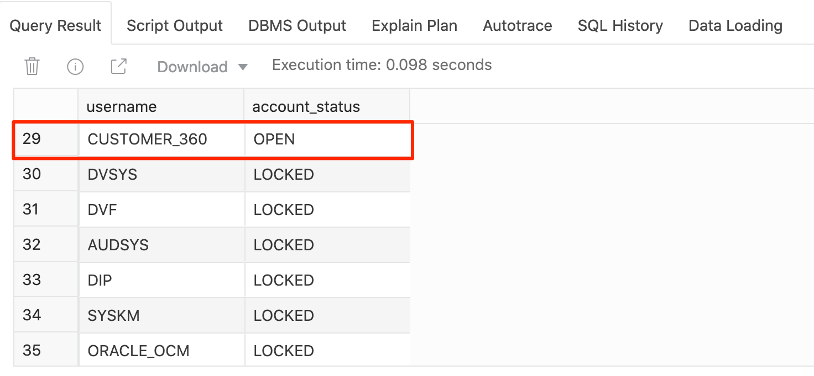
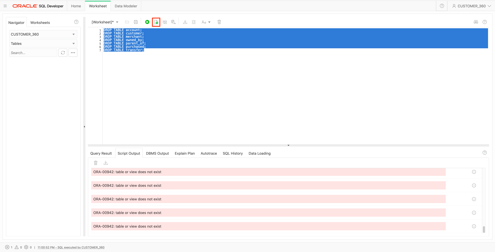
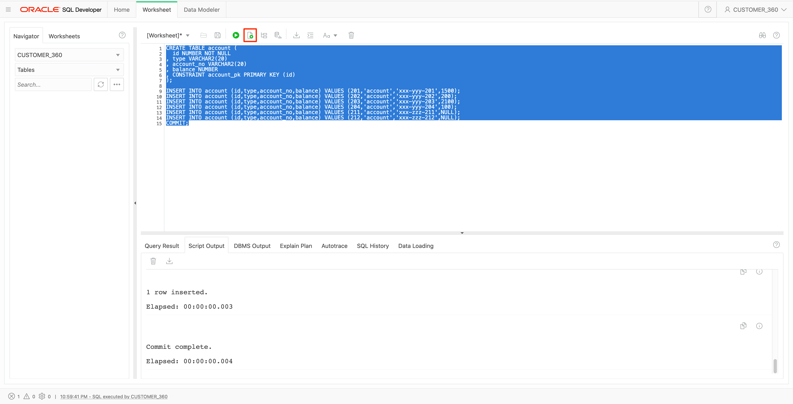
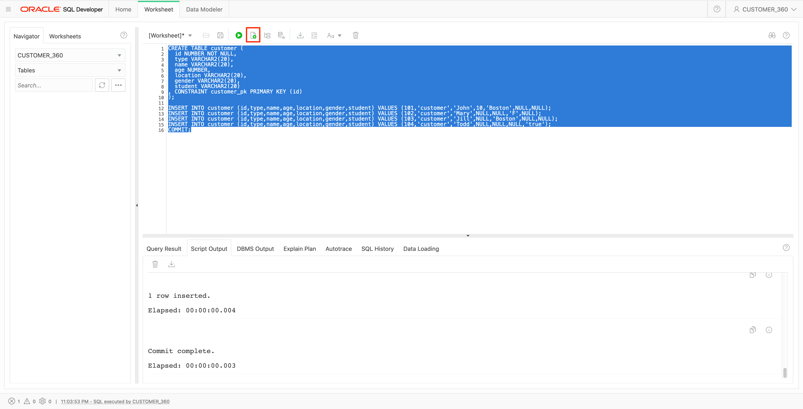
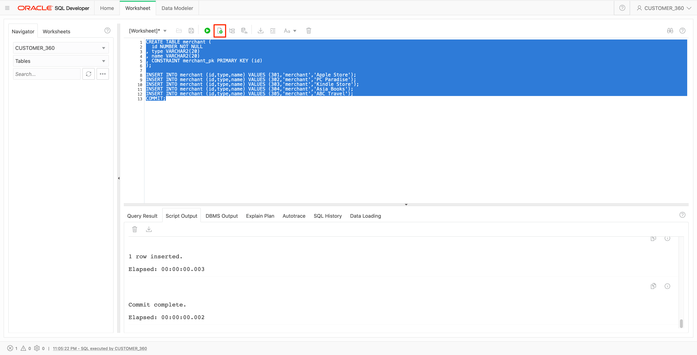
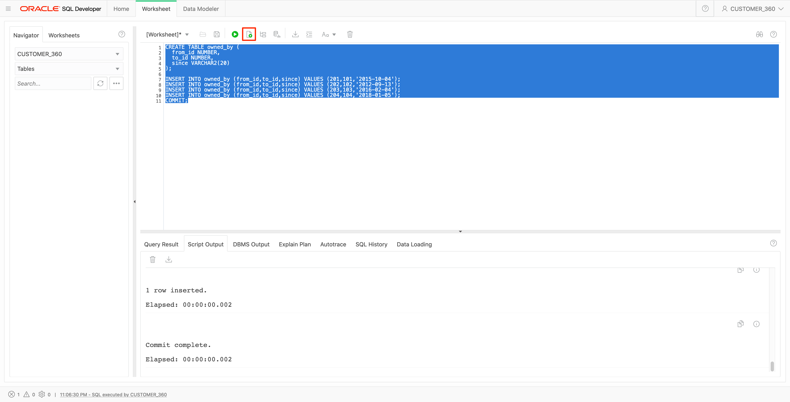
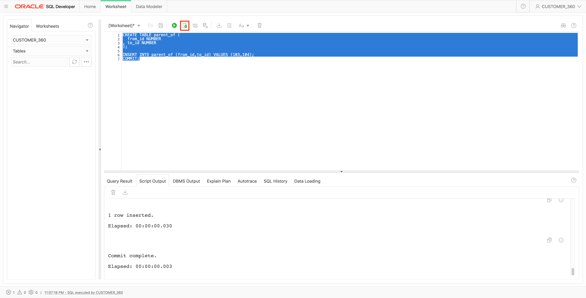
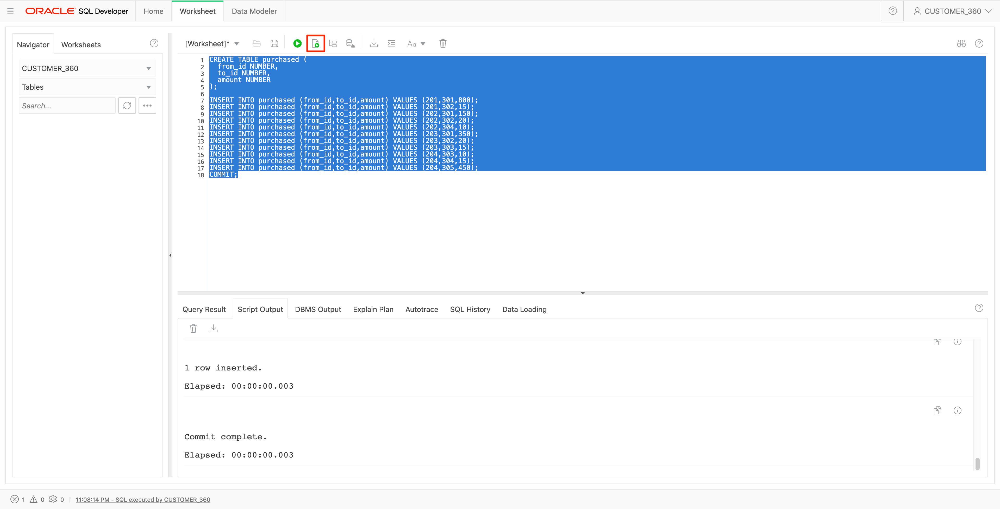

# Create and Populate Tables

## Introduction

In this lab, you are going to log in as user `customer_360`. You will learn how to clear previous tables, create new tables, and populate the tables with your data.

You will create 7 tables (customer, account, merchant, owned_by, purchased, transfer, parent_of). The entity-relationship diagram for these tables is shown below.



Estimated time: 7 minutes

### Objectives

- Learn how to connect to your new Autonomous Database using SQL Developer Web
- Learn how to create tables and insert data using SQL

### Prerequisites

- This lab assumes you have successfully completed the lab - Create and enable a user in SQLDeveloper Web.

## **STEP 1:** Log in to SQLDevWeb as user c360

1. Open the correct URL for SQlDevWeb for the CUSTOMER_360 user. It is almost the same URL as the one for the Admin user execpt that `admin` in that url is replaced with the schema-alias we provided, i.e. with `c360`.

  

2. Login as `CUSTOMER_360` using the password you entered when creating the user.

  *Note: Use the password you choose in Step 1.2 in Lab 4.*

  

  

### Troubleshooting

If you receive a *Service Unavailable* error, it may be that the  `customer_360` account is locked.


You can try the following steps:

1. Log in as ADMIN, enter and run the command in Worksheet:

    ```
    <copy>select username, account_status from dba_users ;</copy>
    ```

  In Query Result, check the account status of `CUSTOMER_360`. The status should be `OPEN`.

  

2. If the status is `LOCKED`, enter and run the command to unlock the user:

    ```
    <copy>alter user CUSTOMER_360 account unlock</copy>
    ```

3. Then, the status should change to `OPEN`. You can check again using command:

    ```
    <copy>select username, account_status from dba_users ;</copy>
    ```

## **STEP 2:** Drop existing tables if any

1. To ensure a clean slate, drop any existing tables. Copy, paste, and execute the following commands into the SQL Worksheet.

    ```
    <copy>
    DROP TABLE account;
    DROP TABLE customer;
    DROP TABLE merchant;
    DROP TABLE owned_by;
    DROP TABLE parent_of;
    DROP TABLE purchased;
    DROP TABLE transfer;

    </copy>
    ```

  

## **STEP 3:** Create and populate the Account table

1. Clear the SQL Worksheet. Copy, paste, and run the following SQL script.

    ```
    <copy>
    CREATE TABLE account (
      id NUMBER NOT NULL
    , type VARCHAR2(20)
    , account_no VARCHAR2(20)
    , balance NUMBER
    , CONSTRAINT account_pk PRIMARY KEY (id)
    );

    INSERT INTO account (id,type,account_no,balance) VALUES (201,'account','xxx-yyy-201',1500);
    INSERT INTO account (id,type,account_no,balance) VALUES (202,'account','xxx-yyy-202',200);
    INSERT INTO account (id,type,account_no,balance) VALUES (203,'account','xxx-yyy-203',2100);
    INSERT INTO account (id,type,account_no,balance) VALUES (204,'account','xxx-yyy-204',100);
    INSERT INTO account (id,type,account_no,balance) VALUES (211,'account','xxx-zzz-211',NULL);
    INSERT INTO account (id,type,account_no,balance) VALUES (212,'account','xxx-zzz-212',NULL);
    COMMIT;

    </copy>
    ```

  

## **STEP 4:** Create and populate the Customer table

1. Clear the SQL Worksheet. Copy, paste, and run the following SQL script.

    ```
    <copy>
    CREATE TABLE customer (
      id NUMBER NOT NULL,
      type VARCHAR2(20),
      name VARCHAR2(20),
      age NUMBER,
      location VARCHAR2(20),
      gender VARCHAR2(20),
      student VARCHAR2(20)
    , CONSTRAINT customer_pk PRIMARY KEY (id)
    );

    INSERT INTO customer (id,type,name,age,location,gender,student) VALUES (101,'customer','John',10,'Boston',NULL,NULL);
    INSERT INTO customer (id,type,name,age,location,gender,student) VALUES (102,'customer','Mary',NULL,NULL,'F',NULL);
    INSERT INTO customer (id,type,name,age,location,gender,student) VALUES (103,'customer','Jill',NULL,'Boston',NULL,NULL);
    INSERT INTO customer (id,type,name,age,location,gender,student) VALUES (104,'customer','Todd',NULL,NULL,NULL,'true');
    COMMIT;
    </copy>
    ```

  

## **STEP 5:** Create and populate the Merchant table

1. Clear the SQL Worksheet. Copy, paste, and run the following SQL script.

    ```
    <copy>
    CREATE TABLE merchant (
      id NUMBER NOT NULL
    , type VARCHAR2(20)
    , name VARCHAR2(20)
    , CONSTRAINT merchant_pk PRIMARY KEY (id)
    );

    INSERT INTO merchant (id,type,name) VALUES (301,'merchant','Apple Store');
    INSERT INTO merchant (id,type,name) VALUES (302,'merchant','PC Paradise');
    INSERT INTO merchant (id,type,name) VALUES (303,'merchant','Kindle Store');
    INSERT INTO merchant (id,type,name) VALUES (304,'merchant','Asia Books');
    INSERT INTO merchant (id,type,name) VALUES (305,'merchant','ABC Travel');
    COMMIT;

    </copy>

    ```

  

## **STEP 6:** Create and populate the Owned_By table

1. Clear the SQL Worksheet. Copy, paste, and run the following SQL script.

    ```
    <copy>
    CREATE TABLE owned_by (
      from_id NUMBER,
      to_id NUMBER,
      since VARCHAR2(20)
    );

    INSERT INTO owned_by (from_id,to_id,since) VALUES (201,101,'2015-10-04');
    INSERT INTO owned_by (from_id,to_id,since) VALUES (202,102,'2012-09-13');
    INSERT INTO owned_by (from_id,to_id,since) VALUES (203,103,'2016-02-04');
    INSERT INTO owned_by (from_id,to_id,since) VALUES (204,104,'2018-01-05');
    COMMIT;
    </copy>
    ```

  

## **STEP 7:** Create and populate the Parent_Of table

1. Clear the SQL Worksheet. Copy, paste, and run the following SQL script.

    ```
    <copy>
    CREATE TABLE parent_of (
      from_id NUMBER
    , to_id NUMBER
    );

    INSERT INTO parent_of (from_id,to_id) VALUES (103,104);
    COMMIT;
    </copy>
    ```

  

## **STEP 8:** Create and populate the Purchased table

1. Clear the SQL Worksheet. Copy, paste, and run the following SQL script.

    ```
    <copy>
    CREATE TABLE purchased (
      from_id NUMBER,
      to_id NUMBER,
      amount NUMBER
    );

    INSERT INTO purchased (from_id,to_id,amount) VALUES (201,301,800);
    INSERT INTO purchased (from_id,to_id,amount) VALUES (201,302,15);
    INSERT INTO purchased (from_id,to_id,amount) VALUES (202,301,150);
    INSERT INTO purchased (from_id,to_id,amount) VALUES (202,302,20);
    INSERT INTO purchased (from_id,to_id,amount) VALUES (202,304,10);
    INSERT INTO purchased (from_id,to_id,amount) VALUES (203,301,350);
    INSERT INTO purchased (from_id,to_id,amount) VALUES (203,302,20);
    INSERT INTO purchased (from_id,to_id,amount) VALUES (203,303,15);
    INSERT INTO purchased (from_id,to_id,amount) VALUES (204,303,10);
    INSERT INTO purchased (from_id,to_id,amount) VALUES (204,304,15);
    INSERT INTO purchased (from_id,to_id,amount) VALUES (204,305,450);
    COMMIT;
    </copy>
    ```

  

## **STEP 9:** Create and populate the Transfer table

1. Clear the SQL Worksheet. Copy, paste, and run the following SQL script.

  The quotes are needed since DATE is a reserved word.

    ```
    <copy>
    CREATE TABLE transfer (
      from_id NUMBER
    , to_id NUMBER
    , amount NUMBER
    , "DATE" VARCHAR2(20)
    );

    INSERT INTO transfer (from_id,to_id,amount,"DATE") VALUES (201,202,200,'2018-10-05');
    INSERT INTO transfer (from_id,to_id,amount,"DATE") VALUES (211,202,900,'2018-10-06');
    INSERT INTO transfer (from_id,to_id,amount,"DATE") VALUES (202,212,850,'2018-10-06');
    INSERT INTO transfer (from_id,to_id,amount,"DATE") VALUES (201,203,500,'2018-10-07');
    INSERT INTO transfer (from_id,to_id,amount,"DATE") VALUES (203,204,450,'2018-10-08');
    INSERT INTO transfer (from_id,to_id,amount,"DATE") VALUES (204,201,400,'2018-10-09');
    INSERT INTO transfer (from_id,to_id,amount,"DATE") VALUES (202,203,100,'2018-10-10');
    INSERT INTO transfer (from_id,to_id,amount,"DATE") VALUES (202,201,300,'2018-10-10');
    COMMIT;
    </copy>
    ```

  

You may now proceed to the next lab

## Acknowledgements

* **Author** - Jayant Sharma, Product Manager, Spatial and Graph
* **Contributors** - Thanks to Jenny Tsai for helpful, constructive feedback that improved this workshop.
* **Last Updated By/Date** - Arabella Yao, Product Manager Intern, Database Management, June 2020

## See an issue?
Please submit feedback using this [form](https://apexapps.oracle.com/pls/apex/f?p=133:1:::::P1_FEEDBACK:1). Please include the *workshop name*, *lab* and *step* in your request.  If you don't see the workshop name listed, please enter it manually. If you would like for us to follow up with you, enter your email in the *Feedback Comments* section.
