# Load Graphs from Files

## Use Case: Customer 360 analysis

This example shows how integrating multiple datasets, using a graph, facilitates additional analytics that can lead to new insights. We will use three small datasets for illustrative purposes. The first contains accounts and account owners. The second is purchases by the people who own those accounts. The third is transactions between these accounts.

The combined dataset is then used to perform the following common graph query and analyses: pattern matching, detection of cycles, finding important nodes, community detection, and recommendation.

Estimated Lab Time: 20 minutes

### Objectives

In this lab, you will:

* Integrate multiple datasets using a graph to facilitate additional analytics that leads to new insights
* Use combined dataset to perform the following common graph query and analyses: pattern matching, detection of cycles, finding important nodes, community detection, and recommendation.

### Prerequisites

* This lab assumes you have successfully setup a Property Graph Analysis Environment in Docker.

## **STEP 1:** Add ingress rules and verify setup environment

1. On Oracle cloud homepage, click on the hamburger, navigate to **Networking** in Core Infrastucture section and click on **Virtual Cloud Networks**.

  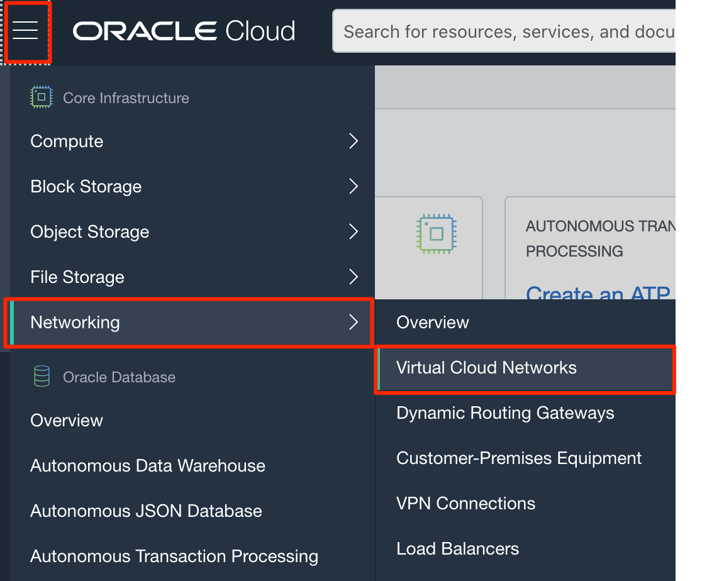

2. Select your compartment from the list and navigate to the vcn you created for this workshop earlier in lab 2.

  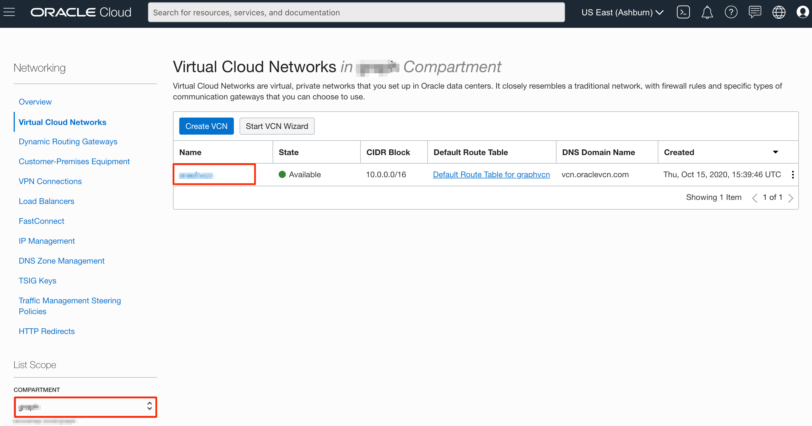

3. In the vcn, under Resources, click on **Security Lists** to see the default security list for the compartment. Now, click on the Default Security List for your compartment.

  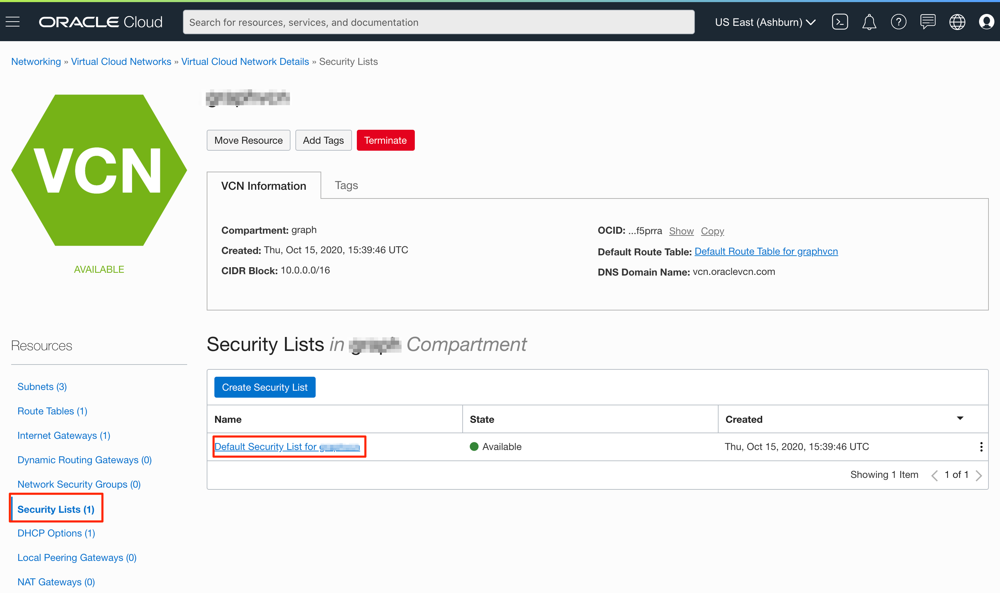

4. Select **Ingress Rule** under the resources in Default Security List for your compartment and click on **Add Ingress Rule**

  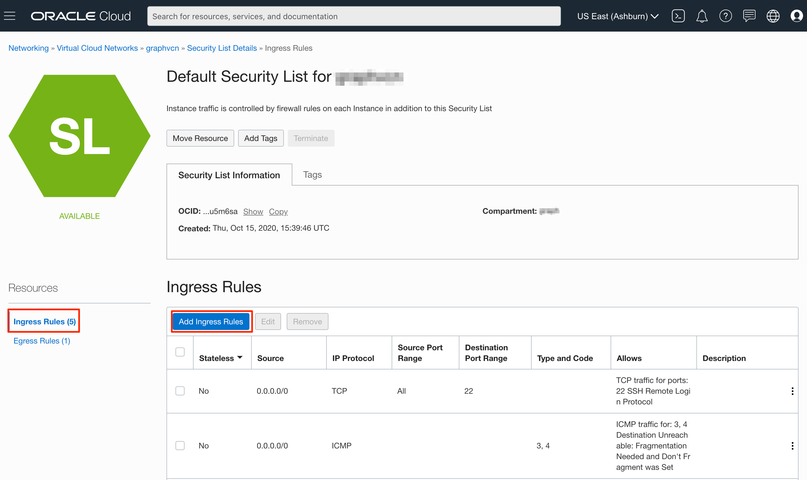

5. Now let's add an ingress rules for the ports 7007 and 8080.

   Fill in the following values for port 7007 and click on **Another Ingress Rule**.
    - Source Type – CIDR
    - Source CIDR – 0.0.0.0/0
    - IP Protocol – TCP
    - Source Port Range – All
    - Destination Port Range - 7007

  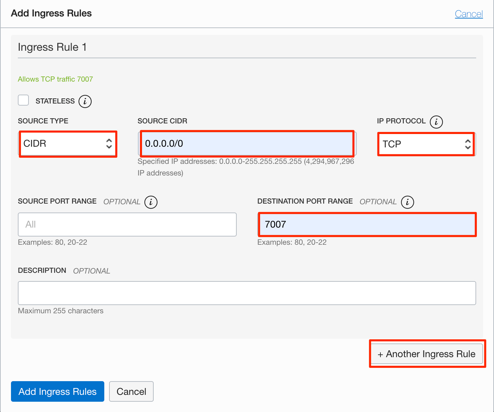

  Fill in the following values for port 8080 and click on **Add Ingress Rule**.
    - Source Type – CIDR
    - Source CIDR – 0.0.0.0/0
    - IP Protocol – TCP
    - Source Port Range – All
    - Destination Port Range - 8080

  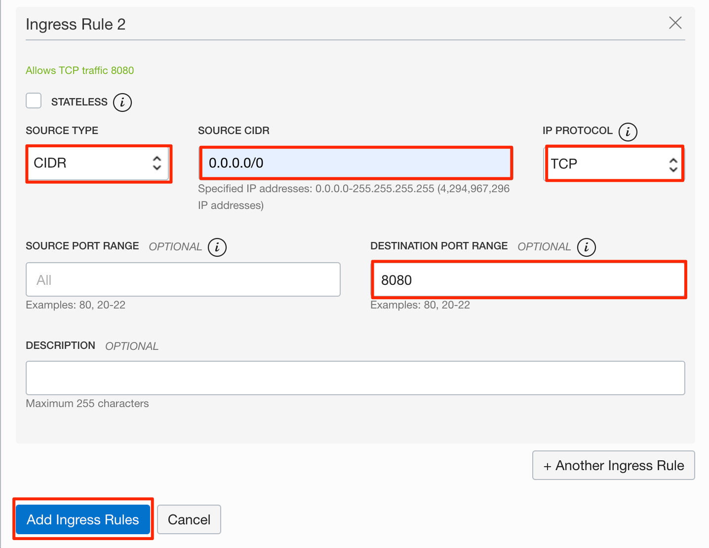

  Now the ingress rules for ports 7007 and 8080 are added.

  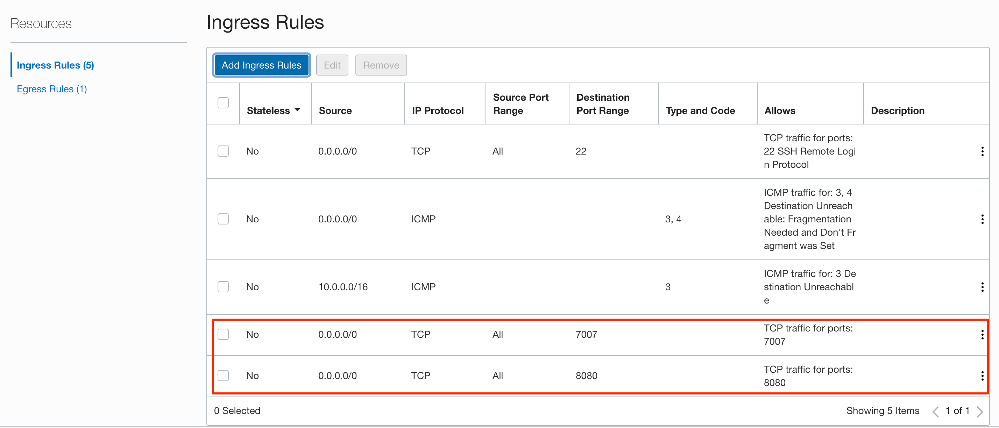

6. To verify the environment is up and running with Zeppelin, replace *your-instance-ip-address* with your instance IP address in the URL.

    ```
    http://your-instance-ip-address:8080
    ```

  

7. To verify the environment is up and running for Graph Visualization component , replace *your-instance-ip-address* with your instance IP address in the URL.

    ```
    http://your-instance-ip-address:7007/ui/
    ```

  

## **STEP 2:** Graph query and analysis in Apache Zeppelin

1. Navigate to the Zeppelin in the browser and click on the "Customer 360" notebook link.

  

2. Run through the notebook paragraphs in sequence.

  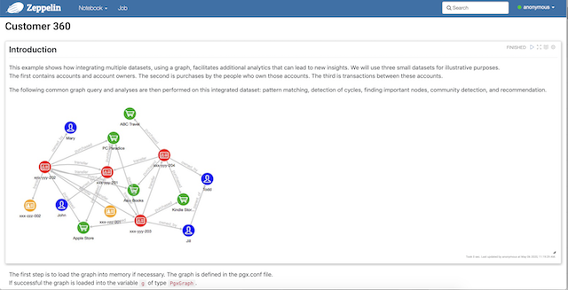

## **STEP 3:** Graph visualization

Now we will use the Graph Visualization component to explore the graph and run some PGQL queries.

1. In URL, replace *your-instance-ip-address* with your instance IP address and open the Graph Viz at:

    ```
    http://your-instance-ip-address:7007/ui/
    ```

  You should see a screen similar to the screenshot below.

  

2. Modify the query to get the first 50 rows, i.e. change LIMIT 10 to LIMIT 50, and click Run.

  You should see a graph similar to the screenshot below.

  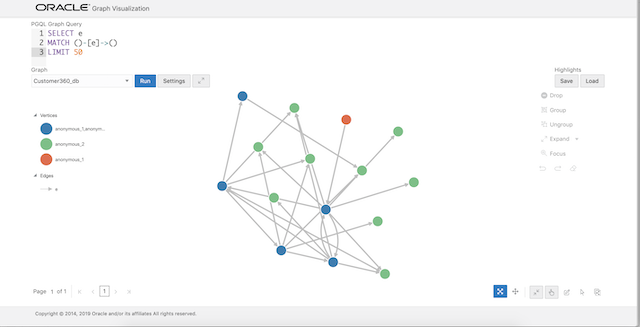

3. Now let's add some labels and other visual context. These are known as highlights.

4. Click [here](https://objectstorage.us-ashburn-1.oraclecloud.com/p/OTVbKy72ORMs1G9b4MxctlEMkR88L3ncOFSFMZYyv57pWmKVlFRCp4MhDqjpCn6n/n/c4u03/b/data-management-library-files/o/highlights.json.zip) to download the highlights.json zip file. Unzip the file and note where it is unzipped.

5. Click on the Load button under Highlights (on the right side of the screen).

6. Browse the `highlights.json` file, click Open to load that.

  

7. The graph should now look like

  

### Pattern matching with PGQL

Now let's run a few PGQL queries.

The [pgql-lang.org](http://pgql-lang.org) site and [specification](http://pgql-land.org/spec/1.2) are the best reference for details and examples. For the purposes of this lab, however, here are minimal basics.

The general structure of a PGQL query is

```
SELECT <select list>
FROM <graph_name> 
MATCH <graph_pattern>
WHERE <condition>
```

PGQL provides a specific construct known as the MATCH clause for matching graph patterns. A graph pattern matches vertices and edges that satisfy the given conditions and constraints.
- `(v)` indicates a vertex variable `v`
- `-` indicates an undirected edge, as in (source)-(dest)
- `->` an outgoing edge from source to destination
- `<-` an incoming edge from destination to source
- `[e]` indicates an edge variable `e`

Let's find accounts that have had an outbound and inbound transfer of over 500 on the same day.

1. The PGQL query for this is:

    ```
    <copy>SELECT * 
    MATCH (FromAcct)-[TransferOut:transfer]->(ToAcct1), (ToAcct2)-[TransferIn:transfer]->(FromAcct)
    WHERE TransferOut.date = TransferIn.date and TransferOut.amount > 500 and TransferIn.amount > 500
    </copy>
    ```

  In the query text above (FromAcct) indicates the source vertex and (ToAcct1) the destination, while [TransferOut:transfer] is the edge connecting them. The [:transfer] specifies that the TransferOut edge has the label 'transfer'. The comma (',') between the two patterns is an AND condition.

  Copy and paste the query into the PGQL Graph Query text input box of the GraphViz application. Click Run.

  The result should look as shown below.

  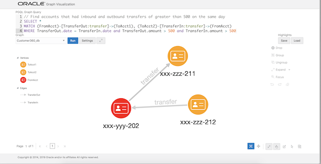

2. The next query finds patterns of transfers to and from the same two accounts, i.e. from A->B and back B->A.

  The PGQL query for this is:

    ```
    <copy>SELECT * 
    MATCH (FromAcct)-[TransferOut:transfer]->(ToAcct)-[TransferIn:transfer]->(FromAcct)
    WHERE TransferOut.date < TransferIn.date 
    </copy>
    ```

  Copy and paste the query into the PGQL Graph Query text input box of the GraphViz application. Click Run.

  The result should look as shown below.

  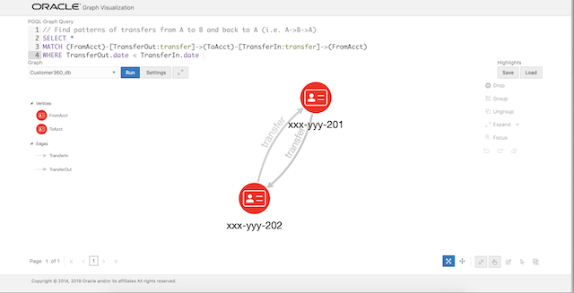

3. Let's add one more account to that query to find a circular transfer pattern between 3 accounts.

  The PGQL query becomes:

    ```
    <copy>SELECT * 
    MATCH (FromAcct)-[TxnAB:transfer]->(ToAcctB)-[TxnBC:transfer]->(ToAcctC)-[TxnCA:transfer]->(FromAcct)
    WHERE TxnAB.date < TxnBC.date and TxnBC.date < TxnCA.date
    </copy>
    ```

  Copy and paste the query into the PGQL Graph Query text input box of the GraphViz application. Click Run.

  The result should look as shown below.

  

## **STEP 4:** Graph query and analysis in JShell

1. If you don't have an open SSH connection to your compute instance, open a terminal window. Navigate to the folder where you created the SSH keys, replace *your-key-name* with your private key name and *your-instance-ip-address* with your compute instance ip address and connect to your compute instance:

    ```
    ssh -i ./<your-key-name> opc@<your-instance-ip-address>
    ```

2. Start the JShell in the graph-client. Copy and paste the following command to do that.

    ```
    <copy>docker exec -it graph-client opg-jshell -b http://graph-server:7007</copy>
    ```

  That starts up a shell that connects to the server instance running on graph-server. Once it starts up you should see the following:

    ```
    For an introduction type: /help intro
    Oracle Graph Server Shell 20.1.0
    PGX server version: 19.4.0 type: SM
    PGX server API version: 3.6.0
    PGQL version: 1.2
    Variables instance, session, and analyst ready to use.
    opg-jshell>
    ```

3. Check to see which graphs have been loaded into the graph server.

    ```
    <copy>session.getGraphs();</copy>
    ```

  The result will be something like: `$1 ==> {Customer360-PG=PgxGraph[name=Customer360-PG,N=15,E=24,created=1589032892327]}`

  If the graph server loaded the graph from files the name will be 'Customer360-PG'. If the graph was loaded from the database it will be named 'Customer360_db'.

4. Now get a handle to that graph so you and query and analyze it in your shell's session. Use the appropriate graph name, i.e. "Customer360-PG" or "Customer360_db".

    ```
    <copy>var g = session.getGraph("Customer360-PG");</copy>
    ```

  Now we can query this graph and run some analyses on it.

### Pattern matching

PGQL Query is convenient for detecting specific patterns.

1. Find accounts that had an inbound and an outbound transfer, of over 500, on the same day. The PGQL query for this is:

    ```
    <copy>g.queryPgql(
      " SELECT a.account_no, a.balance, t1.amount, t2.amount, t1.date " +
      " MATCH (a)<-[t1:transfer]-(a1) " +
      "    , (a)-[t2:transfer]->(a2) " +
      " WHERE t1.date = t2.date " +
      "  AND t1.amount > 500 " +
      "  AND t2.amount > 500 "
    ).print();
    </copy>

    +---------------------------------------------------------------+
    | a.account_no | a.balance | t1.amount | t2.amount | t1.date    |
    +---------------------------------------------------------------+
    | xxx-yyy-202  | 200       | 900       | 850       | 2018-10-06 |
    +---------------------------------------------------------------+
    ```

### Detection of cycles

Next, we use PGQL to find a series of transfers that start and end at the same account such as A to B to A, or A to B to C to A.

1. The first query could be expressed as:

    ```
    <copy>g.queryPgql(
    "  SELECT a1.account_no, t1.date, t1.amount, a2.account_no, t2.date, t2.amount " +
    "  MATCH (a1)-[t1:transfer]->(a2)-[t2:transfer]->(a1) " +
    " WHERE t1.date < t2.date"
    ).print();
    </copy>

    +---------------------------------------------------------------------------------+
    | a1.account_no | t1.date    | t1.amount | a2.account_no | t2.date    | t2.amount |
    +---------------------------------------------------------------------------------+
    | xxx-yyy-201   | 2018-10-05 | 200       | xxx-yyy-202   | 2018-10-10 | 300       |
    +---------------------------------------------------------------------------------+
    ```

  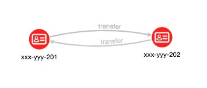

2. The second query just adds one more transfer to the pattern (list) and could be expressed as:

    ```
    <copy>g.queryPgql(
    "  SELECT a1.account_no, t1.amount, a2.account_no, t2.amount " +
    "       , a3.account_no, t3.amount " + 
    "  MATCH (a1)-[t1:transfer]->(a2)-[t2:transfer]->(a3)-[t3:transfer]->(a1) " +
    "  WHERE t1.date < t2.date " +
    "    AND t2.date < t3.date "
    ).print();
    </copy>

    +-----------------------------------------------------------------------------------+
    | a1.account_no | t1.amount | a2.account_no | t2.amount | a3.account_no | t3.amount |
    +-----------------------------------------------------------------------------------+
    | xxx-yyy-201   | 500       | xxx-yyy-203   | 400       | xxx-yyy-204   | 300       |
    +-----------------------------------------------------------------------------------+
    ```

  

### Influential accounts

1. Filter customers from the graph. (cf. [Filter Expressions](https://docs.oracle.com/cd/E56133_01/latest/prog-guides/filter.html))

    ```
    <copy>var sg = g.filter(new EdgeFilter("edge.label()='transfer'")); </copy>
    ```

2. Run [pagerank](https://docs.oracle.com/cd/E56133_01/latest/reference/analytics/algorithms/pagerank.html) algorithm.

    ```
    <copy>analyst.pagerank(sg); </copy>
    ```

3. Show the result.

    ```
    <copy>sg.queryPgql(
    " SELECT a.account_no, a.pagerank " +
    " MATCH (a) " + 
    " ORDER BY a.pagerank DESC "
    ).print();
    </copy>

    +-------------------------------------+
    | a.account_no | a.pagerank           |
    +-------------------------------------+
    | xxx-yyy-201  | 0.18012007557258927  |
    | xxx-yyy-204  | 0.1412461615467829   |
    | xxx-yyy-203  | 0.1365633635065475   |
    | xxx-yyy-202  | 0.12293884324085073  |
    | xxx-zzz-002  | 0.05987452026569676  |
    | xxx-zzz-001  | 0.025000000000000005 |
    +-------------------------------------+
    ```

### Community detection

Let's find which subsets of accounts from communities. That is, there are more transfers among accounts in the same subset than there are between those and accounts in another subset. We'll use the built-in weekly / strongly connected components algorithm.

The first step is to create a subgraph that only has the accounts and the transfers among them. This is done by creating and applying an edge filter (for edges with the table "transfer') to the graph.

1. Filter customers from the graph.

    ```
    <copy>var sg = g.filter(new EdgeFilter("edge.label()='transfer'")); </copy>
    ```

2. [Weakly connected component](https://docs.oracle.com/cd/E56133_01/latest/reference/analytics/algorithms/wcc.html) algorithm detects only one partition.

    ```
    <copy>
    var result = analyst.wcc(sg);
    // The partition value is stored in a property named wcc
    sg.queryPgql(
    " SELECT a.wcc, COUNT(a) MATCH (a) GROUP BY a.wcc"
    ).print();
    </copy>
    ```

3. Run a strongly connected components algorithm, SCC Kosaraju, instead.

    [Strongly connected component](https://docs.oracle.com/cd/E56133_01/latest/reference//analytics/algorithms/scc.html) algorithm detects three partitions.

    ```
    <copy>
    result = analyst.sccKosaraju(sg);
    // List partitions and number of vertices in each
    sg.queryPgql(
    " SELECT a.scc_kosaraju, COUNT(a) MATCH (a) GROUP BY a.scc_kosaraju"
    ).print();
    </copy>

    +---------------------------+  
    | a.scc_kosaraju | COUNT(a) |  
    +---------------------------+  
    | 1              | 4        |  
    | 2              | 1        |  
    | 0              | 1        |  
    +---------------------------+  
    ```

4. List the other accounts in the same connected component (partition) as John's account.

  The partition (or component) id is added as a property named scc_kosaraju for use in PGQL queries.

    ```
    <copy>
    sg.queryPgql(
    " SELECT a.scc_kosaraju as component, COUNT(a.account_no), MAX(a.account_no) " +
    " MATCH (a) " +
    " GROUP BY component " +
    " ORDER BY component"
    ).print();
    </copy>

    +-------------------------------------------------------+  
    | component   | COUNT(a.account_no) | MAX(a.account_no) |  
    +-------------------------------------------------------+  
    | 0           | 1                   | xxx-zzz-001       |  
    | 1           | 4                   | xxx-yyy-204       |  
    | 2           | 1                   | xxx-zzz-002       |  
    +-------------------------------------------------------+  
    ```

  

### Recommendation

Lastly, let's use Personalized PageRank to find stores that John may purchase from given that people he is connected to have made purchases from those stores.

1. Filter customers and merchants from the graph.

    ```
    <copy>sg = g.filter(new EdgeFilter("edge.label()='purchased'"));</copy>
    ```

2. Add reverse edges.

    ```
    <copy>
    var cs = sg.&lt;Integer&gt;createChangeSet();
    var rs = sg.queryPgql("SELECT id(a), id(x) MATCH (a)-[]->(x)");
    for (var r : rs) {
      var e = cs.addEdge(r.getInteger(2),r.getInteger(1)).setLabel("purchased_by");
    }
    </copy>
    ```

3. Build the graph with the reverse edges. Query it to verify.

    ```
    <copy>
    sg = cs.build();
    sg.queryPgql(
    " SELECT ID(r), x.name, LABEL(r), a.account_no" +
    "  MATCH (x)-[r:purchased_by]->(a)" +
    " LIMIT 3"
    ).print();
    </copy>

    +---------------------------------------------------+
    | ID(r) | x.name      | LABEL(r)     | a.account_no |
    +---------------------------------------------------+
    | 11    | Apple Store | purchased_by | xxx-yyy-201  |
    | 13    | Apple Store | purchased_by | xxx-yyy-202  |
    | 16    | Apple Store | purchased_by | xxx-yyy-203  |
    +---------------------------------------------------+
    ```

  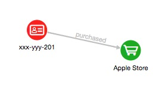


  

4. We will focus on the account no. xxx-yyy-201 (John's account) and run PPR.

  Create a vertex set of the vertices used in personalizing the ranking.

    ```
    <copy>
    var vertexSet = sg.&lt;Integer&gt;createVertexSet();
    vertexSet.addAll(201);
    </copy>
    ```

5. Then compute the Personalized PageRank.

    ```
    <copy>

    var ppr = analyst.personalizedPagerank(sg, vertexSet);
    </copy>
    ```

6. Show the result. (cf. [EXISTS and NOT EXISTS subqueries](https://pgql-lang.org/spec/1.3/#exists-and-not-exists-subqueriess))

    ```
    <copy>
    sg.queryPgql(
    "  SELECT ID(x), x.name, x.pagerank " +
    "  MATCH (x) " +
    "  WHERE x.type = 'merchant' " +
    "    AND NOT EXISTS ( " +
    "     SELECT * " +
    "     MATCH (x)-[:purchased_by]->(a) " +
    "     WHERE ID(a) = 201 " +
    "    ) " +
    "  ORDER BY x.pagerank DESC"
    ).print();
    </copy>

    +--------------------------------------------+
    | ID(x) | x.name       | x.pagerank          |
    +--------------------------------------------+
    | m03   | Kindle Store | 0.04932640133302745 |
    | m04   | Asia Books   | 0.04932640133302745 |
    | m05   | ABC Travel   | 0.01565535511504672 |
    +--------------------------------------------+
    ```

### Exit JShell

1. To exit JShell, run the below exit command.

    ```
    <copy>
    /exit
    </copy>
    ```

You may now proceed to the next lab.

## Acknowledgements ##

* **Author** - Jayant Sharma, Product Manager
* **Contributors** - Ryota Yamanaka, Anoosha Pilli, Product Manager
* **Last Updated By/Date** - Anoosha Pilli, Database Product Management, October 2020

## Need Help?
Please submit feedback or ask for help using our [LiveLabs Support Forum](https://community.oracle.com/tech/developers/categories/oracle-graph). Please click the **Log In** button and login using your Oracle Account. Click the **Ask A Question** button to the left to start a *New Discussion* or *Ask a Question*.  Please include your workshop name and lab name.  You can also include screenshots and attach files.  Engage directly with the author of the workshop.

If you do not have an Oracle Account, click [here](https://profile.oracle.com/myprofile/account/create-account.jspx) to create one.
