# Provision the Database System on OCI

## Introduction
In this lab you will provision a Database system on OCI to act as the standby database in the cloud. You will create a different VCN in different region from the on-premise database, and provision a DBCS in that VCN. 

Estimated Lab Time: 30 minutes(LVM) or 60 minutes(ASM)

### Objectives

-   Create the VCN
-   Create the DB system

### Prerequisites

This lab assumes you have already completed the following:
- An Oracle Free Tier, Always Free, Paid or LiveLabs Cloud Account
- Create a SSH Keys pair

## **Step 1:** Create the VCN

1. Open the navigation menu. Under **Core Infrastructure**, go to **Networking** and click **Virtual Cloud Networks**.

   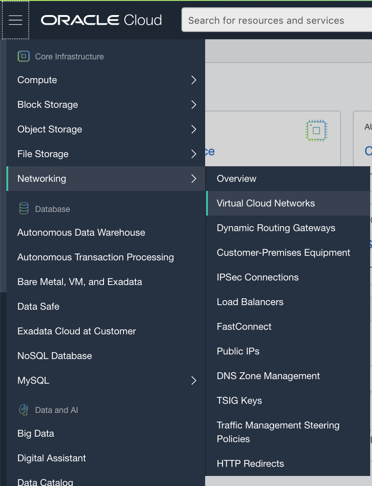

2. Click **Start VCN Wizard**.

   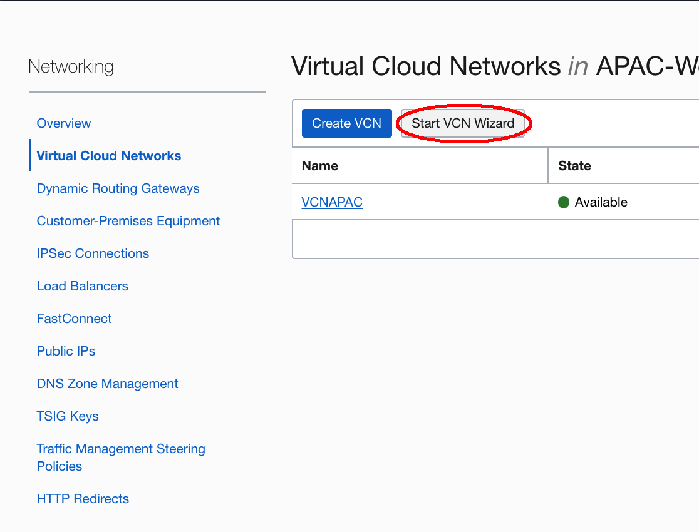

3. Select **VCN with Internet Connectivity**, and then click **Start VNC Wizard**. 

   

4. Enter a unique VCN Name and accept the following default value:

    - VCN CIDR BLOCK: 10.0.0.0/16
    - Public Subnet CIDR Block: 10.0.0.0/24
    - Private Subnet CIDR Block: 10.0.1.0/24

    

5. Click **Next**, review the VCN and click **Create**. After success created, click **Close**.

6. In the VCN detail page, click **Security Lists** under Resources, then click the **Default Security List** link.

   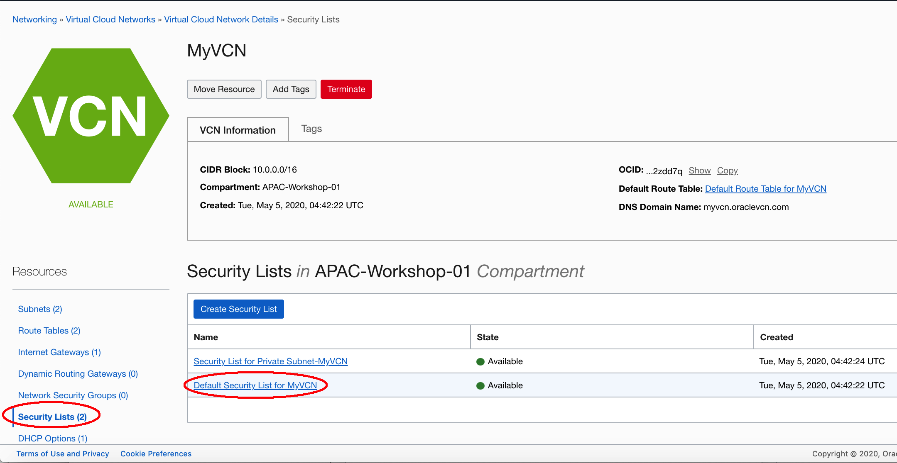

7. Click **Add Ingress Rules**.

   

8. Add an Ingress Rule to allow TCP traffic for port 1521, 

   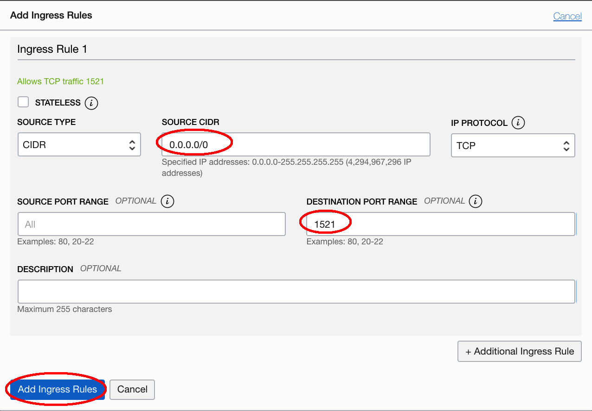

## **Step 2:** Create the DB system

1. Open the navigation menu. Under **Database**, click **Bare Metal, VM, and Exadata**.

2. Click **Create DB System**.

3. On the **Create DB System** page, provide the basic information for the DB system:

    - **Select a compartment:** use the compartment which assign to you.
    - **Name your DB system:** enter a unique name of your DB system
    - **Select an availability domain:** The **availability domain** in which the DB system resides.
    - **Select a shape type:** Choose **Virtual Machine**
    - **Select a shape:** change the Shape to **VM.Stanard2.1**

    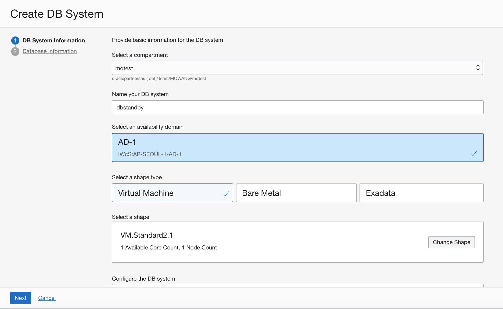

   

4. In the **Configure the DB system** section, specify the following:

    - **Total node count:** 1
    - **Oracle Database software edition:** choose **Enterprise Extreme Performance**.
    - **Storage Management Software:**  choose the storage management software according to your requirements. You will do a different **Lab 5** based on your choice. Select **Oracle Grid Infrastructure** to use Oracle Automatic Storage Management (recommended for production workloads). Select **Logical Volume Manager** to quickly provision your DB system using Logical Volume Manager storage management software.  ASM takes about 60 minutes, and LVM takes about 30 minutes.

    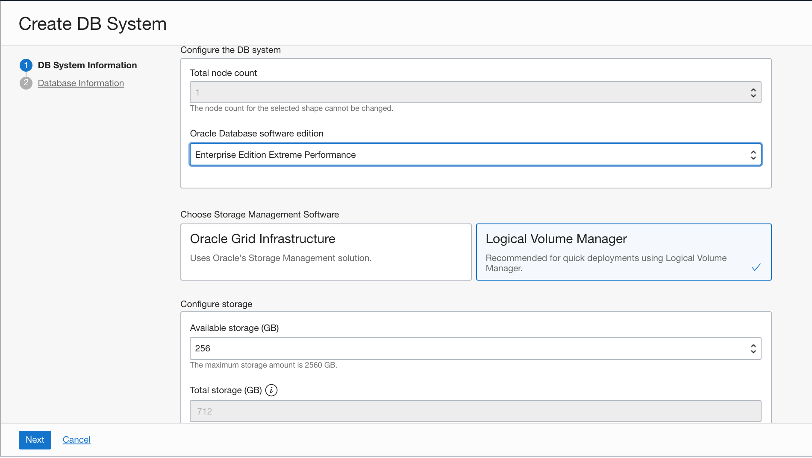

    - Accept the default storage.
    - Upload the public SSH Keys file which you create before.

    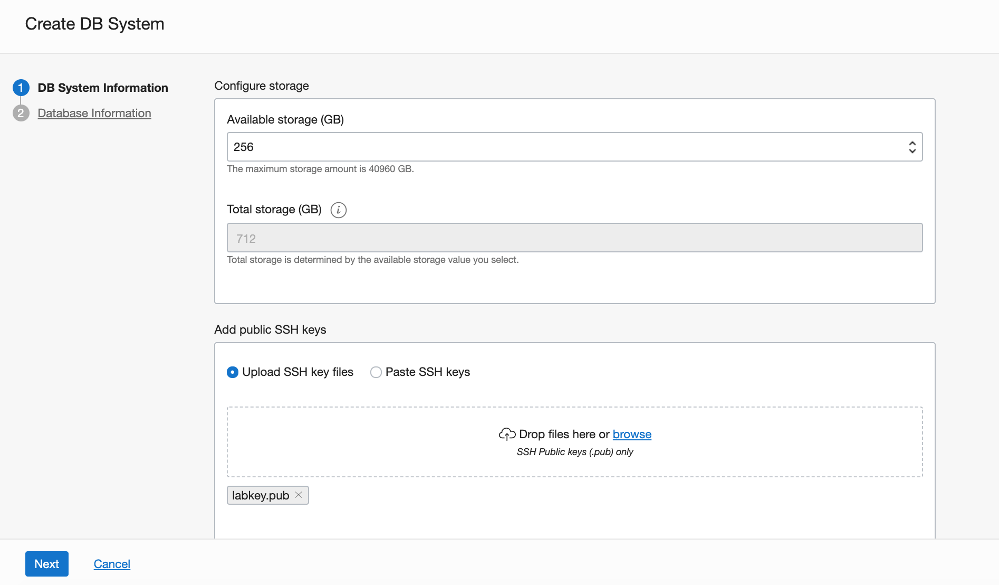

    - License type: choose **Bring Your Own License**.
    - Choose the VCN you created before and choose the **Public Subnet**, enter the Hostname prefix.

    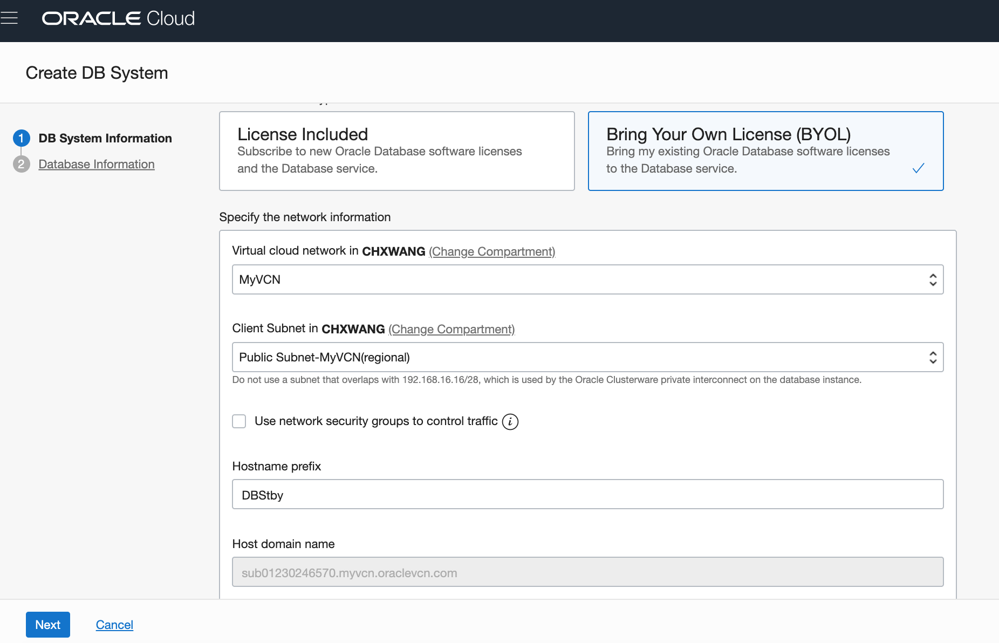

    - click **Next**

5. In the **Database Information** page, Specify the following:

    - **Database name:** **ORCL**, same as the on premise database

    - Click **Change Database Image**

       

    - Turn on the **Display all available versions**, select the Database version: 19.7.0.0, same version as the on premise database

       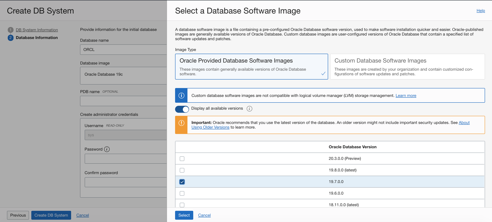

    - PDB name: orclpdb

    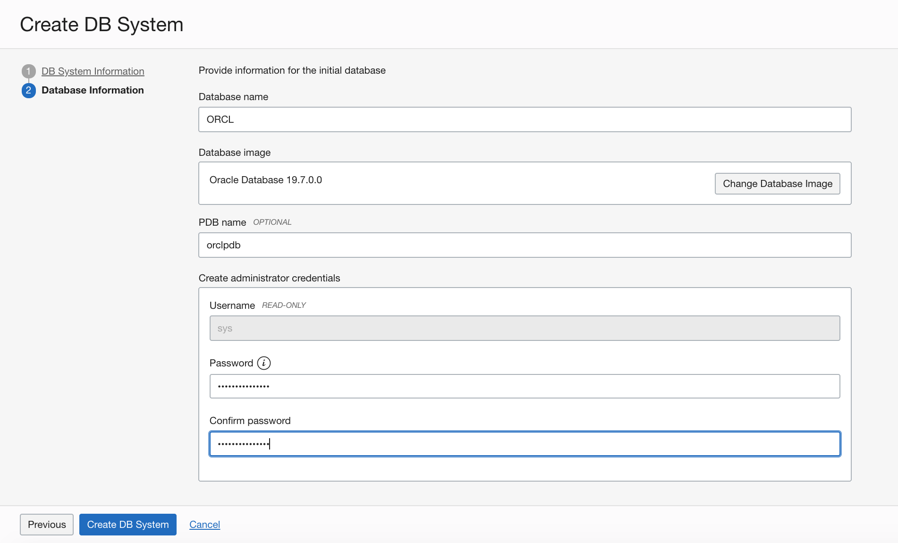

    - Enter a strong password
    - Workload type: OLTP

    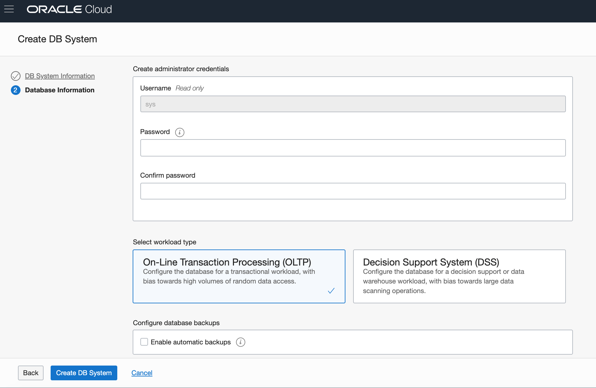

    - Click the **Create DB System**.

6. If you choose ASM as the storage manage, wait about 60 minutes. If you choose LVM as the storage manage, wait about 15 minutes. Then the Database is ready.

   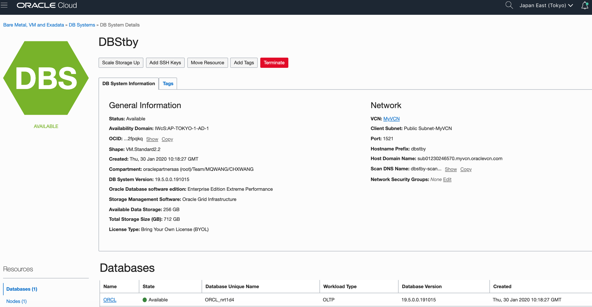

7. Write down your Database Unique Name ie: `ORCL_nrt1d4`.
8. Click the **Nodes**,  write down the public ip address of the database host node and the Host Domain Name.

   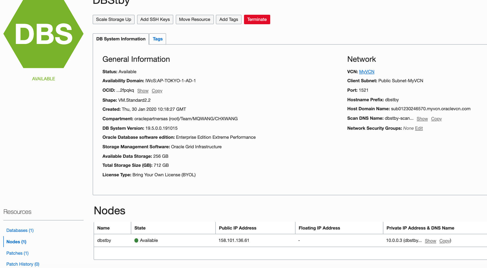

You have completed the Database Cloud provisioning steps.  It will be used as your standby database.

You may proceed to the next lab.

## Acknowledgements
* **Author** - Minqiao Wang, DB Product Management, Oct 2020
* **Contributors** -  <Name, Group> -- optional
* **Last Updated By/Date** - Minqiao Wang, DB Product Management, Oct 2020
* **Workshop (or Lab) Expiry Date** - <Month Year> 

## Need Help?
Please submit feedback or ask for help using our [LiveLabs Support Forum](https://community.oracle.com/tech/developers/categories/livelabsdiscussions). Please click the **Log In** button and login using your Oracle Account. Click the **Ask A Question** button to the left to start a *New Discussion* or *Ask a Question*.  Please include your workshop name and lab name.  You can also include screenshots and attach files.  Engage directly with the author of the workshop.

If you do not have an Oracle Account, click [here](https://profile.oracle.com/myprofile/account/create-account.jspx) to create one.