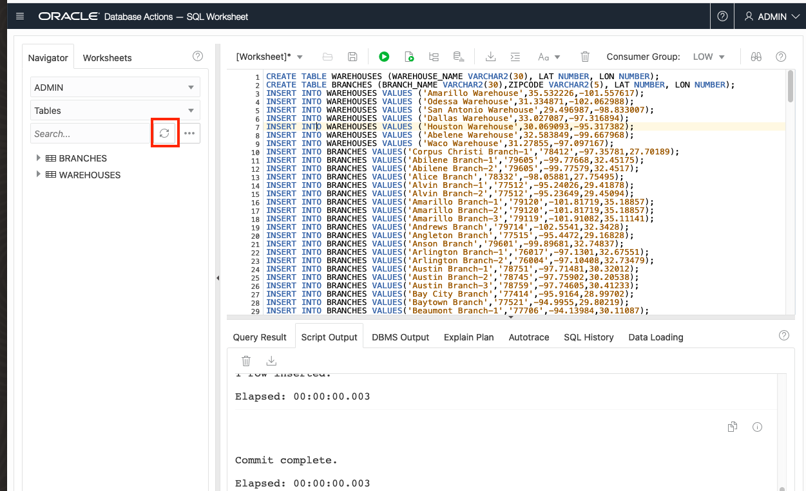

# Create Sample Data

## Introduction

This lab walks you through the steps to create spatial data in Oracle Database.  

Estimated Lab Time: n minutes

### About Product/Technology
Enter background information here..

### Objectives

In this lab, you will:
* Create tables with a geometry column
* Populate geometries
* Create spatial nmetadata and indexes

### Prerequisites


* An Oracle Free Tier, Always Free, Paid or LiveLabs Cloud Account
* Item no 2 with url - [URL Text](https://www.oracle.com).

<!--  *This is the "fold" - below items are collapsed by default*  -->

## **STEP 1**: Create tables with coordinates

explanation .....

1. Download the SQL script [here](files/create-sample-data.sql).


2. Copy/paste/run the script in SQL Developer Web


3. Refresh listing to see tables

    


## **STEP 2:** Create geometries from coordinates

explanation...

1. Add geometry columns:

    ```
    <copy> 
    alter table warehouses add (geometry sdo_geometry);
    alter table branches add (geometry sdo_geometry);
    </copy>
    ```

2. Populate geometry columns:

    ```
    <copy> 
    update warehouses set geometry = 
      sdo_geometry(
        2001,
        4326,
        sdo_point_type(lon, lat, null),
        null,
        null
    );

    update branches set geometry = 
      sdo_geometry(
        2001,
        4326,
        sdo_point_type(lon, lat, null),
        null,
        null
    );
    </copy>
    ```


## **STEP 3**: Create table with polygon

description...

1. Create table and insert row
   
	```
    <copy>
    create table coastal_zone (zone_id number, geometry sdo_geometry);

    insert into coastal_zone values ( 1,
      sdo_geometry(
      2003, 
      4326, 
      null, 
      mdsys.sdo_elem_info_array(1, 1003, 1), 
       mdsys.sdo_ordinate_array(
      -93.719934, 30.210638, 
      -95.422592, 29.773714, 
      -95.059698, 29.322204, 
      -96.013892, 28.787021, 
      -96.660964, 28.925638, 
      -97.528688, 28.042050, 
      -97.858501, 27.447461, 
      -97.497364, 25.880056, 
      -96.977826, 25.969716, 
      -97.211445, 27.054605, 
      -96.870226, 27.816077, 
      -93.794290, 29.535729, 
      -93.719934, 30.210638)) 
      );
  
  </copy>
  ```

## **STEP 4**: Add spatial metadata and indexes 

1. Add spatial metadata:

    ```
    <copy> 
    insert into user_sdo_geom_metadata values (
    'WAREHOUSES',
    'GEOMETRY',
    mdsys.sdo_dim_array(
      mdsys.sdo_dim_element('x', -180, 180, 0.05), 
      mdsys.sdo_dim_element('y', -90, 90, 0.05)),
    4326
    );

    insert into user_sdo_geom_metadata values (
    'BRANCHES',
    'GEOMETRY',
    mdsys.sdo_dim_array(
      mdsys.sdo_dim_element('x', -180, 180, 0.05), 
      mdsys.sdo_dim_element('y', -90, 90, 0.05)),
    4326
    );

    insert into user_sdo_geom_metadata values (
    'COASTAL_ZONE',
    'GEOMETRY',
    mdsys.sdo_dim_array(
      mdsys.sdo_dim_element('x', -180, 180, 0.05), 
      mdsys.sdo_dim_element('y', -90, 90, 0.05)),
    4326
    );
    </copy>
    ```

2. Create spatial indexes:

    ```
    <copy> 
    create index warehouses_sidx
    on warehouses(geometry)
    indextype is mdsys.spatial_index;

    create index branches_sidx
    on branches(geometry)
    indextype is mdsys.spatial_index;

    create index coastal_zone_sidx
    on coastal_zone(geometry)
    indextype is mdsys.spatial_index;
    </copy>
    ```


*At the conclusion of the lab add this statement:*
You may proceed to the next lab.

## Learn More

*(optional - include links to docs, white papers, blogs, etc)*

* [URL text 1](http://docs.oracle.com)
* [URL text 2](http://docs.oracle.com)

## Acknowledgements
* **Author** - <Name, Title, Group>
* **Contributors** -  <Name, Group> -- optional
* **Last Updated By/Date** - <Name, Group, Month Year>
* **Workshop (or Lab) Expiry Date** - <Month Year> -- optional, use this when you are using a Pre-Authorized Request (PAR) URL to an object in Oracle Object Store.

## Need Help?
Please submit feedback or ask for help using our [LiveLabs Support Forum](https://community.oracle.com/tech/developers/categories/livelabsdiscussions). Please click the **Log In** button and login using your Oracle Account. Click the **Ask A Question** button to the left to start a *New Discussion* or *Ask a Question*.  Please include your workshop name and lab name.  You can also include screenshots and attach files.  Engage directly with the author of the workshop.

If you do not have an Oracle Account, click [here](https://profile.oracle.com/myprofile/account/create-account.jspx) to create one.
