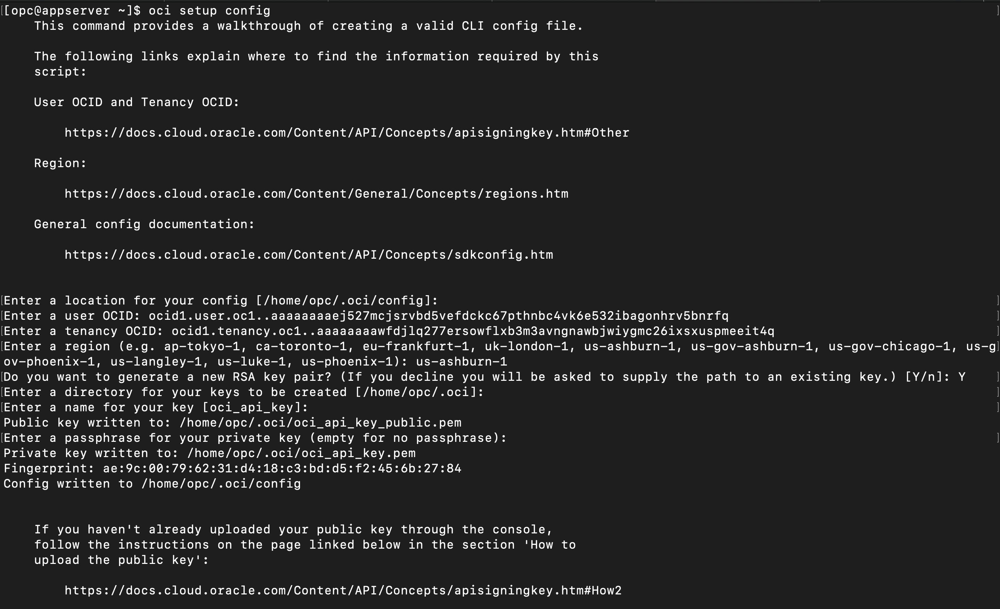
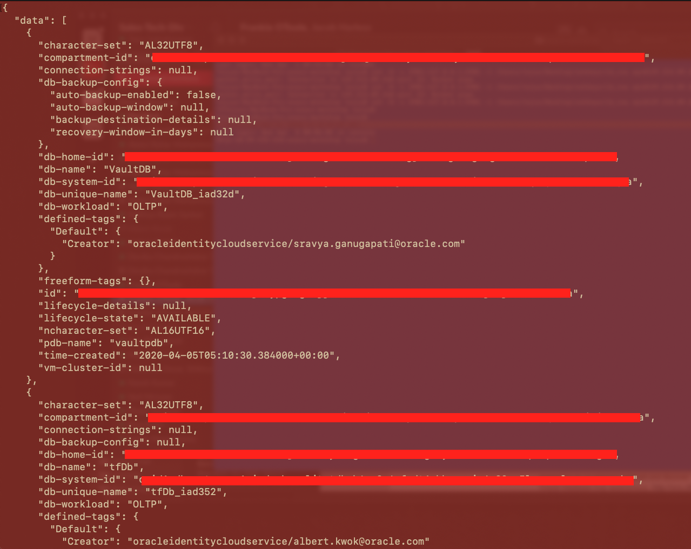
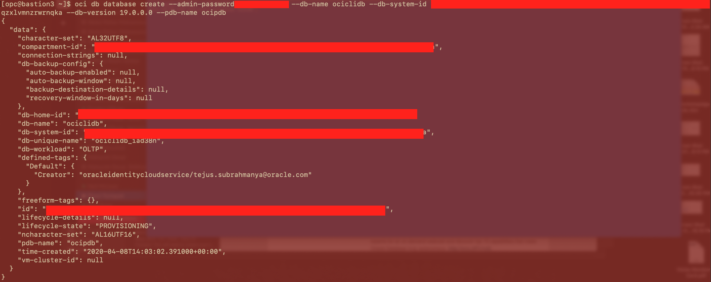

## Introduction

The Oracle Cloud Infrastructure Command Line Interface, OCI CLI, is a small footprint tool that you can use on its own or with the Console to complete Oracle Cloud Infrastructure tasks. The CLI provides the same core functionality as the Console, plus additional commands. Some of these, such as the ability to run scripts, extend the Console's functionality.

This CLI and sample is dual-licensed under the Universal Permissive License 1.0 and the Apache License 2.0; third-party content is separately licensed as described in the code.

The CLI is built on Python (version 2.7.5 or later), running on Mac, Windows, or Linux. The Python code makes calls to Oracle Cloud Infrastructure APIs to provide the functionality implemented for the various services. These are REST APIs that use HTTPS requests and responses. For more information, see [About the API](https://docs.cloud.oracle.com/iaas/Content/API/Concepts/usingapi.htm)

This lab walks you through some examples using the OCI CLI for Exadata Cloud Service.

### **See an issue?**
Please submit feedback using this [form](https://apexapps.oracle.com/pls/apex/f?p=133:1:::::P1_FEEDBACK:1). Please include the *workshop name*, *lab* and *step* in your request.  If you don't see the workshop name listed, please enter it manually. If you would like for us to follow up with you, enter your email in the *Feedback Comments* section.
Watch the video below for an overview on how to use OCI CLI commands to work with ExaCS

<div style="max-width:768px"><div style="position:relative;padding-bottom:56.25%"><iframe id="kaltura_player" src="https://cdnapisec.kaltura.com/p/2171811/sp/217181100/embedIframeJs/uiconf_id/35965902/partner_id/2171811?iframeembed=true&playerId=kaltura_player&entry_id=1_c3lmxz1b&flashvars[streamerType]=auto&amp;flashvars[localizationCode]=en&amp;flashvars[leadWithHTML5]=true&amp;flashvars[sideBarContainer.plugin]=true&amp;flashvars[sideBarContainer.position]=left&amp;flashvars[sideBarContainer.clickToClose]=true&amp;flashvars[chapters.plugin]=true&amp;flashvars[chapters.layout]=vertical&amp;flashvars[chapters.thumbnailRotator]=false&amp;flashvars[streamSelector.plugin]=true&amp;flashvars[EmbedPlayer.SpinnerTarget]=videoHolder&amp;flashvars[dualScreen.plugin]=true&amp;flashvars[hotspots.plugin]=1&amp;flashvars[Kaltura.addCrossoriginToIframe]=true&amp;&wid=1_hygolyr9" width="768" height="432" allowfullscreen webkitallowfullscreen mozAllowFullScreen allow="autoplay *; fullscreen *; encrypted-media *" sandbox="allow-forms allow-same-origin allow-scripts allow-top-navigation allow-pointer-lock allow-popups allow-modals allow-orientation-lock allow-popups-to-escape-sandbox allow-presentation allow-top-navigation-by-user-activation" frameborder="0" title="Kaltura Player" style="position:absolute;top:0;left:0;width:100%;height:100%"></iframe></div></div>

## Objectives

As a developer, DBA or DevOps user,

- Create/Destroy your Exadata Cloud Service database instances using a command line interface
- Interact with Oracle Cloud Infrastructure resource using a CLI instead of a web console


## Required Artifacts

- An Oracle Cloud Infrastructure account with privileges to create Exadata Cloud Service databases

- A pre-provisioned instance of Oracle Cloud Developer Image from the OCI marketplace


Note: 
- The OCI Marketplace 'Developer Cloud Image' is pre-configured with many client tools and drivers including OCI command line interface.
- To deploy a dev client compute image, refer to [Lab 4](?lab=lab-4-configure-development-system-for-use)


## Steps

### **STEP 1: Connect to development client instance and verify OCI CLI version**

To ensure OCI-CLI installed is the correct version needed for Exadata Cloud Service database, lets ssh into the dev client host and check version
    
```
<copy>ssh -i <ssh_key> opc@<ip address>
oci --version</copy>
```
**The OCI CLI version needs to be 2.5.14 or higher to support Exadata Cloud Service database commands. Refer to the [OCI CLI Github Change Log](https://github.com/oracle/oci-cli/blob/master/CHANGELOG.rst#2514---2019-06-11) for version details**


### **STEP 2: Configure OCI CLI**

- This step describes the required configuration for the CLI and includes optional configurations that enable you to extend CLI functionality.

- Before using the CLI, you have to create a config file that contains the required credentials for working with your Oracle Cloud Infrastructure account. You can create this file using a setup dialog or manually, using a text editor.

- To have the CLI walk you through the first-time setup process, step by step, use

```
<copy>oci setup config</copy>
```

- The command prompts you for the information required for the config file and the API public/private keys. The setup dialog generates an API key pair and creates the config file.




- Once you run the above command, you will need to enter the following:

    - **Enter a location for your config [/home/opc/.oci/config]**: Press Return key
    - **Enter a user OCID**: This is located on your user information page in OCI console

    To access your user OCID, click on the user icon on the top right of the page and click on your username from the menu
    

    Copy the user OCID from the user details page

   

    - **Enter a tenancy OCID**: Similarly, for the tenancy, click on the tenancy name in the top right menu as shown above and copy the tenancy OCID
    
   

    - **Enter a region (e.g. eu-frankfurt-1, uk-london-1, us-ashburn-1, us-phoenix-1)**: Select a region

    - **Do you want to generate a new RSA key pair? (If you decline you will be asked to supply the path to an existing key.) [Y/n]**: Y
    - **Enter a directory for your keys to be created [/home/opc/.oci]**: Press Return key
    - **Enter a name for your key [oci_api_key]**: Press Return key
    - **Enter a passphrase for your private key (empty for no passphrase)**: Press Return key
    
### **STEP 3: Add public key to Oracle Cloud Infrastructure**

- Now that you have a private / public key combo , you must add it to OCI Console:

Add public key to OCI User setting

- Open Terminal and navigate to folder containing **oci_api_key_public.pem**. Copy the public key.

```
<copy>cat oci_api_key_public.pem</copy>
```


- Login to your OCI console and click on Menu and select Identity and Users. Select a User and navigate to User Detail page.

- Click on Add Public Key under API Keys section.


- Paste Public key which you copied from CLI in Add Public Key


Once you add the key run the below command to autocomplete OCI setup.

```
<copy>oci setup autocomplete</copy>
```


### **STEP 4: Interacting with Oracle Exadata Cloud Service Database**

Now that you have setup OCI CLI, let us now look at examples of using Exadata Cloud Service Database. 

Let's start with a simpler command to get details on your Exadata Cloud Service database instance.

#### Listing Database

Open your command line interface and run the following command to get list of database in your Exadata Cloud Service

```
<copy>oci db database list --db-system-id [OCID] --compartment-id [OCID]</copy>
```

#### NOTE: You can get your --db-system-id and --compartment-id in OCI console

You are expected to see the following output in the command line interface




#### Creating Database

To create a database in your Exadata Cloud Service you will need some information handy such as the OCID of the Database System ID. Once you have that ready, open your command line interface and run the following command to create a Database in your Exadata Cloud Service infrastructure. 

```
<copy>oci db database create --admin-password [text] --db-name [text] --db-system-id [OCID] --db-version [text] --pdb-name [text]</copy>
```

You are expected to see the following output in the command line interface




#### Deleting Database

Open your command line interface and run the following command to delete a Database in your Exadata Cloud Service infrastructure

```
<copy>oci db database delete --database-id [OCID]</copy>
```

#### Bonus Step: In similar way you can try the following examples

These are a handful of examples on using the OCI CLI REST interface to work with databases in your Exadata Cloud Service infrastructure. For a complete command reference,check out OCI documentation [here](https://docs.cloud.oracle.com/en-us/iaas/tools/oci-cli/2.9.9/oci_cli_docs/cmdref/db/database.html).
