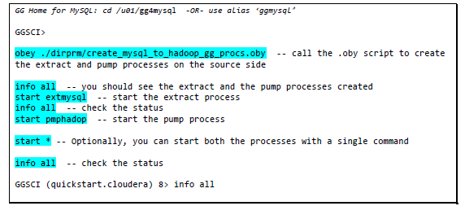
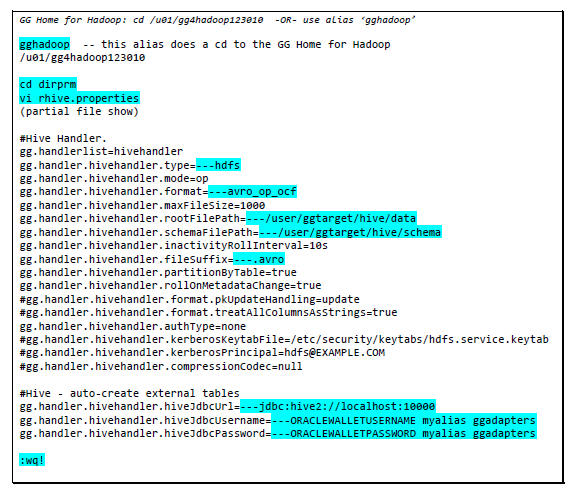
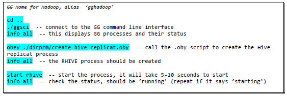
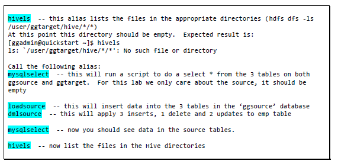
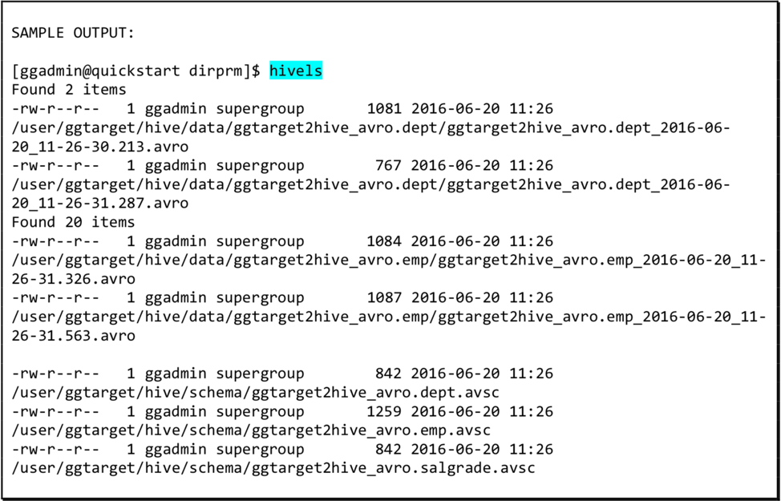
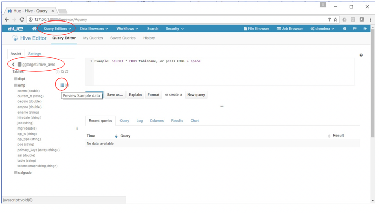
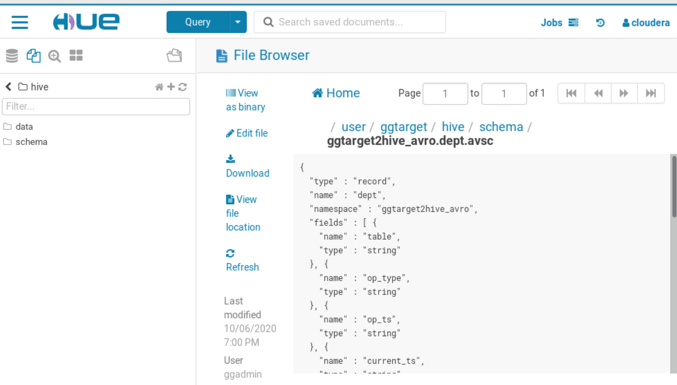

#  MySQL --> Hive (Avro format)

## Introduction

In this lab we will load data in MySQL database ‘ggsource’, GG extract process ‘extmysql’ will capture the changes from MySQL’s binary logs and wrote them to the local trail file. The pump process ‘pmphadop’ will route the data from the local trail (on the source) to the remote trail (on the target). The replicatprocess ‘rhive’ will read the trail file, create the Hive tables, write the data and the schema files (avsc) to the HDFS target directory for Hive: /user/ggtarget/hive/data/* and /user/ggtarget/hive/schema/*

*Estimated Lab Time*:  60 minutes

#### Lab Architecture

  

### Objectives
- Explore GoldenGate replication from **MySQL to Hive**

### Prerequisites
* An Oracle Free Tier, Always Free, Paid or LiveLabs Cloud Account
* Lab: Installation
  
## STEPS: 
For the Lab terminal session:

use ggadmin/oracle to log into your new Lab4
````
<copy>$ ssh opc@xxx.xxx.xx.xx</copy>
````
````
<copy>sudo su -ggadmin</copy>
````
Setting up the Environment For MySQL.
    
If already at a Unix prompt, you can access the Lab Menu by typing the alias ‘labmenu’

**Step1:** The following Lab Menu will be displayed, select **R** to reset the lab environment, then select option **4**

  

**2:** The above step will copy the GoldenGate configuration files to the GG Home directories, under ./dirprm. The workshop facilitator will review the content of each of these files to understand how GoldenGate is being configured.

Optionally view these files, same as in previous lab:

````
cd /u01/gg4mysql

````
````
<copy>view /u01/gg4mysql/dirprm/create_mysql_to_hadoop_gg_procs.oby</copy>
````
````
<copy>cd /u01/gg4mysql/dirprm</copy>
````
````
<copy>view /u01/gg4mysql/dirprm/mgr.prm</copy>
````
````
<copy>view /u01/gg4mysql/dirprm/extmysql.prm</copy>
````
````
<copy>view  /u01/gg4mysql/dirprm/pmpmysql.prm</copy>
````
````
<copy>cd /u01/gg4hadoop/dirprm</copy>
````
````
<copy>view /u01/gg4hadoop123010/dirprm/create_hive_replicat.oby</copy>
````
````
<copy>view /u01/gg4hadoop123010/dirprm/rhive.prm</copy>
````
````
<copy>view /u01/gg4hadoop123010/dirprm/rhive.properties</copy>
````
**3:** Start the GG manager process on both the source and target. **Start two terminal sessions**, connect to ggadmin/oracle (then click **Q** to get to a prompt). Keep these sessions open for the rest of this lab.

Open Terminal Session1 / 
````
<copy>sudo su -ggadmin</copy>
````
Open Terminal Session2 / 

````
<copy>sudo su -ggadmin</copy>  
````
**4:** In the first session, go to the **GG Home for MySQL**, and start the manager process. You can cd to the directory:

 

````
 <copy> pwd</copy>
````
````
<copy>./ggsci</copy>
````
````
<copy> info all</copy>	 
````
````
<copy> start mgr</copy>		
````
````
<copy> info all</copy>
````
**5:** In the second session, go to the **GG Home for Hadoop**, and start the manager process. You can either cd to the directory, or call the alias gghadoop:

  

````
<copy> cd /u01/gg4hadoop123010</copy>
````
````
<copy>./ggsci</copy>
````
````
<copy> info all</copy>	 
````
````
<copy> start mgr</copy>		
````
````
<copy> info all</copy>	 
````
````
<copy> exit</copy>
````
**6:** In the **GG for MySQL ggsci session**, we will create and start the GG extract process:

  
  

````
<copy> obey ./dirprm/create_mysql_to_hadoop_gg_procs.oby</copy>
````
````
<copy> info all</copy>	
 ````
 ````
<copy> start extmysql</copy>	
````
````
<copy> info all</copy>	
````
````
<copy> start pmphadop</copy>	
````
````
<copy> start *</copy> 
````
````
<copy>./ggsci</copy>
````
````
<copy> info all</copy>
````

**7:** Now that the source side is setup, let us configure GG on the target side (Hive Avro format).

**8:** In the **GG for Hadoop session**, you will need to modify the Hive properties by removing the ‘---‘ from the highlighted values:

  

````
<copy>cd /u01/gg4hadoop123010</copy>
````
````
<copy> cd dirprm</copy>
````
````
<copy> vi rhive.properties</copy>
````

**Remove "--" below**

````
<copy> ---hdfs</copy>
````
````
<copy> ---avro_op_ocf</copy>
````
````
<copy> ---/user/ggtarget/hive/data</copy>
````
````
<copy> ---/user/ggtarget/hive/schema</copy>
````
````
<copy> ---.avro</copy>
````
````
<copy> ---jdbc:hive2://localhost:10000</copy>
````
````
<copy> ---ORACLEWALLETUSERNAME myalias</copy>
````
````
<copy> ---ORACLEWALLETPASSWORD myalias</copy>
````
````
<copy>:wq!</copy>
````
**9:** Now create and start the Hive replicat process:

  

````
<copy> cd .. </copy>
````
````
<copy>./ggsci</copy>
````
````
 <copy> info all</copy>
````
````
<copy> obey ./dirprm/create_hive_replicat.oby</copy>
````
````
<copy> info all</copy>
````
````
<copy> start rhive</copy>
````
````
<copy> info all</copy>
````


**10:** Now that GG processes have been created and started on both the source and target, let’s take a look at what’s in the Hive directories (schema & data) – they should be empty. Then we’ll load some data on
the MySQL database ‘ggsource’ and GG will extract and write it to the Hive target. GG will create a subdirectory for each table in the base directory /user/ggtarget/hive/data.

**Step11:** **Start a new session**, connect to ggadmin/oracle (then click Q to get to a prompt):

  

````
<copy> hivels</copy>
````
````
<copy> mysqlselect</copy>
````
````
<copy> loadsource</copy>
````
````
<copy> dmlsource</copy>	
````
````
<copy> mysqlselect	</copy>
````
````
<copy> hivels</copy>	
````
**12:** There should be several .avro files in the data directory, and 3 .avsc files in the schema directory. You will notice that a new directory has been created for each table in the data directory.

  


**13:** Starting with GG version 12.2.0.1.1, GG automatically creates the Hive tables with .avsc schema file. Let us take a look at the contents of the tables:

**14:**

Open a Browser window from your local machine: 

HUE allows you to access the data from a URL -

**HUE:**

(http://YourPublicIPAddress:8888)

Login to Hue: cloudera/cloudera

1-	Click on Query, Editor, Select Hive


  

2-	Pull down on Database selection, and select ggtarget2hive_avro

3-	Then hover the mouse over the emp table, and click the ‘preview sample data’ –small grey icon Hue screens:



**/ user/ ggtarget/ hive/ schema/ ggtarget2hive_avro.dept.avsc**




In summary, we loaded data in MySQL database ‘ggsource’, GG extract process ‘extmysql’ captured the changes from the MySQL binary logs and wrote them to the local trail file. The pump process ‘pmphadop’ routed the data from the local trail (on the source) to the remote trail (on the target). The replicat process ‘rhive’ read the remote trail files, created the Hive tables, wrote the data and the schema files (avsc) to the HDFS target directory for Hive: /user/ggtarget/hive/data/* and
/user/ggtarget/hive/schema


You may now *proceed to the next lab*.

## Learn More

* [Oracle GoldenGate for Big Data 19c | Oracle](https://www.oracle.com/middleware/data-integration/goldengate/big-data/)

## Acknowledgements
* **Author** - Brian Elliott, Data Integration Team, Oracle, August 2020
* **Contributors** - Meghana Banka, Rene Fontcha
* **Last Updated By/Date** - Brian Elliott, October 2020


## See an issue?
Please submit feedback using this [form](https://apexapps.oracle.com/pls/apex/f?p=133:1:::::P1_FEEDBACK:1). Please include the *workshop name*, *lab* and *step* in your request.  If you don't see the workshop name listed, please enter it manually. If you would like us to follow up with you, enter your email in the *Feedback Comments* section.


