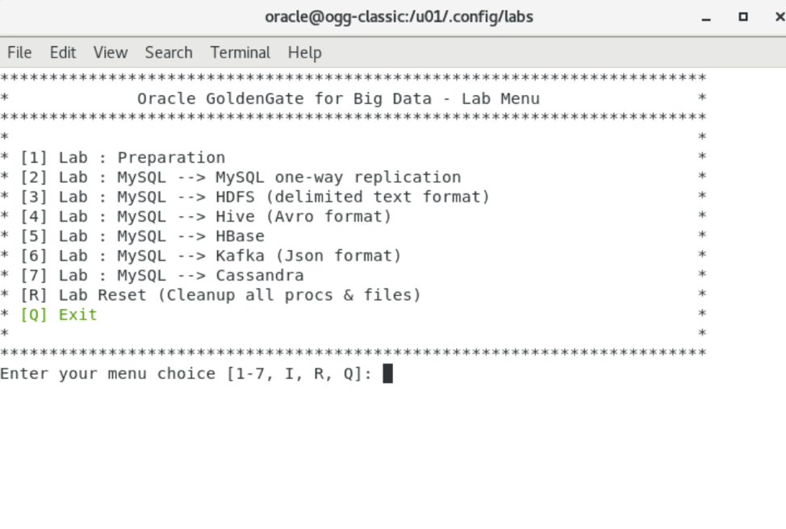
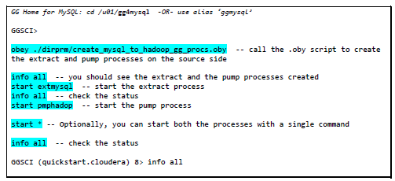
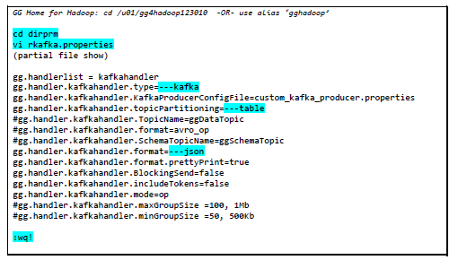
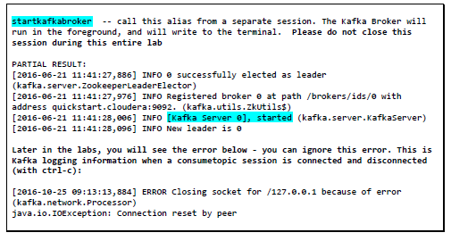
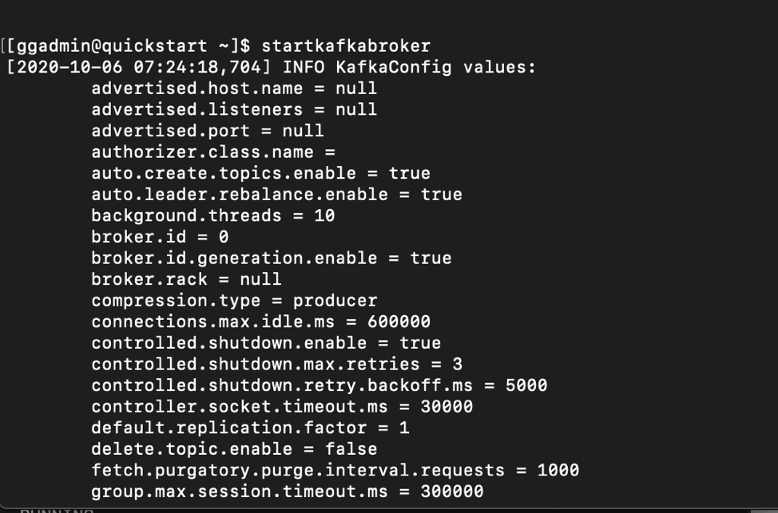
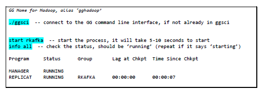
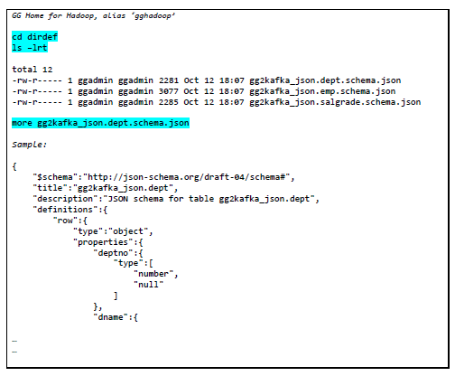

# MySQL to Kafka

## Introduction
In this lab we will load data in MySQL database ‘ggsource’, GG extract process ‘extmysql’ will capture the changes from MySQL’s binary logs and write them to the local trail file. The pump process ‘pmphadop’ will route the data from the local trail (on the source) to the remote trail (on the target). The replicat process ‘rkafka’ will read the remote trail files, act as a producer and write the messages to an auto- created topic for each table in the source database.

Estimated Lab Time:  60 minutes

#### Lab Architecture


### Objectives
- GoldenGate replication from **MySQL to Kafka **

### Prerequisites
* An Oracle Free Tier, Always Free, Paid or LiveLabs Cloud Account
* Lab: Installation
* Lab: MySQL to MySQL


## **STEP 1**: Login to the Workshop Labmenu

1. Open a terminal session locally

````
<copy>$ ssh opc@xxx.xxx.xx.xx</copy>
````
Use Public IP allocated from LiveLabs

**Note: PLEASE USE ‘ggadmin’ USER FOR ALL THE LABS**

````
    <copy>sudo su – ggadmin</copy>
````

1. Display the Lab Menu by typing the alias **labmenu**. The following lab menu will be displayed.
 ```` 
    <copy>labmenu</copy>
````


2. Select **R** to reset the lab environment
3. Select **6** (this step may take a couple of minutes)
Review the overview notes on the following screen
4. Select **Q** to quit.

## **STEP 2**:  Review GoldenGate
The step above copied the GoldenGate configuration files to the GG Home directories, under ./dirprm.

1. Review the content of each of these files to explore how GoldenGate is being configured.

Optionally view these files, same as in previous lab:

````
<copy>view /u01/gg4mysql/dirprm/create_mysql_to_hadoop_gg_procs.oby</copy>
````
````
<copy> cd /u01/gg4mysql/dirprm</copy>
````
````
<copy>view /u01/gg4mysql/dirprm/mgr.prm</copy>
````
````
<copy>view /u01/gg4mysql/dirprm/extmysql.prm</copy>
````
````
<copy>view /u01/gg4mysql/dirprm/pmpmysql.prm</copy>
````
````
<copy> cd /u01/gg4hadoop123010/dirprm</copy>
````
````
<copy>view /u01/gg4hadoop123010/dirprm/create_kafka_replicat.oby</copy>
````
````
<copy>view /u01/gg4hadoop123010/dirprm/rkafka.prm</copy>
````
````
<copy>view /u01/gg4hadoop123010/dirprm/rkafka.properties</copy>
````
````
<copy>view /u01/gg4hadoop123010/dirprm/custom_kafka_producer.properties</copy>
````
## **STEP 3**: GoldenGate Replication

1.  First we will start the GG manager process on both the source and target. Start 2 terminal sessions, connect to ggadmin/oracle (then click Q to get to a prompt). Keep these sessions open for the rest of this lab.

2. In the **first session**, go to the GG Home for MySQL, and start the manager process. You can either cd to the directory, or call the alias ggmysql:
````
<copy>cd /u01/gg4mysql</copy>
````
````
<copy>./ggsci</copy>
````
````
<copy>info all</copy>	 
````
````
<copy>start mgr</copy>		
````
````
<copy>info all</copy>
````

  

 3. In the **second session**, go to the GG Home for Hadoop, and start the manager process. You can cd to the directory:

````
<copy>cd /u01/gg4hadoop123010</copy>
````
````
<copy>./ggsci</copy>
````
````
<copy>info all</copy>	
````
````
<copy>start mgr</copy>		
````
````
<copy>info all</copy>	
````
````
<copy>exit</copy>
````

  

4. In the GG for MySQL ggsci session, we will create and start the GG extract process:
````
<copy>./ggsci</copy>
````
````
<copy>obey ./dirprm/create_mysql_to_hadoop_gg_procs.oby</copy>
````
````
<copy>info all</copy>	
````
````
<copy>start extmysql</copy>	
````
````
<copy>info all</copy>	
````
````
<copy>start pmphadop</copy>	
````
````
<copy>start *</copy>
````
````
<copy>info all</copy>
````
  
  

## **STEP 4**:GoldenGate Kafka Target 

1. Now that the source side is setup, let’s configure GG on the target side (Kafka).

2. In the GG for Hadoop session, you’ll need to modify the Kafka properties by removing the ‘---‘ from the highlighted values:



````
<copy>cd /u01/gg4hadoop123010/dirprm</copy>
````
````
<copy>vi rkafka.properties</copy>
````
````
<copy>Remove "--" prefix</copy>
````
````
<copy>---kafka</copy>
````
````
<copy>---table</copy>
````
````
<copy>---json</copy>
````
````
<copy>:wq!</copy>
````

3. Now create the Kafka replicat process:


````
<copy>cd .. </copy>
````
````
<copy>./ggsci</copy>	
````
````
<copy>start mgr</copy>
````
````
<copy>info all</copy>
````
````
<copy>obey ./dirprm/create_kafka_replicat.oby</copy>
````
````
<copy>info all</copy>
````
Before we start the GG Kafka replicat process, we need to **start the Kafka Broker**. 

4. Start a new session, connect to ggadmin (then click Q to get to a prompt):**



````
<copy>startkafkabroker</copy>
````


5. Start a **new session**, connect to ggadmin
````
<copy>sudo su - ggadmin</copy>
````
 (then click Q to get to a prompt):


## **STEP 5**:GoldenGate Replication to Kafka

1. Now that GG processes have been created and the Kafka Broker has been started, let’s start the GG replicat for Kafka. Go back to the GG Home for Hadoop ggsci session:



````
<copy>./ggsci</copy>
````
````
<copy>start rkafka</copy>
````
````
<copy>info all</copy>
````
2. Now go back to the previous session, where you ran ‘showtopics’; we’ll load some data on the MySQL database ‘ggsource’ and GG will extract and write it to the Kafka topics.


````
<copy>loadsource</copy>	
````
````
<copy>mysqlselect</copy>	
````
````
<copy>showtopics</copy>
````
````
<copy>consumetopic gg2kafka_json.dept</copy>

````

3. Also take a look at the Kafka schema files created by GG, it’s created in the ./dirdef directory in the GG Home for Hadoop:



````
<copy>cd dirdef</copy>
````
````
<copy>ls -lrt</copy>
````
````
<copy>more gg2kafka_json.dept.schema.json</copy>
````

4. Next we’ll apply more DML to the source, then we’ll consume the emp topic, and see the additional data get appended to the topic. Run this from another session, since the consumetopic command runs in the foreground, and outputs the results. Start a new session, connect to ggadmin/oracle (then click Q to get to a prompt)


````
<copy>consumetopic gg2kafka_json.emp
````
5. Now go back to the previous session, and run the DML script


````
<copy>dmlsource</copy>

````


1. Now go back to the session running ‘consumetopic gg2kafka_json.emp’, you should see the new messages written to the emp topics. Scroll up to see "op-type" "U" or "D". For Updates, GG will write the before and after image of the operation


````
<copy>consumetopic gg2kafka_json.emp</copy>
````

7. Let’s confirm that GG replicated the data that it captured. In the GG for Hadoop home


````
<copy>stats rkafka total</copy>
````

## Summary
In summary, you loaded data in MySQL database ‘ggsource’, GG extract process ‘extmysql’ captured the changes from the MySQL binary logs and wrote them to the local trail file. The pump process ‘pmphadop’ routed the data from the local trail (on the source) to the remote trail (on the target). The replicat process ‘rkafka’ read the remote trail files, acted as a producer and wrote the messages to an auto-created topic for each table in the source database.

You may now *proceed to the next lab*.

## Learn More

* [Oracle GoldenGate for Big Data 19c | Oracle](https://www.oracle.com/middleware/data-integration/goldengate/big-data/)

## Acknowledgements
* **Author** - Brian Elliott, Data Integration Team, Oracle, August 2020
* **Contributors** - Meghana Banka
* **Last Updated By/Date** - Brian Elliott, October 2020


## See an issue?
Please submit feedback using this [form](https://apexapps.oracle.com/pls/apex/f?p=133:1:::::P1_FEEDBACK:1). Please include the *workshop name*, *lab* and *step* in your request.  If you don't see the workshop name listed, please enter it manually. If you would like us to follow up with you, enter your email in the *Feedback Comments* section.
