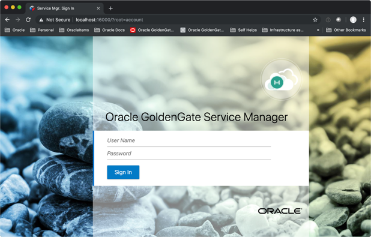
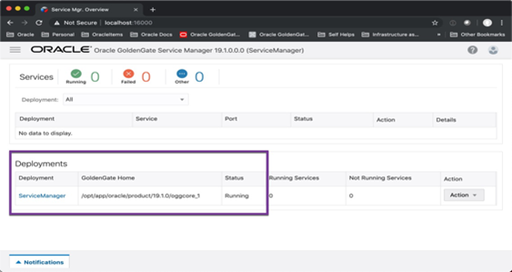
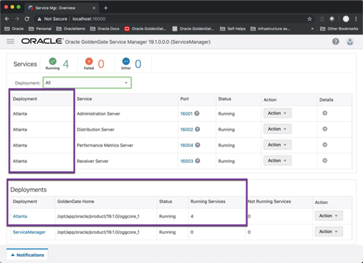
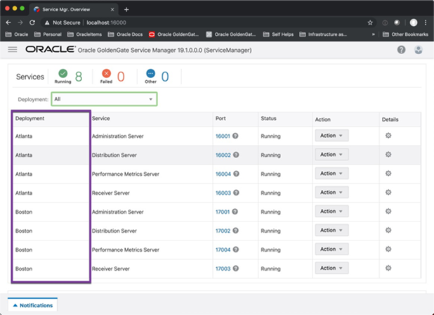

# Lab  -  Setup of Golden Gate Microservices for Replication


## Want to learn more:
* [GoldenGate Microservices](https://docs.oracle.com/goldengate/c1230/gg-winux/GGCON/getting-started-oracle-goldengate.htm#GGCON-GUID-5DB7A5A1-EF00-4709-A14E-FF0ADC18E842")

## Introduction

Contents

Introduction
Disclaimer
Oracle GoldenGate for Microservices Workshop Architecture 


Lab  – Create GoldenGate Microservices Replication

Lab  – Active - Active Replication
  
Lab  – High Availability / Disaster Recovery

Lab  - Transformations using GoldenGate Microservices


### Objectives

KEY FEATURES

Non-invasive, real-time transactional data streaming

Secured, reliable and fault-tolerant data delivery 
Easy to install, configure and maintain real-time changed data 
Easily extensible and flexible to stream changed data to other relational targets

KEY BENEFITS

Improve IT productivity in integrating with data management systems. 
Use real-time data in big data analytics for more timely and reliable insight 
Improve operations and customer experience with enhanced business insight 

• Minimize overhead on source systems to maintain high performance

Oracle GoldenGate Microservices provides optimized and high performance delivery.Designed to demonstrate how Oracle GoldenGate 19c Microservices can be used to setup a replication environment by a mix of web page, shell scripts and Rest API interfaces.  All labs will use shell scripts to facilitate the building of the environment, at the same time provide insight into how to use the web pages and AdminClient.  

Oracle GoldenGate Microservices real-time data streaming platform also allows customers to keep their data reservoirs up to date with their production systems.

Time to complete - 60 mins

### Summary

Oracle GoldenGate offers high-performance, fault-tolerant, easy-to-use, and flexible real- time data streaming platform. It easily extends customers’ real-time data
integration architectures without impacting the performance of the source systems and enables timely business insight for better decision making.

### Disclaimer

This workshop is only for learning and testing purposes. None of the files from the labs should be used in a production environment. 

Time to Complete -
Approximately 30 min

### Prerequisites
This lab assumes you have:
- A Free Tier, Paid or LiveLabs Oracle Cloud account
- SSH Private Key to access the host via SSH
- You have completed:
    - Lab: Generate SSH Keys
    - Lab: Prepare Setup
    - Lab: Environment Setup
    - Lab: Configure GoldenGate

In this lab we will setup GoldenGate Microservices


## **Step 1:** In this task, you will create two deployments that will be used throughout the rest of the Hands-On Lab.  


Open a terminal session


````
<copy>sudo su - oracle</copy>
````

**Deployments are a new concept in Oracle GoldenGate Microservices.**

Deployments provide a siloed approach to splitting replication environments between applications, customers, or environments.  This allows for greater control over the use of Oracle GoldenGate in larger environments.

1.	Log in to ServiceManager’s HTML5 webpage.  This is done by opening Firefox on your linux host machine.

2.	From the browser, connect to port 16000 to access the ServiceManager login page:
```
 <copy>https://<You IP Address>:16000</copy>
```
The URL should bring up the following login page.



3. Log in to the Service Manager using the following credentials:

User Name: oggadmin
Password: Welcome_1
```
<copy>oggadmin</copy>
```
```
<copy>Welcome_1</copy>
```

4.	You should see “ServiceManager” under Deployments at the bottom of the page and the status should be set to “Running”.  




5.	Now switch back to the Remote Desktop Viewer and from the Terminal window, navigate to the Lab3 directory under ~/Desktop/Scripts/HOL.

```
<copy> cd ~/Desktop/Scripts/HOL/Lab2</copy>
```


6.	At this point, by doing an “ls” in the directory; you will notice two files in the lab directory.  The rsp file is a template file that will be copied and used by the sh file.  In order to create two Deployments, the sh script file needs to be ran twice.

First, find out your current VM’s local IP Address by issuing the following command

```
<copy>$ hostname -I</copy>
```
7. Write down the IP Address shown.  For example, 10.145.34.23.  
(** The IP address it shows might be different than the IP address you obtained when using VNC Viewer to connect.  That is fine)

8. Open oggca_deployment.rsp with an editor, such as vi.  Find the following line, replace the IP address with the value you got from above ‘hostname -I’ command
```
<copy>hostname -I</copy>
```
Example: HOST_SERVICEMANAGER=10.0.2.15

9. For example, using above IP address, change it to:

 HOST_SERVICEMANAGER=<YourPublicIP>

10. To run the create_deployment.sh script, you will need to provide eight (8) command line parameters.  Here is the template of the command:

$ sh ./create_deployment.sh <deployment_name> <admin password> <SMPort> <ASPort> <DSPort> <RSPort> <PMSPort> <PMSPortUDP>

Each of the parameters will be used to replace items in the response file and build the Deployment and associated services.  Each of the command line parameters corresponds to the following:

<deployment_name> = Name of the deployment to be created
<admin password> = Password used by the Security Role user for the ServiceManager
<SMPort> = Port number of the ServiceManager (16000)
<ASPort> = Port number of the Administration Service (16001)
<DSPort> = Port number of the Distribution Service (16002)
<RSPort> = Port number of the Receiver Service (16003)
<PMSPort> = Port number of the Performance Metric Service (16004)
<PMSPortUDP> = UDP port number for Performance Metric Service NoSQL Database connection (16005)

11. Run the script using the following parameter values, to create the Atlanta Deployment:
```
<copy>sh ./create_deployment.sh Atlanta Welcome_1 16000 16001 16002 16003 16004 16005</copy>
```


12. Return to Firefox and refresh the ServiceManager page.  You should have one (1) new Deployment called Atlanta, with four (4) services listed.



13. Return to the Terminal Window where you ran the create_deployment.sh script and re-run the script again to create a 2nd Deployment (Boston), this time changing the Deployment name and all port numbers other than the ServiceManager (16000) port number.

**To run the script:**

```
<copy>sh ./create_deployment.sh Boston Welcome_1 16000 17001 17002 17003 17004 17005</copy>
```


14. Return to Firefox and refresh the ServiceManager page again.  You should now have two (2) Deployments with a total of eight (8) services running.  




You may now *proceed to the next lab*.

## Learn More

* [GoldenGate Microservices](https://docs.oracle.com/goldengate/c1230/gg-winux/GGCON/getting-started-oracle-goldengate.htm#GGCON-GUID-5DB7A5A1-EF00-4709-A14E-FF0ADC18E842")

## Acknowledgements
* **Author** - Brian Elliott, Data Integration, November 2020
* **Contributors** - Zia Khan
* **Last Updated By/Date** - Brian Elliott, Novemberber 2020

## See an issue?
Please submit feedback using this [form](https://apexapps.oracle.com/pls/apex/f?p=133:1:::::P1_FEEDBACK:1). Please include the *workshop name*, *lab* and *step* in your request.  If you don't see the workshop name listed, please enter it manually. If you would like us to follow up with you, enter your email in the *Feedback Comments* section.

