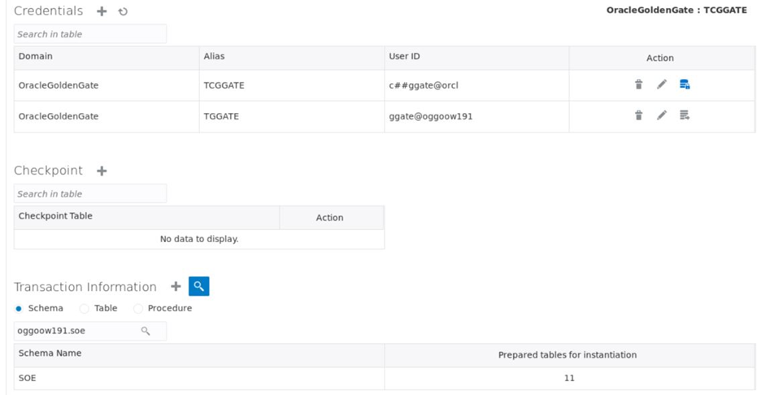
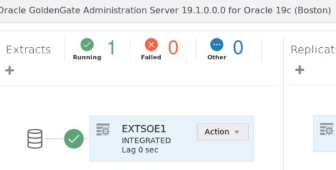
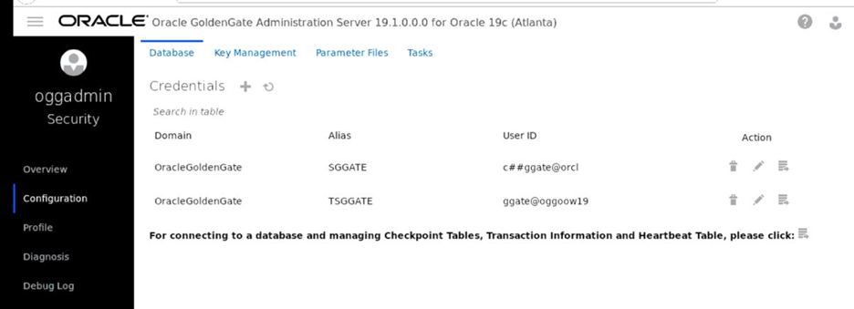
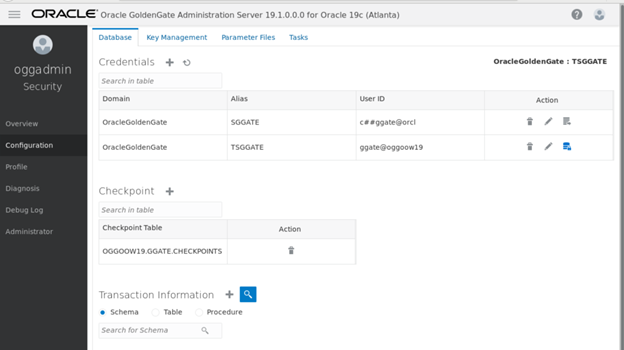
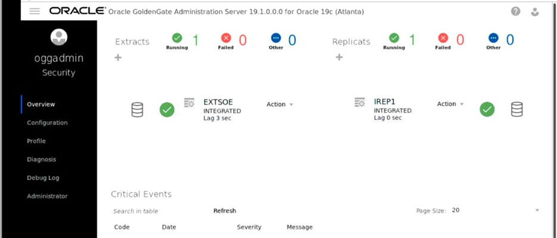
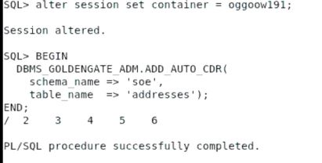

# GoldenGate Microservices HA / DR replication
## Introduction
Oracle GoldenGate for Microservices Workshop Architecture

*Estimated Lab Time*:  60 minutes

#### Lab Architecture


### Objectives

KEY FEATURES

Non-invasive, real-time transactional data streaming

- Secured, reliable and fault-tolerant data delivery
- Easy to install, configure and maintain
- Streams real-time changed data
- Easily extensible and flexible to stream changed data to other relational targets

KEY BENEFITS

- Improve IT productivity in integrating with data management systems
- Use real-time data in big data analytics for more timely and reliable insight
- Improve operations and customer experience with enhanced business insight
- Minimize overhead on source systems to maintain high performance

Oracle GoldenGate Classic provides optimized and high performance delivery.

Oracle GoldenGate Classic real-time data streaming platform also allows customers to keep their data reservoirs up to date with their production systems.

### Prerequisites

This lab assumes you have:
- A Free Tier, Paid or LiveLabs Oracle Cloud account
- SSH Private Key to access the host via SSH
- You have completed:
    - Lab: Generate SSH Keys
    - Lab: Prepare Setup
    - Lab: Environment Setup
    - Lab: Configure GoldenGate

In this lab we will setup GoldenGate Microservices Active - Active Replication

## **STEP 1:** Configuration for Microservices HA / DR Lab

1. Open a terminal session


```
<copy>sudo su - oracle</copy>
```

2. create_credential_TGGAlias.sh

```
<copy>sh ./create_credential_TGGAlias.sh Welcome1 17001 c##ggate@orcl ggate</copy>
```
3. After running this script,you can go to your browser and verify that the credential was created

4. Open a terminal session


````
<copy>sudo su - oracle</copy>
````

4. Change directory to Lab 5

```
<copy>cd /Desktop/Scripts/HOL/Lab5</copy>
```
```
<copy>sh ./create_credential_TGGAlias.sh Welcome1 17001 c##ggate@orcl ggate</copy>
```
5. After running this script, go to your browser and that the credential was created

6. Open a new browser tab and connect to Admin Server


```
<copy>https://localhost:17001</copy>
```

Login with the following credentials

```
<copy> oggadmin/Welcome1</copy>

```
7. Select the "Hamburger Menu"


8. Select Administrator


9. Next add the schema

Back to terminal session run:

```
<copy>sh ./add_SchemaTrandata_Target.sh Welcome1 17001</copy>
```

**Note: You can also check that SCHEMATRANDATA has been added from the Administration
Service -> Configuration page as well. Simply log in to the TCGGATE alias**

10. Then, under “Trandata”, make sure that the magnifying glass and radio button for
“Schema” is selected. Enter “oggoow191.soe” into the search box and then select the magnifying glass to the right of the search box to perform the search.




## **STEP 2:** Add Extract and Distribution Path on oggoow191

You will use the following two scripts to configure these processes

-	add_extract_Target.sh
-	Add_DistroPath.sh

1. From the Terminal Window in the VNC Console, navigate to the Lab6 directory under
~/Desktop/Scripts/HOL/Lab6.
```
<copy>cd ~/Desktop/Scripts/HOL/Lab6</copy>
```
2. Create GoldenGate Extract

```
<copy>sh ./add_extract_Target.sh Welcome1 17001 EXTSOE1</copy>
```
4. After the script has completed, you can go to the Administration Server and see that the extract is there on the Overview page. Remember to use the short URL to access the Administration Server.

```
<copy>https://localhost/Atlanta/adminsrvr</copy>
```



5. Now you will create the Distribution Path that will be used to ship trail files from the Deployment to the Deployment. In order to do this, you will need to run the add_DistroPath.sh script.

At your terminal session:
```
<copy>sh ./add_DistroPath.sh Welcome1 17002 SOE12SOE zz 16003 za</copy>
```
6. After running the add_DistroPath.sh script, you will see the path created in the Distribution Service. Using the short URL approach, you can quickly see the Distribution Path. Using your browser navigate to the Distribution Server and review the Distribution Path.

7.  At the URL
```
<copy>https://localhost/Atlanta/distsrvr</copy>
```


## **STEP 3:**  Create the Replicat on oggoow191  Target


To begin this Task, follow the below steps:

1. From the Terminal window in the VNC Console, navigate to the Lab8 directory under
~/Desktop/Scripts/HOL.

2. From your terminal session
```
<copy>cd ~/Desktop/Scripts/HOL/Lab8</copy>
```
•	create_credential_GGAlias_Source.sh
•	add_CheckpointTable_Atlanta.sh
•	add_Replicat_Atlanta.sh

```
<copy>sh ./create_credential_GGAlias_Source.sh  Welcome1 16001 ggate@oggoow19 ggate</copy>
```

3. Upon a successful run, you can check the Administration Services for the Atlanta deployment from within the browser and verify the account was created. Log in with User name oggadmin and password Welcome1 when prompted.

4. From the URL
https://localhost/Boston/adminsrvr



Back at your terminal session:
```
<copy>sh ./add_CheckpointTable_Atlanta.sh Welcome1 16001</copy>
```




5. With the target database User Alias and Checkpoint Table created, you can now create the Replicat. In order to create the Replicat, you will need to run the add_Replicat_Atlanta.sh script. Enter the following command to run the script:

```
<copy>sh ./add_Replicat_Atlanta.sh Welcome1 16001 IREP1</copy>
```

6. After the script is done running, you will see a running Replicat in the Administration Service for your deployment.





## **STEP 4:** Enable Auto CDR Collision Detect

1. Run the below commands for both the pdb’s for specific tables to enable Auto Conflict detection and Resolution.

```
<copy>SQL> alter session set container = oggoow191;</copy>
```
```
<copy>SQL> BEGIN
  DBMS_GOLDENGATE_ADM.ADD_AUTO_CDR(
    schema_name => 'soe',
    table_name  => 'addresses');
END;
/</copy>
```
```
<copy>SQL> alter session set container = oggoow19;</copy>
```
```
<copy>SQL> BEGIN
  DBMS_GOLDENGATE_ADM.ADD_AUTO_CDR(
    schema_name => 'soe',
    table_name  => 'addresses');
END;
/</copy>
```



### Summary

Oracle GoldenGate offers high-performance, fault-tolerant, easy-to-use, and flexible real- time data streaming platform for big data environments. It easily extends customers’ real-time data
integration architectures to big data systems without impacting the performance of the source systems and enables timely business insight for better decision making.

You may now *proceed to the next lab*

## Learn More

* [GoldenGate Microservices](https://docs.oracle.com/goldengate/c1230/gg-winux/GGCON/getting-started-oracle-goldengate.htm#GGCON-GUID-5DB7A5A1-EF00-4709-A14E-FF0ADC18E842")

* [GoldenGate Microservices](https://docs.oracle.com/goldengate/c1230/gg-winux/GGCON/getting-started-oracle-goldengate.htm#GGCON-GUID-5DB7A5A1-EF00-4709-A14E-FF0ADC18E842")

## Acknowledgements
* **Author** - Brian Elliott, Data Integration, November 2020
* **Contributors** - Zia Khan
* **Last Updated By/Date** - Brian Elliott, November 2020

## Need Help?
Please submit feedback or ask for help using our [LiveLabs Support Forum](https://community.oracle.com/tech/developers/categories/livelabsdiscussions). Please click the **Log In** button and login using your Oracle Account. Click the **Ask A Question** button to the left to start a *New Discussion* or *Ask a Question*.  Please include your workshop name and lab name.  You can also include screenshots and attach files.  Engage directly with the author of the workshop.

If you do not have an Oracle Account, click [here](https://profile.oracle.com/myprofile/account/create-account.jspx) to create one.