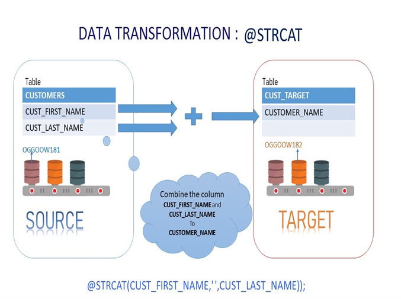
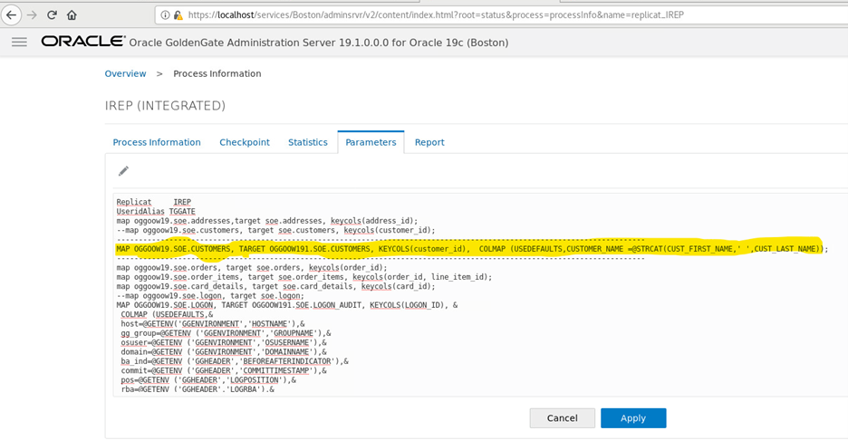
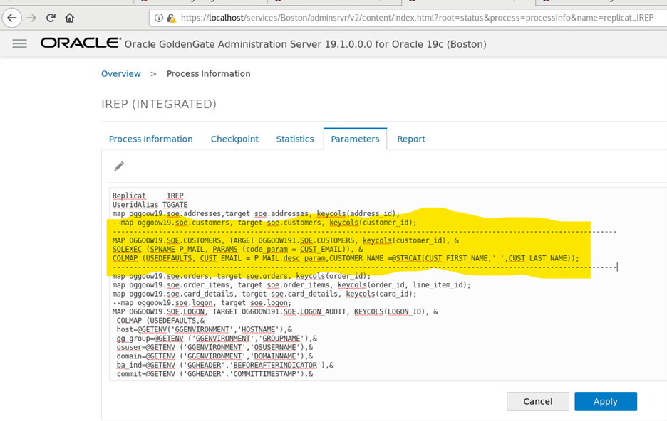
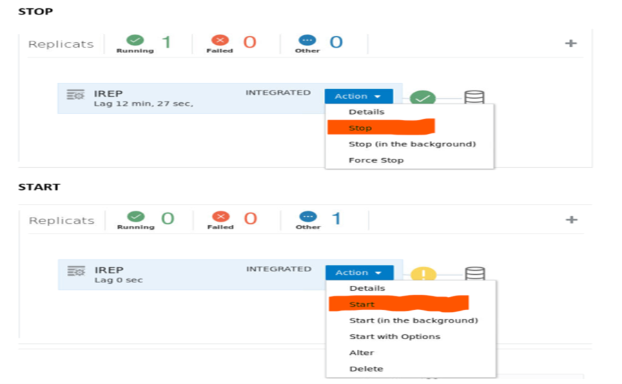
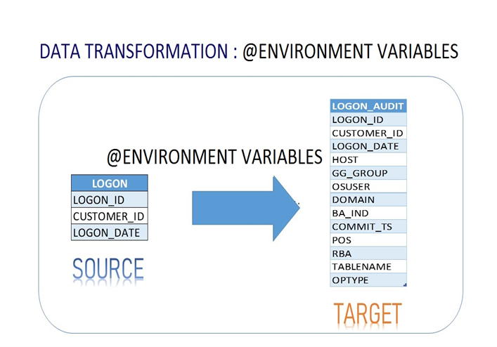
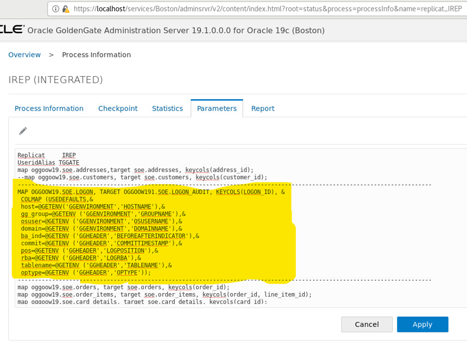

# GoldenGate Microservices Transformations 

## Introduction

This lab is intended to give you familiarity with how to configure GG for database to database replication transformations. GoldenGate is Non-invasive, real-time transactional data streaming
Secured, reliable and fault-tolerant data delivery. It is easy to install, configure and maintain real-time changed data
Easily extensible and flexible to stream transformed data to other relational targets

### Lab Architecture


Lab  – Create GoldenGate Microservices Replication

Lab  – Active - Active Replication

Lab  – High Availability / Disaster Recovery

Lab  - Transformations using GoldenGate Microservices

*Estimated Lab Time*:  60 minutes

### Objectives

To use GoldegGate to perform transformations on the data during the replication process. Even though GoldenGate is primarily a real time data replication tool, it does have the ability to create data transformations. In this lab we will create sample transformations to showcase this feature of GoldenGate.


### Prerequisites
This lab assumes you have:
- A Free Tier, Paid or LiveLabs Oracle Cloud account
- SSH Private Key to access the host via SSH
- You have completed:
    - Lab: Generate SSH Keys
    - Lab: Prepare Setup
    - Lab: Environment Setup
    - Lab: Configure GoldenGate

In this lab we will setup GoldenGate Microservices Transformations

## **STEP 1:** Configuration for Microservices Lab

Open a terminal session


````
<copy>sudo su - oracle</copy>
````

## **STEP 2:**  Concatenating the source ‘m‘ columns into target single ‘n’ columns



1. Edit the parameter of the REPLICAT IREP with the attributes to concatenate the string from columns “CUST_FIRST_NAME” & “CUST_LAST_NAME” into “CUSTOMER_NAME”.Add the following, after commenting the already existing map statement with ”–“.



2. Open the Administration Server of the Target deployment i.e. Boston at `http://<your ip address>:17001`. When the page is completely open, you should be at a page where you can see Replicat IREP. Please stop and start the IREP process.


3. Open a terminal window and execute **insert_customer** below in SQLPLUS to insert data into customer table.

```
<copy>sqlplus ggate/ggate@oggoow19</copy>
```


1. Query inside the script for insert
```
<copy>INSERT INTO SOE.CUSTOMERS VALUES (12345678,’LARRY’,’ELLISON’,’NY’,’NEW YORK’,’5000’,’LARRY@ORACLE.COM’,’365’,’15-OCT- 11’,’BUSINESS’,’MUSIC’,’4-JAN-61’,’Y’,’N’,’2767122’,’126219999’);

Commit;</copy>
```

**1 row copied**


1. After the insert transaction on the source table, query target **CUSTOMER** table as below in the terminal.


```
<copy>sqlplus ggate/ggate@oggoow191</copy>
```

```
<copy>select CUST_FIRST_NAME,CUST_LAST_NAME,CUSTOMER_NAME from SOE.CUSTOMERS where customer_id=12345678;</copy>
```
  

```
<copy>exit</copy>
```

## **STEP 3:** Masking the Source Crucial email-id’s into a dummy email in the target


1. Go to Admin Server console for deployment Baston `http://<your ip address>:17001` and edit the parameter of the REPLICAT IREP with the attributes to pass customer email to SQLEXEC() for execution of stored procedure and mapping it back to the target table.Add the following, after commenting the already existing map statement for CUSTOMERS table with ”–“.

**Replicat Definition**

2. edit the REPLICAT IREP
  
MAP OGGOOW19.SOE.CUSTOMERS, TARGET OGGOOW191.SOE.CUSTOMERS, keycols(customer_id),

SQLEXEC (SPNAME P_MAIL, PARAMS (code_param = CUST_EMAIL)),

COLMAP (USEDEFAULTS, CUST_EMAIL=P_MAIL.desc_param,CUSTOMER_NAME=@STRCAT(CUST_FIRST_NAME,CUST_LAST_NAME));



1. Open Terminal and SQLPLUS into Target Database (OGGOOW191).Create a required stored procedure under GGATE users. This will be used in the SQLEXEC call in the mapping statement

```
<copy>sqlplus ggate/ggate@oggoow191</copy>
```
SQL>
```
<copy>CREATE  OR REPLACE FUNCTION F_MAIL(CODE_PARAM IN VARCHAR2)
  RETURN VARCHAR2
  IS DESC_PARAM VARCHAR2(100);</copy>
  ```

  ```<copy>BEGIN
  RETURN 'XXXXXXXXX@dummy.com';
  END;
  /</copy>
  ```
**Function created**


3. Select F_MAIL and verify results

    

```
<copy>select F_MAIL('MADHU') from dual;</copy>
```

4. Create or replace the procedure
ex: CREATE OR REPLACE PROCEDURE  P_MAIL (CODE_PARAM IN VARCHAR2,DESC_PARAM  OUT VARCHAR2)
  IS
  ```
  <copy>begin
  select F_MAIL('CODE_PARAM')
      into DESC_PARAM
      from dual;
  end;
  /</copy>
  ```


```
<copy>exit</copy>
```
5. Open the Administration Server of the Target deployment i.e. Boston at `http://<your ip address>:17001`. When the page is completely open, you should be at a page where you can see Replicat 6. •	Open Terminal and SQLPLUS into Source Database (OGGOOW19) and do the transcation on the table CUSTOMER by executing @update_email.sql scriptIREP. Please stop and start the IREP process.



6. Open the Terminal and SQLPLUS into Source Database (OGGOOW19) and do the transcation on the table CUSTOMER by executing **update_email**

```
<copy>sqlplus ggate/ggate@oggoow19</copy>
```


7. Run the following Query for update

```
<copy>update soe.customers  set CUST_EMAIL='madhu.kumar.s@yahoo.com' where CUSTOMER_ID=12345678;
commit;</copy>
```
8. Check the Target tables is stored procedure was executed for static masking of the emails. Open Terminal and SQLPLUS into Target Database (OGGOOW191). Excute “select CUST_EMAIL from soe.customers where customer_ID between 562 and 570;” in SQLPLUS

```
<copy>sqlplus ggate/ggate@oggoow191</copy>
```
```
<copy>select CUST_EMAIL from soe.customers where customer_ID between 562 and 570;</copy>
```


## **STEP 4:** Using Environment Variables/Tokens



1. Go to Admin Server console for deployment Baston (http://localhost:17001) and edit the parameter of the REPLICAT IREP with the attributes to map the Environment Variables to the audit table. Add the following after *useridalias command

**edit Relicat Settings REPLICAT IREP**
```
<copy>MAP OGGOOW19.SOE.LOGON, TARGET OGGOOW191.SOE.LOGON_AUDIT, KEYCOLS(LOGON_ID), &
 COLMAP (USEDEFAULTS,&
 host=@GETENV('GGENVIRONMENT','HOSTNAME'),&
 gg_group=@GETENV ('GGENVIRONMENT','GROUPNAME'),&
 osuser=@GETENV ('GGENVIRONMENT','OSUSERNAME'),&
 domain=@GETENV ('GGENVIRONMENT','DOMAINNAME'),&
 ba_ind=@GETENV ('GGHEADER','BEFOREAFTERINDICATOR'),&
 commit=@GETENV ('GGHEADER','COMMITTIMESTAMP'),&
 pos=@GETENV ('GGHEADER','LOGPOSITION'),&
 rba=@GETENV ('GGHEADER','LOGRBA'),&
 tablename=@GETENV ('GGHEADER','TABLENAME'),&
 optype=@GETENV ('GGHEADER','OPTYPE'));</copy>
 ```
 

2. REPLICAT IREP param file will look like

 

3. Open the Administration Server of the Target deployment i.e. Baston at http://<your ip address>:17001. When the page is completely open, you should be at a page where you can see Replicat IREP. Please stop and start the IREP process

 

4. Open the terminal and log into SQLPLUS to do transaction on source DB (OGGOOW19) in table LOGON

```
<copy>sqlplus ggate/ggate@oggoow19</copy>
```
5. Run @insert_logon.sql script

```
<copy>@insert_logon.sql</copy>
```
 

6. Open the terminal and log into SQLPLUS to do look at the transactions replicated on target DB (OGGOOW191) in table *LOGON_AUDIT

```
 <copy>sqlplus ggate/ggate@oggoow191</copy>
 ```
 ```
 <copy>select * from SOE.LOGON_AUDIT;</copy>
 ```
 

### Summary

Oracle GoldenGate offers high-performance, fault-tolerant, easy-to-use, and flexible real- time data streaming platform. It easily extends customers’ real-time data
integration architectures without impacting the performance of the source systems and enables timely business insight for better decision making.

You may now *proceed to the next lab*.

## Learn More

* [GoldenGate Microservices](https://docs.oracle.com/goldengate/c1230/gg-winux/GGCON/getting-started-oracle-goldengate.htm#GGCON-GUID-5DB7A5A1-EF00-4709-A14E-FF0ADC18E842")

## Acknowledgements
* **Author** - Brian Elliott, Data Integration, November 2020
* **Contributors** - Zia Khan
* **Last Updated By/Date** - Brian Elliott November 2020

## Need Help?
Please submit feedback or ask for help using our [LiveLabs Support Forum](https://community.oracle.com/tech/developers/categories/goldengate-on-premises). Please click the **Log In** button and login using your Oracle Account. Click the **Ask A Question** button to the left to start a *New Discussion* or *Ask a Question*.  Please include your workshop name and lab name.  You can also include screenshots and attach files.  Engage directly with the author of the workshop.

If you do not have an Oracle Account, click [here](https://profile.oracle.com/myprofile/account/create-account.jspx) to create one.