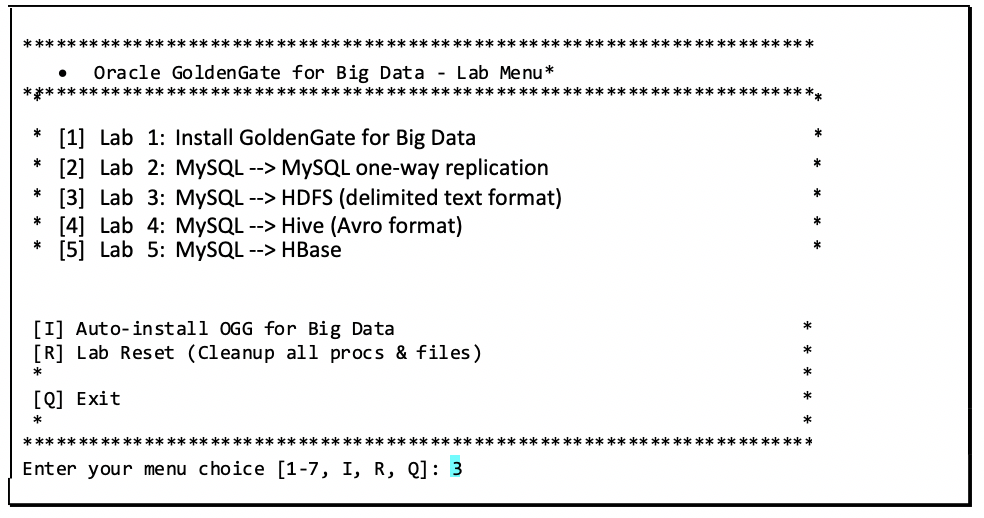
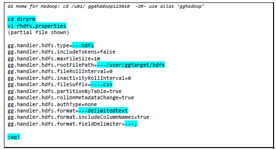
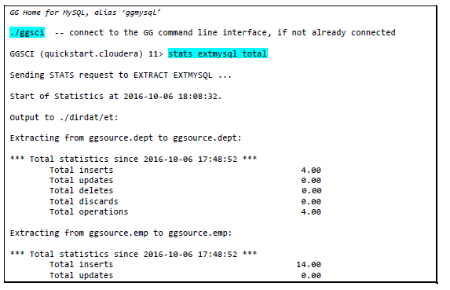
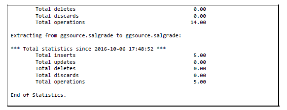

# Lab 3 -  MySQL --> HDFS (delimited text format)

Lab Architecture

## Introduction
In this lab we will load data in MySQL database ‘ggsource’, GG extract process ‘extmysql’ will capture the changes from MySQL’s binary logs and write them to the local trail file. The pump process ‘pmphadop’ will route the data from the local trail (on the source) to the remote trail (on the target). The replicat
process ‘rhdfs’ will read the remote trail files, and write the data to the HDFS target directory
/user/ggtarget/hdfs/

### Objectives
- GoldenGate replication from **MySQL to HDFS**

For the Lab:

If at a terminal session:

'> su - ggadmin

User and Password:

User ID: ggadmin
Password:  oracle

### Time to Complete
Approximately 30 minutes

If already at a Unix prompt, you can access the Lab Menu by typing the alias ‘labmenu’

## Before You Begin
For the Lab terminal session:

The following Lab Menu will be displayed, 

# Steps

1. select R to reset the lab environment, then select 3 to begin Lab3.

2. Review the overview notes on the following screen, then select Q to quit. These online notes have been provided so you can cut/paste file names to another session, to avoid typos.

3. The above step will copy the GoldenGate configuration files to the GG Home directories, under ./dirprm. 

view /u01/gg4mysql/dirprm/create_mysql_to_hadoop_gg_procs.oby 
view these files, same as in previous lab:
    /u01/gg4mysql/dirprm/mgr.prm 
    /u01/gg4mysql/dirprm/extmysql.prm 
    /u01/gg4mysql/dirprm/pmpmysql.prm
view /u01/gg4hadoop123010/dirprm/
   create_hdfs_replicat.oby 
view /u01/gg4hadoop123010/dirprm/rhdfs.prm
view /u01/gg4hadoop123010/dirprm/rhdfs.properties

4. First we will start the GG manager process on both the source and target. Start 2 putty sessions, connect to ggadmin/oracle (then click Q to get to a prompt). Keep these sessions open for the rest of this lab.

5. In the first session, go to the GG Home for MySQL, and start the manager process. You can either cd to the directory, or call the alias ggmysql:

6. In the second session, go to the GG Home for Hadoop, and start the manager process. You can either cd to the directory, or call the alias gghadoop:

7. In the GG for MySQL ggsci session, we will create and start the GG extract process:

8. Now that the source side is setup, let’s configure GG on the target side (HDFS).

9. In the GG for Hadoop session, you’ll need to modify the HDFS properties by removing the ‘---‘ from the highlighted values:

10. Now create and start the HDFS replicat process:

11. ADD REPLICAT RUNNING 

12. Now that GG processes have been created and started on both the source and target, let’s take a look at what’s in the HDFS directory – it should be empty. Then we’ll load some data on the MySQL database
‘ggsource’ and GG will extract and write it to the HDFS target. GG will create a subdirectory for each table in the base directory /user/ggtarget.

13. Start a new session, connect to ggadmin/oracle (then click Q to get to a prompt):

In summary, we loaded data in MySQL database ‘ggsource’, GG extract process ‘extmysql’ captured the changes from the MySQL binary logs and wrote them to the local trail file. The pump process
‘pmphadop’ routed the data from the local trail (on the source) to the remote trail (on the target). The replicat process ‘rhdfs’ read the remote trail file, and wrote the data to the HDFS target directory
/user/ggtarget/hdfs/*.

14. Let’s confirm that GG replicated the data that it captured. Go back to the MySQL ggsci session and execute the following commands to see what data GG has processed, and do the same in the Hadoop ggsci session:

15. In MySQL ggsci session window:

16. In Hadoop ggsci session window:

## Optional: Only if VNC is available

The stats command displays the statistics of the data that GoldenGate processed (grouped by insert/update/deletes). Counts should match between source and target.
You can also see the files created by GG from Hue: http://127.0.0.1:8888/
Login to Hue: cloudera/cloudera
Click on File Browser (Manage HDFS) > Navigate to /user/ggtarget/hdfs…

End of Lab 3.

## Acknowledgements

 * Authors ** - Brian Elliott
 * Contributors ** - Brian Elliott
 * Team ** - Data Integration Team
 * Last Updated By/Date ** - Brian Elliott, August 2020

## See an issue?

Please submit feedback using this link: [issues](https://github.com/oracle/learning-library/issues) 