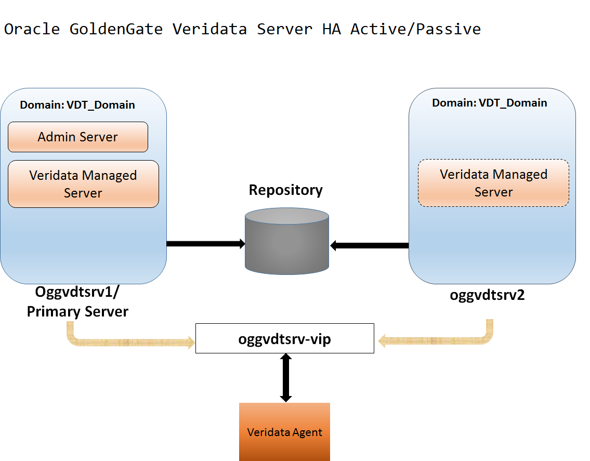
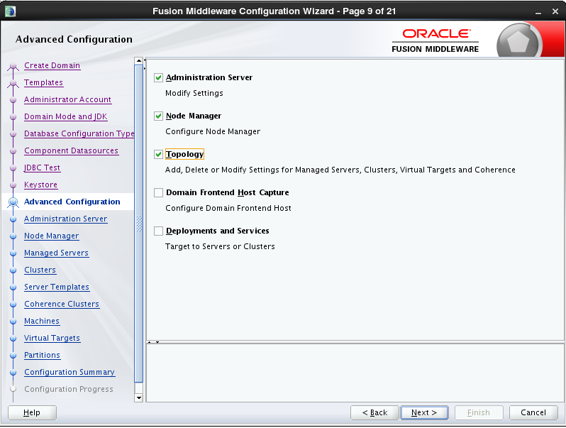
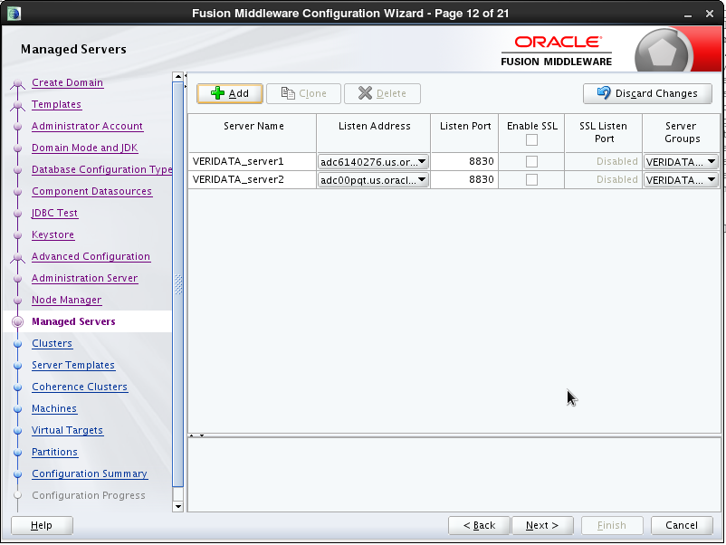
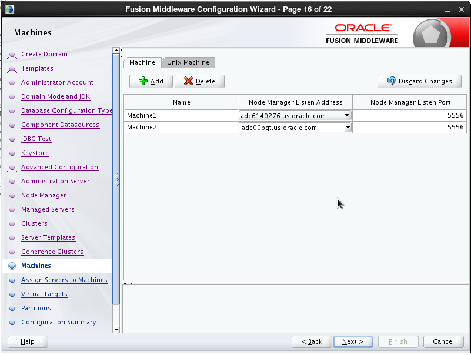
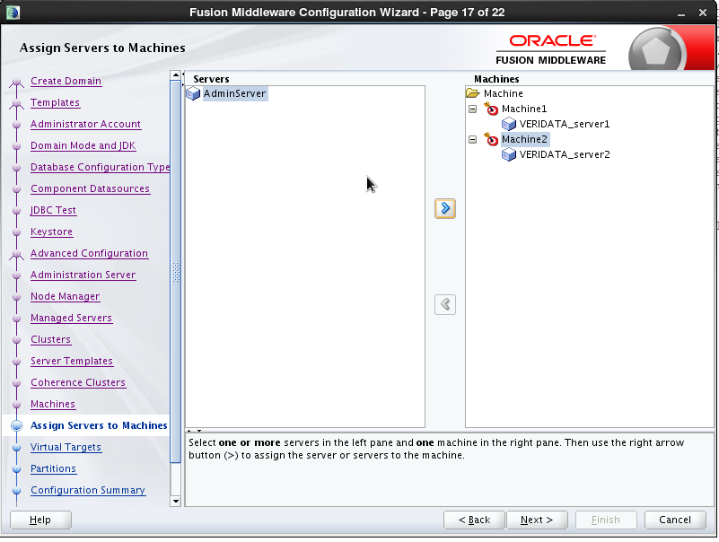

# Set Up the Oracle GoldenGate Veridata Server on the Oracle WebLogic Platform for High Availability

## Introduction
This lab shows you how to set up the Oracle GoldenGate Veridata Server (version: 12.2.1.2) deployed on the Oracle WebLogic Platform for High Availability.
This scenario considers 2 hosts and the setup works in an ACTIVE-PASSIVE mode. Though all the managed servers on different hosts are up, only 1 server serves the request at a time. The usecase was verified on a Linux x86-64 platform, but the approach is generic to all the platforms on which, the Oracle GoldenGate Veridata Server is deployed.

### What Do You Need?

+ **Linux**
+ **Oracle Database 12c (for the repository)**
+ **Oracle WebLogic Server installed on both host 1 and host 2. Ensure that the Oracle WebLogic Server version is same on both hosts.**
+ **Oracle GoldenGate Veridata installed on both host 1 and host 2. Ensure that the Oracle Goldengate Veridata Server version is same on both hosts.**
+ **Virtual IP (VIP) between Servers**
    **Note**: VIP created should have Oracle Weblogic Server (7001) and Oracle GoldenGate Veridata (8830) ports configured.
+ **Oracle GoldenGate Veridata repository created using the Repository Creation Utility (RCU)**
+ **Web Browser**

## **Step 1:** Create the Oracle WebLogic Server Domain on Host 1
To create the Oracle WebLogic Server domain (for example, *domain_name*):
1. In the command line, enter the following: **$ORACLE_HOME/oracle_common/common/bin/config.sh** to display the **Fusion Middleware Configuration Wizard**.
  Ensure that you have set the **$ORACLE_HOME** to a middleware location, such as **MW_HOME**, where you have installed the Oracle WebLogic Server.
2. In this Configuration Wizard, click **Advanced Configuration**, and then select **Administration Server**, **Node Manager**, and **Topology**.
3. For the Administration Server, enter the IP Address or the Hostname of host 1 instead of **All Local Addresses**, and click **Next** to proceed to the Node Manager details.
  

4. Enter the Node Manager credentials and click **Next**.

5. Create 2 managed servers with a Listen Port each on host 1 and on host 2. Ensure that the Listen Port is same on both the host 1 and host 2, and the Listen Port is associated with a VIP.
  
6. Proceed with the default values until you reach the Machines page and then create 2 machines one each for host 1 and host 2, and then click **Next**.
  
7. In the **Assign Servers to Machines** page, assign the managed servers to the respective machines, and click **Next**.
  
8. Retain the default values in the subsequent pages and then finally create the domain. After you have created a domain, start the Administration server and provide the Oracle GoldenGate Veridata permissions for the user under **Security Realms**.

## **Step 2:** Create a Domain Jar File

To create a domain jar file:

* On host 1, run the following command to create a domain jar:
  `cd $ORACLE_HOME/oracle_common/common/bin

  ./pack.sh managed=true -domain=$ORACLE_HOME/user_projects/domains/<domain_name> -template=/<domain_name.jar> -template_name=<domain_name>`
  In this code snippet, `-domain` = domain which needs to be copied from host 1.
  A domain jar gets created in the path provided in the template.

## **Step 3:** Create the Oracle WebLogic Server Domain on Host 2
To create the domain on host 2:
1. Copy the domain jar created in host 1 to host 2.
2. Run the following commands to create the domain in host 2:

    a. `cd $ORACLE_HOME/oracle_common/common/bin`

    b. `./unpack.sh -domain=$ORACLE_HOME/user_projects/domains/<domain_name> -template=<domain_name.jar>` created on host 1.
3. Execute `startNodeManager.sh` under `$ORACLE_HOME/user_projects/domains/<domain_name>/bin` to start the node manager.
4. Repeat steps 1 and 2 on host 2.

## **Step 4:**: Start the Oracle GoldenGate Veridata Managed Servers
To start the Oracle GoldenGate Veridata Managed Servers from the Oracle WebLogic Server Administration UI:
1. Navigate to **Environments** and then select **Servers**.
2. Click the **Control** tab.
3. Select the servers and click **Start**.
4. After the servers comes up, enter the URL `http://vip-host:8830/veridata` in the web browser to display the Oracle GoldenGate Veridata server.

## Want to Learn More?

* [Creating a WebLogic Domain](https://docs.oracle.com/en/middleware/fusion-middleware/12.2.1.3/wldcw/creating-weblogic-domain.html#GUID-40F10C88-F8A2-4849-869C-65CFC5243B71)
* [Repository Creation Utility (RCU)](https://docs.oracle.com/en/middleware/lifecycle/12.2.1.3/rcuug/repository-creation-utility.html#GUID-2E73B30E-9E64-4986-82AD-CD54BB9641BD)
* [Oracle GoldenGate Veridata Documentation](https://docs.oracle.com/en/middleware/goldengate/veridata/index.html)
* [Creating the Oracle GoldenGate Veridata Repository Schema ](https://docs.oracle.com/en/middleware/goldengate/veridata/12.2.1.4/gvdis/creating-oracle-goldengate-veridata-repository-schema.html#GUID-8613B259-F576-4749-8757-89E571286AF0)

## Acknowledgements

* **Author:**
    + Anuradha Chepuri, Principal UA Developer, Oracle GoldenGate User Assistance
* **Reviewed by:**
    + Jonathan Fu, Director, Product Development, GoldenGate Development
    + Avinash Yadagere, Principal Member Technical Staff, GoldenGate Development

* **Last Updated By/Date:** Anuradha Chepuri, August 2020

See an issue?  Please open up a request [here](https://github.com/oracle/learning-library/issues).
