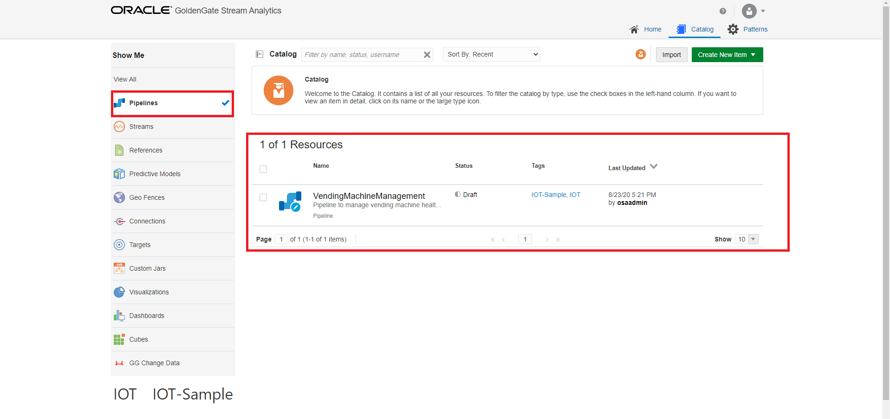
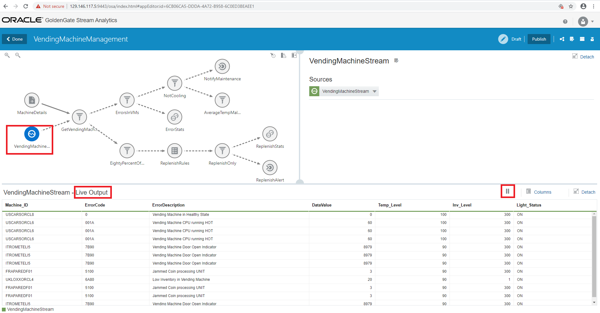
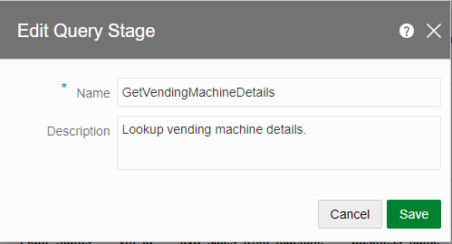
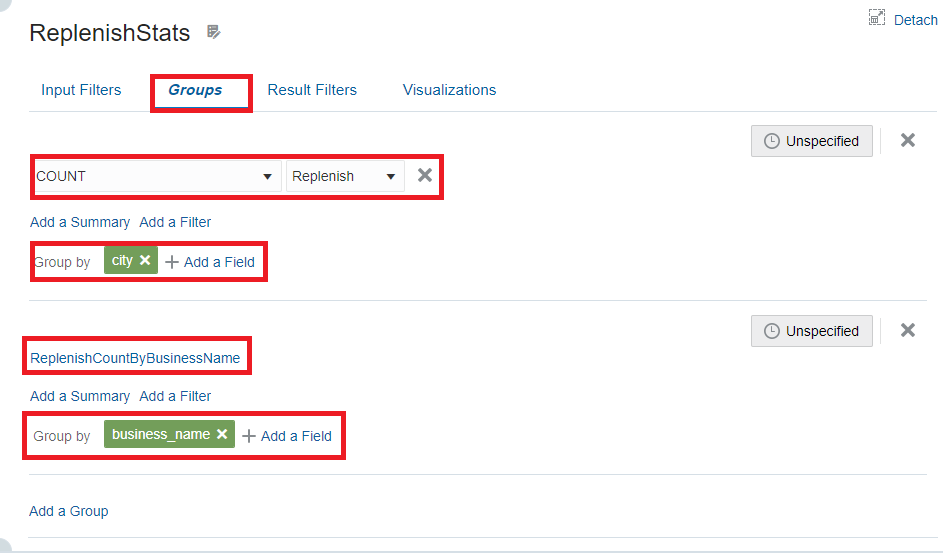
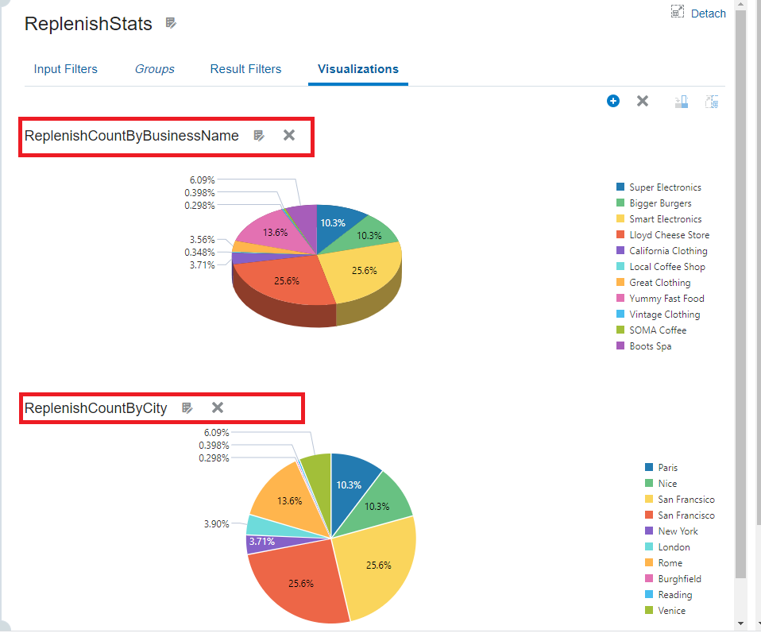

# Streaming IoT Data

## Introduction
In this scenario a management company wants to manage their vending machines which are located all around the world.  The vending machines are each equipped with various sensors that send live data to a central server alerting about any malfunctions such as temperature variations, low inventory and alike.  The input data in this use case comes from a flat-file simulating a live data stream that includes Machine ID, Error Code and Description, Inventory, Temperature levels and Light Status.

The company would like to enrich the data from a database table that contains each machine's specific location including latitude and longitude, an acceptable inventory level and how much in sales they produce on average.  They would then like to run analytics to alert them about low inventory and any malfunctions so that they could act and send the appropriate maintenance.

*Estimated Lab Time*: 30 minutes

### About Product/Technology
Golden Gate Stream Analytics (GGSA) is a tool designed to consume a stream of data from any source such as a database, GoldenGate, Kafka, JMS, REST or even a file system file.  Once the data is in GGSA you can run analytics on live data in real-time using transformation and action functionality of Spark and send the data downstream to any target of your choice.

### Objectives
- Walk through a sample IoT scenario
- Learn about multiple resources in GGSA and how they are created
- Understand the basic concepts of streaming with examples

A `pipeline` is a type of workflow made up of multiple stages such as query stage, a pattern stage, a business rule stage, a query group stage, a custom stage and many more. It is a Spark application where you can implement the business logic for any scenario in this case a vending machine management scenario.

### Prerequisites
This lab assumes you have:
- A Free Tier, Paid or LiveLabs Oracle Cloud account
- SSH Private Key to access the host via SSH
- You have completed:
    - Lab: Generate SSH Keys
    - Lab: Prepare Setup
    - Lab: Environment Setup

## **STEP 1**: Create Pipelines and Adding Stages

1. In the left navigation bar of the Catalog page make sure Pipelines is checked and make sure that only the VendingMachineManagement pipeline is visible.

    

2. Open the `VendingMachineManagement` pipeline and see the live data streaming in the Live Output region at the bottom of the screen.

3. Click the Pause button on the middle right part of the screen to stop live streaming. The Pause icon should now turn into a triangle and live streaming should now be paused.

    There are three sections in the pipeline screen.

    <em> Workflow: upper left region</em>

    <em>Stage details:upper right region</em>

    <em>Live Output:bottom region</em>

    Each circular icon represents a Stage in the workflow. A series of stages constitute a Pipeline. This pipeline is called VendingMachineManagement.

**VendingMachineStream Stage**

4. In the workflow region click on the left most stage VendingMachineStream and
make sure it has been highlighted with the color blue.

5. This is the IoT Vending Machine Pipeline made up of 13 separate stages.
Stay on the first stage *VendingMachineStream* with Live Output paused and
understand the fields that are shown in the Live Output.

 

This data comes from a csv file as streaming data that we saw in the previous lab. It could very well have come from a kafka topic, GoldenGate or JMS.

The data represents live data that comes from various machines around the world with individual IDs and various error conditions such as `Temp_Level` and `Inv_Level` etc. It also identifies each machine by the `Machine_ID` field

**MachineDetails Stage**

This is static data that comes from a database table as we saw in the previous lab.

The fields represent information about each vending machine such as the address, zip code, latitude and longitude, where they are located as well as the `vm_id` which identifies that particular machine.

Click on this stage. Notice that you cannot highlight this stage as it is only static data from the database.

**GetVendingMachineDetails Stage**

6. Now highlight the *GetVendingMachineDetails* stage. Again, you will see that the data is streaming live in the Live Output region. Once again Pause the streaming data so you can understand the fields.

    In this stage we are joining the VendingMachineStream with the MachineDetails in a query stage.

7. In the right details pane under <em>Sources</em> notice that we are joining two sources using a Correlation Conditions

    Vm_id equals (case sensitive) Machine_ID

    As you can see this stage joins the two previous stages by their `Machine_ID` and `vm_id`.

    `Now` Represents the window of time for this stage. In this case we have selected Now to indicate that we are interested in the live data as it comes in.

    

8. We create the GetVendingMachineDetails by highlighting the VendingMachine Stage and with a right click.

9. We then select Add a Stage and then a Query.

   

10. Name the Query *GetVendingMachineDetails* and add a description.

    

11. Once the Stage has been created we edited it in the top right pane joining the two sources using Add a Source and select the Machine Details and adding the Correlation Conditions. You will get a chance to create various
stages in the next lab.

**Visualizations**

Click on the Visualizations tab. In this tab we can see the location of the vending machines with an arrow indicating its location within a geonarea. We were able to create this with the Geo Spatial type of graph from the drop down menu.

   

## **STEP 2**: Calculation and Setting Rules

**EightyPercentOfMaxInv Stage**

1. Highlight the EightyPercentOfMaxInv stage and Pause the data. In this stage we are calculating 80% of the maximum inventory for each machine.  
2. After adding the stage as a query stage with name and description we clicked on the <em>fx</em> icon in the middle right part of the screen and filled out the formula:

    =0.8*max_inventory

3. Then click the checkmark to the left of the formula.

    

    You will get a chance to add stages in the next lab.  In this lab just examine the formula we used with the mouse over the new added column EightyPercentOfMaxInv and see the formula.Again, we created this formula for this stage by using **<em>fx</em>** which gave us an additional column.Notice the left bottom part of the screen identifies which columns are user-defined by an empty box and which ones are part of the stream by a green color box.

    

**ReplenishRules Stage**

4. Click on the *ReplenishRules* stage and Pause the data stream to learn this stage. This is a Rule Stage where we get to define a rule setting Replenish to Yes if Inventory level is less than 80% of maximum inventory level.  Effectively we are setting a Replenish flag based on a minimum amount of inventory in each machine.

5. Notice the difference between the Match All and Match Any is the same as And and a Or condition in a query.

    

    

**ReplenishOnly Stage**

6. Click on the *ReplenishOnly* stage and Pause the stream.This is another Query Stage in which we take the data from the last stage and apply a filter to it.  
7. In the Filters tab we added a condition that only includes Replenish conditions that are set to Yes, because we are only interested in data from machines that require replenishment.

    Replenish equals (case sensitive) Yes

**ReplenishAlert Stage**

8. Now click on the *ReplenishAlert* stage and Pause.
9. In this stage we are adding a target stage that we have defined for a kafka topic replenishAlerts

   

10. The fields in the topic have been predefined but we could have easily defined the necessary fields for our new target or even edited the existing target.Notice that in this stage we mapped the existing data from our stream Output Stream Property to the topic fields Target Property as appropriate

    

**ReplenishStats Stage**

11. Click on the *ReplenishStats* stage and Pause the stream.In this alternate last stage we would like to keep track of the number of machines that are set to Replenish by city and by business_name.

12. We then add a Query Group -Stream stage where we add two summaries with the COUNT of all Replenish and then do a *Group by* city and another summary with *Group by* business_name

    

**Visualization**

13. Click on the *Visualizations* tab and see the statistics in a pie chart for each group by.
14. Here we click on Add A Visualization and select what type of chart we would like to create.Then fill out what we require to use for Measure and Group.  In the next lab you will get to create visualizations for a new scenario

    

    The next stage is in a parallel branch of the pipeline where we are interested to get data on machines that are not functioning properly.

## **STEP 3:**Adding Filters

**ErrorsInVMs Stage**

1. Click on the *ErrorsInVMS* stage and Pause.  In this stage we would like to filter out all machines that are working correctly because they do not require any maintenance.  
2. Click on the <em>Filters</em> tab and see the query condition:

    ErrorCode not equals 0

**ErrorStats Stage**

3. Click on the *ErrorStats* stage and Pause the stream. This is a Query-Group Stream  stage where we like to get some statistics on number of malfunctioning machines by description and also by what city they occur in.
4. First we add a summary with COUNT of ErrorCode and then Group by ErrorDescription.  Next we add another summary with COUNT of ErrorCode and then Group by city

    

**Visualization**

Click on the Visualization tab to see the bar char for the error stats by type and city.

## **STEP 4:** Miscellaneous Stages

**NotCooling Stage**

1. Click on the *NotCooling* stage in the parallel branch and Pause.  
2. Here we would like to isolate machines that are not cooling well by setting this query condition.Click on the <em>Filters</em> to see the query condition:

    Temp_Level greater than 40

**NotifyMaintenance Stage**

3. Click on the *NotifyMaintenance* stage and Pause the stream. In this last stage we are sending the streaming data to a pre-defined Kafka topic for maintenance purposes.  
4. Once again, we need to map the streaming data Output Stream Property values to the kafka topic with Target Property values.  We could  also create the topics in this stage as opposed to using a predefined topic.

**AverageTempMalfunction Stage**

5. Finally click on the *AverageTempMalfunction* stage and Pause.  
6. In this stage we are interested in the Average temperature of malfunctioning machines, so we defined a query stage and added <em>Summaries</em> with the AVG - `Temp_Level` of all the machines and then Group by the type of machine which is identified by the  `Machine_ID`.

    

**Visualization**

Click on this tab to view the bar chart for the average temperature of all machines that malfunctioned by type.

*You may now proceed to the next lab*.

## Learn More

* [GoldenGate Stream Analytics](https://www.oracle.com/middleware/technologies)

## Acknowledgements

* **Author** - Hadi Javaherian, Solution Engineer
* **Contributors** - Shrinidhi Kulkarni, Solution Engineer
* **Last Updated By/Date** - Meghana Banka, October 2020

## Need Help?
Please submit feedback or ask for help using our [LiveLabs Support Forum](https://community.oracle.com/tech/developers/categories/livelabsdiscussions). Please click the **Log In** button and login using your Oracle Account. Click the **Ask A Question** button to the left to start a *New Discussion* or *Ask a Question*.  Please include your workshop name and lab name.  You can also include screenshots and attach files.  Engage directly with the author of the workshop.

If you do not have an Oracle Account, click [here](https://profile.oracle.com/myprofile/account/create-account.jspx) to create one.
