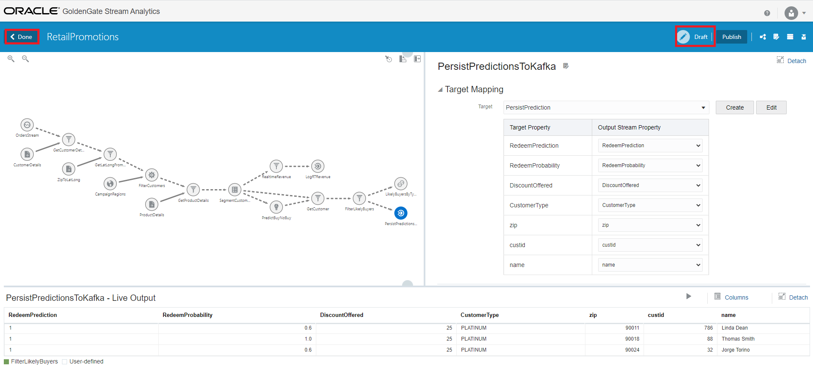
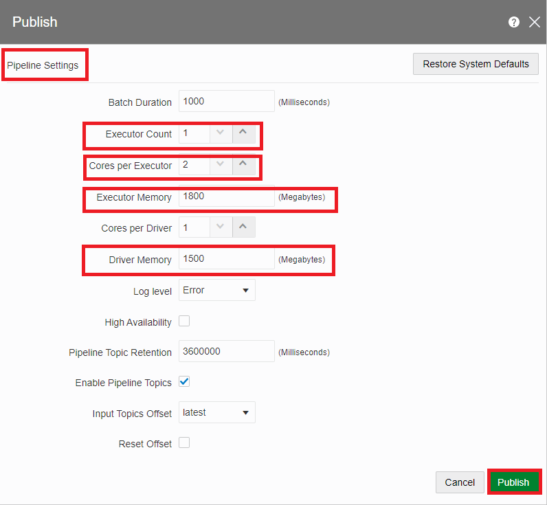
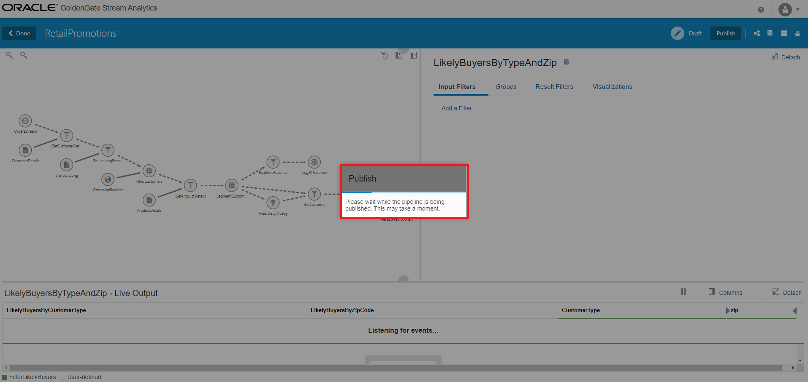
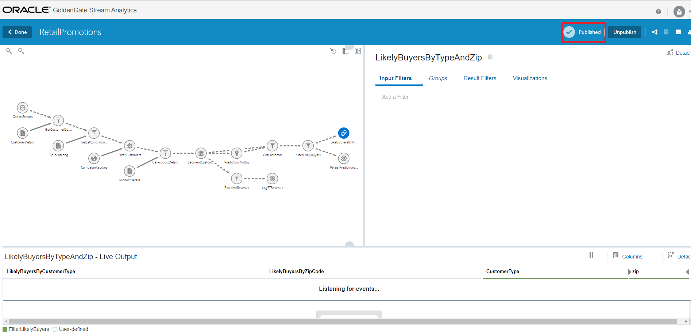
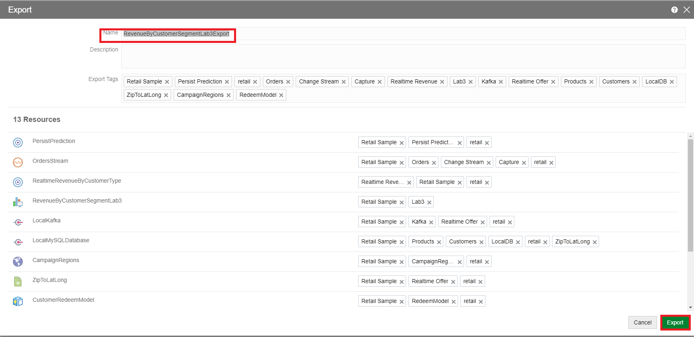

# Publishing, Dashboards, Import/Export

## Introduction
So far, we have been designing the pipelines in Draft Mode which means that we could have made changes to any of the stages and see the updates live.  Furthermore, we could have at any time stopped the stream and designing of the pipeline by clicking on the Done button in the upper left hand corner of the screen.

Estimated Lab Time: 25 minutes

### About Product/Technology
Golden Gate Stream Analytics (GGSA) is a tool designed to consume a stream of data from any source such as a database, GoldenGate, kafka, JMS, REST or even a file system.  Once the data is in GGSA you can run analytics on live data in real-time using transformation and action functionality of Spark and send the data downstream to any target of your choice.

### Objectives
- Learn how to Publish a Pipeline
- Learn how to create a Dashboard
- Learn how to perform Import/Export operations

### Prerequisites
This lab assumes you have:
- A Free Tier, Paid or LiveLabs Oracle Cloud account
- SSH Private Key to access the host via SSH
- You have completed:
    - Lab: Generate SSH Keys
    - Lab: Prepare Setup
    - Lab: Environment Setup

## **STEP 1:** Publishing vs. Draft

1. Select Pipelines from the left Nav Bar and see all the pipelines.  
2. Click on the RetailPromotions from Lab 3 to see that pipeline running with Live Output.Also note that every time you click on the Done button the stream stops but all the changes are saved to the pipeline.  
3. On the top right part of the screen notice that the pipeline is in the Draft mode and only runs while the pipeline is open for each user

    

## **STEP 2:** Publishing a Pipeline
In order to make the pipeline available for production for all users the pipeline must be published.  A published pipeline will continue to run on your Spark cluster even after you exit the pipeline editor which is not the case if the pipeline is in Draft mode.

You can Publish a pipeline in two ways.  You can hover over the pipeline in the Catalog page and see the Publish button highlighted.  Alternatively, you can open the pipeline and click on the Publish button on the top right-hand corner of the screen.

1. Go ahead and Publish the RetailPromotions from Lab 3.
2. In the Pipeline Settings page note the parameters that are configurable for Spark such as number of Executors and Memory as well as Driver Memory.  For this lab we are going to keep all the defaults since we are only running on one node. In production, setting these parameters affect the performance of the pipeline.
3. Do NOT make any changes to the settings and click on the Publish button

    

4. The publishing should take a few seconds

    

5. And the mode should change to Published on the top right corner of the screen

    

6. Also notice that  in the Catalog page the RetailPromotions pipeline is now in Running state

    

## **STEP 3.** Dashboards
A Dashboard is an analytic feature that allows visualization of the pipeline once the data has been analyzed.  You can easily create a dashboard in GGSA with a few quick steps. However, dashboards are not visible until the pipeline they pertain to is in Published state.

1. In the left Nav Bar of the Catalog page click on the Dashboards and see all the dashboards that have been created.
2. Click on the Create New Item drop down and select Dashboard.  
3. In the Create Dashboard page name the new dashboard RevenueByCustomerSegmentLab3
4. Add a description.  
5. Also, tag the dashboard with Retail Sample and Lab 3 tags.  
6. Click Next.

    

7. Keep the defaults and Save the dashboard.  
8. Notice that the new dashboard is now visible in the Catalog page. 
9.  Click on the new RevenueByCustomerSegmentLab3.
10. Click on the Edit Dashboard button on the top right hand corner.

    

11. The button is now changed to Switch to View Mode.  
12. On the Actions dropdown click on the Add Visualizations.

    

13. A new Add Visualizations to Dashboard screen comes up.  
14. Check the RevenueByCustomerSegementLab3 visualization 
15. Click on the Add Visualizations button.

    

16. Notice that the new dashboard is running and streaming data is displayed as a bar chart.

    

17. You can now Exit the dashboard using the Actions dropdown.

## **STEP 4:** Import/Export
You can use export and import to migrate your pipeline and its contents between GoldenGate Stream Analytics systems, or you can also migrate only select artifacts. You can import a pipeline developed with the latest version of GoldenGate Stream Analytics.You have learned the import functionality in the beginning of this workshop.  In this lab you will export the dashboard that you just create in the last step.

1. Hover over the RevenueByCustomerSegementLab3 dashboard
2. Click on the Export icon on the right part of the screen.
3. In the Export screen name the export as `RevenueByCustomerSegmentLab3Export` and click on the Export button.  
4. Notice all the resources that are exported with this dashboard

    

5. Notice that a zip file such as `RevenueByCustomerSegmentLab3Export.zip` has been downloaded to your local machine.

## Learn More

* [GoldenGate Stream Analytics](https://www.oracle.com/middleware/technologies)

## Acknowledgements

* **Author** - Hadi Javaherian, Solution Engineer
* **Contributors** - Shrinidhi Kulkarni, Solution Engineer
* **Last Updated By/Date** - Meghana Banka, October 2020

## Need Help?
Please submit feedback or ask for help using our [LiveLabs Support Forum](https://community.oracle.com/tech/developers/categories/livelabsdiscussions). Please click the **Log In** button and login using your Oracle Account. Click the **Ask A Question** button to the left to start a *New Discussion* or *Ask a Question*.  Please include your workshop name and lab name.  You can also include screenshots and attach files.  Engage directly with the author of the workshop.

If you do not have an Oracle Account, click [here](https://profile.oracle.com/myprofile/account/create-account.jspx) to create one.