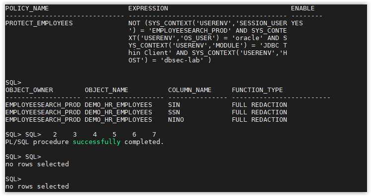

# Redact EMPLOYEESEARCH Data

## Introduction

In this lab we will redact data from the `EMPLOYEESEARCH_PROD` schema from being seen by applications other than the Glassfish application.

Estimated Lab Time: 20 minutes

### Objectives
-   Dynamically redact sensitive data preventing it from being displayed in the application

### Prerequisites
This lab assumes you have:
- An Oracle Free Tier or Paid Cloud account (Always Free is not supported)
- SSH Keys
- Have successfully connected to the workshop machine

## Steps to complete this lab

1. The first thing you will do is view the data in your Glassfish application.  Use your browser and load your browser's public IP into this URL:

  `http://PUBLIC_IP:8080/hr_prod_pdb1`

  Sign in as **admin** / **Oracle123**

  Perform some simple queries in the application and verify you can see Social Identification Number (SIN), Social Security Number (SSN) and National Identification Number (NINO).

2. Open a SSH session on your DBSec-Lab VM as Oracle User

````
<copy>sudo su - oracle</copy>
````

3. Go to the scripts directory

````
<copy>cd /home/oracle/DBSecLab/workshops/Database_Security_Labs/Advanced_Security/Data_Redaction/Redact_EMPLOYEESEARCH_Data</copy>
````

4. Now, in the `Redact_EMPLOYEESEARCH_Data` lab directory, run the following script:

````
<copy>./01_query_employee_data.sh</copy>
````

5. You should see all of the data in an un-redacted format.

   

6. Next, create your redaction policy to redact data for everyone (`1=1`):

````
<copy>./02_redact_for_all.sh</copy>
````
   

7. Run the next script to view the output after applying the redaction policy:

````
<copy>./03_query_employee_data.sh</copy>
````
   

 You will see the SIN column no longer displays any data. You have applied a policy using the `function_type => DBMS_REDACT.FULL`.

8. Use your web browser to verify that the application data is also redacted. We do **not** want to leave it this way so we will redact everything **except** the application.  Do so by running this script:

````
<copy>./04_redact_nonapp_queries.sh`</copy>
````

   

9. Now, add additional columns to our redaction policy. These columns include `SSN` and `NINO`.

````
<copy>./05_add_redacted_columns.sh</copy>
````

   

10. Run the query script to view the `DEMO_HR_EMPLOYEES` table data again.

````
<copy>./06_query_employee_data.sh</copy>
````

   

11.  Use your web browser again to verify that the application data is **not** redacted this time. 

When you are satisified with the results, you can remove the redaction policy.

````
<copy>./07_drop_redact_policy.sh</copy>
````

   

## Acknowledgements
- **Author** - Gian Sartor, Principal Solution Engineer, Database Security
- **Contributors** - Hakim Loumi, Database Security PM
- **Last Updated By/Date** - Gian Sartor, August 2020

## See an issue?
Please submit feedback using this [form](https://apexapps.oracle.com/pls/apex/f?p=133:1:::::P1_FEEDBACK:1). Please include the *workshop name*, *lab* and *step* in your request.  If you don't see the workshop name listed, please enter it manually. If you would like for us to follow up with you, enter your email in the *Feedback Comments* section.
