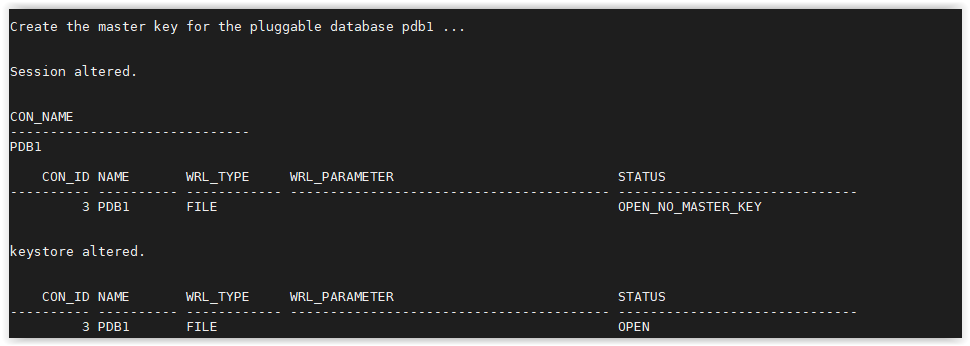

# Introduction

You must create a master key for the container database before continuing. Each pluggable database must have their own master key as well (except for PDB$SEED). In this lab we will create the master key neccessary for TDE operation.

Estimated Lab Time: 10 minutes

## TDE - Create Master Key

Open a SSH session on your DBSec-Lab VM as Oracle User

````
<copy>sudo su - oracle</copy>
````

Go to the scripts directory

````
<copy>cd /home/oracle/DBSecLab/workshops/Database_Security_Labs/Advanced_Security/TDE/Create_Master_Key</copy>
````

To create the container database TDE master key, run the following command

````
<copy>./01_create_cdb_mkey.sh</copy>
````

   

To create a master key for the pluggable database, PDB1, run the following command:

````
<copy>./02_create_pdb_mkey.sh pdb1</copy>
````

   


If you want, you can do the same for PDB2.

This is not a requirement though. It might be helpful to show some databases with TDE and some without.

````
<copy>./02_create_pdb_mkey.sh pdb2</copy>
````

   

Now, you have a master key and you can begin encrypting tablespaces or column!

## Acknowledgements
- **Author** - Gian Sartor, Principal Solution Engineer, Database Security
- **Contributors** - Hakim Loumi, Database Security PM
- **Last Updated By/Date** - Gian Sartor, August 2020

## See an issue?
Please submit feedback using this [form](https://apexapps.oracle.com/pls/apex/f?p=133:1:::::P1_FEEDBACK:1). Please include the *workshop name*, *lab* and *step* in your request.  If you don't see the workshop name listed, please enter it manually. If you would like for us to follow up with you, enter your email in the *Feedback Comments* section.
