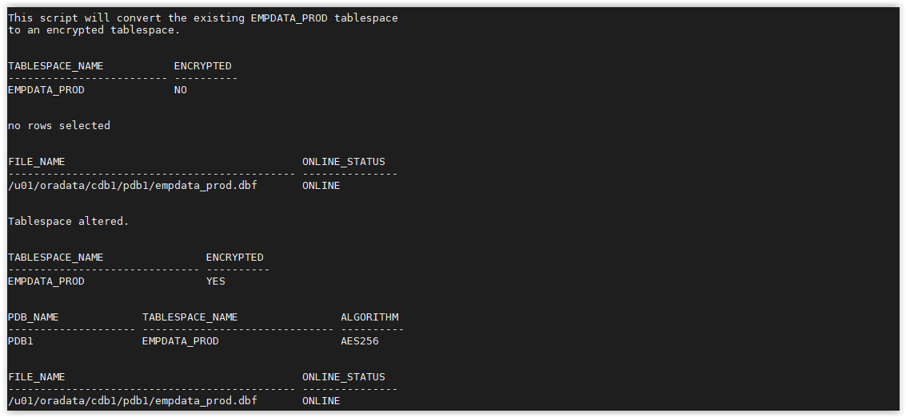

# TDE - Encrypt Existing Tablespace

## Introduction

This lab is all about getting your existing data encrypted. We will use the sample schema for our workshop environment, all of which is stored in the `EMPLOYEESEARCH_DATA` tablespace.

Estimated Lab Time: 10 minutes

### Objectives
-   Encrypt existing application data

### Prerequisites
This lab assumes you have:
- An Oracle Free Tier or Paid Cloud account (Always Free is not supported)
- SSH Keys
- Have successfully connected to the workshop machine

## Steps to complete this lab

1. Open a SSH session on your DBSec-Lab VM as Oracle User

````
<copy>sudo su - oracle</copy>
````

2. Go to the scripts directory

````
<copy>cd /home/oracle/DBSecLab/workshops/Database_Security_Labs/Advanced_Security/TDE/Encrypt_Existing_Tablespace</copy>
````

3. First, use the Linux command, strings, to view the data in the data file.<br>

This is an operating system command that bypasses the database to view the data. This is called a 'side-channel attack' because the database is unaware of it.

````
<copy>./01_Search_Strings_Plain_Text.sh</copy>
````

   

4. Second, encrypt the data by encrypting the entire tablespace:

````
<copy>./02_Encrypt_Tablespace.sh</copy>
````

   

5. And finally, try the side-channel attack again

````
<copy>./03_Search_Strings_Encrypted.sh</copy>
````

   

  You will see that all of the data is now encrypted!

**Note:** This lab has been executed against the pluggable database, PDB1.
You can repeat this, manually, or by using Enterprise Manager, for PDB2 if you want more practice.

## Acknowledgements
- **Author** - Gian Sartor, Principal Solution Engineer, Database Security
- **Contributors** - Hakim Loumi, Database Security PM
- **Last Updated By/Date** - Gian Sartor, August 2020

## See an issue?
Please submit feedback using this [form](https://apexapps.oracle.com/pls/apex/f?p=133:1:::::P1_FEEDBACK:1). Please include the *workshop name*, *lab* and *step* in your request.  If you don't see the workshop name listed, please enter it manually. If you would like for us to follow up with you, enter your email in the *Feedback Comments* section.
