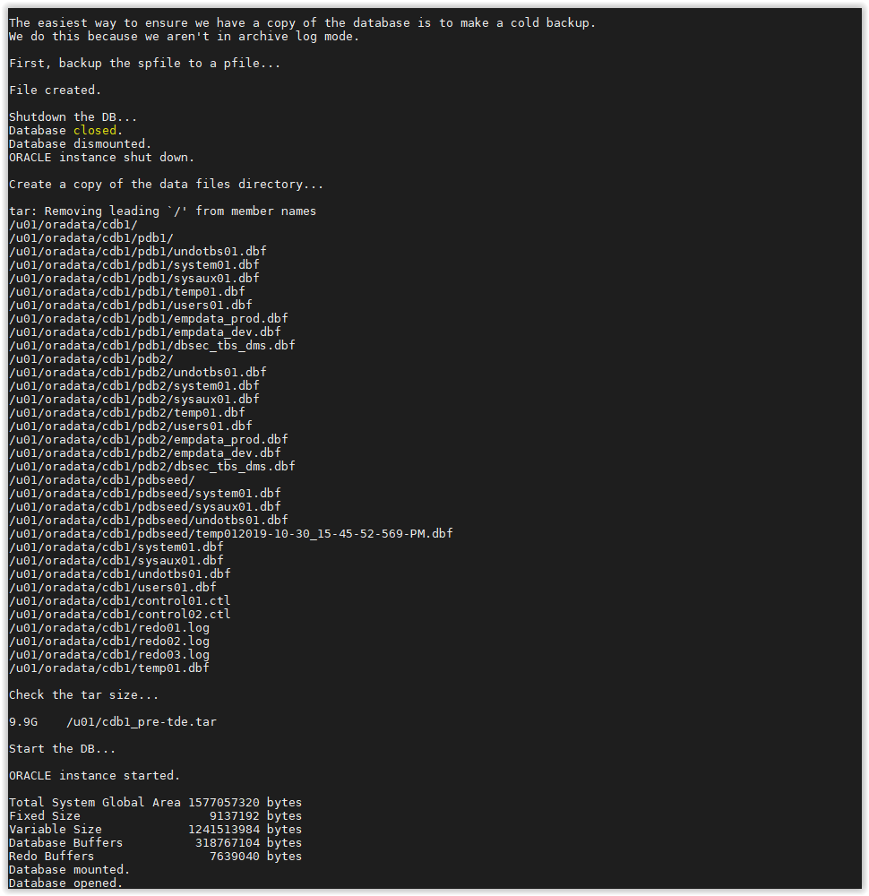
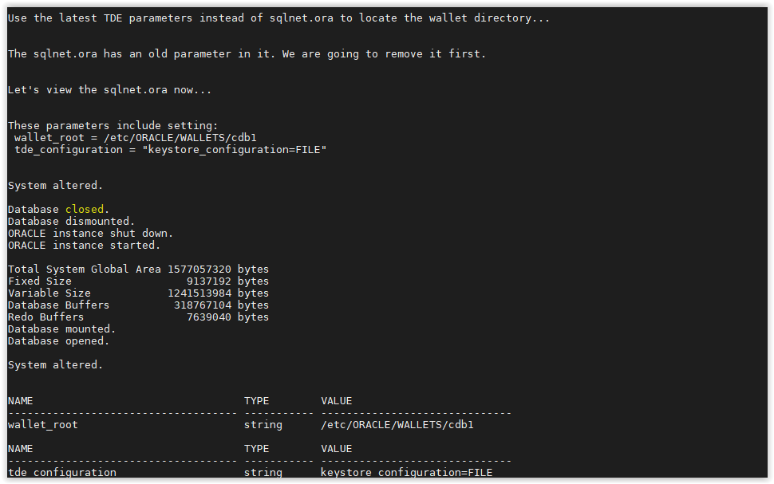
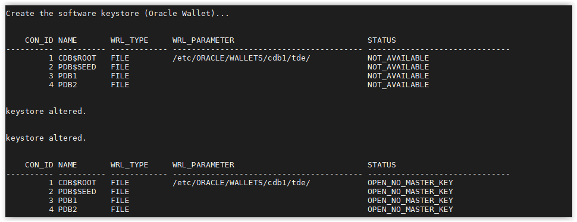
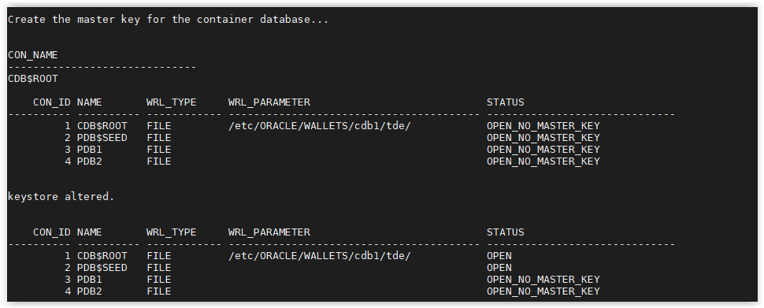
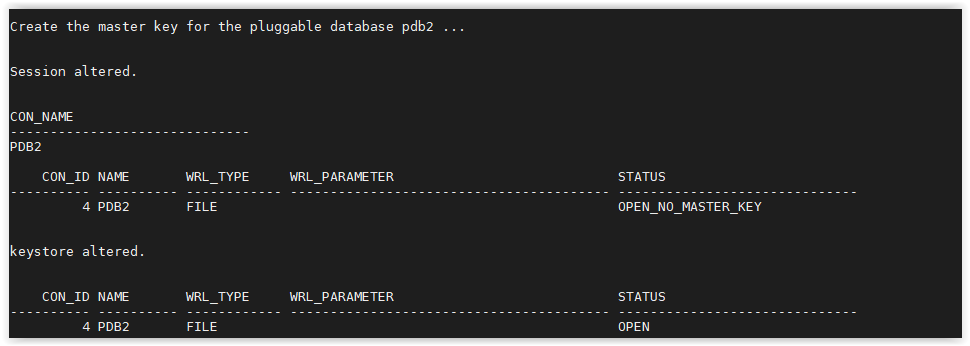
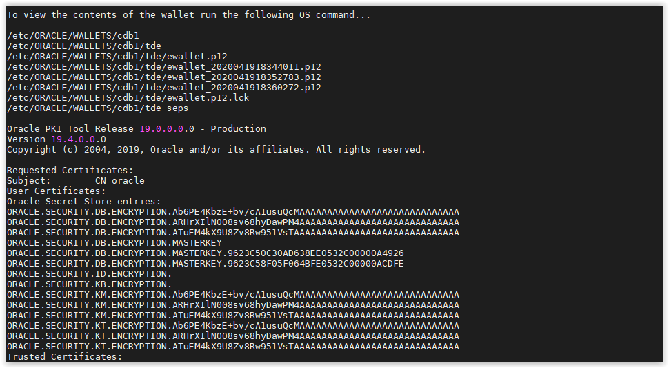
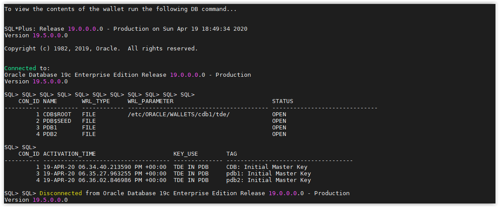

# Transparent Data Encryption

## Introduction

To restore your database to a pre-TDE point in time, this lab will enable archive redo log mode and set a restore point. Since this database is not in Archive Log mode and doesn't have the Flash Recovery Area enabled, a "Cold Backup" of the database will be created.

Hence, this requires stopping the database, creating a tape archive file (tar) and restarting it.

Estimated Lab Time: 45 minutes

### Objectives
- Take a cold backup of the database to enable db restore if needed
- Enable Transparent Data Encrytion in the database
- Encrypt data using Transparent Data Encrytion

### Prerequisites
This lab assumes you have:
- An Oracle Free Tier or Paid Cloud account (Always Free is not supported)
- SSH Keys
- Have successfully connected to the workshop machine

## **STEP 1**: Allow DB Restore

1. Open a SSH session on your DBSec-Lab VM as Oracle User

      ````
      <copy>sudo su - oracle</copy>
      ````

2. Go to the scripts directory

      ````
      <copy>cd /home/oracle/DBSecLab/workshops/Database_Security_Labs/Advanced_Security/TDE/Allow_DB_Restore</copy>
      ````

3. Run the backup command:

      ````
      <copy>./01_backup_db.sh</copy>
      ````

   

4. Once it has completed, it will automatically restart the container and pluggable databases

**Note:** If you have executed this script before and there is an existing backup file, the script will not complete. You must manually manage the existing backup (delete or move) before running this script again.

## **STEP 2**: Create Keystore

1. Open a SSH session on your DBSec-Lab VM as Oracle User

      ````
      <copy>sudo su - oracle</copy>
      ````

2. Go to the scripts directory

      ````
      <copy>cd /home/oracle/DBSecLab/workshops/Database_Security_Labs/Advanced_Security/TDE/Create_Software_Keystore</copy>
      ````

3. Run this script to create the directory on the operating system:

      ````
      <copy>./01_create_os_directory.sh</copy>
      ````

   

4. Use the database parameters to manage TDE. This will require a database restart for one of the parameters to take effect.<
   The script will perform the reboot for you. 

      ````
      <copy>./02_set_tde_parameters.sh</copy>
      ````

   

5. Create the software keystore (Oracle Wallet) for the container database.
   You will see the status result goes from `NOT_AVAILABLE` to `OPEN_NO_MASTER_KEY`. 

      ````
      <copy>./03_create_wallet.sh</copy>
      ````

   
    
6. Now, your wallet has been created

## **STEP 3**: Create Master Key

1. Open a SSH session on your DBSec-Lab VM as Oracle User

      ````
      <copy>sudo su - oracle</copy>
      ````

2. Go to the scripts directory

      ````
      <copy>cd /home/oracle/DBSecLab/workshops/Database_Security_Labs/Advanced_Security/TDE/Create_Master_Key</copy>
      ````

3. To create the container database TDE master key, run the following command:

      ````
      <copy>./01_create_cdb_mkey.sh</copy>
      ````

   

4. To create a master key for the pluggable database, PDB1, run the following command:

      ````
      <copy>./02_create_pdb_mkey.sh pdb1</copy>
      ````

   

5. If you want, you can do the same for PDB2.
   This is not a requirement though. It might be helpful to show some databases with TDE and some without.

      ````
      <copy>./02_create_pdb_mkey.sh pdb2</copy>
      ````

   

6. Now, you have a master key and you can begin encrypting tablespaces or column!

## **STEP 4**: Create Auto-login Wallet

1. Open a SSH session on your DBSec-Lab VM as Oracle User

      ````
      <copy>sudo su - oracle</copy>
      ````

2. Go to the scripts directory

      ````
      <copy>cd /home/oracle/DBSecLab/workshops/Database_Security_Labs/Advanced_Security/TDE/Create_Autologin_Wallet</copy>
      ````
	
3. Then run the script to view the wallet on the operating system.
   Notice there is no `cwallet.sso`, there will be when we create the auto login wallet.

      ````
      <copy>./01_view_wallet_on_os.sh</copy>
      ````

   

4. You can view what the wallet looks like in the database

      ````
      <copy>./02_view_wallet_in_db.sh</copy>
      ````

   

5. Now, create the autologin wallet

      ````
      <copy>./03_create_autologin_wallet.sh</copy>
      ````
   
   

6. Run the same queries... You should now see the `cwallet.sso` file:

      ````
      <copy>./04_view_wallet_on_os.sh</copy>
      ````   

   

   
   **Note**: Now you should see the *.sso file
   

7. And no changes to the wallet in the database

      ````
      <copy>./05_view_wallet_in_db.sh</copy>
      ````

   

8. Now your Autologin is created!

## **STEP 5**: Encrypt Existing Tablespace

1. Open a SSH session on your DBSec-Lab VM as Oracle User

      ````
      <copy>sudo su - oracle</copy>
      ````

2. Go to the scripts directory

      ````
      <copy>cd /home/oracle/DBSecLab/workshops/Database_Security_Labs/Advanced_Security/TDE/Encrypt_Existing_Tablespace</copy>
      ````

3. Use the Linux command, strings, to view the data in the data file, `empdata_prod.dbf` that is associated with the `EMPDATA_PROD` tablespace. This is an operating system command that bypasses the database to view the data. This is called a 'side-channel attack' because the database is unaware of it.

      ````
      <copy>./01_Search_Strings_Plain_Text.sh</copy>
      ````

   

4. Next, encrypt the data by encrypting the entire tablespace:

      ````
      <copy>./02_Encrypt_Tablespace.sh</copy>
      ````

   

5. And finally, try the side-channel attack again

      ````
      <copy>./03_Search_Strings_Encrypted.sh</copy>
      ````

   

6. You will see that all of the data is now encrypted!

## **STEP 6**: Encyrpt All New Tablespaces

1. Open a SSH session on your DBSec-Lab VM as Oracle User

      ````
      <copy>sudo su - oracle</copy>
      ````

2. Go to the scripts directory

      ````
      <copy>cd /home/oracle/DBSecLab/workshops/Database_Security_Labs/Advanced_Security/TDE/Encrypt_All_New_Tablespaces</copy>
      ````

3. First, check the existing initialization parameters

      ````
      <copy>./01_Check_Init_Params.sh</copy>
      ````

   

4. Next, change the init parameter `encrypt_new_tablespaces` to be `ALWAYS` so all new tablespaces are encrypted.

      ````
      <copy>./02_Encrypt_All_New_Tablespaces.sh</copy>
      ````

   

5. Finally, create a tablespace to test it.
   The tablespace `TEST` will be created without specifying the encryption parameters (the default encryption is AES128) and will be dropped after

      ````
      <copy>./03_Create_New_Tablespace.sh</copy>
      ````

   

6. Now, your new Tablespaces will be encrypted by default!

## **STEP 7**: Rekey Master Key

1. Start this lab here

      ````
      <copy>cd /home/oracle/DBSecLab/workshops/Database_Security_Labs/Advanced_Security/TDE/Rekey_Master_Key</copy>
      ````

2. To_rekey the container database TDE master key, run the following command:

      ````
      <copy>./01_rekey_cdb_mkey.sh</copy>
      ````

3. To rekey a master key for the pluggable database, PDB1, run the following command:

      ````
      <copy>./02_rekey_pdb_mkey.sh pdb1</copy>
      ````

4. If you want, you can do the same for PDB2.  This is not a requirement though. It might be helpful to show some databases with TDE and some without.

      ````
      <copy>./02_rekey_pdb_mkey.sh pdb2</copy>
      ````

5. Now that you have a master key, you can begin encrypting tablespaces or column. 

## **STEP 8**: View Keystore Details

1. Open a SSH session on your DBSec-Lab VM as Oracle User

      ````
      <copy>sudo su - oracle</copy>
      ````

2. Go to the scripts directory

      ````
      <copy>cd /home/oracle/DBSecLab/workshops/Database_Security_Labs/Advanced_Security/TDE/View_Software_Keystore</copy>
      ````

3. Once you have a keystore, you can run either of these scripts.
   You will notice there are multiple copies of the `ewallet.p12` file.
   Every time you make a change, including create or rekey, the `ewallet.p12` file is backed up.
   You will also see the contents of the wallet file by using `orapki`

   - View the OS files related to the keystore

      ````
      <copy>./01_view_wallet_on_os.sh</copy>
      ````

   

   - View the keystore data in the database

      ````
      <copy>./02_view_wallet_in_db.sh</copy>
      ````

   

## **STEP 9**: Restore Before TDE (Optional)

1. Open a SSH session on your DBSec-Lab VM as Oracle User

      ````
      <copy>sudo su - oracle</copy>
      ````

2. Go to the scripts directory

      ````
      <copy>cd /home/oracle/DBSecLab/workshops/Database_Security_Labs/Advanced_Security/TDE/Restore_Before_TDE</copy>
      ````

3. First, execute this script to restore the pfile

      ````
      <copy>./01_restore_init_parameters.sh</copy>
      ````

4. Second, restore the database (this may take some time)

      ````
      <copy>./02_restore_db.sh</copy>
      ````

5. Third, delete the associated wallet files

      ````
      <copy>./03_delete_wallet_files.sh</copy>
      ````

6. Finally, start the container and pluggable databases

      ````
      <copy>./04_start_db.sh</copy>
      ````

7. This should have restored your database to it's pre-TDE state

8. Verify the initialization parameters don't say anything about TDE

      ````
      <copy>./05_check_init_params.sh</copy>
      ````

## Acknowledgements
- **Author** - Hakim Loumi, Database Security PM
- **Contributors** - Gian Sartor, Principal Solution Engineer, Database Security
- **Last Updated By/Date** - Kamryn Vinson, September 2020

## See an issue?
Please submit feedback using this [form](https://apexapps.oracle.com/pls/apex/f?p=133:1:::::P1_FEEDBACK:1). Please include the *workshop name*, *lab* and *step* in your request.  If you don't see the workshop name listed, please enter it manually. If you would like for us to follow up with you, enter your email in the *Feedback Comments* section.