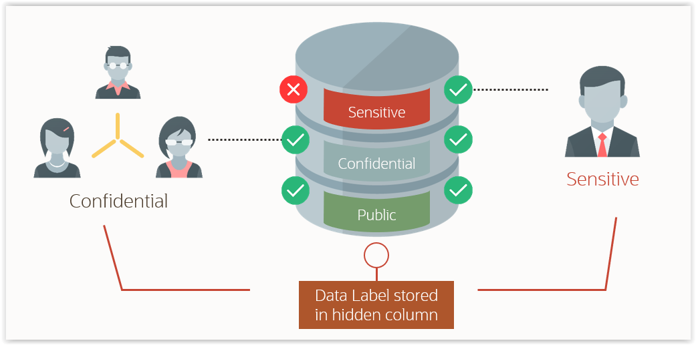

# Label Security

Oracle Label Security controls the display of individual table rows using labels that are assigned to specific individual table rows and application users.

Oracle Label Security works by comparing the row label with a user's label authorizations to enable you to easily restrict sensitive information to only authorized users. This way, users with different authorization levels (for example, managers and sales representatives) can have access to specific rows of data in a table. You can apply Oracle Label Security policies to one or more application tables. The design of Oracle Label Security is similar to Oracle Virtual Private Database (VPD). However, unlike VPD, Oracle Label Security provides the access mediation functions, data dictionary tables, and policy-based architecture out of the box, eliminating customized coding and providing a consistent label based access control model that can be used by multiple applications.

Oracle Label Security is based on multi-level security (MLS) requirements that are found in government and defense organizations.

Oracle Label Security software is installed by default, but not automatically enabled. You can enable Oracle Label Security in either SQL*Plus or by using the Oracle Database Configuration Assistant (DBCA). The default administrator for Oracle Label Security is the user LBACSYS. To manage Oracle Label Security, you can use either a set of PL/SQL packages and standalone functions at the command-line level or Oracle Enterprise Manager Cloud Control. To find information about Oracle Label Security policies, you can query ALL_SA_*, DBA_SA_*, or USER_SA_* data dictionary views.

An Oracle Label Security policy has a standard set of components.

These components are as follows:

- **Labels:** Labels for data and users, along with authorizations for users and program units, govern access to specified protected objects. Labels are composed of the following:

    - **Levels:** Levels indicate the type of sensitivity that you want to assign to the row (for example, SENSITIVE or HIGHLY SENSITIVE). Levels are mandatory.

    - **Compartments (Optional):** Data can have the same level (for example, Public, Confidential and Secret), but can belong to different projects inside a company (for example, ACME Merger and IT Security). Compartments represent the projects in this example that help define more precise access controls. They are most often used in government environments.

    - **Groups (Optional):** Groups identify organizations owning or accessing the data (for example, UK, US, Asia, Europe). Groups are used both in commercial and government environments, and frequently used in place of compartments due to their flexibility.

- **Policy:** A policy is a name associated with these labels, rules, authorizations, and protected tables.

 

**Benefits of using Oracle Label Security**

Oracle Label Security provides several benefits for controlling row level management.

- It enables row level data classification and provides out-of-the-box access mediation based on the data classification and the user label authorization or security clearance.

- It enables you to assign label authorizations or security clearances to both database users and application users.

- It provides both APIs and a graphical user interface for defining and storing data classification labels and user label authorizations.

- It integrates with Oracle Database Vault and Oracle Advanced Security Data Redaction, enabling security clearances to be use in both Database Vault command rules and Data Redaction policy definitions.

---

- [Oracle Label Security 20c](https://docs.oracle.com/en/database/oracle/oracle-database/20/olsag/introduction-to-oracle-label-security.html#GUID-C20C62AE-2A30-45F9-AEEA-52A0D3286FBA)

---

Version tested in this lab: `Oracle DB 19.5`

For these labs, you will need **Glassfish App**

- [Simple CRM Application](../simple-crm-app/simple-crm-app.md)

- [Protect Glassfish Application](../protect-glassfish-app/protect-glassfish-app.md)

---

Click to return [home](/README.md)
