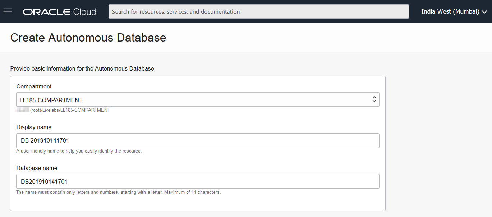
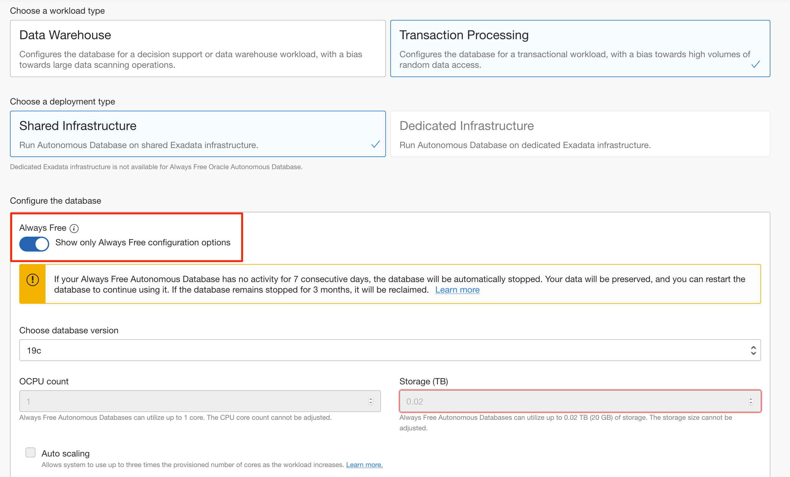
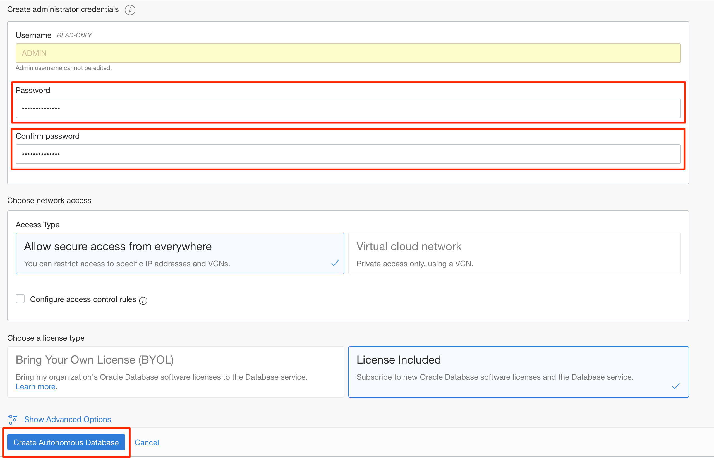
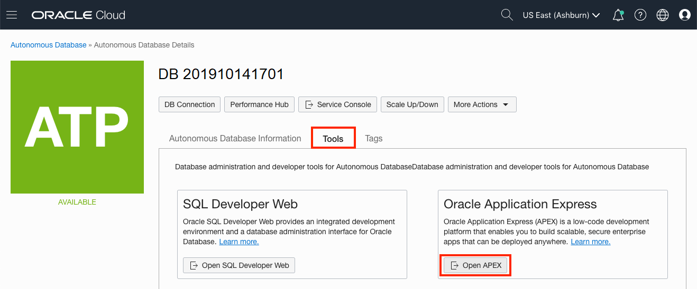

# Create an Oracle APEX Workspace

## Introduction

Oracle Application Express (APEX) is a feature of Oracle Database, including the Autonomous Data Warehouse (ADW) and Autonomous Transaction Processing (ATP) services. To start, you will need to decide which Oracle Database you are going to use for the workshop, and then create an APEX workspace in that database.

If you already have an APEX 20.1 Workspace provisioned, you can skip this lab and go straight to Lab 2 by clicking the navigation menu icon, in the upper-right corner of the header.

Estimated Time: 5 minutes

### What is an APEX Workspace?
An APEX Workspace is a logical domain where you define APEX applications. Each workspace is associated with one or more database schemas (database users) which are used to store the database objects, such as tables, views, packages, and more. These database objects are generally what APEX applications are built on top of.

### How Do I Find My APEX Release Version?
To determine which release of Oracle Application Express you are currently running, do one of the following:
* View the release number on the Workspace home page:
    - Sign in to Oracle Application Express. The Workspace home page appears. The current release version displays in bottom right corner.
* View the About Application Express page:
    - Sign in to Oracle Application Express. The Workspace home page appears.
    - Click the Help menu at the top of the page and select About. The About Application Express page appears.

  

### Where to Run the Lab
You can run this lab in any Oracle Database with APEX 20.1 installed. This includes the "Always Free" Oracle Autonomous Database, the free, "Development Only" apex.oracle.com service, your on-premises Oracle Database (providing APEX 20.1 is installed), on a third party cloud provider where APEX 20.1 is installed, or even on your laptop by installing Oracle XE or the Oracle VirtualBox App Dev VM and installing APEX 20.1.

This lab is designed for a LiveLabs environment. If you haven't already done so, reserve an environment to run this workshop.

## **STEP 1**: Create an APEX Workspace on an Autonomous Transaction Processing instance

In this step, you will create an *Autonomous Transaction Processing* database and provision an Oracle APEX Workspace.

1. From within your Oracle Cloud environment, you will create an instance of the Autonomous Transaction Processing database service.

    From the Cloud Dashboard, select the navigation menu icon in the upper left-hand corner and then select **Autonomous Transaction Processing**.

    

2. Click **Create Autonomous Database**.

    

3. Select the **Always Free** option, enter **```SecretPassw0rd```** for the ADMIN password, then click **Create Autonomous Database**.

    
    
    

4. After clicking **Create Autonomous Database**, you will be redirected to the Autonomous Database Details page for the new instance.

    Continue when the status changes from:

    

    to:

    

5. Within your new database, APEX is not yet configured. Therefore, when you first access APEX, you will need to log in as an APEX Instance Administrator to create a workspace.

    Click the **Tools** tab.
    Click **Open APEX**.

    

6. Enter the password for the Administration Services and click **Sign In to Administration**.     
    The password is the same as the one entered for the ADMIN user when creating the ATP instance: **```SecretPassw0rd```**

    

7. Click **Create Workspace**.

    

8. In the Create Workspace dialog, enter the following:

    | Property | Value |
    | --- | --- |
    | Database User | DEMO |
    | Password | **`SecretPassw0rd`** |
    | Workspace Name | DEMO |

    Click **Create Workspace**.

    

9. In the APEX Instance Administration page, click the **DEMO** link in the success message.         
    *Note: This will log you out of APEX Administration so that you can log into your new workspace.*

    

10. On the APEX Workspace log in page, enter **``SecretPassw0rd``** for the password, check the **Remember workspace and username** checkbox, and then click **Sign In**.

    


## **Summary**

This completes the lab setup. At this point, you know how to create an APEX Workspace and you are ready to start building amazing apps, fast.

You may now *proceed to the next lab*.

## **Acknowledgements**

 - **Author/Contributors** -  David Peake, Consulting Member of Technical Staff | Arabella Yao, Product Manager Intern, Database Management, June 2020
 - **Last Updated By/Date** - Tom McGinn, Database Cloud Services, Product Management, June 2020

See an issue? Please open up a request [here](https://github.com/oracle/learning-library/issues). Please include the workshop name and lab in your request.
