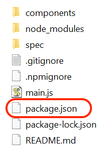
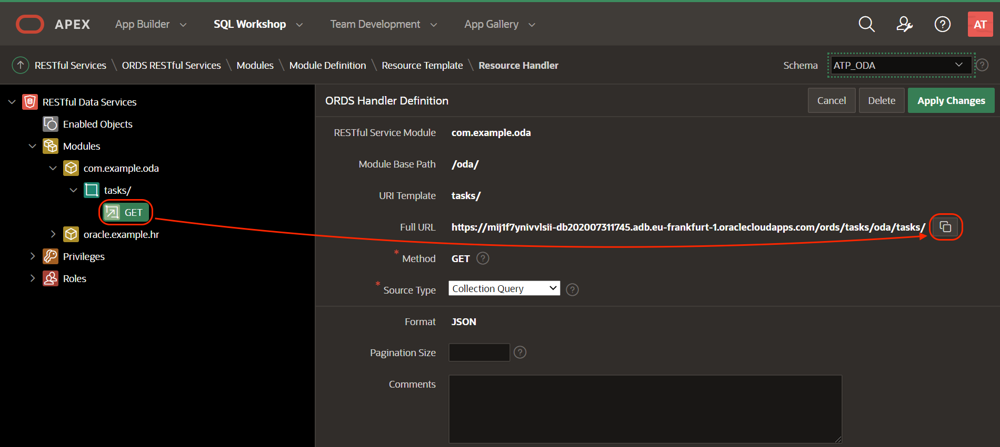
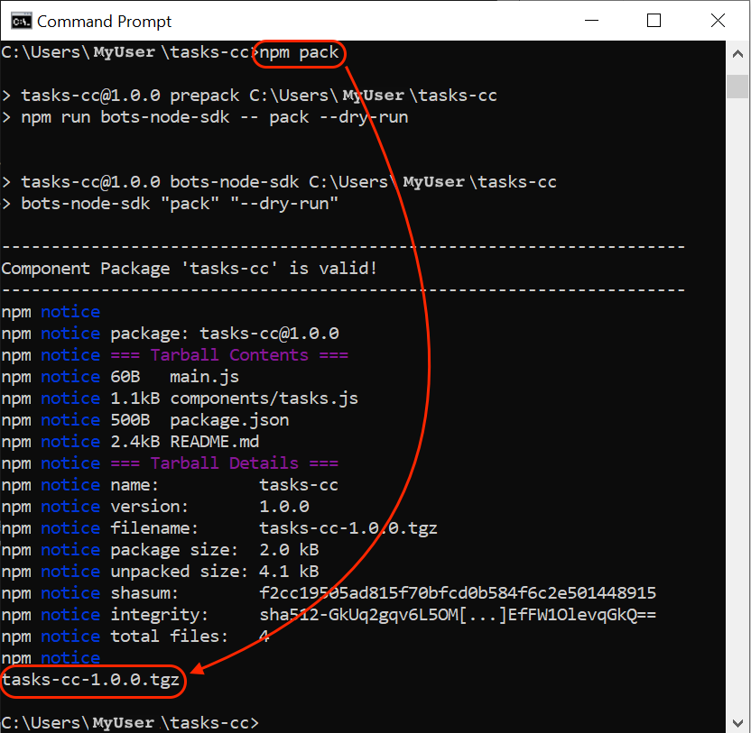
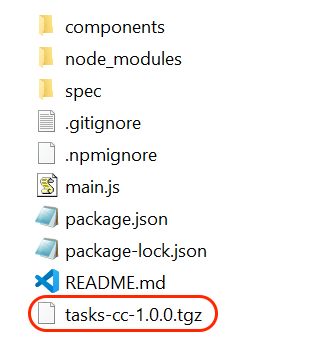

# Lab 4: Implement Custom Component

## Introduction

**Oracle Digital Assistant** allows you to build integrations with backend services by creating **Custom Components**.

Custom Components are a bridge between **Skills** on Oracle Digital Assistant and the **Services** where information can be fetched.


Custom components allow you as well to plug-in custom code logic into a bot conversation.

That is exactly what we are going to build.

**Custom Components** are developed using **Node.js**. They are just a REST **API** that offer an endpoint to **Skills** bots to `GET` and `POST` actions.


You can package related **Custom Components** together.

Estimated workshop Time 15 minutes.

## **Step 1**: Create a Custom Component to integrate with backend services

Oracle provides **Oracle Bots Node.js SDK**, a free utility that makes custom components development very easy.

> We had explained the installation steps in the Pre-requisites section at the very beginning of this workshop.

Ready to create your **Custom Component** scaffolding.

1. Open a **terminal** and type:

    ```bash
    npx @oracle/bots-node-sdk init tasks-cc --component-name tasks
      ```

    Where `tasks-cc` is the name of the custom component module. And `tasks` is the name of our first custom component implementation.

2. The **result** should look like this:

    ```bash
    ---------------------------------------------------------------------
    Custom Component package 'tasks-cc' created successfully!
    ---------------------------------------------------------------------

    Usage:

      cd tasks-cc
      npm start    Start a dev server with the component package
    ```

    > NOTE:
    >
    > A new folder `tasks-cc` was created with this hierarchy inside:
    >
    > 
    >
    > Note you have a `package.json` file and a `components` folder with a file `tasks.js` inside.

3. **Change directory** to `tasks-cc` on the Command Prompt or Terminal:

    ```bash
    cd tasks-cc
    ```

    This custom component is going to make REST API calls to fetch information from APEX. To do so, we need to install an extra library called [node-fetch](https://www.npmjs.com/package/node-fetch).

4. Install the library with the following command:

    ```bash
    npm install node-fetch
    ```

5. Edit the file `package.json` in `tasks-cc` folder. You can use your favorite text editor. My choice is [Visual Code](https://code.visualstudio.com/) but feel free to use any. Even Notepad for those Windows user that don't want to install anything else.

    

6. We have to **change the name** of the package from the generic `my-custom-component` to something more personalized like `tasks-cc`. Check line number 2:

    

7. **Save** the file with the changes.

    Great, we are now ready to **change the code** of our **custom component implementation**.

8. **Open** the file `tasks.js` with your favorite text editor. You can find this file in the **components folder**.

9. **Edit** the file `tasks.js` and **replace** the whole content with the following code or download it from [here](files/tasks.js) to download the customer component source code.

    ```javascript
    "use strict";

    const fetch = require("node-fetch");

    const ordsURL = "<URL_copied_from_APEX>";

    function getTasks(urlRequest, logger, callback) {
    logger.info(urlRequest);
    fetch(urlRequest)
        .then((res) => {
        if (!res.ok) {
            const errorMessage = `Invalid status ${res.status}`;
            logger.error(errorMessage);
            callback(errorMessage);
            throw new Error(errorMessage);
        }
        return res.json();
        })
        .then((body) => {
        callback(null, body.items);
        })
        .catch((err) => {
        logger.error(err.message);
        callback(err.message);
        });
    }

    module.exports = {
        metadata: () => ({
            name: "com.example.tasks",
            supportedActions: ["success", "failure"],
        }),
        invoke: (conversation, done) => {
            getTasks(ordsURL, conversation.logger(), (err, data) => {
            if (err) {
                conversation.transition("failure");
                done();
                return;
            }
            const tasks = data.map((task) => task.text);
            conversation.reply(tasks.join("\n")).transition("success");
            done();
            });
        },
    };
    ```

    **IMPORTANT**:

    **Remember** to change the `<URL_copied_from_APEX>` with the **URL** copied on **APEX** in **Lab 2**.

    

    It should look like this:

    ```javascript
    const ordsURL =
        "https://xxx-yyy.adb.region.oraclecloudapps.com/ords/tasks/oda/tasks/";
    ```

10. Don't forget the **save** tasks.js file.

## **Step 2**: Deploy the custom component

**Custom Components** can be deployed in different ways:

- **Local Component Container**: single instance deployment as custom component resides in skill bot
- **Mobile Hub**: multi-channel environment with mobile extras and shared instance deployment
- **Node Container**: shared instance but no need for mobile extras

1. We are going to **install** our custom component **locally** as a **component container**. Very simple, we need to pack our code in a single file that contains everything:

    Package your **Custom Component** by running on your Command Prompt or Terminal:

    ```bash
    npm pack
    ```

    The **output** looks like this:

    

## It works

There will be a new file in your `tasks-cc` folder called `tasks-cc-1.0.0.tgz`.



Congratulations! You are ready to go to the next workshop!

## **Acknowledgements**

- **Author** - Victor Martin - Principal Cloud Engineer - EMEA Oracle Digital, Priscila Iruela - Database Business Development - EMEA Oracle Digital
- **Contributors** - Melanie Ashworth-March - Master Principal Sales Consultant - EMEA Oracle Solution Center
- **Last Updated By/Date** - 

## See an issue?
Please submit feedback using this [form](https://apexapps.oracle.com/pls/apex/f?p=133:1:::::P1_FEEDBACK:1). Please include the *workshop name*, *lab* and *step* in your request.  If you don't see the workshop name listed, please enter it manually. If you would like for us to follow up with you, enter your email in the *Feedback Comments* section.