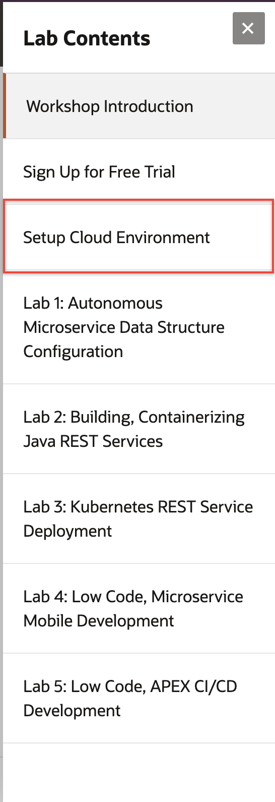

# Rapid Application Development – Appdev DevOps

## Introduction

Learn how to modernize or extend legacy applications into a cloud-native microservice-based development framework leveraging the Oracle Cloud. During this sales play, customers will follow the journey of 7 personas inside a fictitious company. Our day will begin with a first-hand look from the perspective of Richard, the CTO, as he explains the frustration with the speed at which the company is able to go to market with new services, features, promotions, and functionality. Richard hopes to leverage micro-services to create a highly scalable architecture that will allow new services and features to be deployed at the speed the business is demanding. Next we will follow Jim, Operation Engineer, as he provisions the necessary Oracle Cloud Services such as OCI Compartments, Autonomous Transaction Processing (ATP) databases, Kubernetes Cluser and Developer Cloud Service.  We will then follow Gerald, our DBA. Gerald will show how to set up and explore Oracle’s autonomous database cloud service (ATP). Christian, Java Developer, leverages DevCS to set up CI/CD pipeline to build and deploy applications. Next we will follow DevOps Engineer, Derek, as he explores Kubernetes. You will then follow Sarika, a Javascript Developer as she learns to leverage the power of Visual Builder to construct a mobile app leveraging the product catalog micro-services.  Finally, there's Steve, from the Finance department.  He is responsible for Sales Forecast Projections and will build an APEX application in ATP and will leverage DevCS to clone an APEX application.

## See an issue?
Please submit feedback using this [form](https://apexapps.oracle.com/pls/apex/f?p=133:1:::::P1_FEEDBACK:1). Please include the *workshop name*, *lab* and *step* in your request.  If you don't see the workshop name listed, please enter it manually. If you would like for us to follow up with you, enter your email in the *Feedback Comments* section.
### Acquire an Oracle Cloud Free Tier Account or Workshop Account

If you already have an account or an active trial/free tier account, you may skip this section.  If not, you will be creating all required infrastructure components within your Oracle Cloud Free Tier account.

- Bookmark this page for future reference.

## Navigate to Lab 050

  - Use the Contents Menu to access the next lab. For example, to proceed to Lab 050, click **Lab 50: Setup Cloud Environment** from the menu on the right.

  

- Close the menu by clicking the X.

  

You're now ready to continue with **Lab 050**.
