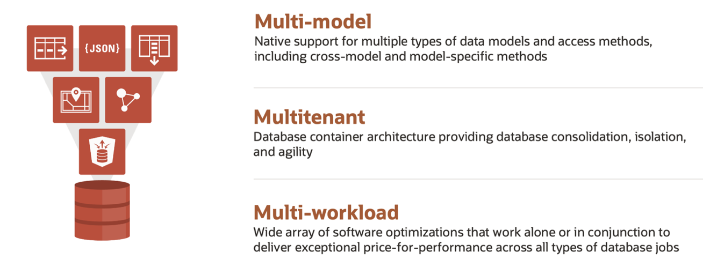

# Introduction
As enterprises digitize more business processes and decision points, they face a seemingly impossible choice—improve developer productivity now or data productivity later. But a radically new approach, Oracle’s converged database, breaks this impasse.

## Today's Challenge

Companies need to create consumer-facing mobile and web apps with the same rapid iteration and flexibility as the internet giants. They also have to provide IT services to multiple departments with the same agility as commercial SaaS providers. Plus, they have to make their existing enterprise systems use data from those new environments and contribute data back to them. 

However, this is extremely difficult when each environment is built on different single-purpose databases with different operational, security, and performance profiles. Instead, firms need a unified data tier supporting all of these apps, analytics, and AI algorithms. This requires an innovation in data management—a converged database.

### **Introducing the Oracle Converged Database**
A converged database is a multi-model, multitenant, multi-workload database (Figure 1). It supports the data model and access method each development team wants, without unneeded functionality getting in the way. It provides both the consolidation and isolation these different teams want but don’t want to think about. And it excels in all the workloads (like OLTP, analytics, and IoT) these teams require.  Oracle Database 19c is the world’s first converged database.

These multi-model capabilities allow enterprises to have both developer productivity now and data productivity later. They give developers simple API-driven access and model-specific languages, while still having recourse to powerful SQL capabilities whenever they want. Meanwhile, IT enjoys a common approach to security, upgrades, patching, and maintenance across all deployments of Oracle’s converged database.

### Objectives
Oracle’s converged database supports JSON, XML, relational, spatial, graph, IoT, text and blockchain data with full joins, transactions, and other critical SQL features enterprises rely on.  In this workshop, you will gain first-hand experience of using data types beyond relational data - JSON, XML, Spatial and Graph all running on Oracle's Autonomous Database.

This workshop uses a hybrid cloud architecture, a web application running in docker on Oracle Compute connected to an ATP instance.  You will setup an ATP instance using terraform, import the data and connect your application server querying multiple datatypes in the same database.

- Lab: NODE.JS
- Lab: JSON
- Lab: XML
- Lab: Spatial
- Lab: Graph
- Lab: Cross Data Types

You will also use Oracle SQL Developer Web to help execute the programs associated with the lab. 

### Prerequisites

- An Oracle Cloud Always Free, Free Trial, LiveLabs or Paid account

*Estimated Workshop Time:*  2.5 hours

*Please proceed to the first lab.*

## More Information
Feel free to share with your colleagues.

1. Blogs
      - [What is a converged database?](https://blogs.oracle.com/database/what-is-a-converged-database)
      - [Many single purpose database vs a converged database](https://blogs.oracle.com/database/many-single-purpose-databases-versus-a-converged-database)

## Acknowledgements
- **Authors** - Abhinav Srivastra, Yaisah Granillo, Kay Malcolm, Matthew O'Keefe
- **Workshop Owners** - Balasubramanian Ramamoorthy, Arvind Bhope
- **Contributors** - Laxmi Amarappanavar, Kanika Sharma, Venkata Bandaru, Ashish Kumar, Priya Dhuriya, Maniselvan K., Robbie Ruppel, David Start, Paul Sonderegger
- **Last Updated By** - Kay Malcolm, October 2020

## Need Help?
Please submit feedback or ask for help using our [LiveLabs Support Forum](https://community.oracle.com/tech/developers/categories/converged-database). Please click the **Log In** button and login using your Oracle Account. Click the **Ask A Question** button to the left to start a *New Discussion* or *Ask a Question*.  Please include your workshop name and lab name.  You can also include screenshots and attach files.  Engage directly with the author of the workshop.

If you do not have an Oracle Account, click [here](https://profile.oracle.com/myprofile/account/create-account.jspx) to create one.
