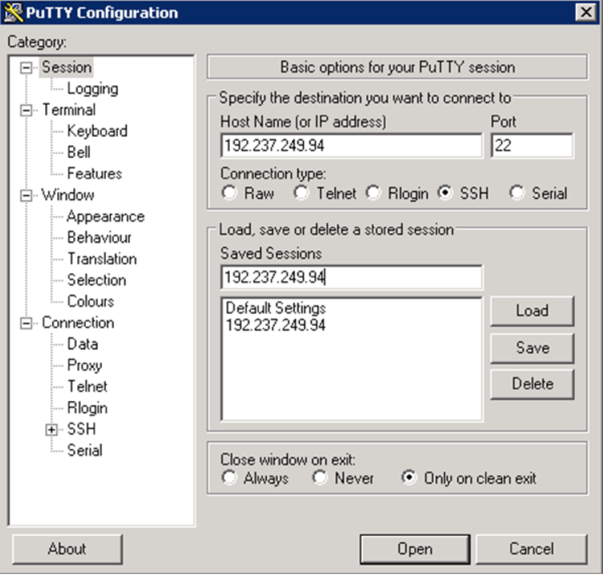
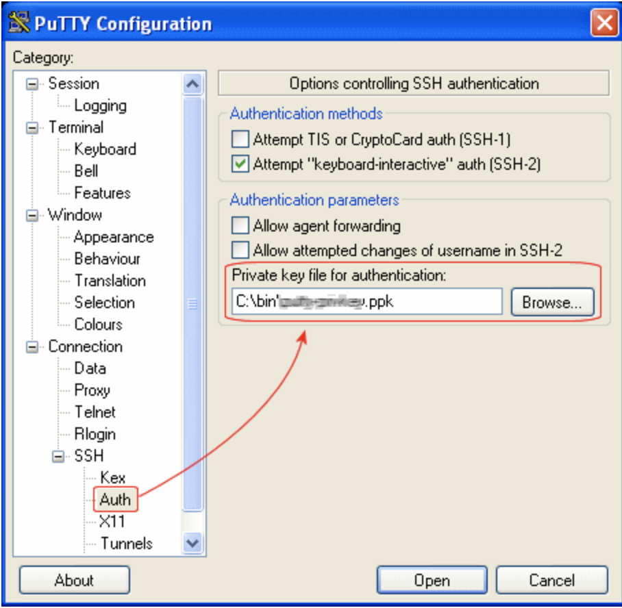
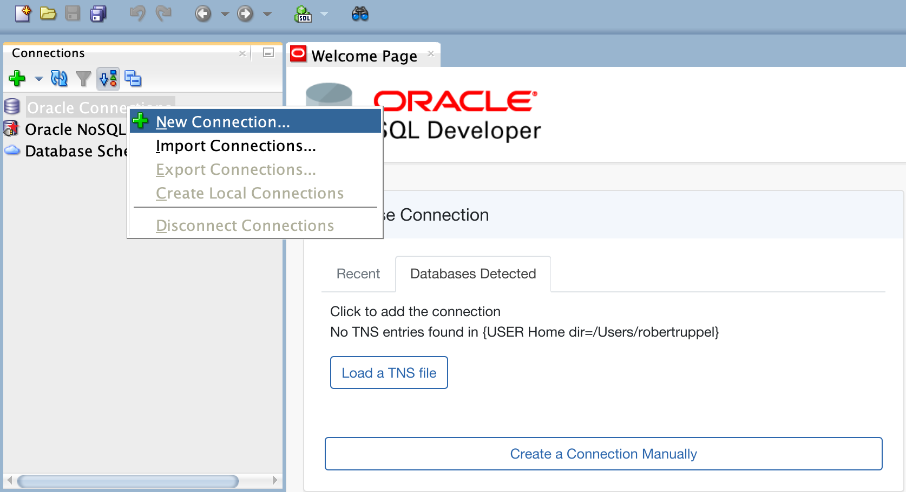
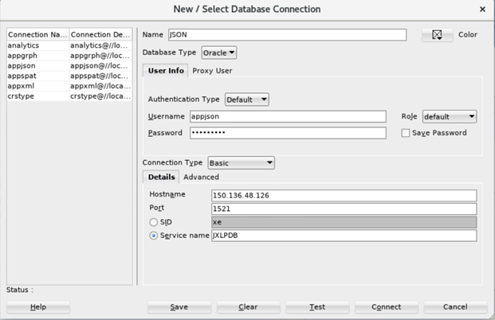

# Oracle JSON 

## Introduction

This lab walks you through the steps of setting up the environment for JSON lab . You can connect an Oracle Database instance using any client you wish. In this lab, you'll connect using Oracle SQLDeveloper.

### Prerequisites

This lab assumes you have completed the following labs:
- Lab 1:  Login to Oracle Cloud
- Lab 2:  Generate SSH Key
- Lab 3:  Create Compute instance 
- Lab 4:  Environment setup
- Note :  All scripts for this lab are stored in the /u01/workshop/json folder and are run as the oracle user. 

### About Oracle JSON 

JSON (JavaScript Object Notation) is a syntax for storing and exchanging data. When exchanging data between a browser and a server, the data can only be text.

JSON is text, and we can convert any JavaScript object into JSON, and send JSON to the server. We can also convert any JSON received from the server into JavaScript objects.

This way we can work with the data as JavaScript objects, with no complicated parsing and translations.

### JSON with Oracle Database

JSON data can be used in Oracle Databases in similar ways. Unlike relational data, it can be stored, indexed, and queried without any need for a schema that defines the data. Oracle Database supports JSON natively with relational database features, including transactions, indexing, declarative querying, and views.

It's likely we want to send and receive JSON documents to and from and our database, and store them in tables. Oracle Database has a huge amount of functionality that makes this easy.

Oracle database provides a comprehensive implemention of SQL, for both analytics and batch processing. JSON held in the Oracle Database can be directly accessed via SQL, without the need to convert it into an intermediary form. JSON collections can be joined to other JSON collections or to relational tables using standard SQL queries.

**Storing and Managing JSON Documents**

JSON documents can be stored usinga VARCHAR2, CLOB, or BLOB column. An IS JSON SQL constraint ensures that the column contains only valid JSON documents, allowing the database to understand that the column is being used as a container for JSON documents.

Oracle’s JSON capabilities are focused on providing full support for schemaless development and document-based storage. Developers are free to change the structure of their JSON documents as necessary. With the addition of JSON support, Oracle Database delivers the same degree of flexibility as a NoSQL JSON document store.

[](youtube:oiOCp23T1ZU)

The first thing to realize about JSON is that it remains a simple text format, which is relatively easy to read and inspect with the naked eye. At a syntax level, what starts to set JSON apart from other formats is the characters used to separate data, which are mainly constrained to apostrophes ', brackets ( ), [ ], { }, colons :, and commas ,. This listing illustrates what a JSON payload looks like:


### Want to learn more
- [JSON](https://docs.oracle.com/en/database/oracle/oracle-database/19/adjsn/index.html)
  
## Step 1: Connect to your Instance
### Oracle Cloud Shell
1. Open Oracle Cloud Shell by clicking on the Cloud Shell icon in the top right corner. 

    

2. Go to Compute -> Instance and select the instance you created (make sure you choose the correct compartment)

3. On the instance homepage, find the Public IP addresss for your instance.

4. Enter the command below to login to your instance.

    ````
    ssh -i ~/<sshkeylocation> opc@<Your Compute Instance Public IP address>
    ````

5. When prompted, answer yes to continue connecting.

### MAC or Windows CYGWIN Emulator
1. Go to Compute -> Instance and select the instance you created (make sure you choose the correct compartment)

2. On the instance homepage, find the Public IP addresss for your instance.

3. Open up a terminal (MAC) or cygwin emulator as the opc user. Enter yes when prompted.

4. Enter the command below to login to your instance

    ````
    ssh -i ~/<sshkeylocation> opc@<Your Compute InstancePublic IP address>
    ````

### Windows using Putty
1. Open up putty and connect to your instance. 

    ````
    ssh -i ~/.ssh/<sshkeyname> opc@<Your Compute Instance Public IP Address>
    ````
    

2. Enter a name for the session and Click "Save". 

    

3. Click **Connection > Data** in the left navigation pane and set the Auto-login username to root.

4. Click **Connection > SSH > Auth** in the left navigation pane and configure the SSH private key to use by clicking Browse under Private key file for authentication.

5. Navigate to the location where you saved your SSH private key file, select the file, and click Open. NOTE: You may not be able to connect while on any corporate VPN or in the Oracle office on clear-corporate (choose clear-internet if you are in an Oracle office). 

    

6. The file path for the SSH private key file now displays in the Private key file for authentication field.

7. Click Session in the left navigation pane, then click Save in the Load, save or delete a stored session Step.

8. Click Open to begin your session with the instance.

## Step 2: Set your Oracle Environment
1. Open the Oracle Cloud Shell by clicking on the icon next to the reigon name. 

    


2. As oracle user navigate to the json workshop directory by entering the following commands.
   
    ````
    <copy>
    sudo su - oracle
    </copy>
    ````

    ````
    <copy>
    cd /u01/workshop/json
    </copy>
    ````
    
    
2. Set your environment variables to the ConvergedCDB home.
       
    ````
    <copy>
    . oraenv
    </copy>
    ````

    ````
    <copy>
    ConvergedCDB
    </copy>
    ````
    

    ````
    <copy>
    sqlplus appjson/Oracle_4U@JXLPDB
    </copy>
    ````
    

## Step 3: Connect to SqlDeveloper

1. Download SqlDeveloper for your device.[https://www.oracle.com/tools/downloads/sqldev-downloads.html](https://www.oracle.com/tools/downloads/sqldev-downloads.html). You will also need JDK 11 which can be downloaded here [https://www.oracle.com/java/technologies/javase-jdk11-downloads.html](https://www.oracle.com/java/technologies/javase-jdk11-downloads.html)

2. Under connections right click on "Oracle Connections" and click "New Connection" 

    

3.  Provide the details as below and click on connect.
   
    ````
    Name: opc 
    Username: appjson
    Password: Oracle_4U
    Hostname: Instance Public IP address
    Port: 1521
    Service name: JXLPDB
    ````
 
   

  4. Click Connect


## Acknowledgements

- **Authors** - Balasubramanian Ramamoorthy, Arvind Bhope
- **Contributors** - Laxmi Amarappanavar, Kanika Sharma, Venkata Bandaru, Ashish Kumar, Priya Dhuriya, Maniselvan K, Robert Ruppel.
- **Team** - North America Database Specialists.
- **Last Updated By** - Kay Malcolm, Director, Database Product Management, June 2020
- **Expiration Date** - June 2021   

## See an issue?
Please submit feedback using this [form](https://apexapps.oracle.com/pls/apex/f?p=133:1:::::P1_FEEDBACK:1). Please include the *workshop name*, *lab* and *step* in your request.  If you don't see the workshop name listed, please enter it manually. If you would like for us to follow up with you, enter your email in the *Feedback Comments* section.
      
 
