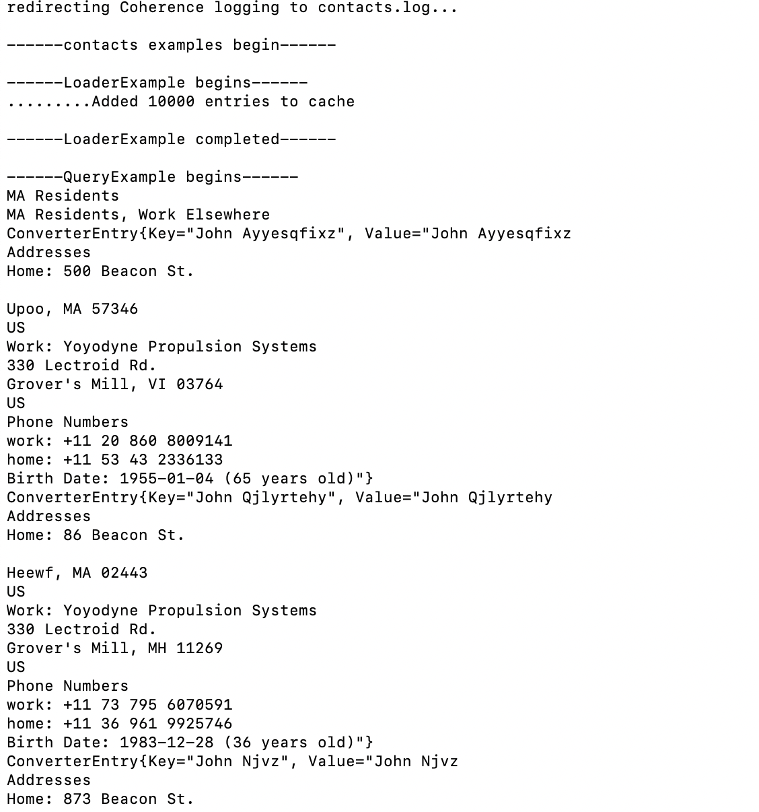
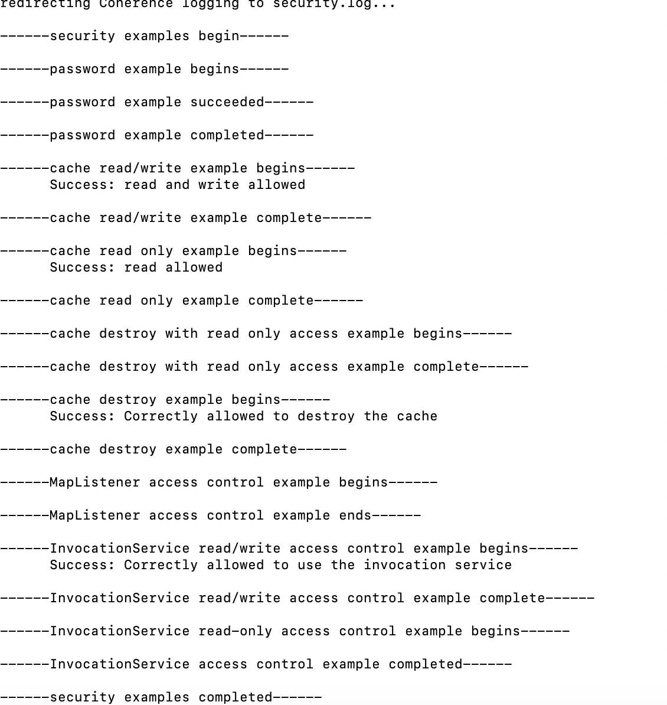
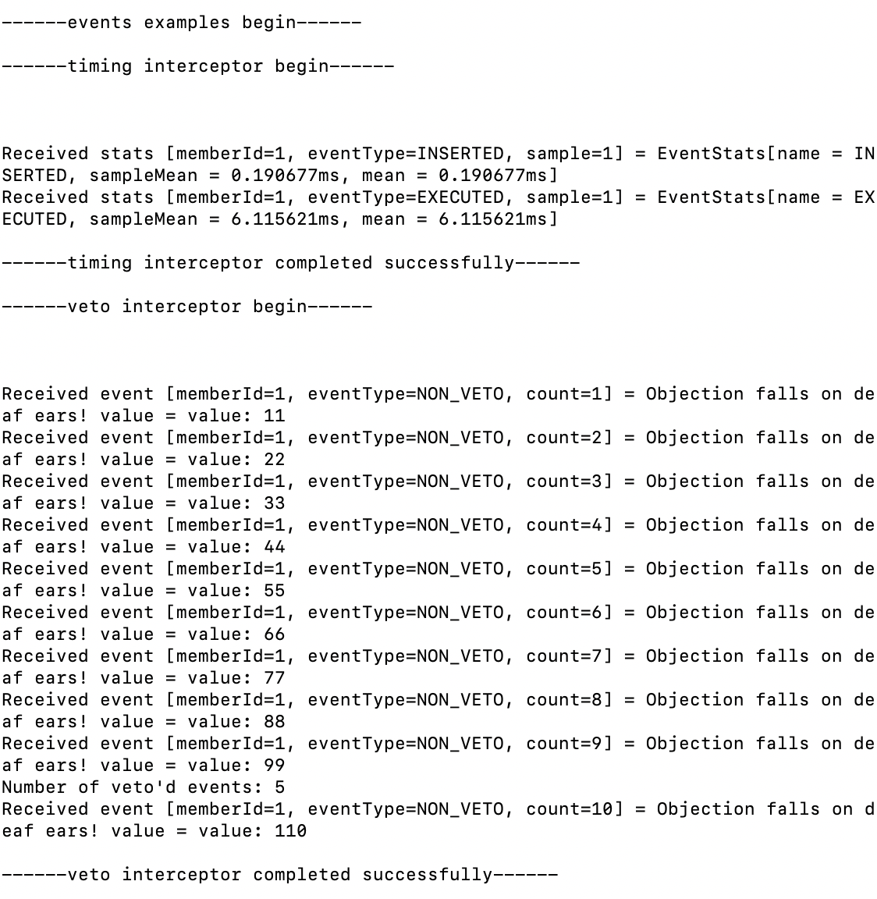
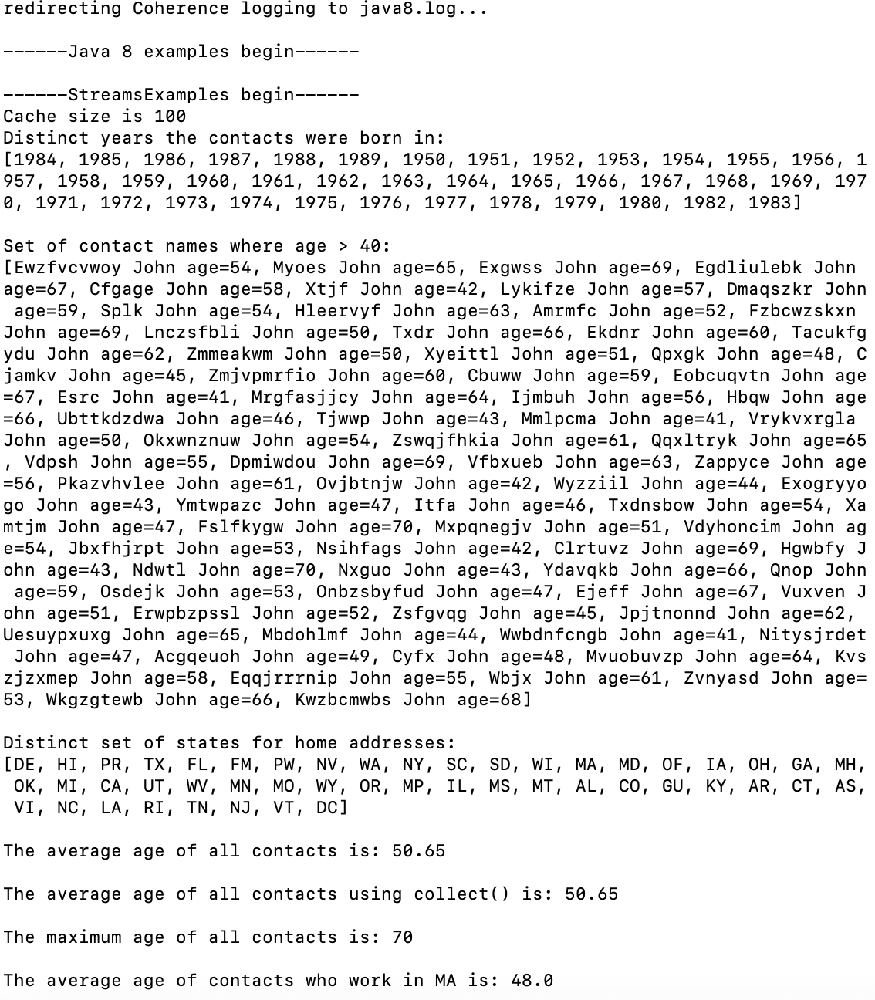
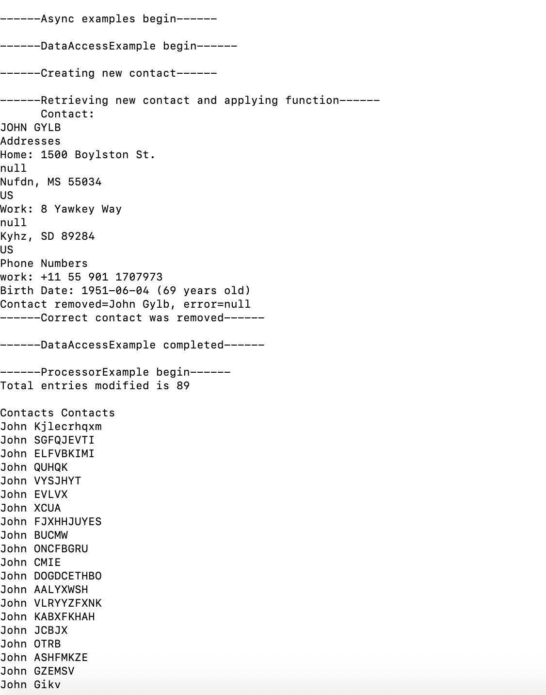

## Coherence Labs

This lab walks you through the steps for running different Coherence Labs

## Before You Begin

**What Do You Need?**

This lab assumes you have completed the following labs:
- Lab 1:  Login to Oracle Cloud
- Lab 2:  Generate SSH Key
- Lab 3:  Create Compute instance 
- Lab 4:  Environment setup
 

## Lab Description

  These Coherence Labs are exercises to visuslaize the different features of Coherence as a distributed in-memory data-grid.
    
## Prerequisites for Java
 
  Make sure that the $COHERENCE_HOME environment variable points to the location of the unpacked Coherence directory.

  Make sure that the $JAVA_HOME environment variable points to the location of a supported JDK before building the examples.
 
## Directory Structure for Java

java/bin	Scripts for building and executing examples. There are two sets of scripts. Scripts with no file extension are bash scripts. Scripts with a .cmd file extension are Windows command scripts. The following description refers to the script names without specifying any file extension.
- run  
    Runs an example collection
- run-cache-server
  
    Runs the cache server used for the examples. The command is also used to start a proxy service that is required for extend clients.

- java/classes	
    The class files output from a build. This directory will not exist until the build script is executed.
- java/resource/config	
    The common Coherence configuration files required by the examples.
- java/resource/<example name>	
    If an example has configuration that is required instead of the common configuration, it will have its own directory. The security example uses configuration files from java/resource/security.

- $COHERENCE_HOME/lib	
    Coherence libraries used for compiling and running the examples.
- resource	
    The data file used for the contacts LoaderExample: contacts.csv.
 
## Execute the run script for each Lab

## Verify Environment

    Open Two Terminal windows and verify ENVIRONMENT in each as below
    Please verify the JAVA_HOME from a terminal window

    Type: echo $JAVA_HOME

    Verify COHERENCE_HOME

    Type:  echo $COHERENCE_HOME

    Change Directory to Java Samples in both Terminal Windows

    Type:  cd $COHERENCE_HOME/examples/java

    Build all the java Labs as needed
    Execute the build script with the name of the example collection:

        bin/build contacts

        bin/build security

        bin/build events

        bin/build java8

        bin/build async

    Now Run all the Labs from this folder $COHERENCE_HOME/examples/java
    in both Terminal Windows

    cd $COHERENCE_HOME/examples/java
    
## Lab 1: Contacts 

1.	Start one or more cache servers in First Terminal window : bin/run-cache-server. 

    Each execution starts a cache server cluster node. 

    Wait for the Cache Server to start in a few seconds

     

2.	In the second Terminal window, run with the name of the example: bin/run contacts. The Driver.main method runs through the features of the example with output going to the command window (stdout).

      

## Lab 2: Security
The security example requires Coherence*Extend, which uses a proxy.
1.	Start one or more cache servers First Terminal window: bin/run-cache-server security. 

    The cache server also runs a proxy service which allows connections from Coherence*Extend clients.

    Wait for the Cache Server to start in a few seconds

      

2.	In the second Terminal window, run with the name of the example: bin/run security. 

    The Driver.main method runs through the features of the example with output going to the command window (stdout).

      

## Lab 3:  Live events 
1.	Start one or more cache servers First Terminal window: bin/run-cache-server events. 

    Each execution starts a cache server cluster node. 
    
    Wait for the Cache Server to start in a few seconds

     

2.	In the second Terminal window, run with the name of the example: bin/run events. 

    The Driver.main method runs through the features of the example with output going to the command window (stdout).

     

## Lab 4: Java 8 features 
1.	Start a cache server First Terminal window: bin/run-cache-server.

    Wait for the Cache Server to start in a few seconds

      

2.	In the second Terminal window, run with the name of the example: bin/run java8. 

    The Driver.main method runs through the features of the example with output going to the command window (stdout). Inspect the output and refer to the code at src/com/tangosol/examples/java8.

     

## Lab 5: Asynchronous features 
1.	Start a cache server First Terminal window: bin/run-cache-server.

    Wait for the Cache Server to start in a few seconds

      

2.	In the second Terminal window, run with the name of the example: bin/run async. 

    The Driver.main method runs through the features of the example with output going to the command window (stdout). Inspect the output and refer to the code at src/com/tangosol/examples/async.

     

## Acknowledgements

- **Authors** - Srinivas Pothukuchi, Pradeep Chandramouli, Chethan BR
- **Contributors** - Srinivas Pothukuchi, Pradeep Chandramouli, Chethan BR, Laxmi Amarappanavar
- **Team** - North America SE Specialists.
- **Last Updated By** -  
- **Expiration Date** -    

## See an issue?
Please submit feedback using this [form](https://apexapps.oracle.com/pls/apex/f?p=133:1:::::P1_FEEDBACK:1). Please include the *workshop name*, *lab* and *step* in your request.  If you don't see the workshop name listed, please enter it manually. If you would like for us to follow up with you, enter your email in the *Feedback Comments* section.
      
      

