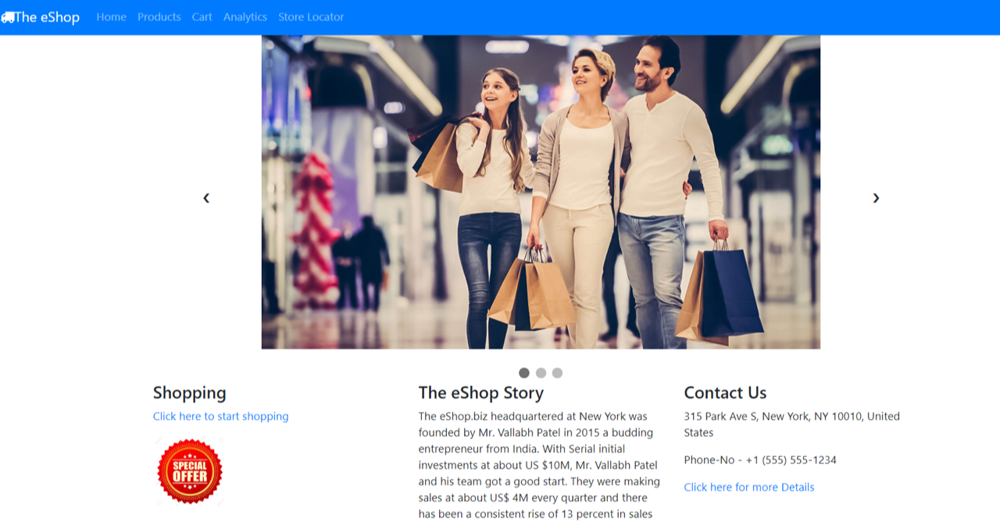
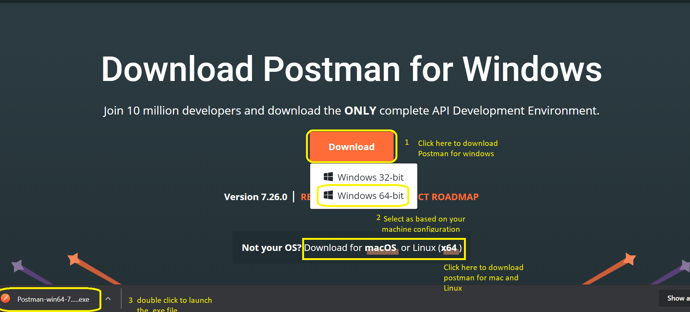
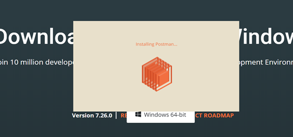
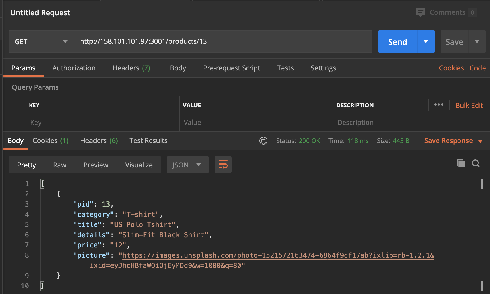

# Oracle Node.js

## Introduction

This lab walks you through the steps to start the Docker as well as Node.js Retail application .
You can connect to an Node.js running in a Docker container on an Oracle Cloud Compute instance. You can connect the Oracle Database instance using any client you wish. In this lab, you'll connect using Oracle SQLDeveloper

### Lab Prerequisites

This lab assumes you have completed the following labs:
- Lab 1: Login to Oracle Cloud
- Lab 2: Generate SSH Key
- Lab 3: Create Compute Instance
- Lab 4: Environment Setup

### About Oracle Node.js

Node.js is an open-source and cross-platform JavaScript runtime environment. It runs the V8 JavaScript engine, outside of the browser. This allows Node.js to be very performant.

A Node.js app is run in a single process, without creating a new thread for every request. Node.js provides a set of asynchronous I/O primitives in its standard library that prevent JavaScript code from blocking and generally, libraries in Node.js are written using non-blocking paradigms, making blocking behavior the exception rather than the norm.

When Node.js needs to perform an I/O operation, like reading from the network, accessing a database or the filesystem, instead of blocking the thread and wasting CPU cycles waiting, Node.js will resume the operations when the response comes back.

 [](youtube:zQtRwTOwisI)

**Why Node.js?**

  Node.js uses asynchronous programming!
-	A common task for a web server can be to open a file on the server and return the content to the client.
-	how Node.js handles a file request:
	     Sends the task to the computer's file system.
         Ready to handle the next request.
         When the file system has opened and read the file, the server returns the content to the client.

-	Node.js eliminates the waiting, and simply continues with the next request.
-	Node.js runs single-threaded, non-blocking, asynchronously programming, which is very memory efficient.

**What Node.js can do?**
-	Node.js can generate dynamic page content
-	Node.js can create, open, read, write, delete, and close files on the server
-	Node.js can collect form data
-	Node.js can add, delete, modify data in your database

**Download Node.js**

   The official Node.js website has installation instructions for [Node.js](https://yum.oracle.com/oracle-linux-nodejs.html).

### Want to learn more

   - [Node-js](https://nodejs.org/en/)
   - [Node-js for Oracle Linux](https://yum.oracle.com/oracle-linux-nodejs.html)  
   - [Node-js Driver](https://oracle.github.io/node-oracledb/)
   - [Oracle Instant Client](https://www.oracle.com/in/database/technologies/instant-client/downloads.html)
   - [Docker](https://www.docker.com/)
   - [Postman](https://www.postman.com/)

## Step 1:  Verify Application

1.  The script (env\_setup\_script.sh) which was run in Lab-4 has started the application. Also at the end of the script. you      will be presented with two URLs.

   

2. Open up a web browser and visit the Application URL indicated in your terminal.   http://your address:3000/

      - your address - Your Public IP Address

3. Open up a web browser and visit the Application API indicated in your terminal.   http://your address:3001/
      - your address - Your Public IP Address

    

You may proceed to the next lab.

## Step 2: Download Postman

 1. Download the Postman.
    -  [Click here to download Postman](https://www.postman.com/downloads/)

    

    

 2. Launch the Postman.
    

 3. Open a new tab.
    

 4. Select POST Method and enter the request URL
    - Method: - POST
    - URL: - <\PUBLIC-IP>:3001/addproduct
    - Data Format: - Insert the data in the Body in the form of JSON (check the image below attached)
    - Product details: - Example

      ````
      <copy>  
      {
      "pid": "488",
      "category": "Puma Shoe ",
      "title": "Puma-shoe Demo3",
      "details": "Puma-shoe-Original",
      "price": "9",
      "picture": "https://objectstorage.us-ashburn-1.oraclecloud.com/n/orasenatdpltsecitom03/b/ConvergedbAppImage3/o/Puma-shoe-dietmar-hannebohn-_G94gB2cms0-unsplash.jpg"
      }  
      </copy>
      ````
    


5. Click on the **Submit** button, Postman return the HTTP 200 after successfully adding the product in oracle database.


## Step 3: Using HTTP GET method.

1. Open a new tab

2. Select GET Method and enter the request URL http://&lt;PUBLIC-IP&gt;:3001/products/31  
-Method: - GET
-To get list of all the product details. URL: - http://&lt;PUBLIC-IP&gt;:3001/products  
-To get the specific product details by using PID. URL: - http://&lt;PUBLIC-IP&gt;:3001/products/31  

3. Click on the **Send** button, Postman return the HTTP 200 Ok which is a successful GET.


4. Open the browser and verify the above using link- http://&lt;PUBLIC-IP&gt;:3001/products/31"


## Step 4: Using HTTP POST Method


1. Open a new tab. Before applying the POST method, please check the product table format by using GET Method and the URL http://&lt;PUBLIC-IP&gt;:3001/products/13.

  

  We are going to update the price from $9 to $12 for the product PID=13.

  Check the key value format for the price field.

	{"Key": "value"}

  {"price": "9"}

2. Select POST Method and enter the request URL to update the price value for the PID=13

-Method: - POST  
-URL: - http://&lt;PUBLIC-IP&gt;:3001/updateProduct/13  
-Data Format: - Insert the data in the Body in the form of JSON (check the image below attached)  
-Product details: Copy the entry from below  

````
  <copy>
	{"price": "12"}
  </copy>
````


3. Click on the Send button, Postman return the HTTP 200 OK after successfully updating the product price.

4. Verify product details by using HTTP GET method. Select the GET method, enter the URL http://&lt;PUBLIC-IP&gt;:3001/products/13 and click on Send. Notice the data in the body section and price is updated.  


## Acknowledgements

- **Authors** - Balasubramanian Ramamoorthy, Arvind Bhope
- **Contributors** - Laxmi Amarappanavar, Kanika Sharma, Venkata Bandaru, Ashish Kumar, Priya Dhuriya, Maniselvan K.
- **Team** - North America Database Specialists.
- **Last Updated By** - Kay Malcolm, Director, Database Product Management, June 2020
- **Expiration Date** - June 2021   

**Issues-**
Please submit an issue on our [issues](https://github.com/oracle/learning-library/issues) page. We review it regularly.
