# Setup Compute Instance

## Introduction
This lab will show you how to setup a Resource Manager stack that will generate the Oracle Cloud objects needed to run this workshop.  This workshop requires a compute instance running the Converged Database marketplace image and a Virtual Cloud Network (VCN).

### About Terraform and Oracle Cloud Resource Manager
For more information about Terraform and Resource Manager, please see the appendix below.

### Objectives
-   Create Compute + Networking Resource Manager Stack
-   Connect to compute instance

### Prerequisites
This lab assumes you have completed the following labs:
- Lab: Generate SSH Key

This lab requires the following:
- Oracle Cloud Free Trial or Paid account
  
## **Step 1A**: Create Stack:  Compute + Networking

If you already have a VCN setup, proceed to *Step 1B*.

1.  Click on the link below to download the Resource Manager zip file you need to build your environment.  
      - [converged-db-mkplc-freetier.zip](https://objectstorage.us-ashburn-1.oraclecloud.com/p/uZPsGTFvwVSVjMn9JtlhRw5tk8zIiYfIz8iTql-I6eI/n/omcinternal/b/workshop-labs-files/o/converged-db-mkplc-freetier.zip)

2.  Save in your downloads folder.
3.  Login to Oracle Cloud
4.  Open up the hamburger menu in the left hand corner.  Choose the compartment in which you would like to install.  Under the **Solutions and Platform** submenu, choose **Resource Manager > Stacks**.  

  

  

  

4.  Select **My Configuration**, click the **Browse** link and select the zip file (converged-db-mkplc-freetier.zip) that you downloaded. Click **Select**.

  

5. Enter the following information:
   
      - **Name**:  Enter a name  or keep the prefilled default (*DO NOT ENTER ANY SPECIAL CHARACTERS HERE*, including periods, underscores, exclamation etc, it will mess up the configuration and you will get an error during the apply process)
      - **Description**:  Same as above
      - **Create in compartment**:  Select the correct compartment if not already selected

     *Note: If this is a newly provisioned tenant such as freetier with no user created compartment, stop here and first create it before proceeding.*

6.  Click **Next**.

  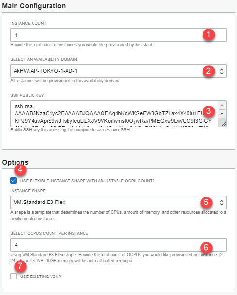

7. Enter or select the following:
    - **Instance Count:** Accept the default
    - **Select Availability Domain:** Select an availability domain from the dropdown list.
    - **SSH Public Key**:  Paste the public key you created in the earlier lab

    *Note: If you used the Oracle Cloud Shell to create your key, make sure you paste the pub file in a notepad, remove any hard returns.  The file should be one line or you will not be able to login to your compute instance*
8. Depending on the quota you have in your tenancy you can choose from standard Compute shapes or Flex shapes.  We recommend standard shapes unless you have run out of quota (Please visit the Appendix: Troubleshooting Tips for instructions on checking your quota)
    - **Use Flexible Instance Shape with Adjustable OCPU Count?:** Leave unchecked (unless you plan on using a Flex shape)
    - **Instance Shape:** Select VM.Standard.E2.4 (this compute instance requires at least 30 GB of memory to run, make sure to choose accordingly)
  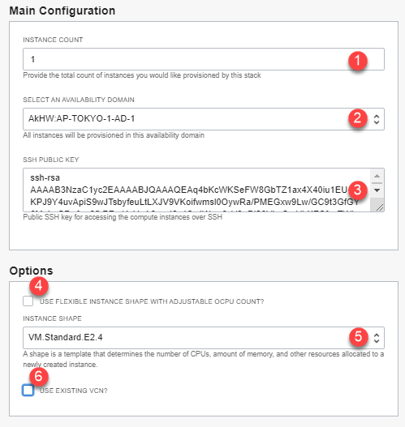
9. If you choose to use flex shapes, follow the instructions below.  Otherwise skip to the next step.
    - **Instance OCPUS:** Accept the default (**4**) This will provision the ***VM.Standard.E3.Flex*** shape with 4 OCPUs and 64GB of memory.

10. For this section we will provision a new VCN with all the appropriate ingress and egress rules needed to run this workshop.  If you already have a VCN, make sure it has all of the correct ingress and egress rules and skip to the next section.
     - **Use Existing VCN?:** Accept the default by leaving this unchecked. This will create a **new VCN**.

9. Click **Next**.

10. Review and click **Create**.

  

7. Your stack has now been created!  

  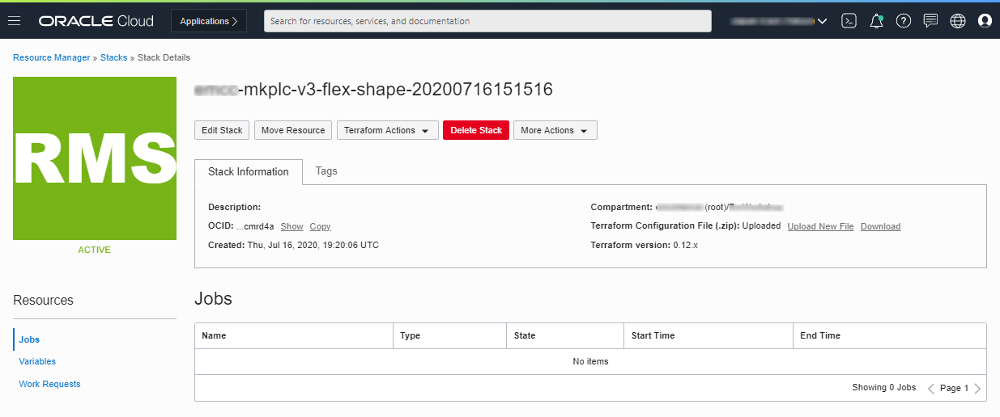

You may now proceed to Step 2 (skip Step 1B).

## **Step 1B**: Create Stack:  Compute only
If you just completed Step 1A, please proceed to Step 2.  If you have an existing VCN and are comfortable updating VCN configurations, please ensure your VCN meets the minimum requirements.  
- Egress rules for the following ports:  3000, 3001, 3003, 1521, 7007, 9090, 22          

If you do not know how to add egress rules, skip to the Appendix to add rules to your VCN.  *Note:  We recommend using our stack to create to reduce the potential for error.*

1. Click on the link below to download the Resource Manager zip file you need to build your environment.  
     - [converged-db-mkplc-freetier.zip](https://objectstorage.us-ashburn-1.oraclecloud.com/p/uZPsGTFvwVSVjMn9JtlhRw5tk8zIiYfIz8iTql-I6eI/n/omcinternal/b/workshop-labs-files/o/converged-db-mkplc-freetier.zip)

2. Save in your downloads folder.
3. Open up the hamburger menu in the left hand corner.  Choose the compartment in which you would like to install.  Choose **Resource Manager > Stacks**.  

  

  

  

4. Select **My Configuration**, click the **Browse** link and select the zip file (converged-db-mkplc-freetier.zip) that you downloaded. Click **Select**.

  

  Enter the following information:
    - **Name**:  Enter a name  or keep the prefilled default (*DO NOT ENTER ANY SPECIAL CHARACTERS HERE*, including periods, underscores, exclamation etc, it will mess up the configuration and you will get an error during the apply process)
    - **Description**:  Same as above
    - **Create in compartment**:  Select the correct compartment if not already selected

  *Note: If this is a newly provisioned tenant such as freetier with no user created compartment, stop here and first create it before proceeding.*

5. Click **Next**.

  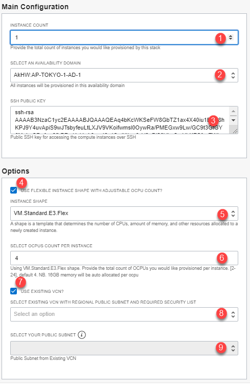

    Enter or select the following:
      - **Instance Count:** Keep the default to **1** to create only one instance. You may also choose to a higher number if you need more than one instance created.
      - **Select Availability Domain:** Select an availability domain from the dropdown list.
      - **SSH Public Key**:  Paste the public key you created in the earlier lab

    *Note: If you used the Oracle Cloud Shell to create your key, make sure you paste the pub file in a notepad, remove any hard returns.  The file should be one line or you will not be able to login to your compute instance*

     - **Use Flexible Instance Shape with Adjustable OCPU Count?:** Keep the default by leaving checked to use ***VM.Standard.E3.Flex*** shape. If you prefer shapes of fixed OCPUs types, then check to select and use the default shown (***VM.Standard2.4***) or select the desired shape from the dropdown menu.
     - **Instance OCPUS:** Keep the default to **4** to provision ***VM.Standard.E3.Flex*** shape with 4 OCPU's.

     *Note: Instance OCPUS only applies to Flex Shapes and won't be displayed if you elect to use shapes of fixed OCPUs types*

     - **Use Existing VCN?:** Check to select.

     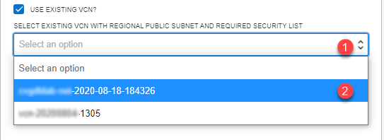

     - **Select Existing VCN?:** Select existing VCN with regional public subnet and required security list.

     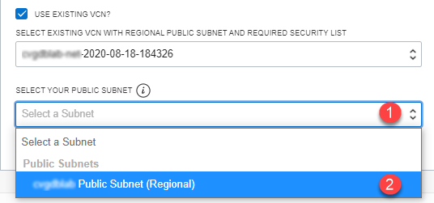

     - **Select Public Subnet:** Select existing public subnet from above VCN.

     *Note: For an existing VCN Option to be used successful, review the details at the bottom of this section*

6. Review and click **Create**.

  

7. Your stack has now been created!  

  

## **Step 2**: Terraform Plan (OPTIONAL)
When using Resource Manager to deploy an environment, execute a terraform **plan** to verify the configuration. This is optional, *you may skip directly to Step 3*.

1.  **[OPTIONAL]** Click **Terraform Actions** -> **Plan** to validate your configuration.  This takes about a minute, please be patient.

  

  

  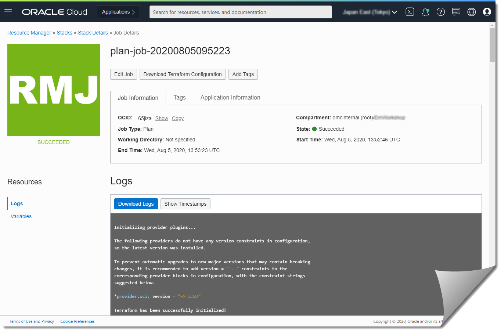

  

  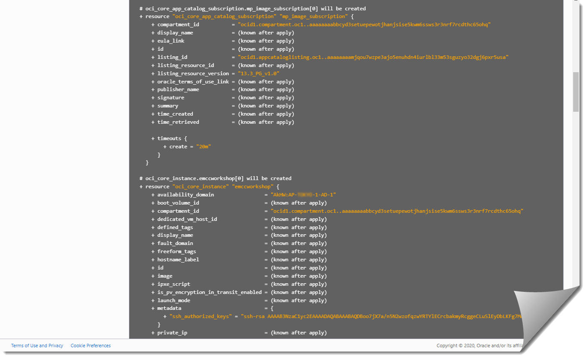

  

## **Step 3**: Terraform Apply
When using Resource Manager to deploy an environment, execute a terraform **apply** to actually create the configuration.  Let's do that now.

1.  At the top of your page, click on **Stack Details**.  click the button, **Terraform Actions** -> **Apply**.  This will create your network (unless you opted to use and existing VCN) and the compute instance.

  

  

  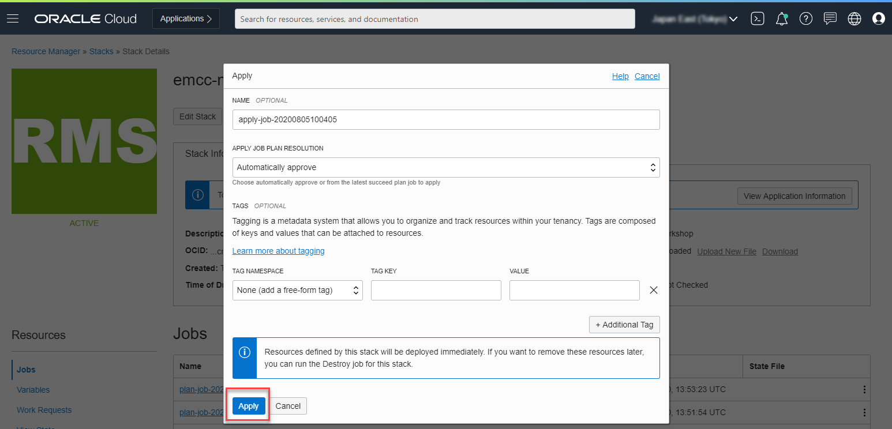

2.  Once this job succeeds, you will get an apply complete notification from Terraform.  Examine it closely, 8 resources have been added (3 only if using an existing VCN).  *If you encounter any issues running the terraform stack, visit the Appendix: Troubleshooting Tips section below.*

  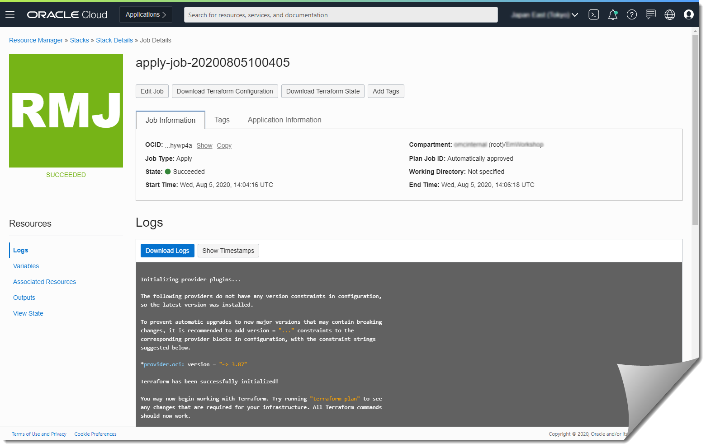

  

  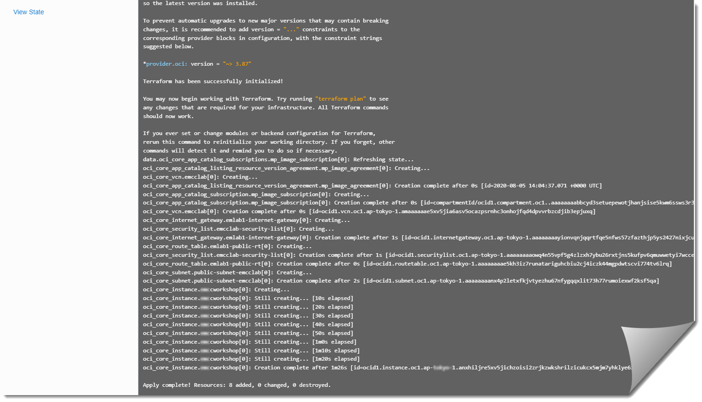

  

3.  Congratulations, your environment is created!  Click on the Application Information tab to get additional information about what you have just done.

  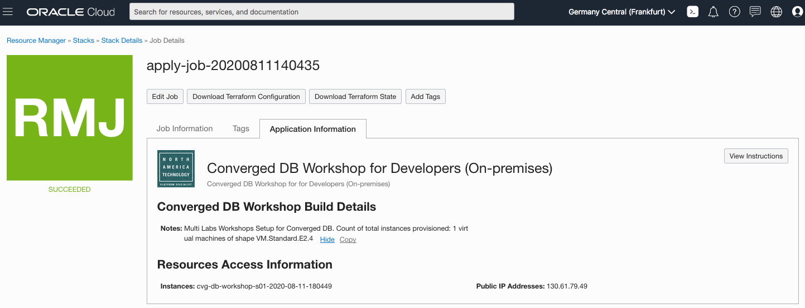

4.  Your public IP address and instance name will be displayed.  Note the public IP address, you will need it for the next step.

## **Step 4**: Connect to your instance

Choose the environment where you created your ssh-key in the previous lab (Generate SSH Keys)
  - *NOTE 1:  If you are not using Cloud Shell and are using your laptop to connect your corporate VPN may prevent you from logging in.*

### Oracle Cloud Shell

1. To re-start the Oracle Cloud shell, go to your Cloud console and click the Cloud Shell icon to the right of the region.  *Note: Make sure you are in the region you were assigned*

  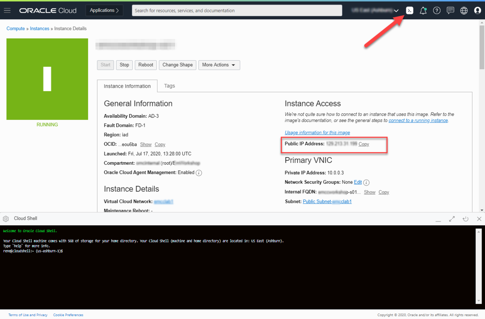

2.  If you didn't jot down your comput instances public IP address, go to **Compute** -> **Instance** and select the instance you created (make sure you choose the correct compartment)
3.  On the instance homepage, find the Public IP address for your instance.
4.  Enter the command below to login to your instance.    
  ````
  ssh -i ~/.ssh/<sshkeyname> opc@<Your Compute Instance Public IP Address>
  ````

  

5.  When prompted, answer **yes** to continue connecting.
6.  Continue to Step 5 on the left hand menu.

### MAC or Windows CYGWIN Emulator
1.  Go to **Compute** -> **Instance** and select the instance you created (make sure you choose the correct compartment)
2.  On the instance homepage, find the Public IP address for your instance.
3.  Open up a terminal (MAC) or cygwin emulator as the opc user.  Enter yes when prompted.

  ````
  ssh -i ~/.ssh/<sshkeyname> opc@<Your Compute Instance Public IP Address>
  ````
  

4.  After successfully logging in, you may *proceed to the next lab*

### Windows using Putty

On Windows, you can use PuTTY as an SSH client. PuTTY enables Windows users to connect to remote systems over the internet using SSH and Telnet. SSH is supported in PuTTY, provides for a secure shell, and encrypts information before it's transferred.

1.  Download and install PuTTY. [http://www.putty.org](http://www.putty.org)
2.  Run the PuTTY program. On your computer, go to **All Programs > PuTTY > PuTTY**
3.  Select or enter the following information:
    - Category: _Session_
    - IP address: _Your service instance’s public IP address_
    - Port: _22_
    - Connection type: _SSH_

  

#### **Configuring Automatic Login**

1.  In the category section, **Click** Connection and then **Select** Data.

2.  Enter your auto-login username. Enter **opc**.

  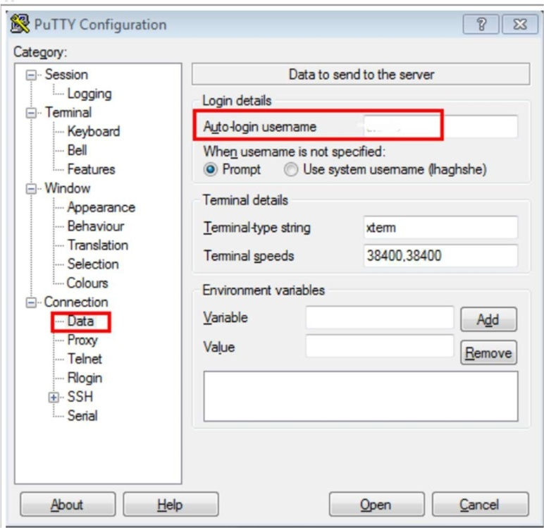

#### **Adding Your Private Key**

1.  In the category section, **Click** Auth.
2.  **Click** browse and find the private key file that matches your VM’s public key. This private key should have a .ppk extension for PuTTy to work.

  

To save all your settings:

3.  In the category section, **Click** session.
4.  In the saved sessions section, name your session, for example ( EM13C-ABC ) and **Click** Save.

You may now *proceed to the next lab*.  

## Appendix:  Teraform and Resource Manager
Terraform is a tool for building, changing, and versioning infrastructure safely and efficiently.  Configuration files describe to Terraform the components needed to run a single application or your entire datacenter.  In this lab a configuration file has been created for you to build network and compute components.  The compute component you will build creates an image out of Oracle's Cloud Marketplace.  This image is running Oracle Linux 7.

Resource Manager is an Oracle Cloud Infrastructure service that allows you to automate the process of provisioning your Oracle Cloud Infrastructure resources. Using Terraform, Resource Manager helps you install, configure, and manage resources through the "infrastructure-as-code" model. To learn more about OCI Resource Manager, take a watch the video below.

[](youtube:udJdVCz5HYs)

### Oracle Cloud Marketplace
The Oracle Cloud Marketplace is a catalog of solutions that extends Oracle Cloud services.  It offers multiple consumption modes and deployment modes.  In this lab we will be deploying the free Oracle Enterprise Manager 13c Workshop marketplace image.

[Link to OCI Marketplace](https://www.oracle.com/cloud/marketplace/)

## Appendix:  Updating an Existing VCN

Coming soon

## Appendix: Troubleshooting Tips

If you encountered any issues during the lab, follow the steps below to resolve them.  If you are unable to resolve, please skip to the **See an Issue** section to submit your issue via our feedback form.
- Availability Domain Mismatch
- Limits Exceeded
- Invalid public key
- Flex Shape Not Found
  
### Issue 1: Availability Domain Mismatch


#### Issue #1 Description
When creating a stack and using an existing VCN, the availability domain and the subnet must match otherwise the stack errors.  

#### Fix for Issue #1
1.  Click on **Stack**-> **Edit Stack** -> **Configure Variables**.
2.  Scroll down to the network definition.
3.  Make sure the Availability Domain number matches the subnet number.  E.g. If you choose AD-1, you must also choose subnet #1.

### Issue 2: Limits Exceeded


### Issue 2: Invalid public key


### Issue 2: Flex Shape Not Found

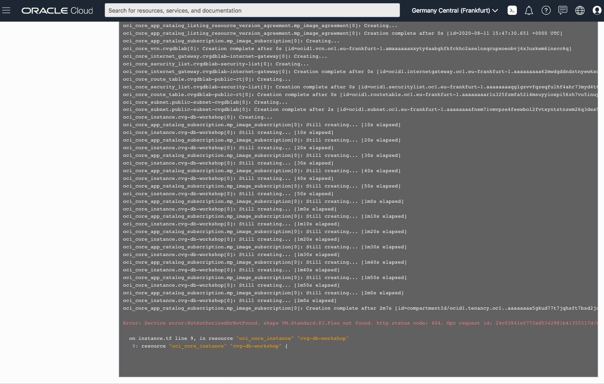

## Acknowledgements

* **Author** - Rene Fontcha, Master Principal Platform Specialist, NA Technology
* **Contributors** - Kay Malcolm, Product Manager, Database Product Management
* **Last Updated By/Date** - Kay Malcolm, Product Manager, Database Product Management, August 2020

## See an issue?
Please submit feedback using this [form](https://apexapps.oracle.com/pls/apex/f?p=133:1:::::P1_FEEDBACK:1). Please include the *workshop name*, *lab* and *step* in your request.  If you don't see the workshop name listed, please enter it manually. If you would like for us to follow up with you, enter your email in the *Feedback Comments* section.
