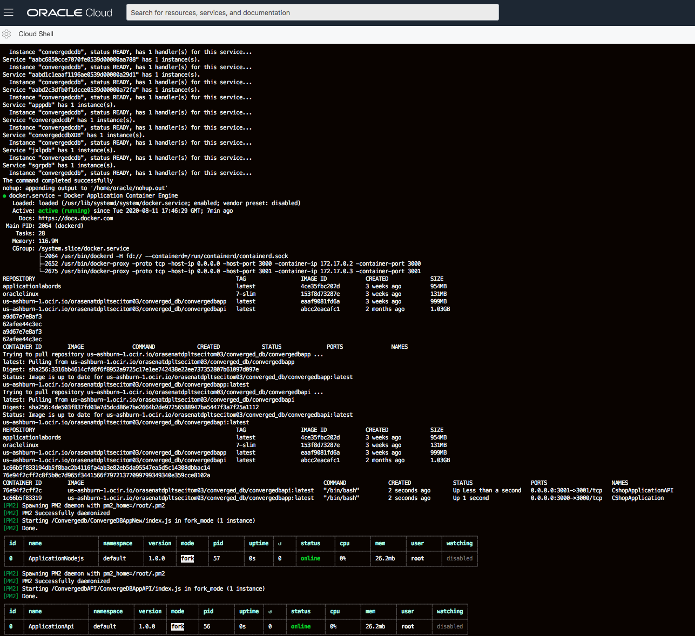
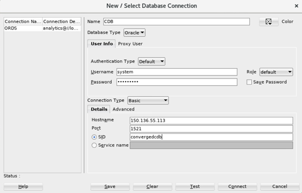

# Environment Setup

## Introduction
This lab will show you how to start a database instance and listener from a Putty window. You will also setup SQL Developer.

*Estimated time:* 40 Minutes

### Objectives
- Gather info about your 
- Start SQL Developer Web

### Prerequisites
- Lab: Generate SSH Keys
- Lab: Provision ATP

## **STEP 1:** Start Cloud Shell and Create Auth Token
There are multiple ways to create an authorization token for ADB.  We will be using Oracle Cloud Shell as this is not the focus of this workshop.  To learn more about Auth Tokens and use the interface, please refer to the lab in this workshop: [Analyzing Your Data with ADB - Lab 3](https://apexapps.oracle.com/pls/apex/dbpm/r/livelabs/view-workshop?p180_id=553)

1. Login to the Oracle Cloud console if you aren't logged in already

2. Navigate back to your Autonomous Database instance by clicking on the hamburger menu and selecting Autonomous Transaction Processing (ATP) (*Note:* This workshop can run on Autonomous Data Warehouse, Autonmous JSON Database and ATP, the instructions are the same).
3. Start Oracle Cloud Shell by clicking on the icon in the upper right corner
4. While still in the upper right corner click on the person icon.
5. Click on the user you logged in as
6. Show the Oracle Cloud ID (OCID) for the user, copy it to a notepad
7. Create the Authorization Token that you will need to load your database by copying the command below and pasting it into your Cloud Shell.  Paste in your user OCID in for the ocid below.
   ````
   <copy>
   oci iam auth-token create --description convergeddb --user-id </copy> ocid1.user.oc1.pasteinyourocid
   ````
8. Copy the value for token to a note pad.  This is *very important*


## **STEP 2:** Create Oracle Wallet
There are multiple ways to create an Oracle Wallet for ADB.  We will be using Oracle Cloud Shell as this is not the focus of this workshop.  To learn more about Oracle Wallets and use the interface to create one, please refer to the lab in this workshop: [Analyzing Your Data with ADB - Lab 6](https://apexapps.oracle.com/pls/apex/dbpm/r/livelabs/view-workshop?p180_id=553)

1.  Go back to your ATP screen by clicking on the Hamburger Menu -> **Autonomous Transaction Processing**
2.  Click on the **Display Name**
3.  Copy the Autonomous Databse OCID to a notepad
4.  Create the Database Wallet that you will need to connect to your ATP instance
5.  In the General Information section find the OCID, click copy and paste this command.  Add the OCID you just copied into the command line
   ````
   <copy>
oci db autonomous-database generate-wallet --password WElcome123## --file converged-wallet.zip --autonomous-database-id </copy> ocid1.autonomousdatabase.oc1.iad.xxxxxxxxxxxxxxxxxxxxxx
   ````
6.  The wallet file will be downloaded to your cloud shell
7.  Click the list command below to verify it was created
      ````
      ls
      ````


8.  In Oracle Cloud Shell (*recommended*) or the terminal of your choice, login via ssh as the **opc** user.  

      ````
      ssh -i <<sshkeylocation>> opc@<<your address>>
      ````

      - sshkeylocation - Full path of your SSH key
      - your address - Your Public IP Address

## **STEP 2:** Start the Database and the Listener
4. Switch to the oracle user
      ````
      <copy>sudo su - oracle</copy>
      ````

   

5.  Run the script env\_setup\_script.sh, this will start the database, listener, oracle rest data service and our eshop application. This script could take 2-5 minutes to run.


      ````
      <copy>cd /u01/script
      ./env_setup_script.sh</copy>
      ````
   

## **STEP 3:** Download SQL Developer
Certain workshops require SQL Developer.  To setup SQL Developer, follow the steps below.

1. Download [SQL Developer](https://www.oracle.com/tools/downloads/sqldev-downloads.html) from the Oracle.com site and install on your local system.

2. Once installed, open up the SQL Developer console.

      

## **STEP 4:**  Test a connection
1.  In the connections page click the green plus to create a new connection

2.  Enter the following connection information to test your connection:
      - **Name**: CDB
      - **Username**: system
      - **Password**: Oracle_4U
      - **Hostname**: <instance_publicIP>
      - **Port**: 1521
      - **SID**: convergedcdb

    

    *Note: If you cannot login to SQL Developer, check to ensure your VCN has the correct ports opened*

3.  Once your connection is successful in the SQL Developer panel execute the query below
      ````
      <copy>select name, open_mode from v$database;</copy>
      ````

      

## Acknowledgements
* **Authors** - Balasubramanian Ramamoorthy, Arvind Bhope
* **Contributors** - Laxmi Amarappanavar, Kanika Sharma, Venkata Bandaru, Ashish Kumar, Priya Dhuriya, Maniselvan K, Robert Ruppel, David Start, Rene Fontcha
* **Last Updated By/Date** - Rene Fontcha, Master Principal Solutions Architect, NA Technology, September 2020

## Need Help?
Please submit feedback or ask for help using our [LiveLabs Support Forum](https://community.oracle.com/tech/developers/categories/converged-database). Please click the **Log In** button and login using your Oracle Account. Click the **Ask A Question** button to the left to start a *New Discussion* or *Ask a Question*.  Please include your workshop name and lab name.  You can also include screenshots and attach files.  Engage directly with the author of the workshop.

If you do not have an Oracle Account, click [here](https://profile.oracle.com/myprofile/account/create-account.jspx) to create one.
