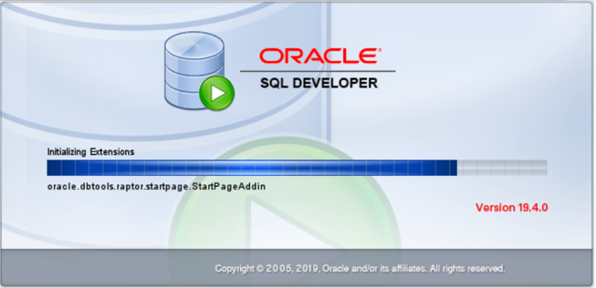

# Environment Setup

## Introduction

This lab will show you how to start a database instance and listener from a Putty window. You will also setup SQL Developer.

*Estimated time:* 10 Minutes

### Objectives
- Start the Oracle Database and Listener
- Download and Setup SQL Developer Client

### Prerequisites
- A Free Tier, Paid or LiveLabs Oracle Cloud account
- SSH Private Key to access the host via SSH
- You have completed:
    - Lab: Verify Compute Instance Setup
    - Lab: Setup SSH Tunnel

## **Step 0:** Running the Workshop
### Setup SSH Tunnels.
  As per security policies all external connections to this workshop instance are to be done over SSH. As a result, prior to executing this workshop, establish SSH tunnels over the instance public IP for ports 1521 as detailed in the table below. Please refer to *Lab 2 - Setup SSH Tunnel* for detailed instructions.

  | Description              | Client                 | Local port       | Remote Port     |
  | :----------------------- | :--------------------- | :--------------- | :-------------- |
  | Remote SQL Access        | SQL Developer          | 1521             | 1521            |.

  ***Note:*** Once this step is completed, all occurrences of the public IP of the instance when combined with above ports throughout this workshop should be substituted with *localhost*

### Login to Host using SSH Key based authentication
Refer to *Lab 1 - Verify Setup* for detailed instructions relevant to your SSH client type (e.g. Putty on Windows or Native such as terminal on Mac OS):
  - Authentication OS User - “*opc*”
  - Authentication method - *SSH RSA Key*
  - Oracle Software OS User – “*oracle*”. First login as “*opc*”, then sudo to “*oracle*”. E.g.
  ````
  <copy>sudo su - oracle</copy>
  ````

***Note:*** Any SSH session you established in *Lab 2 - Setup SSH Tunnel* for SSH port forwarding can also be used for any task requiring SSH terminal access.

## **Step 1:** Start the Database and the Listener
1. Switch to the oracle user
      ````
      <copy>sudo su - oracle</copy>
      ````

   

2.  Run the script env\_setup\_script.sh, this will start the database, listener, oracle rest data service and our eshop application. This script could take 2-5 minutes to run.

      ````
      <copy>cd /u01/script
      ./env_setup_script.sh</copy>
      ````
   

## **Step 2:** Download SQL Developer
Certain workshops require SQL Developer.  To setup SQL Developer, follow the steps below.

1. Download [SQL Developer](https://www.oracle.com/tools/downloads/sqldev-downloads.html) from the Oracle.com site and install on your local system.

2. Once installed, open up the SQL Developer console.

      

## **Step 3:**  Test a connection
1.  In the connections page click the green plus to create a new connection

2.  Enter the following connection information to test your connection:
      - **Name**: CDB
      - **Username**: system
      - **Password**: Oracle_4U
      - **Hostname**: localhost
      - **Port**: 1521
      - **SID**: convergedcdb

    

    *Note: If you cannot login to SQL Developer, check to ensure your SSH tunnel session is still active*

3.  Once your connection is successful in the SQL Developer panel execute the query below
      ````
      <copy>select name, open_mode from v$database;</copy>
      ````

      

## Acknowledgements
* **Authors** - Balasubramanian Ramamoorthy, Arvind Bhope
* **Contributors** - Laxmi Amarappanavar, Kanika Sharma, Venkata Bandaru, Ashish Kumar, Priya Dhuriya, Maniselvan K, Robert Ruppel, David Start, Rene Fontcha
* **Last Updated By/Date** - Rene Fontcha, Master Principal Solutions Architect, NA Technology, September 2020

## See an issue?
Please submit feedback using this [form](https://apexapps.oracle.com/pls/apex/f?p=133:1:::::P1_FEEDBACK:1). Please include the *workshop name*, *lab* and *step* in your request.  If you don't see the workshop name listed, please enter it manually. If you would like for us to follow up with you, enter your email in the *Feedback Comments* section.
