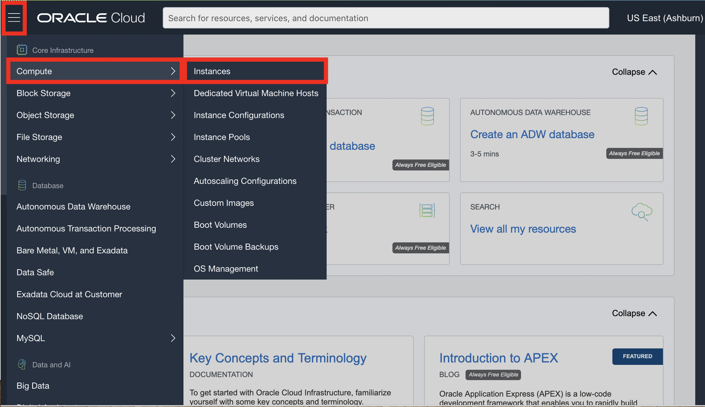
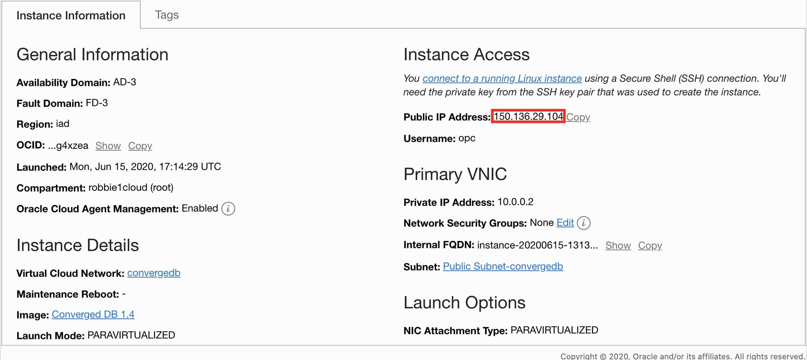

# Environment Setup

## Introduction

This lab will show you how to start a database instance and listener from a Putty window. You will also setup vncserver and SQLDeveloper.

Estimated time: 10 Minutes

### Objectives
- Start the Oracle Database and Listener
- Download and Setup SQL Developer Client

### Prerequisites

- Lab: Generate SSH Key
- Lab: Setup Compute Instance

## **Step 1:** Login to ConvergedDB Compute instance
If you aren't already logged in, follow the steps below to login.  If you are logged in, skip to Step 2.

1. Click the Hamburger Menu in the top left corner. Then hover over **Compute** > **Instances**. Find the instance you created in the previous lab.

   

2. Click on your instance and copy your Public IP address to a notepad.

   


3. In Oracle Cloud Shell (*recommended*) or the terminal of your choice, login via ssh as the **opc** user.  

      ````
      ssh -i <<sshkeylocation>> opc@<<your address>>
      ````

      - sshkeylocation - Full path of your SSH key
      - your address - Your Public IP Address
  
## **Step 2:** Start the Database and the Listener


4. Switch to the oracle user
      ````
      <copy>sudo su - oracle</copy>
      ````

   

5.  Run the script env\_setup\_script.sh, this will start the database, listener, oracle rest data service and our eshop application. This script could take 2-5 minutes to run.


      ````
      <copy>cd /u01/script
      ./env_setup_script.sh</copy>
      ````
   

## **Step 3:** Download SQL Developer

Certain workshops require SQL Developer.  To setup SQL Developer, follow the steps below.

1. Download [SQL Developer](https://www.oracle.com/tools/downloads/sqldev-downloads.html) from the Oracle.com site and install on your local system.

2. Once installed, open up the SQL Developer console.

      

## **Step 4:**  Test a connection

1.  In the connections page click the green plus to create a new connection

2.  Enter the following connection information to test your connection:
      - **Name**: CDB
      - **Username**: system
      - **Password**: Oracle_4U
      - **Hostname**: <instance_publicIP>
      - **Port**: 1521
      - **SID**: convergedcdb

    

    *Note: If you cannot login to SQL Developer, check to ensure your VCN has the correct ports opened*

3.  Once your connection is successful in the SQL Developer panel execute the query below
      ````
      <copy>select name, open_mode from v$database;</copy>
      ````

      


## Acknowledgements
* **Authors** - Balasubramanian Ramamoorthy, Arvind Bhope
* **Contributors** - Laxmi Amarappanavar, Kanika Sharma, Venkata Bandaru, Ashish Kumar, Priya Dhuriya, Maniselvan K, Robert Ruppel, David Start
* **Last Updated By/Date** - Kay Malcolm, Product Manager, Database Product Management, August 2020

## See an issue?
Please submit feedback using this [form](https://apexapps.oracle.com/pls/apex/f?p=133:1:::::P1_FEEDBACK:1). Please include the *workshop name*, *lab* and *step* in your request.  If you don't see the workshop name listed, please enter it manually. If you would like for us to follow up with you, enter your email in the *Feedback Comments* section.
