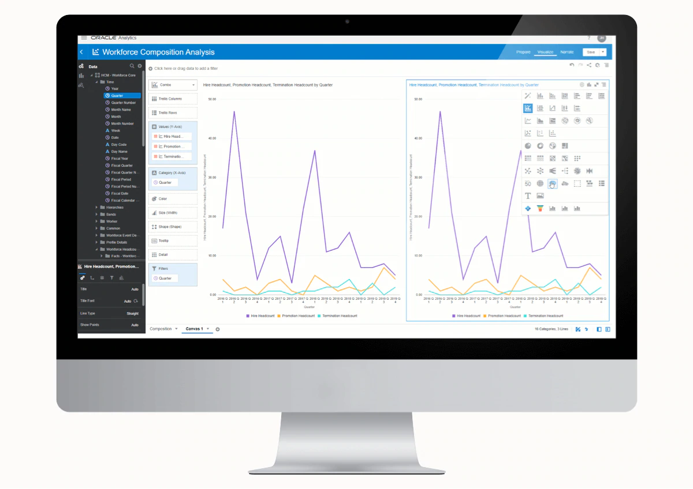
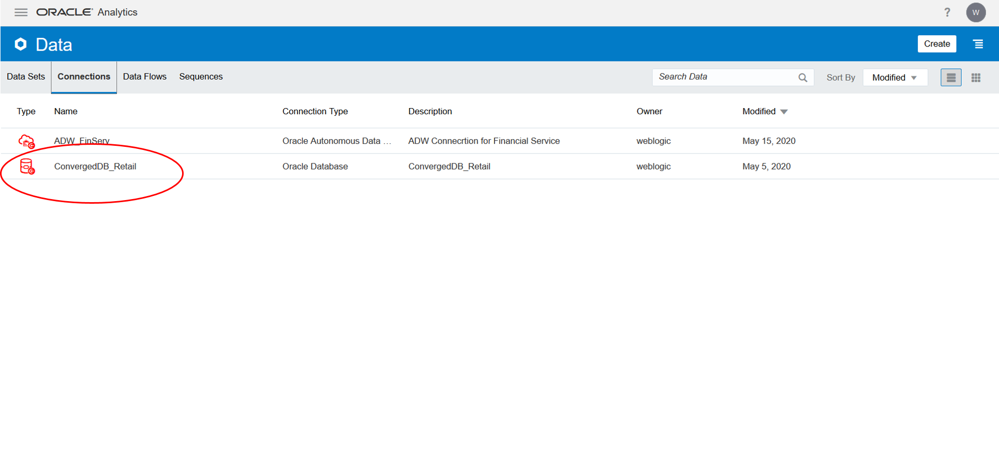
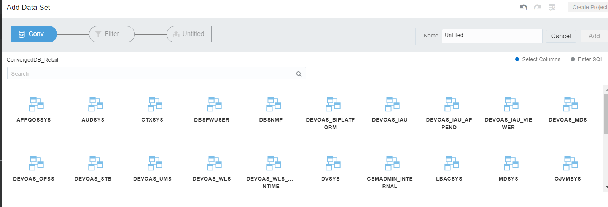

# Augmented Analytics #

## Introduction

Oracle powers deeper insights by embedding machine learning and AI into every aspect of the analytics process, making your job easier than ever.  Oracle employ smart data preparation and discovery to enhance your overall experience. Natural language processing (NLP) powers modern, conversational-style analytics.

**Estimated Lab Time:** 30 Mintues.

### Objectives ###

In this lab you will learn on two key features in OAS Augmented Analytics; “Explain” and “Forecast”.

**Explain:** Explain analyzes the selected column within the context of its data set and generates text descriptions about the insights it finds.  Explain creates corresponding visualizations that you can add to your project's canvas.

**Forecast:** Oracle Analytics Server offers a user-friendly method to leverage advanced analytics functions on a chart with a single mouse click. Having advanced analytical functions like forecast provides a strong capability to business users who want to have better insights into their data. 

### Prerequisites ###
This lab assumes you have completed the following labs;  
- Lab : Login to Oracle Cloud  
- Lab : Generate SSH Key  
- Lab : Create Compute Instance  
- Lab : Environment Setup
- Lab : Data Visualization  

The below pre-loaded data object is available in Converged Database.  

| Object Name  | Object Type  | Data Type  | Description  |
| ------------- | ------------- | ------------- |
| FINANCIALS\_REL | Table | Relational  | Data used Explain and Forecast features. |

## Step 1: Create a data set from database

1. In the home screen, click the humberger to select **Data** and then **Connections** tab. Select the  created connection and browse schema **OASLABS** as shown below.

2. Select the **FINANCIALS\_REL** table and click “Add All” to select all the columns of the table and by providing a dataset name click “Add” button to create the dataset.

3. Now in Data tab, you can see the added table as a data set.

## Step 2: Project creation from data set

1. In the **Data** tab, click on the added data set.  This will open screen for project creation.

## Step 3: Explain Feature

Let us now learn the Augmented Analytics of OAS using the  **Explain** feature.

1. Select the Revenue column and right-click to select “Explain Revenue”

    The result is a profile of the data element you have selected with both visualizations and narrative text to explain the insights for the element that is being analyze.
    

To choose the generated visualization, click "add selected" and easily one can begin to use Data Visualizations project editor to drill further. 

2. Now, select Revenue by Cost Center graph, Revenue by Region Graph, and Revenue by Month graph. Click on Add Selected.

3. After Adding the selected Visulizations, we can change the type of graph as per our choice.
   Now, let us change bar view to pie:

4. Rearrange the columns to get the pie chart as shown below.

5. Similarly, try another column **Operating Expense** using **Explain** feature and the final canvas should look as shown below.

    

6. Click on **Save** to save the project by providing a name to the project file.

## Step 4: Forecast Feature

Using Forecast you can predict values for the next _n_ future periods.  Number of _n_ next periods can be set as required. 

Let us use forecast feature on the sample financial data.

1. Select Reveue, Operating Expenses, Net Income and Month columns.  Pick Line Graph by right click.

    Verify as below.

    

2. Similarly build a line graph for payables and receivables monthly trend.

3. Now in the first chart, right-click and select "Add Statistics" and then click on "Forecast".

4. The highlighted area will show future predictions for next two month.

5. Similarly, use forecast for payables and receivables trend.

Great! Now, you have completed augmented analytics lab and hope you have learnt to use Explain and Forecast features of the tool to generate and present insights.

## Acknowledgements

- **Authors** - Balasubramanian Ramamoorthy, Sudip Bandyopadhyay, Vishwanath Venkatachalaiah
- **Contributors** - Jyotsana Rawat, Satya Pranavi Manthena, Kowshik Nittala
- **Team** - North America Analytics Specialists
- **Last Updated By** - Vishwanath Venkatachalaiah, Principal Solution Engineer, Oracle Analytics, Sep 2020

## See an issue?
Please submit feedback using this [form](https://apexapps.oracle.com/pls/apex/f?p=133:1:::::P1_FEEDBACK:1). Please include the *workshop name*, *lab* and *step* in your request.  If you don't see the workshop name listed, please enter it manually. If you would like for us to follow up with you, enter your email in the *Feedback Comments* section.