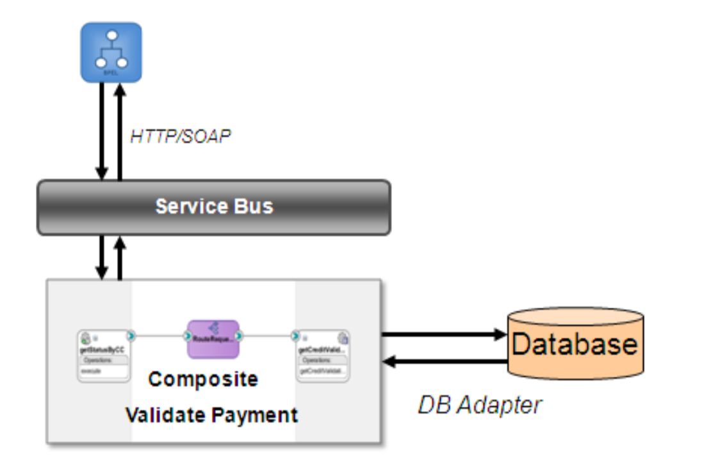
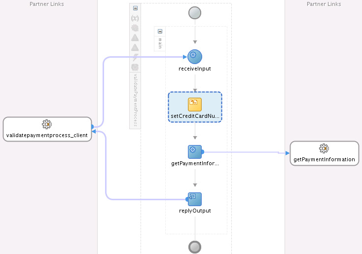
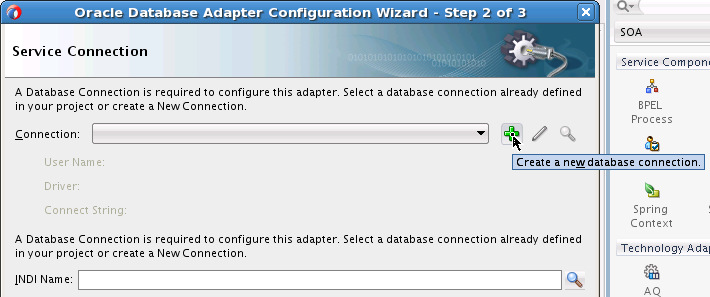
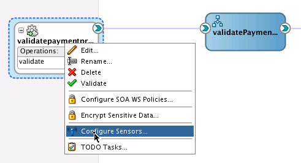
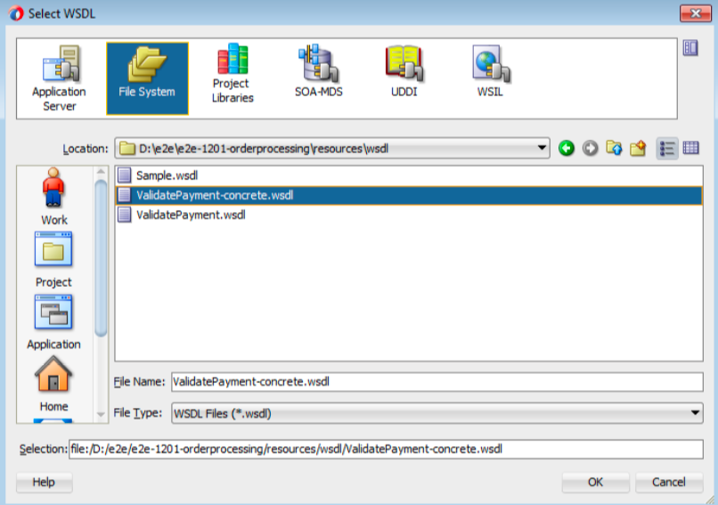
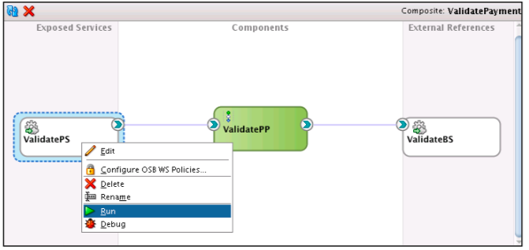

# Module 2: Payment validation

## Introduction
In this module, you will build your first Oracle SOA Suite 12c composite to validate a credit card payment.
In this composite, credit card payments will be validated and the payment status will be returned. If the payment is denied, the order will not be processed.

Avitek, a fictitious company, has embarked upon a modernization project to align with business goals of improving customer satisfaction. A key area of improvement will be streamlining the order process to provide better visibility tracking orders through credit approvals, fulfillment, shipment and delivery.

One of **the issue in the current application is that credit card payments are often denied for various, sometimes minor reasons, such as expiration date, etc. Since the process to correct these issues varies across Avitek’s order entry systems, on-premise or new adopted Cloud SaaS application there is no consistent follow-up and resolution with customers. Orders may end up lost or delayed in the system leading to customer dissatisfaction**.

The business has indicated a new credit card fraud detection system must be put in place before year’s end to thwart credit card abuses. A consistent fraud mechanism will require the credit validation process to be consolidated across all order entry systems.

The solution will look like the following from an architectural perspective:

## **STEP 1**: Build the payment validation process flow

The validation process are:
+ The payment information is retrieved from the database, using the credit card number quoted in the order message as the key. If there is no data available with this credit card number, payment is denied.
+ If data for the credit card number is available, the expiry date in the database record is compared to the expiry date listed in the order message. If they are not the same, the payment is also denied.
+ The last check compares if the total order amount is less than the daily limit on the credit card in the database.
+ When all tests are successful, the payment is authorized. Otherwise it’s denied.
+ The implementation of this service uses a BPEL process to retrieve the credit card data from the database and perform the tests outlined above. The service will return either Authorized or Denied as the payment status.

**Validation Payment, development Steps:**

1.  Create a new composite application e2e-1201-composites and SOA project named ValidatePayment
2.  Use the new SOA Project template to create the ValidatePayment composite.

    

The SOA templates come in three flavors:
+ Project templates: They include a complete project with all components and resources used and will be used when creating a new project in your SOA application.
+ Component templates: A component with all references resources and components. For example, a BPEL process that calls a business rule or adapter can be packaged as component template.
+ Custom activity templates: A scope in a BPEL process, which may include an invoke/receive from/to a partnerlink, can be packaged as a custom BPEL activity. For example, an assign activity and a call to an adapter. 
  
3.  Review the various components of the composite.

    

    
4.  Add a database connection to Java DB (it is an embedded database inside JDeveloper 12c. The embedded weblogic requires to be started prior to establishing connection to the embedded database) 

    

5. Import a custom activity template with an XSLT map to determine the payment status (Authorized or Denied), based on the daily limit and the total amount of order.

    

6.  Add a composite sensor PaymentStatus for the payment status (this is optional step)

    

7.  Deploy and test the project. 

    

8. Optional: Use the debugging tool within JDeveloper to explore.
   In SOA Suite 12c, there is facility to set breakpoints in the composite editor, BPEL process. You’re able to stop at breakpoints, look at the data, step into, step out and so on. In a BPEL process, you’re also able to change the value of a variable while debugging.

### Details: ###
For details of how to instructions, please go to Chapter 2, from <ins>**page 11 to 53**</ins> in the [SOAsuite 12c tutorial.pdf](https://oradocs-prodapp.cec.ocp.oraclecloud.com/documents/fileview/D62E7C999F2BB9C78C4D8085F6EE42C20DD5FE8D98D7/_SOASuite12c_Tutorial.pdf).

The lab tutorial pdf document can also be found on the desktop of your OCI Linux instance.

## **STEP 2**: Register the composite on SOA Service Bus

In previous section, you have completed the validatePayment process composite, you will now register this process composite on Service Bus.

Service Bus will protect consumers of the validatePayment composite from routine changes such as deployment location and implementation updates. Service Bus will help scale the service to handle higher volume of requests and provide resiliency for the service if it needs to be taken down for routine maintenance.

**Development Steps:**

1.  Create a new Service Bus application and new project **ValidatePayment.**. 

    

[//]: # (click **Create Application**. )
[//]: # (images/2/continue-to-create-application-wizard.png)

[//]: # (Remove Steps 2 and 3)
2. Create folders and import artifacts, WSDL and XSD resource click **Create App**.

    
    
3. Configure a business service for the ValidatePayment composite and review properties.
    
     

4. Configure proxy and pipeline and wire to the business service, starting page 71 on the tutorial document.

   

5. Test and Debug the end-to-end application.

    

6.   Test Console
   
    

### Details: ###
  
Please follow the construction details from <ins>**page 54 to 77**</ins>, in the [SOAsuite 12c tutorial.pdf](https://oradocs-prodapp.cec.ocp.oraclecloud.com/documents/fileview/D62E7C999F2BB9C78C4D8085F6EE42C20DD5FE8D98D7/_SOASuite12c_Tutorial.pdf).

## **Summary**

Congratulations you completed your first SOA Suite 12c composite! in Part 1 and 2 for developing validate payment using SOA Composite approach.

You may proceed to the next lab.
<!--[Click here to navigate to the next Module 3](3-process-order-using-composite.md) -->

## Acknowledgements
* **Author** - <Name, Title, Group>
* **Adapted for Cloud by** -  <Name, Group> -- optional
* **Last Updated By/Date** - <Name, Group, Month Year>
* **Workshop (or Lab) Expiry Date** - <Month Year> -- optional

## See an issue?
Please submit feedback using this [form](https://apexapps.oracle.com/pls/apex/f?p=133:1:::::P1_FEEDBACK:1). Please include the *workshop name*, *lab* and *step* in your request.  If you don't see the workshop name listed, please enter it manually. If you would like for us to follow up with you, enter your email in the *Feedback Comments* section.