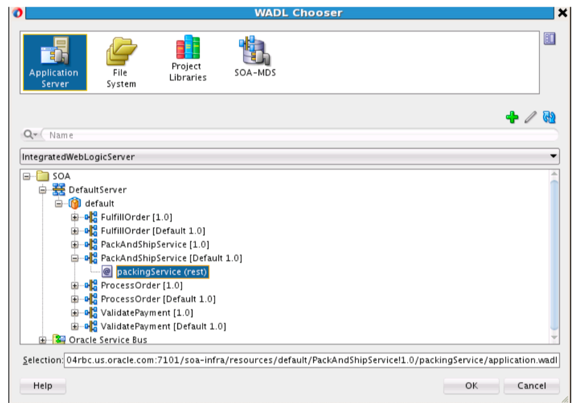

# Module 8: Summary and next step

## Introduction
During this live lab tutorial, you have learned, gained hands-on understanding and built integration with Service orientated approach principle where application and component provide services to other components via well defined communication protocol over a network. SOA makes it easier for software components over various networks to work with each other. It provides intelligent and flexible framework for apps and process connectivity, across on-premise and cloud.

## Review ##
Salient points about Oracle SOA. It is a platform to address application **integration**, for both cloud SaaS and on-premise. Oracle SOA can be deployed on customer's datacenter, OCI or your choice of IaaS, Cloud provider:

1. Companies can develop applications without replacing existing enterprise applications or system of record.
2. SOA allows reusing the service of an existing system, alternately building new services from existing applications or system of record. It can provide REST API-enabled from existing system or enterprise business service.
3. It offers reliable applications in which you can test and debug the independent services as compared to a large set of huge lines of code.

SOA complement Microservices architecture by 
1. Maximizing service reusability and decoupling 
2. Uses lightweight protocols like HTTP, REST, or Thrift APIs. 
3. Quick and easy deployment with docker and Kubernetes
4. Strong emphasis on DevOps and Continuous Delivery 
5. Communicate through an API layer.

## **Summary**

This completes an end to end modernization order processing that provide better visibility tracking orders through credit approvals, fulfillment, shipment and delivery. In your JDeveloper, you would see the following composite apps

### **Learn More - Useful Links** ###

- <a href="https://docs.oracle.com/en/middleware/soa-suite/soa/12.2.1.3/concepts/overview.html#GUID-95A68E45-922B-4361-9B48-8372F49BCD1A"> Understanding Oracle SOA Suite </a>
  
- <a href="https://apex.oracle.com/en/learn/tutorials"> Tutorials </a>
- <a href="http://apex.oracle.com/community"> Community </a>

## Acknowledgements
* **Author** - <Name, Title, Group>
* **Adapted for Cloud by** -  <Name, Group> -- optional
* **Last Updated By/Date** - <Name, Group, Month Year>
* **Workshop (or Lab) Expiry Date** - <Month Year> -- optional

## See an issue?
Please submit feedback using this [form](https://apexapps.oracle.com/pls/apex/f?p=133:1:::::P1_FEEDBACK:1). Please include the *workshop name*, *lab* and *step* in your request.  If you don't see the workshop name listed, please enter it manually. If you would like for us to follow up with you, enter your email in the *Feedback Comments* section.